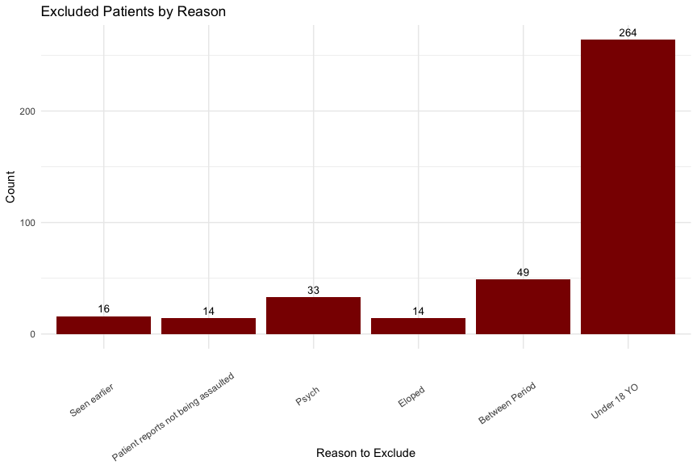
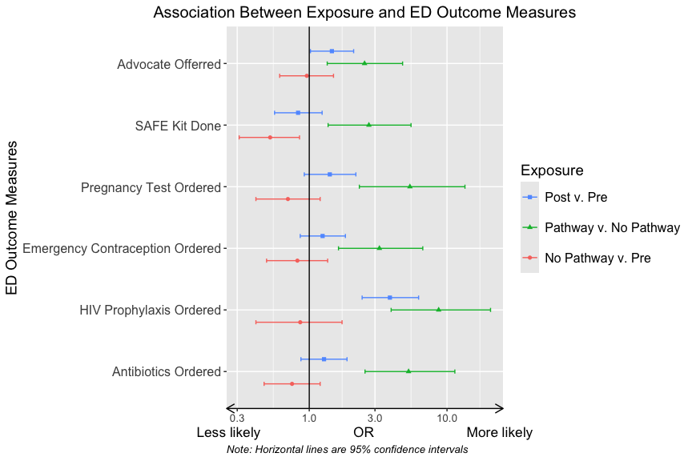
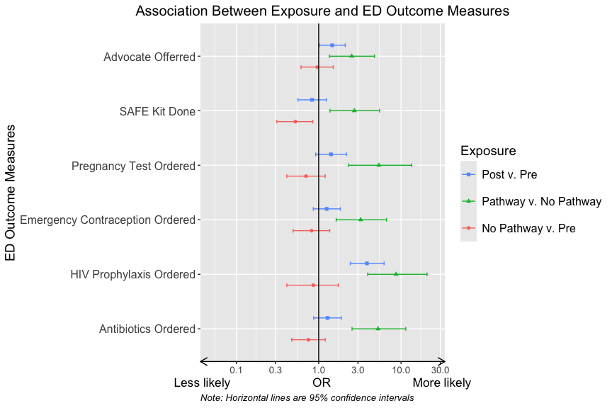
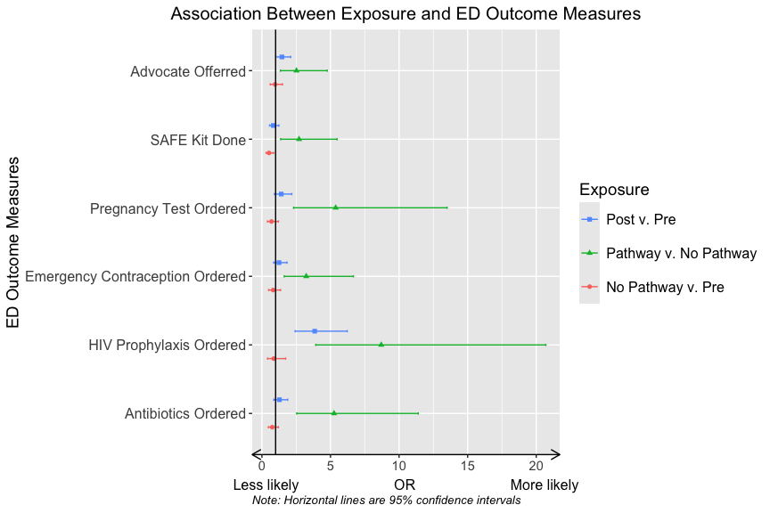
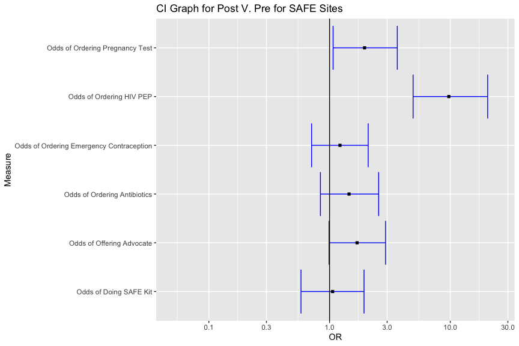
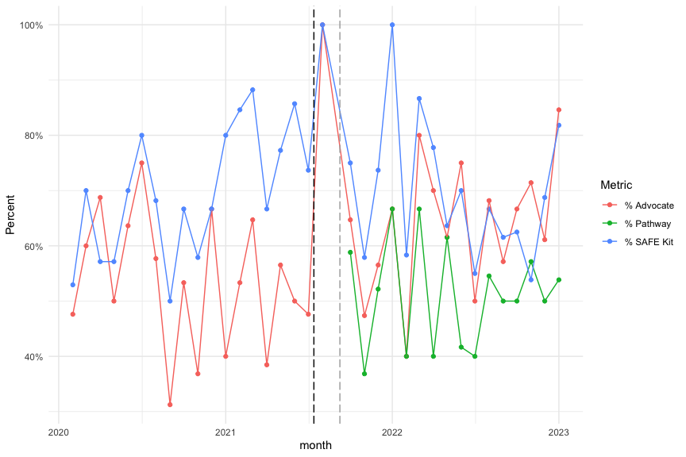
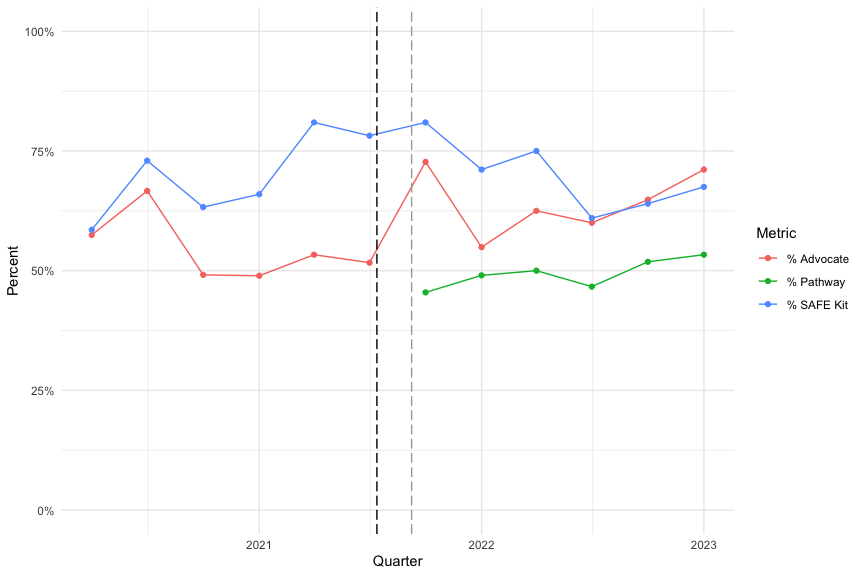
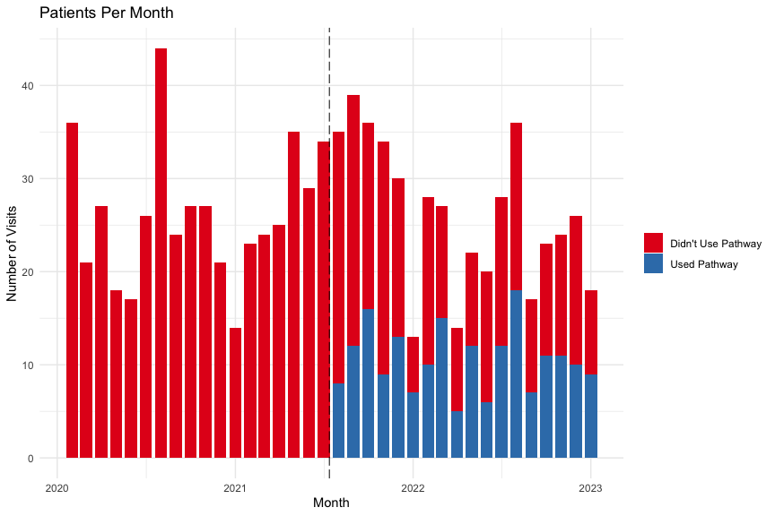
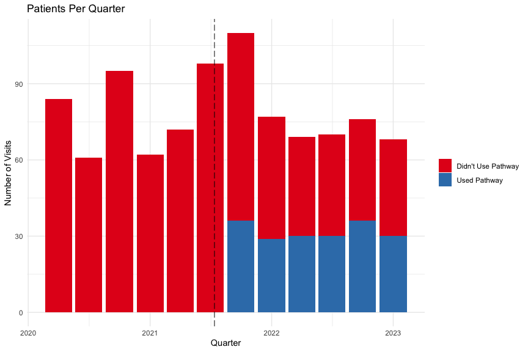

## Prep Code


``` r
library(readr)
library(logistf)
library(tidyverse)
library(lubridate)
library(gtsummary)
library(gt)
library(parsedate)
library(janitor)
library(labelled)
library(parameters)
library(survival)
library(ggsurvfit)
library(table1)
library(hms)
library(readxl)
library(ggborderline)
theme_gtsummary_journal(journal = "jama")
theme_gtsummary_compact()
load(
  "~/Documents/Current_Projects/Sexual_Assault/new_SA_YNHH/Updated YNHH SA code/all_pts.RData"
)
# set TZ to east coast standard
time_zone <- "America/New_York"
#pathway went live on 7/13/21
pathway_start <- mdy("7/13/21", tz = time_zone)
#Story board notification went live on 9/8/21
sb_start <- mdy("9/8/21", tz = time_zone)
day.arrival.start <- hms::as_hms("03:00:00")
night.arrival.start <- hms::as_hms("15:00:00")
all_pts$insurance_3 <- as_factor(all_pts$insurance_3)
all_pts$insurance_3 <- relevel(all_pts$insurance_3, ref = "Public")
all_pts <- all_pts %>% mutate(
    race_eth = case_when(
      patient_ethnicity == "Hispanic or Latina/o/x" ~ "Hispanic or Latina/o/x",
      patient_race == "Black or African American" ~ "Non-Hispanic Black",
      patient_race == "White" ~ "Non-Hispanic White",
      patient_ethnicity != "Hispanic or Latina/o/x" &
        patient_race != "Black or African American" &
        patient_race != "White" ~ "Other",
      .default = patient_race
    )
  ) %>% 
  mutate(
    race_eth_num = case_when(
      race_eth == "Non-Hispanic White" ~ 0,
      race_eth == "Non-Hispanic Black" ~ 1,
      race_eth == "Hispanic or Latina/o/x" ~ 3,
      race_eth == "Other" ~ 4
    )
  ) %>% 
  set_value_labels(
    race_eth_num = c(
      "Non-Hispanic White" = 0,
      "Non-Hispanic Black" = 1,
      "Hispanic or Latina/o/x" = 3,
      "Other" = 4
    )
  )
all_pts$race_eth_num <- to_factor(all_pts$race_eth_num, ordered = FALSE)
all_excluded <- all_pts %>%
  mutate(exclude = case_when(age < 18 ~ 1,
                             between == 1 ~ 1,
                             sane_kit_done == 4 ~ 1,
                             exclude == 1 ~ 1)) %>%
  mutate(
    reason_to_exclude = case_when(
      age < 18 ~ 8,
      is.na(reason_to_exclude) & between == 1 ~ 7,
      is.na(reason_to_exclude) & sane_kit_done == 4 ~ 3,
      is.na(reason_to_exclude) ~ 6,
      .default = reason_to_exclude
    )
  ) %>% add_value_labels(
    reason_to_exclude = c(
      "Seen earlier" = 1 ,
      "Patient reports not being assaulted" = 2,
      "Psych" = 3,
      "not excluded" = 4,
      "Eloped" = 5,
      "NA/Not Listed" = 6,
      "Between Period" = 7,
      "Under 18 YO" = 8
    )
  ) %>% to_factor()
all_excluded <- all_excluded %>% filter(exclude == 1)
excluded_plot <-
  all_excluded %>% ggplot(aes(x = reason_to_exclude)) + geom_bar(fill = "darkred") + geom_text(stat =
                                                                                                 'count', aes(label = after_stat(count)), vjust = -0.5, size = 3.5) + theme_minimal() + labs(x = "Reason to Exclude", y = "Count", title = "Excluded Patients by Reason") + theme(axis.text.x = element_text(angle = 35, vjust = .6, hjust= .8))

excluded_plot
```

<!-- -->

``` r
all_excluded %>% group_by(reason_to_exclude) %>% summarise(n = n()) %>% print()
```

```
## # A tibble: 6 × 2
##   reason_to_exclude                       n
##   <fct>                               <int>
## 1 Seen earlier                           16
## 2 Patient reports not being assaulted    14
## 3 Psych                                  33
## 4 Eloped                                 14
## 5 Between Period                         49
## 6 Under 18 YO                           264
```

``` r
number_of_minors <-
  all_excluded %>% filter(age < 18) #changed it so age is first exclusion criteria
number_of_minors <-
  n_distinct(number_of_minors$pat_enc_csn_id, na.rm = TRUE) %>% as.character()
cat("  ", number_of_minors, "patients under 18 YO excluded")
```

```
##    264 patients under 18 YO excluded
```

``` r
n_excluded <-
  all_excluded %>% filter(
    reason_to_exclude %in% c(
      "Seen earlier",
      "Patient reports not being assaulted",
      "Psych",
      "Eloped",
      "NA/Not Listed"
    )
  )
n_excluded <-
  n_distinct(n_excluded$pat_enc_csn_id, na.rm = TRUE) %>% as.character()
n_between <-
  all_excluded %>% filter(reason_to_exclude == "Between Period")
n_between <-
  n_distinct(n_between$pat_enc_csn_id, na.rm = TRUE) %>% as.character()

cat("-", n_excluded, "patients were excluded based on chart review.")
```

```
## - 77 patients were excluded based on chart review.
```

``` r
cat(" ",
    n_between,
    "patients who arrived between 7/13/21 and 9/8/21 were excluded")
```

```
##   49 patients who arrived between 7/13/21 and 9/8/21 were excluded
```

``` r
rm(n_excluded, number_of_minors, n_between)
#pre-post cohort
pp.cohort.1 <-
  all_pts %>% filter(between == 0) %>% filter(age > 17) %>% filter(is.na(exclude), sane_kit_done != 4) %>% mutate(exposure.tab = exposure.char)
#pathway v no pathway cohort
cohort.1 <-
  all_pts %>% filter(ed_arrival_date > sb_start) %>% filter(age > 17) %>% filter(is.na(exclude)) %>% mutate(exposure.tab = pathway)
#pre vs no pathway cohort
pp.cohort.2 <- pp.cohort.1 %>% filter(agile_md_used_num != 1)
```

942 patient encounters from 2019-12-31 to 2022-12-24\
In order of exclusion: age -\> chart review -\> between period

## Table 1 and 2
### Table 1


```{=html}
<div id="ipwsekzwas" style="padding-left:0px;padding-right:0px;padding-top:10px;padding-bottom:10px;overflow-x:auto;overflow-y:auto;width:auto;height:auto;">
<style>#ipwsekzwas table {
  font-family: system-ui, 'Segoe UI', Roboto, Helvetica, Arial, sans-serif, 'Apple Color Emoji', 'Segoe UI Emoji', 'Segoe UI Symbol', 'Noto Color Emoji';
  -webkit-font-smoothing: antialiased;
  -moz-osx-font-smoothing: grayscale;
}

#ipwsekzwas thead, #ipwsekzwas tbody, #ipwsekzwas tfoot, #ipwsekzwas tr, #ipwsekzwas td, #ipwsekzwas th {
  border-style: none;
}

#ipwsekzwas p {
  margin: 0;
  padding: 0;
}

#ipwsekzwas .gt_table {
  display: table;
  border-collapse: collapse;
  line-height: normal;
  margin-left: auto;
  margin-right: auto;
  color: #333333;
  font-size: 13px;
  font-weight: normal;
  font-style: normal;
  background-color: #FFFFFF;
  width: auto;
  border-top-style: solid;
  border-top-width: 2px;
  border-top-color: #A8A8A8;
  border-right-style: none;
  border-right-width: 2px;
  border-right-color: #D3D3D3;
  border-bottom-style: solid;
  border-bottom-width: 2px;
  border-bottom-color: #A8A8A8;
  border-left-style: none;
  border-left-width: 2px;
  border-left-color: #D3D3D3;
}

#ipwsekzwas .gt_caption {
  padding-top: 4px;
  padding-bottom: 4px;
}

#ipwsekzwas .gt_title {
  color: #333333;
  font-size: 125%;
  font-weight: initial;
  padding-top: 4px;
  padding-bottom: 4px;
  padding-left: 5px;
  padding-right: 5px;
  border-bottom-color: #FFFFFF;
  border-bottom-width: 0;
}

#ipwsekzwas .gt_subtitle {
  color: #333333;
  font-size: 85%;
  font-weight: initial;
  padding-top: 3px;
  padding-bottom: 5px;
  padding-left: 5px;
  padding-right: 5px;
  border-top-color: #FFFFFF;
  border-top-width: 0;
}

#ipwsekzwas .gt_heading {
  background-color: #FFFFFF;
  text-align: center;
  border-bottom-color: #FFFFFF;
  border-left-style: none;
  border-left-width: 1px;
  border-left-color: #D3D3D3;
  border-right-style: none;
  border-right-width: 1px;
  border-right-color: #D3D3D3;
}

#ipwsekzwas .gt_bottom_border {
  border-bottom-style: solid;
  border-bottom-width: 2px;
  border-bottom-color: #D3D3D3;
}

#ipwsekzwas .gt_col_headings {
  border-top-style: solid;
  border-top-width: 2px;
  border-top-color: #D3D3D3;
  border-bottom-style: solid;
  border-bottom-width: 2px;
  border-bottom-color: #D3D3D3;
  border-left-style: none;
  border-left-width: 1px;
  border-left-color: #D3D3D3;
  border-right-style: none;
  border-right-width: 1px;
  border-right-color: #D3D3D3;
}

#ipwsekzwas .gt_col_heading {
  color: #333333;
  background-color: #FFFFFF;
  font-size: 100%;
  font-weight: normal;
  text-transform: inherit;
  border-left-style: none;
  border-left-width: 1px;
  border-left-color: #D3D3D3;
  border-right-style: none;
  border-right-width: 1px;
  border-right-color: #D3D3D3;
  vertical-align: bottom;
  padding-top: 5px;
  padding-bottom: 6px;
  padding-left: 5px;
  padding-right: 5px;
  overflow-x: hidden;
}

#ipwsekzwas .gt_column_spanner_outer {
  color: #333333;
  background-color: #FFFFFF;
  font-size: 100%;
  font-weight: normal;
  text-transform: inherit;
  padding-top: 0;
  padding-bottom: 0;
  padding-left: 4px;
  padding-right: 4px;
}

#ipwsekzwas .gt_column_spanner_outer:first-child {
  padding-left: 0;
}

#ipwsekzwas .gt_column_spanner_outer:last-child {
  padding-right: 0;
}

#ipwsekzwas .gt_column_spanner {
  border-bottom-style: solid;
  border-bottom-width: 2px;
  border-bottom-color: #D3D3D3;
  vertical-align: bottom;
  padding-top: 5px;
  padding-bottom: 5px;
  overflow-x: hidden;
  display: inline-block;
  width: 100%;
}

#ipwsekzwas .gt_spanner_row {
  border-bottom-style: hidden;
}

#ipwsekzwas .gt_group_heading {
  padding-top: 1px;
  padding-bottom: 1px;
  padding-left: 5px;
  padding-right: 5px;
  color: #333333;
  background-color: #FFFFFF;
  font-size: 100%;
  font-weight: initial;
  text-transform: inherit;
  border-top-style: solid;
  border-top-width: 2px;
  border-top-color: #D3D3D3;
  border-bottom-style: solid;
  border-bottom-width: 2px;
  border-bottom-color: #D3D3D3;
  border-left-style: none;
  border-left-width: 1px;
  border-left-color: #D3D3D3;
  border-right-style: none;
  border-right-width: 1px;
  border-right-color: #D3D3D3;
  vertical-align: middle;
  text-align: left;
}

#ipwsekzwas .gt_empty_group_heading {
  padding: 0.5px;
  color: #333333;
  background-color: #FFFFFF;
  font-size: 100%;
  font-weight: initial;
  border-top-style: solid;
  border-top-width: 2px;
  border-top-color: #D3D3D3;
  border-bottom-style: solid;
  border-bottom-width: 2px;
  border-bottom-color: #D3D3D3;
  vertical-align: middle;
}

#ipwsekzwas .gt_from_md > :first-child {
  margin-top: 0;
}

#ipwsekzwas .gt_from_md > :last-child {
  margin-bottom: 0;
}

#ipwsekzwas .gt_row {
  padding-top: 1px;
  padding-bottom: 1px;
  padding-left: 5px;
  padding-right: 5px;
  margin: 10px;
  border-top-style: solid;
  border-top-width: 1px;
  border-top-color: #D3D3D3;
  border-left-style: none;
  border-left-width: 1px;
  border-left-color: #D3D3D3;
  border-right-style: none;
  border-right-width: 1px;
  border-right-color: #D3D3D3;
  vertical-align: middle;
  overflow-x: hidden;
}

#ipwsekzwas .gt_stub {
  color: #333333;
  background-color: #FFFFFF;
  font-size: 100%;
  font-weight: initial;
  text-transform: inherit;
  border-right-style: solid;
  border-right-width: 2px;
  border-right-color: #D3D3D3;
  padding-left: 5px;
  padding-right: 5px;
}

#ipwsekzwas .gt_stub_row_group {
  color: #333333;
  background-color: #FFFFFF;
  font-size: 100%;
  font-weight: initial;
  text-transform: inherit;
  border-right-style: solid;
  border-right-width: 2px;
  border-right-color: #D3D3D3;
  padding-left: 5px;
  padding-right: 5px;
  vertical-align: top;
}

#ipwsekzwas .gt_row_group_first td {
  border-top-width: 2px;
}

#ipwsekzwas .gt_row_group_first th {
  border-top-width: 2px;
}

#ipwsekzwas .gt_summary_row {
  color: #333333;
  background-color: #FFFFFF;
  text-transform: inherit;
  padding-top: 1px;
  padding-bottom: 1px;
  padding-left: 5px;
  padding-right: 5px;
}

#ipwsekzwas .gt_first_summary_row {
  border-top-style: solid;
  border-top-color: #D3D3D3;
}

#ipwsekzwas .gt_first_summary_row.thick {
  border-top-width: 2px;
}

#ipwsekzwas .gt_last_summary_row {
  padding-top: 1px;
  padding-bottom: 1px;
  padding-left: 5px;
  padding-right: 5px;
  border-bottom-style: solid;
  border-bottom-width: 2px;
  border-bottom-color: #D3D3D3;
}

#ipwsekzwas .gt_grand_summary_row {
  color: #333333;
  background-color: #FFFFFF;
  text-transform: inherit;
  padding-top: 1px;
  padding-bottom: 1px;
  padding-left: 5px;
  padding-right: 5px;
}

#ipwsekzwas .gt_first_grand_summary_row {
  padding-top: 1px;
  padding-bottom: 1px;
  padding-left: 5px;
  padding-right: 5px;
  border-top-style: double;
  border-top-width: 6px;
  border-top-color: #D3D3D3;
}

#ipwsekzwas .gt_last_grand_summary_row_top {
  padding-top: 1px;
  padding-bottom: 1px;
  padding-left: 5px;
  padding-right: 5px;
  border-bottom-style: double;
  border-bottom-width: 6px;
  border-bottom-color: #D3D3D3;
}

#ipwsekzwas .gt_striped {
  background-color: rgba(128, 128, 128, 0.05);
}

#ipwsekzwas .gt_table_body {
  border-top-style: solid;
  border-top-width: 2px;
  border-top-color: #D3D3D3;
  border-bottom-style: solid;
  border-bottom-width: 2px;
  border-bottom-color: #D3D3D3;
}

#ipwsekzwas .gt_footnotes {
  color: #333333;
  background-color: #FFFFFF;
  border-bottom-style: none;
  border-bottom-width: 2px;
  border-bottom-color: #D3D3D3;
  border-left-style: none;
  border-left-width: 2px;
  border-left-color: #D3D3D3;
  border-right-style: none;
  border-right-width: 2px;
  border-right-color: #D3D3D3;
}

#ipwsekzwas .gt_footnote {
  margin: 0px;
  font-size: 90%;
  padding-top: 1px;
  padding-bottom: 1px;
  padding-left: 5px;
  padding-right: 5px;
}

#ipwsekzwas .gt_sourcenotes {
  color: #333333;
  background-color: #FFFFFF;
  border-bottom-style: none;
  border-bottom-width: 2px;
  border-bottom-color: #D3D3D3;
  border-left-style: none;
  border-left-width: 2px;
  border-left-color: #D3D3D3;
  border-right-style: none;
  border-right-width: 2px;
  border-right-color: #D3D3D3;
}

#ipwsekzwas .gt_sourcenote {
  font-size: 90%;
  padding-top: 1px;
  padding-bottom: 1px;
  padding-left: 5px;
  padding-right: 5px;
}

#ipwsekzwas .gt_left {
  text-align: left;
}

#ipwsekzwas .gt_center {
  text-align: center;
}

#ipwsekzwas .gt_right {
  text-align: right;
  font-variant-numeric: tabular-nums;
}

#ipwsekzwas .gt_font_normal {
  font-weight: normal;
}

#ipwsekzwas .gt_font_bold {
  font-weight: bold;
}

#ipwsekzwas .gt_font_italic {
  font-style: italic;
}

#ipwsekzwas .gt_super {
  font-size: 65%;
}

#ipwsekzwas .gt_footnote_marks {
  font-size: 75%;
  vertical-align: 0.4em;
  position: initial;
}

#ipwsekzwas .gt_asterisk {
  font-size: 100%;
  vertical-align: 0;
}

#ipwsekzwas .gt_indent_1 {
  text-indent: 5px;
}

#ipwsekzwas .gt_indent_2 {
  text-indent: 10px;
}

#ipwsekzwas .gt_indent_3 {
  text-indent: 15px;
}

#ipwsekzwas .gt_indent_4 {
  text-indent: 20px;
}

#ipwsekzwas .gt_indent_5 {
  text-indent: 25px;
}

#ipwsekzwas .katex-display {
  display: inline-flex !important;
  margin-bottom: 0.75em !important;
}

#ipwsekzwas div.Reactable > div.rt-table > div.rt-thead > div.rt-tr.rt-tr-group-header > div.rt-th-group:after {
  height: 0px !important;
}
</style>
<table class="gt_table" data-quarto-disable-processing="false" data-quarto-bootstrap="false">
  <thead>
    <tr class="gt_col_headings gt_spanner_row">
      <th class="gt_col_heading gt_columns_bottom_border gt_left" rowspan="2" colspan="1" scope="col" id="label"><span class='gt_from_md'><strong>Characteristic</strong></span></th>
      <th class="gt_center gt_columns_top_border gt_column_spanner_outer" rowspan="1" colspan="4" scope="colgroup" id="**Post v. Pre**">
        <div class="gt_column_spanner"><span class='gt_from_md'><strong>Post v. Pre</strong></span></div>
      </th>
      <th class="gt_center gt_columns_top_border gt_column_spanner_outer" rowspan="1" colspan="3" scope="colgroup" id="**Pathway v. No Pathway**">
        <div class="gt_column_spanner"><span class='gt_from_md'><strong>Pathway v. No Pathway</strong></span></div>
      </th>
    </tr>
    <tr class="gt_col_headings">
      <th class="gt_col_heading gt_columns_bottom_border gt_center" rowspan="1" colspan="1" scope="col" id="stat_0_1"><span class='gt_from_md'><strong>Overall</strong><br />
N = 552</span></th>
      <th class="gt_col_heading gt_columns_bottom_border gt_center" rowspan="1" colspan="1" scope="col" id="stat_1_1"><span class='gt_from_md'><strong>Post-intervention</strong><br />
N = 252</span></th>
      <th class="gt_col_heading gt_columns_bottom_border gt_center" rowspan="1" colspan="1" scope="col" id="stat_2_1"><span class='gt_from_md'><strong>Pre-intervention</strong><br />
N = 300</span></th>
      <th class="gt_col_heading gt_columns_bottom_border gt_center" rowspan="1" colspan="1" scope="col" id="p.value_1"><span class='gt_from_md'><strong>p-value</strong></span></th>
      <th class="gt_col_heading gt_columns_bottom_border gt_center" rowspan="1" colspan="1" scope="col" id="stat_1_2"><span class='gt_from_md'><strong>Used Pathway</strong><br />
N = 128</span></th>
      <th class="gt_col_heading gt_columns_bottom_border gt_center" rowspan="1" colspan="1" scope="col" id="stat_2_2"><span class='gt_from_md'><strong>Didn’t Use Pathway</strong><br />
N = 124</span></th>
      <th class="gt_col_heading gt_columns_bottom_border gt_center" rowspan="1" colspan="1" scope="col" id="p.value_2"><span class='gt_from_md'><strong>p-value</strong></span></th>
    </tr>
  </thead>
  <tbody class="gt_table_body">
    <tr><td headers="label" class="gt_row gt_left">Age, Median (Q1, Q3)</td>
<td headers="stat_0_1" class="gt_row gt_center">27 (21, 38)</td>
<td headers="stat_1_1" class="gt_row gt_center">27 (22, 38)</td>
<td headers="stat_2_1" class="gt_row gt_center">27 (21, 39)</td>
<td headers="p.value_1" class="gt_row gt_center">>0.99<span class="gt_footnote_marks" style="white-space:nowrap;font-style:italic;font-weight:normal;line-height:0;"><sup>1</sup></span></td>
<td headers="stat_1_2" class="gt_row gt_center">27 (22, 35)</td>
<td headers="stat_2_2" class="gt_row gt_center">27 (21, 40)</td>
<td headers="p.value_2" class="gt_row gt_center">0.57<span class="gt_footnote_marks" style="white-space:nowrap;font-style:italic;font-weight:normal;line-height:0;"><sup>1</sup></span></td></tr>
    <tr><td headers="label" class="gt_row gt_left">Female, n (%)</td>
<td headers="stat_0_1" class="gt_row gt_center">520 (94)</td>
<td headers="stat_1_1" class="gt_row gt_center">237 (94)</td>
<td headers="stat_2_1" class="gt_row gt_center">283 (94)</td>
<td headers="p.value_1" class="gt_row gt_center">0.89<span class="gt_footnote_marks" style="white-space:nowrap;font-style:italic;font-weight:normal;line-height:0;"><sup>2</sup></span></td>
<td headers="stat_1_2" class="gt_row gt_center">117 (91)</td>
<td headers="stat_2_2" class="gt_row gt_center">120 (97)</td>
<td headers="p.value_2" class="gt_row gt_center">0.072<span class="gt_footnote_marks" style="white-space:nowrap;font-style:italic;font-weight:normal;line-height:0;"><sup>2</sup></span></td></tr>
    <tr><td headers="label" class="gt_row gt_left">Race, n (%)</td>
<td headers="stat_0_1" class="gt_row gt_center"><br /></td>
<td headers="stat_1_1" class="gt_row gt_center"><br /></td>
<td headers="stat_2_1" class="gt_row gt_center"><br /></td>
<td headers="p.value_1" class="gt_row gt_center">0.015<span class="gt_footnote_marks" style="white-space:nowrap;font-style:italic;font-weight:normal;line-height:0;"><sup>2</sup></span></td>
<td headers="stat_1_2" class="gt_row gt_center"><br /></td>
<td headers="stat_2_2" class="gt_row gt_center"><br /></td>
<td headers="p.value_2" class="gt_row gt_center">0.16<span class="gt_footnote_marks" style="white-space:nowrap;font-style:italic;font-weight:normal;line-height:0;"><sup>2</sup></span></td></tr>
    <tr><td headers="label" class="gt_row gt_left">    Non-Hispanic White</td>
<td headers="stat_0_1" class="gt_row gt_center">260 (47)</td>
<td headers="stat_1_1" class="gt_row gt_center">121 (48)</td>
<td headers="stat_2_1" class="gt_row gt_center">139 (46)</td>
<td headers="p.value_1" class="gt_row gt_center"><br /></td>
<td headers="stat_1_2" class="gt_row gt_center">54 (42)</td>
<td headers="stat_2_2" class="gt_row gt_center">67 (54)</td>
<td headers="p.value_2" class="gt_row gt_center"><br /></td></tr>
    <tr><td headers="label" class="gt_row gt_left">    Non-Hispanic Black</td>
<td headers="stat_0_1" class="gt_row gt_center">135 (24)</td>
<td headers="stat_1_1" class="gt_row gt_center">47 (19)</td>
<td headers="stat_2_1" class="gt_row gt_center">88 (29)</td>
<td headers="p.value_1" class="gt_row gt_center"><br /></td>
<td headers="stat_1_2" class="gt_row gt_center">23 (18)</td>
<td headers="stat_2_2" class="gt_row gt_center">24 (19)</td>
<td headers="p.value_2" class="gt_row gt_center"><br /></td></tr>
    <tr><td headers="label" class="gt_row gt_left">    Hispanic or Latina/o/x</td>
<td headers="stat_0_1" class="gt_row gt_center">118 (21)</td>
<td headers="stat_1_1" class="gt_row gt_center">64 (25)</td>
<td headers="stat_2_1" class="gt_row gt_center">54 (18)</td>
<td headers="p.value_1" class="gt_row gt_center"><br /></td>
<td headers="stat_1_2" class="gt_row gt_center">39 (30)</td>
<td headers="stat_2_2" class="gt_row gt_center">25 (20)</td>
<td headers="p.value_2" class="gt_row gt_center"><br /></td></tr>
    <tr><td headers="label" class="gt_row gt_left">    Other</td>
<td headers="stat_0_1" class="gt_row gt_center">39 (7.1)</td>
<td headers="stat_1_1" class="gt_row gt_center">20 (7.9)</td>
<td headers="stat_2_1" class="gt_row gt_center">19 (6.3)</td>
<td headers="p.value_1" class="gt_row gt_center"><br /></td>
<td headers="stat_1_2" class="gt_row gt_center">12 (9.4)</td>
<td headers="stat_2_2" class="gt_row gt_center">8 (6.5)</td>
<td headers="p.value_2" class="gt_row gt_center"><br /></td></tr>
    <tr><td headers="label" class="gt_row gt_left">Presented within 120h of assault, n (%)</td>
<td headers="stat_0_1" class="gt_row gt_center">504 (91)</td>
<td headers="stat_1_1" class="gt_row gt_center">228 (90)</td>
<td headers="stat_2_1" class="gt_row gt_center">276 (92)</td>
<td headers="p.value_1" class="gt_row gt_center">0.44<span class="gt_footnote_marks" style="white-space:nowrap;font-style:italic;font-weight:normal;line-height:0;"><sup>2</sup></span></td>
<td headers="stat_1_2" class="gt_row gt_center">121 (95)</td>
<td headers="stat_2_2" class="gt_row gt_center">107 (86)</td>
<td headers="p.value_2" class="gt_row gt_center">0.026<span class="gt_footnote_marks" style="white-space:nowrap;font-style:italic;font-weight:normal;line-height:0;"><sup>2</sup></span></td></tr>
    <tr><td headers="label" class="gt_row gt_left">    Unknown</td>
<td headers="stat_0_1" class="gt_row gt_center">1</td>
<td headers="stat_1_1" class="gt_row gt_center">0</td>
<td headers="stat_2_1" class="gt_row gt_center">1</td>
<td headers="p.value_1" class="gt_row gt_center"><br /></td>
<td headers="stat_1_2" class="gt_row gt_center"><br /></td>
<td headers="stat_2_2" class="gt_row gt_center"><br /></td>
<td headers="p.value_2" class="gt_row gt_center"><br /></td></tr>
    <tr><td headers="label" class="gt_row gt_left">Presented within 72h of assault, n (%)</td>
<td headers="stat_0_1" class="gt_row gt_center">453 (82)</td>
<td headers="stat_1_1" class="gt_row gt_center">200 (79)</td>
<td headers="stat_2_1" class="gt_row gt_center">253 (85)</td>
<td headers="p.value_1" class="gt_row gt_center">0.11<span class="gt_footnote_marks" style="white-space:nowrap;font-style:italic;font-weight:normal;line-height:0;"><sup>2</sup></span></td>
<td headers="stat_1_2" class="gt_row gt_center">108 (84)</td>
<td headers="stat_2_2" class="gt_row gt_center">92 (74)</td>
<td headers="p.value_2" class="gt_row gt_center">0.046<span class="gt_footnote_marks" style="white-space:nowrap;font-style:italic;font-weight:normal;line-height:0;"><sup>2</sup></span></td></tr>
    <tr><td headers="label" class="gt_row gt_left">    Unknown</td>
<td headers="stat_0_1" class="gt_row gt_center">1</td>
<td headers="stat_1_1" class="gt_row gt_center">0</td>
<td headers="stat_2_1" class="gt_row gt_center">1</td>
<td headers="p.value_1" class="gt_row gt_center"><br /></td>
<td headers="stat_1_2" class="gt_row gt_center"><br /></td>
<td headers="stat_2_2" class="gt_row gt_center"><br /></td>
<td headers="p.value_2" class="gt_row gt_center"><br /></td></tr>
    <tr><td headers="label" class="gt_row gt_left">English speaking, n (%)</td>
<td headers="stat_0_1" class="gt_row gt_center">527 (95)</td>
<td headers="stat_1_1" class="gt_row gt_center">240 (95)</td>
<td headers="stat_2_1" class="gt_row gt_center">287 (96)</td>
<td headers="p.value_1" class="gt_row gt_center">0.81<span class="gt_footnote_marks" style="white-space:nowrap;font-style:italic;font-weight:normal;line-height:0;"><sup>2</sup></span></td>
<td headers="stat_1_2" class="gt_row gt_center">121 (95)</td>
<td headers="stat_2_2" class="gt_row gt_center">119 (96)</td>
<td headers="p.value_2" class="gt_row gt_center">0.59<span class="gt_footnote_marks" style="white-space:nowrap;font-style:italic;font-weight:normal;line-height:0;"><sup>2</sup></span></td></tr>
    <tr><td headers="label" class="gt_row gt_left">Arrived by EMS, n (%)</td>
<td headers="stat_0_1" class="gt_row gt_center">215 (39)</td>
<td headers="stat_1_1" class="gt_row gt_center">96 (38)</td>
<td headers="stat_2_1" class="gt_row gt_center">119 (40)</td>
<td headers="p.value_1" class="gt_row gt_center">0.71<span class="gt_footnote_marks" style="white-space:nowrap;font-style:italic;font-weight:normal;line-height:0;"><sup>2</sup></span></td>
<td headers="stat_1_2" class="gt_row gt_center">52 (41)</td>
<td headers="stat_2_2" class="gt_row gt_center">44 (35)</td>
<td headers="p.value_2" class="gt_row gt_center">0.40<span class="gt_footnote_marks" style="white-space:nowrap;font-style:italic;font-weight:normal;line-height:0;"><sup>2</sup></span></td></tr>
    <tr><td headers="label" class="gt_row gt_left">Diagnosis of Intoxication, n (%)</td>
<td headers="stat_0_1" class="gt_row gt_center">196 (36)</td>
<td headers="stat_1_1" class="gt_row gt_center">84 (33)</td>
<td headers="stat_2_1" class="gt_row gt_center">112 (37)</td>
<td headers="p.value_1" class="gt_row gt_center">0.33<span class="gt_footnote_marks" style="white-space:nowrap;font-style:italic;font-weight:normal;line-height:0;"><sup>2</sup></span></td>
<td headers="stat_1_2" class="gt_row gt_center">52 (41)</td>
<td headers="stat_2_2" class="gt_row gt_center">32 (26)</td>
<td headers="p.value_2" class="gt_row gt_center">0.013<span class="gt_footnote_marks" style="white-space:nowrap;font-style:italic;font-weight:normal;line-height:0;"><sup>2</sup></span></td></tr>
    <tr><td headers="label" class="gt_row gt_left">Psychiatric Diagnosis, n (%)</td>
<td headers="stat_0_1" class="gt_row gt_center">125 (23)</td>
<td headers="stat_1_1" class="gt_row gt_center">41 (16)</td>
<td headers="stat_2_1" class="gt_row gt_center">84 (28)</td>
<td headers="p.value_1" class="gt_row gt_center">0.001<span class="gt_footnote_marks" style="white-space:nowrap;font-style:italic;font-weight:normal;line-height:0;"><sup>2</sup></span></td>
<td headers="stat_1_2" class="gt_row gt_center">20 (16)</td>
<td headers="stat_2_2" class="gt_row gt_center">21 (17)</td>
<td headers="p.value_2" class="gt_row gt_center">0.78<span class="gt_footnote_marks" style="white-space:nowrap;font-style:italic;font-weight:normal;line-height:0;"><sup>2</sup></span></td></tr>
    <tr><td headers="label" class="gt_row gt_left">Assailant was Intimate Partner, n (%)</td>
<td headers="stat_0_1" class="gt_row gt_center">42 (7.6)</td>
<td headers="stat_1_1" class="gt_row gt_center">14 (5.6)</td>
<td headers="stat_2_1" class="gt_row gt_center">28 (9.3)</td>
<td headers="p.value_1" class="gt_row gt_center">0.10<span class="gt_footnote_marks" style="white-space:nowrap;font-style:italic;font-weight:normal;line-height:0;"><sup>2</sup></span></td>
<td headers="stat_1_2" class="gt_row gt_center">7 (5.5)</td>
<td headers="stat_2_2" class="gt_row gt_center">7 (5.6)</td>
<td headers="p.value_2" class="gt_row gt_center">0.95<span class="gt_footnote_marks" style="white-space:nowrap;font-style:italic;font-weight:normal;line-height:0;"><sup>2</sup></span></td></tr>
  </tbody>
  
  <tfoot class="gt_footnotes">
    <tr>
      <td class="gt_footnote" colspan="8"><span class="gt_footnote_marks" style="white-space:nowrap;font-style:italic;font-weight:normal;line-height:0;"><sup>1</sup></span> <span class='gt_from_md'>Wilcoxon rank sum test</span></td>
    </tr>
    <tr>
      <td class="gt_footnote" colspan="8"><span class="gt_footnote_marks" style="white-space:nowrap;font-style:italic;font-weight:normal;line-height:0;"><sup>2</sup></span> <span class='gt_from_md'>Pearson’s Chi-squared test</span></td>
    </tr>
  </tfoot>
</table>
</div>
```
#### Supplemental Table 1


``` r
pp.cohort.2 <- pp.cohort.2 %>% mutate(exposure = exposure.num) %>% set_variable_labels(sane_ED = "ED with SANE program", race_eth_num = "Race and Ethnicity", exposure = "Exposure", age = "Age", ipv = "Assailant was Intimate Partner", intoxicated= "Intoxicated")

supplment.table1 <- pp.cohort.2 %>% mutate(exposure = exposure.num) %>% mutate(exposure.tab = if_else(exposure == 0, "Pre-intervention", "No Pathway")) %>% tbl.one.fxn()
supplment.table1
```

```{=html}
<div id="vemfaluytn" style="padding-left:0px;padding-right:0px;padding-top:10px;padding-bottom:10px;overflow-x:auto;overflow-y:auto;width:auto;height:auto;">
<style>#vemfaluytn table {
  font-family: system-ui, 'Segoe UI', Roboto, Helvetica, Arial, sans-serif, 'Apple Color Emoji', 'Segoe UI Emoji', 'Segoe UI Symbol', 'Noto Color Emoji';
  -webkit-font-smoothing: antialiased;
  -moz-osx-font-smoothing: grayscale;
}

#vemfaluytn thead, #vemfaluytn tbody, #vemfaluytn tfoot, #vemfaluytn tr, #vemfaluytn td, #vemfaluytn th {
  border-style: none;
}

#vemfaluytn p {
  margin: 0;
  padding: 0;
}

#vemfaluytn .gt_table {
  display: table;
  border-collapse: collapse;
  line-height: normal;
  margin-left: auto;
  margin-right: auto;
  color: #333333;
  font-size: 13px;
  font-weight: normal;
  font-style: normal;
  background-color: #FFFFFF;
  width: auto;
  border-top-style: solid;
  border-top-width: 2px;
  border-top-color: #A8A8A8;
  border-right-style: none;
  border-right-width: 2px;
  border-right-color: #D3D3D3;
  border-bottom-style: solid;
  border-bottom-width: 2px;
  border-bottom-color: #A8A8A8;
  border-left-style: none;
  border-left-width: 2px;
  border-left-color: #D3D3D3;
}

#vemfaluytn .gt_caption {
  padding-top: 4px;
  padding-bottom: 4px;
}

#vemfaluytn .gt_title {
  color: #333333;
  font-size: 125%;
  font-weight: initial;
  padding-top: 4px;
  padding-bottom: 4px;
  padding-left: 5px;
  padding-right: 5px;
  border-bottom-color: #FFFFFF;
  border-bottom-width: 0;
}

#vemfaluytn .gt_subtitle {
  color: #333333;
  font-size: 85%;
  font-weight: initial;
  padding-top: 3px;
  padding-bottom: 5px;
  padding-left: 5px;
  padding-right: 5px;
  border-top-color: #FFFFFF;
  border-top-width: 0;
}

#vemfaluytn .gt_heading {
  background-color: #FFFFFF;
  text-align: center;
  border-bottom-color: #FFFFFF;
  border-left-style: none;
  border-left-width: 1px;
  border-left-color: #D3D3D3;
  border-right-style: none;
  border-right-width: 1px;
  border-right-color: #D3D3D3;
}

#vemfaluytn .gt_bottom_border {
  border-bottom-style: solid;
  border-bottom-width: 2px;
  border-bottom-color: #D3D3D3;
}

#vemfaluytn .gt_col_headings {
  border-top-style: solid;
  border-top-width: 2px;
  border-top-color: #D3D3D3;
  border-bottom-style: solid;
  border-bottom-width: 2px;
  border-bottom-color: #D3D3D3;
  border-left-style: none;
  border-left-width: 1px;
  border-left-color: #D3D3D3;
  border-right-style: none;
  border-right-width: 1px;
  border-right-color: #D3D3D3;
}

#vemfaluytn .gt_col_heading {
  color: #333333;
  background-color: #FFFFFF;
  font-size: 100%;
  font-weight: normal;
  text-transform: inherit;
  border-left-style: none;
  border-left-width: 1px;
  border-left-color: #D3D3D3;
  border-right-style: none;
  border-right-width: 1px;
  border-right-color: #D3D3D3;
  vertical-align: bottom;
  padding-top: 5px;
  padding-bottom: 6px;
  padding-left: 5px;
  padding-right: 5px;
  overflow-x: hidden;
}

#vemfaluytn .gt_column_spanner_outer {
  color: #333333;
  background-color: #FFFFFF;
  font-size: 100%;
  font-weight: normal;
  text-transform: inherit;
  padding-top: 0;
  padding-bottom: 0;
  padding-left: 4px;
  padding-right: 4px;
}

#vemfaluytn .gt_column_spanner_outer:first-child {
  padding-left: 0;
}

#vemfaluytn .gt_column_spanner_outer:last-child {
  padding-right: 0;
}

#vemfaluytn .gt_column_spanner {
  border-bottom-style: solid;
  border-bottom-width: 2px;
  border-bottom-color: #D3D3D3;
  vertical-align: bottom;
  padding-top: 5px;
  padding-bottom: 5px;
  overflow-x: hidden;
  display: inline-block;
  width: 100%;
}

#vemfaluytn .gt_spanner_row {
  border-bottom-style: hidden;
}

#vemfaluytn .gt_group_heading {
  padding-top: 1px;
  padding-bottom: 1px;
  padding-left: 5px;
  padding-right: 5px;
  color: #333333;
  background-color: #FFFFFF;
  font-size: 100%;
  font-weight: initial;
  text-transform: inherit;
  border-top-style: solid;
  border-top-width: 2px;
  border-top-color: #D3D3D3;
  border-bottom-style: solid;
  border-bottom-width: 2px;
  border-bottom-color: #D3D3D3;
  border-left-style: none;
  border-left-width: 1px;
  border-left-color: #D3D3D3;
  border-right-style: none;
  border-right-width: 1px;
  border-right-color: #D3D3D3;
  vertical-align: middle;
  text-align: left;
}

#vemfaluytn .gt_empty_group_heading {
  padding: 0.5px;
  color: #333333;
  background-color: #FFFFFF;
  font-size: 100%;
  font-weight: initial;
  border-top-style: solid;
  border-top-width: 2px;
  border-top-color: #D3D3D3;
  border-bottom-style: solid;
  border-bottom-width: 2px;
  border-bottom-color: #D3D3D3;
  vertical-align: middle;
}

#vemfaluytn .gt_from_md > :first-child {
  margin-top: 0;
}

#vemfaluytn .gt_from_md > :last-child {
  margin-bottom: 0;
}

#vemfaluytn .gt_row {
  padding-top: 1px;
  padding-bottom: 1px;
  padding-left: 5px;
  padding-right: 5px;
  margin: 10px;
  border-top-style: solid;
  border-top-width: 1px;
  border-top-color: #D3D3D3;
  border-left-style: none;
  border-left-width: 1px;
  border-left-color: #D3D3D3;
  border-right-style: none;
  border-right-width: 1px;
  border-right-color: #D3D3D3;
  vertical-align: middle;
  overflow-x: hidden;
}

#vemfaluytn .gt_stub {
  color: #333333;
  background-color: #FFFFFF;
  font-size: 100%;
  font-weight: initial;
  text-transform: inherit;
  border-right-style: solid;
  border-right-width: 2px;
  border-right-color: #D3D3D3;
  padding-left: 5px;
  padding-right: 5px;
}

#vemfaluytn .gt_stub_row_group {
  color: #333333;
  background-color: #FFFFFF;
  font-size: 100%;
  font-weight: initial;
  text-transform: inherit;
  border-right-style: solid;
  border-right-width: 2px;
  border-right-color: #D3D3D3;
  padding-left: 5px;
  padding-right: 5px;
  vertical-align: top;
}

#vemfaluytn .gt_row_group_first td {
  border-top-width: 2px;
}

#vemfaluytn .gt_row_group_first th {
  border-top-width: 2px;
}

#vemfaluytn .gt_summary_row {
  color: #333333;
  background-color: #FFFFFF;
  text-transform: inherit;
  padding-top: 1px;
  padding-bottom: 1px;
  padding-left: 5px;
  padding-right: 5px;
}

#vemfaluytn .gt_first_summary_row {
  border-top-style: solid;
  border-top-color: #D3D3D3;
}

#vemfaluytn .gt_first_summary_row.thick {
  border-top-width: 2px;
}

#vemfaluytn .gt_last_summary_row {
  padding-top: 1px;
  padding-bottom: 1px;
  padding-left: 5px;
  padding-right: 5px;
  border-bottom-style: solid;
  border-bottom-width: 2px;
  border-bottom-color: #D3D3D3;
}

#vemfaluytn .gt_grand_summary_row {
  color: #333333;
  background-color: #FFFFFF;
  text-transform: inherit;
  padding-top: 1px;
  padding-bottom: 1px;
  padding-left: 5px;
  padding-right: 5px;
}

#vemfaluytn .gt_first_grand_summary_row {
  padding-top: 1px;
  padding-bottom: 1px;
  padding-left: 5px;
  padding-right: 5px;
  border-top-style: double;
  border-top-width: 6px;
  border-top-color: #D3D3D3;
}

#vemfaluytn .gt_last_grand_summary_row_top {
  padding-top: 1px;
  padding-bottom: 1px;
  padding-left: 5px;
  padding-right: 5px;
  border-bottom-style: double;
  border-bottom-width: 6px;
  border-bottom-color: #D3D3D3;
}

#vemfaluytn .gt_striped {
  background-color: rgba(128, 128, 128, 0.05);
}

#vemfaluytn .gt_table_body {
  border-top-style: solid;
  border-top-width: 2px;
  border-top-color: #D3D3D3;
  border-bottom-style: solid;
  border-bottom-width: 2px;
  border-bottom-color: #D3D3D3;
}

#vemfaluytn .gt_footnotes {
  color: #333333;
  background-color: #FFFFFF;
  border-bottom-style: none;
  border-bottom-width: 2px;
  border-bottom-color: #D3D3D3;
  border-left-style: none;
  border-left-width: 2px;
  border-left-color: #D3D3D3;
  border-right-style: none;
  border-right-width: 2px;
  border-right-color: #D3D3D3;
}

#vemfaluytn .gt_footnote {
  margin: 0px;
  font-size: 90%;
  padding-top: 1px;
  padding-bottom: 1px;
  padding-left: 5px;
  padding-right: 5px;
}

#vemfaluytn .gt_sourcenotes {
  color: #333333;
  background-color: #FFFFFF;
  border-bottom-style: none;
  border-bottom-width: 2px;
  border-bottom-color: #D3D3D3;
  border-left-style: none;
  border-left-width: 2px;
  border-left-color: #D3D3D3;
  border-right-style: none;
  border-right-width: 2px;
  border-right-color: #D3D3D3;
}

#vemfaluytn .gt_sourcenote {
  font-size: 90%;
  padding-top: 1px;
  padding-bottom: 1px;
  padding-left: 5px;
  padding-right: 5px;
}

#vemfaluytn .gt_left {
  text-align: left;
}

#vemfaluytn .gt_center {
  text-align: center;
}

#vemfaluytn .gt_right {
  text-align: right;
  font-variant-numeric: tabular-nums;
}

#vemfaluytn .gt_font_normal {
  font-weight: normal;
}

#vemfaluytn .gt_font_bold {
  font-weight: bold;
}

#vemfaluytn .gt_font_italic {
  font-style: italic;
}

#vemfaluytn .gt_super {
  font-size: 65%;
}

#vemfaluytn .gt_footnote_marks {
  font-size: 75%;
  vertical-align: 0.4em;
  position: initial;
}

#vemfaluytn .gt_asterisk {
  font-size: 100%;
  vertical-align: 0;
}

#vemfaluytn .gt_indent_1 {
  text-indent: 5px;
}

#vemfaluytn .gt_indent_2 {
  text-indent: 10px;
}

#vemfaluytn .gt_indent_3 {
  text-indent: 15px;
}

#vemfaluytn .gt_indent_4 {
  text-indent: 20px;
}

#vemfaluytn .gt_indent_5 {
  text-indent: 25px;
}

#vemfaluytn .katex-display {
  display: inline-flex !important;
  margin-bottom: 0.75em !important;
}

#vemfaluytn div.Reactable > div.rt-table > div.rt-thead > div.rt-tr.rt-tr-group-header > div.rt-th-group:after {
  height: 0px !important;
}
</style>
<table class="gt_table" data-quarto-disable-processing="false" data-quarto-bootstrap="false">
  <thead>
    <tr class="gt_col_headings">
      <th class="gt_col_heading gt_columns_bottom_border gt_left" rowspan="1" colspan="1" scope="col" id="label"><span class='gt_from_md'><strong>Characteristic</strong></span></th>
      <th class="gt_col_heading gt_columns_bottom_border gt_center" rowspan="1" colspan="1" scope="col" id="stat_1"><span class='gt_from_md'><strong>No Pathway</strong><br />
N = 124</span></th>
      <th class="gt_col_heading gt_columns_bottom_border gt_center" rowspan="1" colspan="1" scope="col" id="stat_2"><span class='gt_from_md'><strong>Pre-intervention</strong><br />
N = 300</span></th>
      <th class="gt_col_heading gt_columns_bottom_border gt_center" rowspan="1" colspan="1" scope="col" id="p.value"><span class='gt_from_md'><strong>p-value</strong></span></th>
    </tr>
  </thead>
  <tbody class="gt_table_body">
    <tr><td headers="label" class="gt_row gt_left">Age, Median (Q1, Q3)</td>
<td headers="stat_1" class="gt_row gt_center">27 (21, 40)</td>
<td headers="stat_2" class="gt_row gt_center">27 (21, 39)</td>
<td headers="p.value" class="gt_row gt_center">0.74<span class="gt_footnote_marks" style="white-space:nowrap;font-style:italic;font-weight:normal;line-height:0;"><sup>1</sup></span></td></tr>
    <tr><td headers="label" class="gt_row gt_left">Female, n (%)</td>
<td headers="stat_1" class="gt_row gt_center">120 (97)</td>
<td headers="stat_2" class="gt_row gt_center">283 (94)</td>
<td headers="p.value" class="gt_row gt_center">0.29<span class="gt_footnote_marks" style="white-space:nowrap;font-style:italic;font-weight:normal;line-height:0;"><sup>2</sup></span></td></tr>
    <tr><td headers="label" class="gt_row gt_left">Race, n (%)</td>
<td headers="stat_1" class="gt_row gt_center"><br /></td>
<td headers="stat_2" class="gt_row gt_center"><br /></td>
<td headers="p.value" class="gt_row gt_center">0.20<span class="gt_footnote_marks" style="white-space:nowrap;font-style:italic;font-weight:normal;line-height:0;"><sup>2</sup></span></td></tr>
    <tr><td headers="label" class="gt_row gt_left">    Non-Hispanic White</td>
<td headers="stat_1" class="gt_row gt_center">67 (54)</td>
<td headers="stat_2" class="gt_row gt_center">139 (46)</td>
<td headers="p.value" class="gt_row gt_center"><br /></td></tr>
    <tr><td headers="label" class="gt_row gt_left">    Non-Hispanic Black</td>
<td headers="stat_1" class="gt_row gt_center">24 (19)</td>
<td headers="stat_2" class="gt_row gt_center">88 (29)</td>
<td headers="p.value" class="gt_row gt_center"><br /></td></tr>
    <tr><td headers="label" class="gt_row gt_left">    Hispanic or Latina/o/x</td>
<td headers="stat_1" class="gt_row gt_center">25 (20)</td>
<td headers="stat_2" class="gt_row gt_center">54 (18)</td>
<td headers="p.value" class="gt_row gt_center"><br /></td></tr>
    <tr><td headers="label" class="gt_row gt_left">    Other</td>
<td headers="stat_1" class="gt_row gt_center">8 (6.5)</td>
<td headers="stat_2" class="gt_row gt_center">19 (6.3)</td>
<td headers="p.value" class="gt_row gt_center"><br /></td></tr>
    <tr><td headers="label" class="gt_row gt_left">Presented within 120h of assault, n (%)</td>
<td headers="stat_1" class="gt_row gt_center">107 (86)</td>
<td headers="stat_2" class="gt_row gt_center">276 (92)</td>
<td headers="p.value" class="gt_row gt_center">0.054<span class="gt_footnote_marks" style="white-space:nowrap;font-style:italic;font-weight:normal;line-height:0;"><sup>2</sup></span></td></tr>
    <tr><td headers="label" class="gt_row gt_left">    Unknown</td>
<td headers="stat_1" class="gt_row gt_center">0</td>
<td headers="stat_2" class="gt_row gt_center">1</td>
<td headers="p.value" class="gt_row gt_center"><br /></td></tr>
    <tr><td headers="label" class="gt_row gt_left">Presented within 72h of assault, n (%)</td>
<td headers="stat_1" class="gt_row gt_center">92 (74)</td>
<td headers="stat_2" class="gt_row gt_center">253 (85)</td>
<td headers="p.value" class="gt_row gt_center">0.012<span class="gt_footnote_marks" style="white-space:nowrap;font-style:italic;font-weight:normal;line-height:0;"><sup>2</sup></span></td></tr>
    <tr><td headers="label" class="gt_row gt_left">    Unknown</td>
<td headers="stat_1" class="gt_row gt_center">0</td>
<td headers="stat_2" class="gt_row gt_center">1</td>
<td headers="p.value" class="gt_row gt_center"><br /></td></tr>
    <tr><td headers="label" class="gt_row gt_left">English speaking, n (%)</td>
<td headers="stat_1" class="gt_row gt_center">119 (96)</td>
<td headers="stat_2" class="gt_row gt_center">287 (96)</td>
<td headers="p.value" class="gt_row gt_center">0.89<span class="gt_footnote_marks" style="white-space:nowrap;font-style:italic;font-weight:normal;line-height:0;"><sup>2</sup></span></td></tr>
    <tr><td headers="label" class="gt_row gt_left">Arrived by EMS, n (%)</td>
<td headers="stat_1" class="gt_row gt_center">44 (35)</td>
<td headers="stat_2" class="gt_row gt_center">119 (40)</td>
<td headers="p.value" class="gt_row gt_center">0.42<span class="gt_footnote_marks" style="white-space:nowrap;font-style:italic;font-weight:normal;line-height:0;"><sup>2</sup></span></td></tr>
    <tr><td headers="label" class="gt_row gt_left">Diagnosis of Intoxication, n (%)</td>
<td headers="stat_1" class="gt_row gt_center">32 (26)</td>
<td headers="stat_2" class="gt_row gt_center">112 (37)</td>
<td headers="p.value" class="gt_row gt_center">0.023<span class="gt_footnote_marks" style="white-space:nowrap;font-style:italic;font-weight:normal;line-height:0;"><sup>2</sup></span></td></tr>
    <tr><td headers="label" class="gt_row gt_left">Psychiatric Diagnosis, n (%)</td>
<td headers="stat_1" class="gt_row gt_center">21 (17)</td>
<td headers="stat_2" class="gt_row gt_center">84 (28)</td>
<td headers="p.value" class="gt_row gt_center">0.016<span class="gt_footnote_marks" style="white-space:nowrap;font-style:italic;font-weight:normal;line-height:0;"><sup>2</sup></span></td></tr>
    <tr><td headers="label" class="gt_row gt_left">Assailant was Intimate Partner, n (%)</td>
<td headers="stat_1" class="gt_row gt_center">7 (5.6)</td>
<td headers="stat_2" class="gt_row gt_center">28 (9.3)</td>
<td headers="p.value" class="gt_row gt_center">0.21<span class="gt_footnote_marks" style="white-space:nowrap;font-style:italic;font-weight:normal;line-height:0;"><sup>2</sup></span></td></tr>
  </tbody>
  
  <tfoot class="gt_footnotes">
    <tr>
      <td class="gt_footnote" colspan="4"><span class="gt_footnote_marks" style="white-space:nowrap;font-style:italic;font-weight:normal;line-height:0;"><sup>1</sup></span> <span class='gt_from_md'>Wilcoxon rank sum test</span></td>
    </tr>
    <tr>
      <td class="gt_footnote" colspan="4"><span class="gt_footnote_marks" style="white-space:nowrap;font-style:italic;font-weight:normal;line-height:0;"><sup>2</sup></span> <span class='gt_from_md'>Pearson’s Chi-squared test</span></td>
    </tr>
  </tfoot>
</table>
</div>
```
### Table 2


```{=html}
<div id="ufrvxosmwc" style="padding-left:0px;padding-right:0px;padding-top:10px;padding-bottom:10px;overflow-x:auto;overflow-y:auto;width:auto;height:auto;">
<style>#ufrvxosmwc table {
  font-family: system-ui, 'Segoe UI', Roboto, Helvetica, Arial, sans-serif, 'Apple Color Emoji', 'Segoe UI Emoji', 'Segoe UI Symbol', 'Noto Color Emoji';
  -webkit-font-smoothing: antialiased;
  -moz-osx-font-smoothing: grayscale;
}

#ufrvxosmwc thead, #ufrvxosmwc tbody, #ufrvxosmwc tfoot, #ufrvxosmwc tr, #ufrvxosmwc td, #ufrvxosmwc th {
  border-style: none;
}

#ufrvxosmwc p {
  margin: 0;
  padding: 0;
}

#ufrvxosmwc .gt_table {
  display: table;
  border-collapse: collapse;
  line-height: normal;
  margin-left: auto;
  margin-right: auto;
  color: #333333;
  font-size: 13px;
  font-weight: normal;
  font-style: normal;
  background-color: #FFFFFF;
  width: auto;
  border-top-style: solid;
  border-top-width: 2px;
  border-top-color: #A8A8A8;
  border-right-style: none;
  border-right-width: 2px;
  border-right-color: #D3D3D3;
  border-bottom-style: solid;
  border-bottom-width: 2px;
  border-bottom-color: #A8A8A8;
  border-left-style: none;
  border-left-width: 2px;
  border-left-color: #D3D3D3;
}

#ufrvxosmwc .gt_caption {
  padding-top: 4px;
  padding-bottom: 4px;
}

#ufrvxosmwc .gt_title {
  color: #333333;
  font-size: 125%;
  font-weight: initial;
  padding-top: 4px;
  padding-bottom: 4px;
  padding-left: 5px;
  padding-right: 5px;
  border-bottom-color: #FFFFFF;
  border-bottom-width: 0;
}

#ufrvxosmwc .gt_subtitle {
  color: #333333;
  font-size: 85%;
  font-weight: initial;
  padding-top: 3px;
  padding-bottom: 5px;
  padding-left: 5px;
  padding-right: 5px;
  border-top-color: #FFFFFF;
  border-top-width: 0;
}

#ufrvxosmwc .gt_heading {
  background-color: #FFFFFF;
  text-align: center;
  border-bottom-color: #FFFFFF;
  border-left-style: none;
  border-left-width: 1px;
  border-left-color: #D3D3D3;
  border-right-style: none;
  border-right-width: 1px;
  border-right-color: #D3D3D3;
}

#ufrvxosmwc .gt_bottom_border {
  border-bottom-style: solid;
  border-bottom-width: 2px;
  border-bottom-color: #D3D3D3;
}

#ufrvxosmwc .gt_col_headings {
  border-top-style: solid;
  border-top-width: 2px;
  border-top-color: #D3D3D3;
  border-bottom-style: solid;
  border-bottom-width: 2px;
  border-bottom-color: #D3D3D3;
  border-left-style: none;
  border-left-width: 1px;
  border-left-color: #D3D3D3;
  border-right-style: none;
  border-right-width: 1px;
  border-right-color: #D3D3D3;
}

#ufrvxosmwc .gt_col_heading {
  color: #333333;
  background-color: #FFFFFF;
  font-size: 100%;
  font-weight: normal;
  text-transform: inherit;
  border-left-style: none;
  border-left-width: 1px;
  border-left-color: #D3D3D3;
  border-right-style: none;
  border-right-width: 1px;
  border-right-color: #D3D3D3;
  vertical-align: bottom;
  padding-top: 5px;
  padding-bottom: 6px;
  padding-left: 5px;
  padding-right: 5px;
  overflow-x: hidden;
}

#ufrvxosmwc .gt_column_spanner_outer {
  color: #333333;
  background-color: #FFFFFF;
  font-size: 100%;
  font-weight: normal;
  text-transform: inherit;
  padding-top: 0;
  padding-bottom: 0;
  padding-left: 4px;
  padding-right: 4px;
}

#ufrvxosmwc .gt_column_spanner_outer:first-child {
  padding-left: 0;
}

#ufrvxosmwc .gt_column_spanner_outer:last-child {
  padding-right: 0;
}

#ufrvxosmwc .gt_column_spanner {
  border-bottom-style: solid;
  border-bottom-width: 2px;
  border-bottom-color: #D3D3D3;
  vertical-align: bottom;
  padding-top: 5px;
  padding-bottom: 5px;
  overflow-x: hidden;
  display: inline-block;
  width: 100%;
}

#ufrvxosmwc .gt_spanner_row {
  border-bottom-style: hidden;
}

#ufrvxosmwc .gt_group_heading {
  padding-top: 1px;
  padding-bottom: 1px;
  padding-left: 5px;
  padding-right: 5px;
  color: #333333;
  background-color: #FFFFFF;
  font-size: 100%;
  font-weight: initial;
  text-transform: inherit;
  border-top-style: solid;
  border-top-width: 2px;
  border-top-color: #D3D3D3;
  border-bottom-style: solid;
  border-bottom-width: 2px;
  border-bottom-color: #D3D3D3;
  border-left-style: none;
  border-left-width: 1px;
  border-left-color: #D3D3D3;
  border-right-style: none;
  border-right-width: 1px;
  border-right-color: #D3D3D3;
  vertical-align: middle;
  text-align: left;
}

#ufrvxosmwc .gt_empty_group_heading {
  padding: 0.5px;
  color: #333333;
  background-color: #FFFFFF;
  font-size: 100%;
  font-weight: initial;
  border-top-style: solid;
  border-top-width: 2px;
  border-top-color: #D3D3D3;
  border-bottom-style: solid;
  border-bottom-width: 2px;
  border-bottom-color: #D3D3D3;
  vertical-align: middle;
}

#ufrvxosmwc .gt_from_md > :first-child {
  margin-top: 0;
}

#ufrvxosmwc .gt_from_md > :last-child {
  margin-bottom: 0;
}

#ufrvxosmwc .gt_row {
  padding-top: 1px;
  padding-bottom: 1px;
  padding-left: 5px;
  padding-right: 5px;
  margin: 10px;
  border-top-style: solid;
  border-top-width: 1px;
  border-top-color: #D3D3D3;
  border-left-style: none;
  border-left-width: 1px;
  border-left-color: #D3D3D3;
  border-right-style: none;
  border-right-width: 1px;
  border-right-color: #D3D3D3;
  vertical-align: middle;
  overflow-x: hidden;
}

#ufrvxosmwc .gt_stub {
  color: #333333;
  background-color: #FFFFFF;
  font-size: 100%;
  font-weight: initial;
  text-transform: inherit;
  border-right-style: solid;
  border-right-width: 2px;
  border-right-color: #D3D3D3;
  padding-left: 5px;
  padding-right: 5px;
}

#ufrvxosmwc .gt_stub_row_group {
  color: #333333;
  background-color: #FFFFFF;
  font-size: 100%;
  font-weight: initial;
  text-transform: inherit;
  border-right-style: solid;
  border-right-width: 2px;
  border-right-color: #D3D3D3;
  padding-left: 5px;
  padding-right: 5px;
  vertical-align: top;
}

#ufrvxosmwc .gt_row_group_first td {
  border-top-width: 2px;
}

#ufrvxosmwc .gt_row_group_first th {
  border-top-width: 2px;
}

#ufrvxosmwc .gt_summary_row {
  color: #333333;
  background-color: #FFFFFF;
  text-transform: inherit;
  padding-top: 1px;
  padding-bottom: 1px;
  padding-left: 5px;
  padding-right: 5px;
}

#ufrvxosmwc .gt_first_summary_row {
  border-top-style: solid;
  border-top-color: #D3D3D3;
}

#ufrvxosmwc .gt_first_summary_row.thick {
  border-top-width: 2px;
}

#ufrvxosmwc .gt_last_summary_row {
  padding-top: 1px;
  padding-bottom: 1px;
  padding-left: 5px;
  padding-right: 5px;
  border-bottom-style: solid;
  border-bottom-width: 2px;
  border-bottom-color: #D3D3D3;
}

#ufrvxosmwc .gt_grand_summary_row {
  color: #333333;
  background-color: #FFFFFF;
  text-transform: inherit;
  padding-top: 1px;
  padding-bottom: 1px;
  padding-left: 5px;
  padding-right: 5px;
}

#ufrvxosmwc .gt_first_grand_summary_row {
  padding-top: 1px;
  padding-bottom: 1px;
  padding-left: 5px;
  padding-right: 5px;
  border-top-style: double;
  border-top-width: 6px;
  border-top-color: #D3D3D3;
}

#ufrvxosmwc .gt_last_grand_summary_row_top {
  padding-top: 1px;
  padding-bottom: 1px;
  padding-left: 5px;
  padding-right: 5px;
  border-bottom-style: double;
  border-bottom-width: 6px;
  border-bottom-color: #D3D3D3;
}

#ufrvxosmwc .gt_striped {
  background-color: rgba(128, 128, 128, 0.05);
}

#ufrvxosmwc .gt_table_body {
  border-top-style: solid;
  border-top-width: 2px;
  border-top-color: #D3D3D3;
  border-bottom-style: solid;
  border-bottom-width: 2px;
  border-bottom-color: #D3D3D3;
}

#ufrvxosmwc .gt_footnotes {
  color: #333333;
  background-color: #FFFFFF;
  border-bottom-style: none;
  border-bottom-width: 2px;
  border-bottom-color: #D3D3D3;
  border-left-style: none;
  border-left-width: 2px;
  border-left-color: #D3D3D3;
  border-right-style: none;
  border-right-width: 2px;
  border-right-color: #D3D3D3;
}

#ufrvxosmwc .gt_footnote {
  margin: 0px;
  font-size: 90%;
  padding-top: 1px;
  padding-bottom: 1px;
  padding-left: 5px;
  padding-right: 5px;
}

#ufrvxosmwc .gt_sourcenotes {
  color: #333333;
  background-color: #FFFFFF;
  border-bottom-style: none;
  border-bottom-width: 2px;
  border-bottom-color: #D3D3D3;
  border-left-style: none;
  border-left-width: 2px;
  border-left-color: #D3D3D3;
  border-right-style: none;
  border-right-width: 2px;
  border-right-color: #D3D3D3;
}

#ufrvxosmwc .gt_sourcenote {
  font-size: 90%;
  padding-top: 1px;
  padding-bottom: 1px;
  padding-left: 5px;
  padding-right: 5px;
}

#ufrvxosmwc .gt_left {
  text-align: left;
}

#ufrvxosmwc .gt_center {
  text-align: center;
}

#ufrvxosmwc .gt_right {
  text-align: right;
  font-variant-numeric: tabular-nums;
}

#ufrvxosmwc .gt_font_normal {
  font-weight: normal;
}

#ufrvxosmwc .gt_font_bold {
  font-weight: bold;
}

#ufrvxosmwc .gt_font_italic {
  font-style: italic;
}

#ufrvxosmwc .gt_super {
  font-size: 65%;
}

#ufrvxosmwc .gt_footnote_marks {
  font-size: 75%;
  vertical-align: 0.4em;
  position: initial;
}

#ufrvxosmwc .gt_asterisk {
  font-size: 100%;
  vertical-align: 0;
}

#ufrvxosmwc .gt_indent_1 {
  text-indent: 5px;
}

#ufrvxosmwc .gt_indent_2 {
  text-indent: 10px;
}

#ufrvxosmwc .gt_indent_3 {
  text-indent: 15px;
}

#ufrvxosmwc .gt_indent_4 {
  text-indent: 20px;
}

#ufrvxosmwc .gt_indent_5 {
  text-indent: 25px;
}

#ufrvxosmwc .katex-display {
  display: inline-flex !important;
  margin-bottom: 0.75em !important;
}

#ufrvxosmwc div.Reactable > div.rt-table > div.rt-thead > div.rt-tr.rt-tr-group-header > div.rt-th-group:after {
  height: 0px !important;
}
</style>
<table class="gt_table" data-quarto-disable-processing="false" data-quarto-bootstrap="false">
  <thead>
    <tr class="gt_col_headings gt_spanner_row">
      <th class="gt_col_heading gt_columns_bottom_border gt_left" rowspan="2" colspan="1" scope="col" id="label"><span class='gt_from_md'><strong>Characteristic</strong></span></th>
      <th class="gt_center gt_columns_top_border gt_column_spanner_outer" rowspan="1" colspan="4" scope="colgroup" id="**Post v. Pre**">
        <div class="gt_column_spanner"><span class='gt_from_md'><strong>Post v. Pre</strong></span></div>
      </th>
      <th class="gt_center gt_columns_top_border gt_column_spanner_outer" rowspan="1" colspan="3" scope="colgroup" id="**Pathway v. No Pathway**">
        <div class="gt_column_spanner"><span class='gt_from_md'><strong>Pathway v. No Pathway</strong></span></div>
      </th>
    </tr>
    <tr class="gt_col_headings">
      <th class="gt_col_heading gt_columns_bottom_border gt_center" rowspan="1" colspan="1" scope="col" id="stat_0_1"><span class='gt_from_md'><strong>Overall</strong><br />
N = 552</span></th>
      <th class="gt_col_heading gt_columns_bottom_border gt_center" rowspan="1" colspan="1" scope="col" id="stat_1_1"><span class='gt_from_md'><strong>Pre-intervention</strong><br />
N = 300</span></th>
      <th class="gt_col_heading gt_columns_bottom_border gt_center" rowspan="1" colspan="1" scope="col" id="stat_2_1"><span class='gt_from_md'><strong>Post-intervention</strong><br />
N = 252</span></th>
      <th class="gt_col_heading gt_columns_bottom_border gt_center" rowspan="1" colspan="1" scope="col" id="p.value_1"><span class='gt_from_md'><strong>p-value</strong></span></th>
      <th class="gt_col_heading gt_columns_bottom_border gt_center" rowspan="1" colspan="1" scope="col" id="stat_1_2"><span class='gt_from_md'><strong>Used Pathway</strong><br />
N = 128</span></th>
      <th class="gt_col_heading gt_columns_bottom_border gt_center" rowspan="1" colspan="1" scope="col" id="stat_2_2"><span class='gt_from_md'><strong>Didn’t Use Pathway</strong><br />
N = 124</span></th>
      <th class="gt_col_heading gt_columns_bottom_border gt_center" rowspan="1" colspan="1" scope="col" id="p.value_2"><span class='gt_from_md'><strong>p-value</strong></span></th>
    </tr>
  </thead>
  <tbody class="gt_table_body">
    <tr><td headers="label" class="gt_row gt_left">Documentation of advocate offerred, n (%)</td>
<td headers="stat_0_1" class="gt_row gt_center">322 (58)</td>
<td headers="stat_1_1" class="gt_row gt_center">164 (55)</td>
<td headers="stat_2_1" class="gt_row gt_center">158 (63)</td>
<td headers="p.value_1" class="gt_row gt_center">0.057<span class="gt_footnote_marks" style="white-space:nowrap;font-style:italic;font-weight:normal;line-height:0;"><sup>1</sup></span></td>
<td headers="stat_1_2" class="gt_row gt_center">98 (77)</td>
<td headers="stat_2_2" class="gt_row gt_center">60 (48)</td>
<td headers="p.value_2" class="gt_row gt_center"><0.001<span class="gt_footnote_marks" style="white-space:nowrap;font-style:italic;font-weight:normal;line-height:0;"><sup>1</sup></span></td></tr>
    <tr><td headers="label" class="gt_row gt_left">PEP antibiotics ordered, n (%)</td>
<td headers="stat_0_1" class="gt_row gt_center">383 (69)</td>
<td headers="stat_1_1" class="gt_row gt_center">200 (67)</td>
<td headers="stat_2_1" class="gt_row gt_center">183 (73)</td>
<td headers="p.value_1" class="gt_row gt_center">0.13<span class="gt_footnote_marks" style="white-space:nowrap;font-style:italic;font-weight:normal;line-height:0;"><sup>1</sup></span></td>
<td headers="stat_1_2" class="gt_row gt_center">108 (84)</td>
<td headers="stat_2_2" class="gt_row gt_center">75 (60)</td>
<td headers="p.value_2" class="gt_row gt_center"><0.001<span class="gt_footnote_marks" style="white-space:nowrap;font-style:italic;font-weight:normal;line-height:0;"><sup>1</sup></span></td></tr>
    <tr><td headers="label" class="gt_row gt_left">HIV PEP ordered (if &lt; 72h from assault, n/N Non-missing (%)</td>
<td headers="stat_0_1" class="gt_row gt_center">111/453 (25%)</td>
<td headers="stat_1_1" class="gt_row gt_center">35/253 (14%)</td>
<td headers="stat_2_1" class="gt_row gt_center">76/200 (38%)</td>
<td headers="p.value_1" class="gt_row gt_center"><0.001<span class="gt_footnote_marks" style="white-space:nowrap;font-style:italic;font-weight:normal;line-height:0;"><sup>1</sup></span></td>
<td headers="stat_1_2" class="gt_row gt_center">63/108 (58%)</td>
<td headers="stat_2_2" class="gt_row gt_center">13/92 (14%)</td>
<td headers="p.value_2" class="gt_row gt_center"><0.001<span class="gt_footnote_marks" style="white-space:nowrap;font-style:italic;font-weight:normal;line-height:0;"><sup>1</sup></span></td></tr>
    <tr><td headers="label" class="gt_row gt_left">Female under 55, n (%)</td>
<td headers="stat_0_1" class="gt_row gt_center">492 (89)</td>
<td headers="stat_1_1" class="gt_row gt_center">270 (90)</td>
<td headers="stat_2_1" class="gt_row gt_center">222 (88)</td>
<td headers="p.value_1" class="gt_row gt_center">0.47<span class="gt_footnote_marks" style="white-space:nowrap;font-style:italic;font-weight:normal;line-height:0;"><sup>1</sup></span></td>
<td headers="stat_1_2" class="gt_row gt_center">112 (88)</td>
<td headers="stat_2_2" class="gt_row gt_center">110 (89)</td>
<td headers="p.value_2" class="gt_row gt_center">0.77<span class="gt_footnote_marks" style="white-space:nowrap;font-style:italic;font-weight:normal;line-height:0;"><sup>1</sup></span></td></tr>
    <tr><td headers="label" class="gt_row gt_left">Pregnancy test ordered, n/N Non-missing (%)</td>
<td headers="stat_0_1" class="gt_row gt_center">362/492 (74%)</td>
<td headers="stat_1_1" class="gt_row gt_center">191/270 (71%)</td>
<td headers="stat_2_1" class="gt_row gt_center">171/222 (77%)</td>
<td headers="p.value_1" class="gt_row gt_center">0.12<span class="gt_footnote_marks" style="white-space:nowrap;font-style:italic;font-weight:normal;line-height:0;"><sup>1</sup></span></td>
<td headers="stat_1_2" class="gt_row gt_center">96/112 (86%)</td>
<td headers="stat_2_2" class="gt_row gt_center">75/110 (68%)</td>
<td headers="p.value_2" class="gt_row gt_center">0.002<span class="gt_footnote_marks" style="white-space:nowrap;font-style:italic;font-weight:normal;line-height:0;"><sup>1</sup></span></td></tr>
    <tr><td headers="label" class="gt_row gt_left">Pregnancy prophalaxis ordered, n/N Non-missing (%)</td>
<td headers="stat_0_1" class="gt_row gt_center">204/492 (41%)</td>
<td headers="stat_1_1" class="gt_row gt_center">104/270 (39%)</td>
<td headers="stat_2_1" class="gt_row gt_center">100/222 (45%)</td>
<td headers="p.value_1" class="gt_row gt_center">0.14<span class="gt_footnote_marks" style="white-space:nowrap;font-style:italic;font-weight:normal;line-height:0;"><sup>1</sup></span></td>
<td headers="stat_1_2" class="gt_row gt_center">63/112 (56%)</td>
<td headers="stat_2_2" class="gt_row gt_center">37/110 (34%)</td>
<td headers="p.value_2" class="gt_row gt_center"><0.001<span class="gt_footnote_marks" style="white-space:nowrap;font-style:italic;font-weight:normal;line-height:0;"><sup>1</sup></span></td></tr>
    <tr><td headers="label" class="gt_row gt_left">ED with SANE program, n (%)</td>
<td headers="stat_0_1" class="gt_row gt_center">285 (52)</td>
<td headers="stat_1_1" class="gt_row gt_center">158 (53)</td>
<td headers="stat_2_1" class="gt_row gt_center">127 (50)</td>
<td headers="p.value_1" class="gt_row gt_center">0.60<span class="gt_footnote_marks" style="white-space:nowrap;font-style:italic;font-weight:normal;line-height:0;"><sup>1</sup></span></td>
<td headers="stat_1_2" class="gt_row gt_center">95 (74)</td>
<td headers="stat_2_2" class="gt_row gt_center">32 (26)</td>
<td headers="p.value_2" class="gt_row gt_center"><0.001<span class="gt_footnote_marks" style="white-space:nowrap;font-style:italic;font-weight:normal;line-height:0;"><sup>1</sup></span></td></tr>
    <tr><td headers="label" class="gt_row gt_left">SANE kit done, n (%)</td>
<td headers="stat_0_1" class="gt_row gt_center"><br /></td>
<td headers="stat_1_1" class="gt_row gt_center"><br /></td>
<td headers="stat_2_1" class="gt_row gt_center"><br /></td>
<td headers="p.value_1" class="gt_row gt_center">0.25<span class="gt_footnote_marks" style="white-space:nowrap;font-style:italic;font-weight:normal;line-height:0;"><sup>2</sup></span></td>
<td headers="stat_1_2" class="gt_row gt_center"><br /></td>
<td headers="stat_2_2" class="gt_row gt_center"><br /></td>
<td headers="p.value_2" class="gt_row gt_center"><0.001<span class="gt_footnote_marks" style="white-space:nowrap;font-style:italic;font-weight:normal;line-height:0;"><sup>2</sup></span></td></tr>
    <tr><td headers="label" class="gt_row gt_left">    No</td>
<td headers="stat_0_1" class="gt_row gt_center">25 (4.5)</td>
<td headers="stat_1_1" class="gt_row gt_center">17 (5.7)</td>
<td headers="stat_2_1" class="gt_row gt_center">8 (3.2)</td>
<td headers="p.value_1" class="gt_row gt_center"><br /></td>
<td headers="stat_1_2" class="gt_row gt_center">1 (0.8)</td>
<td headers="stat_2_2" class="gt_row gt_center">7 (5.6)</td>
<td headers="p.value_2" class="gt_row gt_center"><br /></td></tr>
    <tr><td headers="label" class="gt_row gt_left">    Offered, but declined</td>
<td headers="stat_0_1" class="gt_row gt_center">128 (23)</td>
<td headers="stat_1_1" class="gt_row gt_center">62 (21)</td>
<td headers="stat_2_1" class="gt_row gt_center">66 (26)</td>
<td headers="p.value_1" class="gt_row gt_center"><br /></td>
<td headers="stat_1_2" class="gt_row gt_center">25 (20)</td>
<td headers="stat_2_2" class="gt_row gt_center">41 (33)</td>
<td headers="p.value_2" class="gt_row gt_center"><br /></td></tr>
    <tr><td headers="label" class="gt_row gt_left">    Outside 120 hr Window</td>
<td headers="stat_0_1" class="gt_row gt_center">46 (8.3)</td>
<td headers="stat_1_1" class="gt_row gt_center">24 (8.0)</td>
<td headers="stat_2_1" class="gt_row gt_center">22 (8.7)</td>
<td headers="p.value_1" class="gt_row gt_center"><br /></td>
<td headers="stat_1_2" class="gt_row gt_center">7 (5.5)</td>
<td headers="stat_2_2" class="gt_row gt_center">15 (12)</td>
<td headers="p.value_2" class="gt_row gt_center"><br /></td></tr>
    <tr><td headers="label" class="gt_row gt_left">    Yes</td>
<td headers="stat_0_1" class="gt_row gt_center">353 (64)</td>
<td headers="stat_1_1" class="gt_row gt_center">197 (66)</td>
<td headers="stat_2_1" class="gt_row gt_center">156 (62)</td>
<td headers="p.value_1" class="gt_row gt_center"><br /></td>
<td headers="stat_1_2" class="gt_row gt_center">95 (74)</td>
<td headers="stat_2_2" class="gt_row gt_center">61 (49)</td>
<td headers="p.value_2" class="gt_row gt_center"><br /></td></tr>
    <tr><td headers="label" class="gt_row gt_left">Under 120 hours and SANE kit done, n/N Non-missing (%)</td>
<td headers="stat_0_1" class="gt_row gt_center">350/504 (69%)</td>
<td headers="stat_1_1" class="gt_row gt_center">195/276 (71%)</td>
<td headers="stat_2_1" class="gt_row gt_center">155/228 (68%)</td>
<td headers="p.value_1" class="gt_row gt_center">0.52<span class="gt_footnote_marks" style="white-space:nowrap;font-style:italic;font-weight:normal;line-height:0;"><sup>1</sup></span></td>
<td headers="stat_1_2" class="gt_row gt_center">95/121 (79%)</td>
<td headers="stat_2_2" class="gt_row gt_center">60/107 (56%)</td>
<td headers="p.value_2" class="gt_row gt_center"><0.001<span class="gt_footnote_marks" style="white-space:nowrap;font-style:italic;font-weight:normal;line-height:0;"><sup>1</sup></span></td></tr>
    <tr><td headers="label" class="gt_row gt_left">Has after discharge follow up, n (%)</td>
<td headers="stat_0_1" class="gt_row gt_center">515 (93)</td>
<td headers="stat_1_1" class="gt_row gt_center">273 (91)</td>
<td headers="stat_2_1" class="gt_row gt_center">242 (96)</td>
<td headers="p.value_1" class="gt_row gt_center">0.029<span class="gt_footnote_marks" style="white-space:nowrap;font-style:italic;font-weight:normal;line-height:0;"><sup>1</sup></span></td>
<td headers="stat_1_2" class="gt_row gt_center">124 (97)</td>
<td headers="stat_2_2" class="gt_row gt_center">118 (95)</td>
<td headers="p.value_2" class="gt_row gt_center">0.71<span class="gt_footnote_marks" style="white-space:nowrap;font-style:italic;font-weight:normal;line-height:0;"><sup>1</sup></span></td></tr>
  </tbody>
  
  <tfoot class="gt_footnotes">
    <tr>
      <td class="gt_footnote" colspan="8"><span class="gt_footnote_marks" style="white-space:nowrap;font-style:italic;font-weight:normal;line-height:0;"><sup>1</sup></span> <span class='gt_from_md'>Pearson’s Chi-squared test</span></td>
    </tr>
    <tr>
      <td class="gt_footnote" colspan="8"><span class="gt_footnote_marks" style="white-space:nowrap;font-style:italic;font-weight:normal;line-height:0;"><sup>2</sup></span> <span class='gt_from_md'>Fisher’s exact test</span></td>
    </tr>
  </tfoot>
</table>
</div>
```
#### Supplmenetal Table 2


``` r
supplment.table2 <- pp.cohort.2 %>% mutate(exposure = exposure.num) %>% mutate(exposure.tab = if_else(exposure == 0, "Pre-intervention", "No Pathway")) %>% tbl.two.fxn()
supplment.table2
```

```{=html}
<div id="kehjglpvzg" style="padding-left:0px;padding-right:0px;padding-top:10px;padding-bottom:10px;overflow-x:auto;overflow-y:auto;width:auto;height:auto;">
<style>#kehjglpvzg table {
  font-family: system-ui, 'Segoe UI', Roboto, Helvetica, Arial, sans-serif, 'Apple Color Emoji', 'Segoe UI Emoji', 'Segoe UI Symbol', 'Noto Color Emoji';
  -webkit-font-smoothing: antialiased;
  -moz-osx-font-smoothing: grayscale;
}

#kehjglpvzg thead, #kehjglpvzg tbody, #kehjglpvzg tfoot, #kehjglpvzg tr, #kehjglpvzg td, #kehjglpvzg th {
  border-style: none;
}

#kehjglpvzg p {
  margin: 0;
  padding: 0;
}

#kehjglpvzg .gt_table {
  display: table;
  border-collapse: collapse;
  line-height: normal;
  margin-left: auto;
  margin-right: auto;
  color: #333333;
  font-size: 13px;
  font-weight: normal;
  font-style: normal;
  background-color: #FFFFFF;
  width: auto;
  border-top-style: solid;
  border-top-width: 2px;
  border-top-color: #A8A8A8;
  border-right-style: none;
  border-right-width: 2px;
  border-right-color: #D3D3D3;
  border-bottom-style: solid;
  border-bottom-width: 2px;
  border-bottom-color: #A8A8A8;
  border-left-style: none;
  border-left-width: 2px;
  border-left-color: #D3D3D3;
}

#kehjglpvzg .gt_caption {
  padding-top: 4px;
  padding-bottom: 4px;
}

#kehjglpvzg .gt_title {
  color: #333333;
  font-size: 125%;
  font-weight: initial;
  padding-top: 4px;
  padding-bottom: 4px;
  padding-left: 5px;
  padding-right: 5px;
  border-bottom-color: #FFFFFF;
  border-bottom-width: 0;
}

#kehjglpvzg .gt_subtitle {
  color: #333333;
  font-size: 85%;
  font-weight: initial;
  padding-top: 3px;
  padding-bottom: 5px;
  padding-left: 5px;
  padding-right: 5px;
  border-top-color: #FFFFFF;
  border-top-width: 0;
}

#kehjglpvzg .gt_heading {
  background-color: #FFFFFF;
  text-align: center;
  border-bottom-color: #FFFFFF;
  border-left-style: none;
  border-left-width: 1px;
  border-left-color: #D3D3D3;
  border-right-style: none;
  border-right-width: 1px;
  border-right-color: #D3D3D3;
}

#kehjglpvzg .gt_bottom_border {
  border-bottom-style: solid;
  border-bottom-width: 2px;
  border-bottom-color: #D3D3D3;
}

#kehjglpvzg .gt_col_headings {
  border-top-style: solid;
  border-top-width: 2px;
  border-top-color: #D3D3D3;
  border-bottom-style: solid;
  border-bottom-width: 2px;
  border-bottom-color: #D3D3D3;
  border-left-style: none;
  border-left-width: 1px;
  border-left-color: #D3D3D3;
  border-right-style: none;
  border-right-width: 1px;
  border-right-color: #D3D3D3;
}

#kehjglpvzg .gt_col_heading {
  color: #333333;
  background-color: #FFFFFF;
  font-size: 100%;
  font-weight: normal;
  text-transform: inherit;
  border-left-style: none;
  border-left-width: 1px;
  border-left-color: #D3D3D3;
  border-right-style: none;
  border-right-width: 1px;
  border-right-color: #D3D3D3;
  vertical-align: bottom;
  padding-top: 5px;
  padding-bottom: 6px;
  padding-left: 5px;
  padding-right: 5px;
  overflow-x: hidden;
}

#kehjglpvzg .gt_column_spanner_outer {
  color: #333333;
  background-color: #FFFFFF;
  font-size: 100%;
  font-weight: normal;
  text-transform: inherit;
  padding-top: 0;
  padding-bottom: 0;
  padding-left: 4px;
  padding-right: 4px;
}

#kehjglpvzg .gt_column_spanner_outer:first-child {
  padding-left: 0;
}

#kehjglpvzg .gt_column_spanner_outer:last-child {
  padding-right: 0;
}

#kehjglpvzg .gt_column_spanner {
  border-bottom-style: solid;
  border-bottom-width: 2px;
  border-bottom-color: #D3D3D3;
  vertical-align: bottom;
  padding-top: 5px;
  padding-bottom: 5px;
  overflow-x: hidden;
  display: inline-block;
  width: 100%;
}

#kehjglpvzg .gt_spanner_row {
  border-bottom-style: hidden;
}

#kehjglpvzg .gt_group_heading {
  padding-top: 1px;
  padding-bottom: 1px;
  padding-left: 5px;
  padding-right: 5px;
  color: #333333;
  background-color: #FFFFFF;
  font-size: 100%;
  font-weight: initial;
  text-transform: inherit;
  border-top-style: solid;
  border-top-width: 2px;
  border-top-color: #D3D3D3;
  border-bottom-style: solid;
  border-bottom-width: 2px;
  border-bottom-color: #D3D3D3;
  border-left-style: none;
  border-left-width: 1px;
  border-left-color: #D3D3D3;
  border-right-style: none;
  border-right-width: 1px;
  border-right-color: #D3D3D3;
  vertical-align: middle;
  text-align: left;
}

#kehjglpvzg .gt_empty_group_heading {
  padding: 0.5px;
  color: #333333;
  background-color: #FFFFFF;
  font-size: 100%;
  font-weight: initial;
  border-top-style: solid;
  border-top-width: 2px;
  border-top-color: #D3D3D3;
  border-bottom-style: solid;
  border-bottom-width: 2px;
  border-bottom-color: #D3D3D3;
  vertical-align: middle;
}

#kehjglpvzg .gt_from_md > :first-child {
  margin-top: 0;
}

#kehjglpvzg .gt_from_md > :last-child {
  margin-bottom: 0;
}

#kehjglpvzg .gt_row {
  padding-top: 1px;
  padding-bottom: 1px;
  padding-left: 5px;
  padding-right: 5px;
  margin: 10px;
  border-top-style: solid;
  border-top-width: 1px;
  border-top-color: #D3D3D3;
  border-left-style: none;
  border-left-width: 1px;
  border-left-color: #D3D3D3;
  border-right-style: none;
  border-right-width: 1px;
  border-right-color: #D3D3D3;
  vertical-align: middle;
  overflow-x: hidden;
}

#kehjglpvzg .gt_stub {
  color: #333333;
  background-color: #FFFFFF;
  font-size: 100%;
  font-weight: initial;
  text-transform: inherit;
  border-right-style: solid;
  border-right-width: 2px;
  border-right-color: #D3D3D3;
  padding-left: 5px;
  padding-right: 5px;
}

#kehjglpvzg .gt_stub_row_group {
  color: #333333;
  background-color: #FFFFFF;
  font-size: 100%;
  font-weight: initial;
  text-transform: inherit;
  border-right-style: solid;
  border-right-width: 2px;
  border-right-color: #D3D3D3;
  padding-left: 5px;
  padding-right: 5px;
  vertical-align: top;
}

#kehjglpvzg .gt_row_group_first td {
  border-top-width: 2px;
}

#kehjglpvzg .gt_row_group_first th {
  border-top-width: 2px;
}

#kehjglpvzg .gt_summary_row {
  color: #333333;
  background-color: #FFFFFF;
  text-transform: inherit;
  padding-top: 1px;
  padding-bottom: 1px;
  padding-left: 5px;
  padding-right: 5px;
}

#kehjglpvzg .gt_first_summary_row {
  border-top-style: solid;
  border-top-color: #D3D3D3;
}

#kehjglpvzg .gt_first_summary_row.thick {
  border-top-width: 2px;
}

#kehjglpvzg .gt_last_summary_row {
  padding-top: 1px;
  padding-bottom: 1px;
  padding-left: 5px;
  padding-right: 5px;
  border-bottom-style: solid;
  border-bottom-width: 2px;
  border-bottom-color: #D3D3D3;
}

#kehjglpvzg .gt_grand_summary_row {
  color: #333333;
  background-color: #FFFFFF;
  text-transform: inherit;
  padding-top: 1px;
  padding-bottom: 1px;
  padding-left: 5px;
  padding-right: 5px;
}

#kehjglpvzg .gt_first_grand_summary_row {
  padding-top: 1px;
  padding-bottom: 1px;
  padding-left: 5px;
  padding-right: 5px;
  border-top-style: double;
  border-top-width: 6px;
  border-top-color: #D3D3D3;
}

#kehjglpvzg .gt_last_grand_summary_row_top {
  padding-top: 1px;
  padding-bottom: 1px;
  padding-left: 5px;
  padding-right: 5px;
  border-bottom-style: double;
  border-bottom-width: 6px;
  border-bottom-color: #D3D3D3;
}

#kehjglpvzg .gt_striped {
  background-color: rgba(128, 128, 128, 0.05);
}

#kehjglpvzg .gt_table_body {
  border-top-style: solid;
  border-top-width: 2px;
  border-top-color: #D3D3D3;
  border-bottom-style: solid;
  border-bottom-width: 2px;
  border-bottom-color: #D3D3D3;
}

#kehjglpvzg .gt_footnotes {
  color: #333333;
  background-color: #FFFFFF;
  border-bottom-style: none;
  border-bottom-width: 2px;
  border-bottom-color: #D3D3D3;
  border-left-style: none;
  border-left-width: 2px;
  border-left-color: #D3D3D3;
  border-right-style: none;
  border-right-width: 2px;
  border-right-color: #D3D3D3;
}

#kehjglpvzg .gt_footnote {
  margin: 0px;
  font-size: 90%;
  padding-top: 1px;
  padding-bottom: 1px;
  padding-left: 5px;
  padding-right: 5px;
}

#kehjglpvzg .gt_sourcenotes {
  color: #333333;
  background-color: #FFFFFF;
  border-bottom-style: none;
  border-bottom-width: 2px;
  border-bottom-color: #D3D3D3;
  border-left-style: none;
  border-left-width: 2px;
  border-left-color: #D3D3D3;
  border-right-style: none;
  border-right-width: 2px;
  border-right-color: #D3D3D3;
}

#kehjglpvzg .gt_sourcenote {
  font-size: 90%;
  padding-top: 1px;
  padding-bottom: 1px;
  padding-left: 5px;
  padding-right: 5px;
}

#kehjglpvzg .gt_left {
  text-align: left;
}

#kehjglpvzg .gt_center {
  text-align: center;
}

#kehjglpvzg .gt_right {
  text-align: right;
  font-variant-numeric: tabular-nums;
}

#kehjglpvzg .gt_font_normal {
  font-weight: normal;
}

#kehjglpvzg .gt_font_bold {
  font-weight: bold;
}

#kehjglpvzg .gt_font_italic {
  font-style: italic;
}

#kehjglpvzg .gt_super {
  font-size: 65%;
}

#kehjglpvzg .gt_footnote_marks {
  font-size: 75%;
  vertical-align: 0.4em;
  position: initial;
}

#kehjglpvzg .gt_asterisk {
  font-size: 100%;
  vertical-align: 0;
}

#kehjglpvzg .gt_indent_1 {
  text-indent: 5px;
}

#kehjglpvzg .gt_indent_2 {
  text-indent: 10px;
}

#kehjglpvzg .gt_indent_3 {
  text-indent: 15px;
}

#kehjglpvzg .gt_indent_4 {
  text-indent: 20px;
}

#kehjglpvzg .gt_indent_5 {
  text-indent: 25px;
}

#kehjglpvzg .katex-display {
  display: inline-flex !important;
  margin-bottom: 0.75em !important;
}

#kehjglpvzg div.Reactable > div.rt-table > div.rt-thead > div.rt-tr.rt-tr-group-header > div.rt-th-group:after {
  height: 0px !important;
}
</style>
<table class="gt_table" data-quarto-disable-processing="false" data-quarto-bootstrap="false">
  <thead>
    <tr class="gt_col_headings">
      <th class="gt_col_heading gt_columns_bottom_border gt_left" rowspan="1" colspan="1" scope="col" id="label"><span class='gt_from_md'><strong>Characteristic</strong></span></th>
      <th class="gt_col_heading gt_columns_bottom_border gt_center" rowspan="1" colspan="1" scope="col" id="stat_1"><span class='gt_from_md'><strong>No Pathway</strong><br />
N = 124</span></th>
      <th class="gt_col_heading gt_columns_bottom_border gt_center" rowspan="1" colspan="1" scope="col" id="stat_2"><span class='gt_from_md'><strong>Pre-intervention</strong><br />
N = 300</span></th>
      <th class="gt_col_heading gt_columns_bottom_border gt_center" rowspan="1" colspan="1" scope="col" id="p.value"><span class='gt_from_md'><strong>p-value</strong></span></th>
    </tr>
  </thead>
  <tbody class="gt_table_body">
    <tr><td headers="label" class="gt_row gt_left">Documentation of advocate offerred, n (%)</td>
<td headers="stat_1" class="gt_row gt_center">60 (48)</td>
<td headers="stat_2" class="gt_row gt_center">164 (55)</td>
<td headers="p.value" class="gt_row gt_center">0.24<span class="gt_footnote_marks" style="white-space:nowrap;font-style:italic;font-weight:normal;line-height:0;"><sup>1</sup></span></td></tr>
    <tr><td headers="label" class="gt_row gt_left">PEP antibiotics ordered, n (%)</td>
<td headers="stat_1" class="gt_row gt_center">75 (60)</td>
<td headers="stat_2" class="gt_row gt_center">200 (67)</td>
<td headers="p.value" class="gt_row gt_center">0.23<span class="gt_footnote_marks" style="white-space:nowrap;font-style:italic;font-weight:normal;line-height:0;"><sup>1</sup></span></td></tr>
    <tr><td headers="label" class="gt_row gt_left">HIV PEP ordered (if &lt; 72h from assault, n/N Non-missing (%)</td>
<td headers="stat_1" class="gt_row gt_center">13/92 (14%)</td>
<td headers="stat_2" class="gt_row gt_center">35/253 (14%)</td>
<td headers="p.value" class="gt_row gt_center">0.94<span class="gt_footnote_marks" style="white-space:nowrap;font-style:italic;font-weight:normal;line-height:0;"><sup>1</sup></span></td></tr>
    <tr><td headers="label" class="gt_row gt_left">Female under 55, n (%)</td>
<td headers="stat_1" class="gt_row gt_center">110 (89)</td>
<td headers="stat_2" class="gt_row gt_center">270 (90)</td>
<td headers="p.value" class="gt_row gt_center">0.69<span class="gt_footnote_marks" style="white-space:nowrap;font-style:italic;font-weight:normal;line-height:0;"><sup>1</sup></span></td></tr>
    <tr><td headers="label" class="gt_row gt_left">Pregnancy test ordered, n/N Non-missing (%)</td>
<td headers="stat_1" class="gt_row gt_center">75/110 (68%)</td>
<td headers="stat_2" class="gt_row gt_center">191/270 (71%)</td>
<td headers="p.value" class="gt_row gt_center">0.62<span class="gt_footnote_marks" style="white-space:nowrap;font-style:italic;font-weight:normal;line-height:0;"><sup>1</sup></span></td></tr>
    <tr><td headers="label" class="gt_row gt_left">Pregnancy prophalaxis ordered, n/N Non-missing (%)</td>
<td headers="stat_1" class="gt_row gt_center">37/110 (34%)</td>
<td headers="stat_2" class="gt_row gt_center">104/270 (39%)</td>
<td headers="p.value" class="gt_row gt_center">0.37<span class="gt_footnote_marks" style="white-space:nowrap;font-style:italic;font-weight:normal;line-height:0;"><sup>1</sup></span></td></tr>
    <tr><td headers="label" class="gt_row gt_left">ED with SANE program, n (%)</td>
<td headers="stat_1" class="gt_row gt_center">32 (26)</td>
<td headers="stat_2" class="gt_row gt_center">158 (53)</td>
<td headers="p.value" class="gt_row gt_center"><0.001<span class="gt_footnote_marks" style="white-space:nowrap;font-style:italic;font-weight:normal;line-height:0;"><sup>1</sup></span></td></tr>
    <tr><td headers="label" class="gt_row gt_left">SANE kit done, n (%)</td>
<td headers="stat_1" class="gt_row gt_center"><br /></td>
<td headers="stat_2" class="gt_row gt_center"><br /></td>
<td headers="p.value" class="gt_row gt_center">0.011<span class="gt_footnote_marks" style="white-space:nowrap;font-style:italic;font-weight:normal;line-height:0;"><sup>2</sup></span></td></tr>
    <tr><td headers="label" class="gt_row gt_left">    No</td>
<td headers="stat_1" class="gt_row gt_center">7 (5.6)</td>
<td headers="stat_2" class="gt_row gt_center">17 (5.7)</td>
<td headers="p.value" class="gt_row gt_center"><br /></td></tr>
    <tr><td headers="label" class="gt_row gt_left">    Offered, but declined</td>
<td headers="stat_1" class="gt_row gt_center">41 (33)</td>
<td headers="stat_2" class="gt_row gt_center">62 (21)</td>
<td headers="p.value" class="gt_row gt_center"><br /></td></tr>
    <tr><td headers="label" class="gt_row gt_left">    Outside 120 hr Window</td>
<td headers="stat_1" class="gt_row gt_center">15 (12)</td>
<td headers="stat_2" class="gt_row gt_center">24 (8.0)</td>
<td headers="p.value" class="gt_row gt_center"><br /></td></tr>
    <tr><td headers="label" class="gt_row gt_left">    Yes</td>
<td headers="stat_1" class="gt_row gt_center">61 (49)</td>
<td headers="stat_2" class="gt_row gt_center">197 (66)</td>
<td headers="p.value" class="gt_row gt_center"><br /></td></tr>
    <tr><td headers="label" class="gt_row gt_left">Under 120 hours and SANE kit done, n/N Non-missing (%)</td>
<td headers="stat_1" class="gt_row gt_center">60/107 (56%)</td>
<td headers="stat_2" class="gt_row gt_center">195/276 (71%)</td>
<td headers="p.value" class="gt_row gt_center">0.007<span class="gt_footnote_marks" style="white-space:nowrap;font-style:italic;font-weight:normal;line-height:0;"><sup>1</sup></span></td></tr>
    <tr><td headers="label" class="gt_row gt_left">Has after discharge follow up, n (%)</td>
<td headers="stat_1" class="gt_row gt_center">118 (95)</td>
<td headers="stat_2" class="gt_row gt_center">273 (91)</td>
<td headers="p.value" class="gt_row gt_center">0.21<span class="gt_footnote_marks" style="white-space:nowrap;font-style:italic;font-weight:normal;line-height:0;"><sup>1</sup></span></td></tr>
  </tbody>
  
  <tfoot class="gt_footnotes">
    <tr>
      <td class="gt_footnote" colspan="4"><span class="gt_footnote_marks" style="white-space:nowrap;font-style:italic;font-weight:normal;line-height:0;"><sup>1</sup></span> <span class='gt_from_md'>Pearson’s Chi-squared test</span></td>
    </tr>
    <tr>
      <td class="gt_footnote" colspan="4"><span class="gt_footnote_marks" style="white-space:nowrap;font-style:italic;font-weight:normal;line-height:0;"><sup>2</sup></span> <span class='gt_from_md'>Fisher’s exact test</span></td>
    </tr>
  </tfoot>
</table>
</div>
```

## Regression Outcomes

### Primary Outcome: *Advocate Contacted*


``` r
advocate.regression<-function(data, exposure){
  data$advocate_offered <- as_factor(data$advocate_offered )
  data$advocate_offered <- relevel(data$advocate_offered, ref= "No Documentation of Pt Advocate")
  model <-  glm(advocate_offered ~ exposure + age + race_eth_num + ipv+ intoxicated + sane_ED, family = "binomial", data = data)
  model.results <- tbl_regression(model, exponentiate = TRUE) %>% add_global_p()
  return(model.results)
}
```

All patients


```{=html}
<div id="cwguwfvrzu" style="padding-left:0px;padding-right:0px;padding-top:10px;padding-bottom:10px;overflow-x:auto;overflow-y:auto;width:auto;height:auto;">
<style>#cwguwfvrzu table {
  font-family: system-ui, 'Segoe UI', Roboto, Helvetica, Arial, sans-serif, 'Apple Color Emoji', 'Segoe UI Emoji', 'Segoe UI Symbol', 'Noto Color Emoji';
  -webkit-font-smoothing: antialiased;
  -moz-osx-font-smoothing: grayscale;
}

#cwguwfvrzu thead, #cwguwfvrzu tbody, #cwguwfvrzu tfoot, #cwguwfvrzu tr, #cwguwfvrzu td, #cwguwfvrzu th {
  border-style: none;
}

#cwguwfvrzu p {
  margin: 0;
  padding: 0;
}

#cwguwfvrzu .gt_table {
  display: table;
  border-collapse: collapse;
  line-height: normal;
  margin-left: auto;
  margin-right: auto;
  color: #333333;
  font-size: 13px;
  font-weight: normal;
  font-style: normal;
  background-color: #FFFFFF;
  width: auto;
  border-top-style: solid;
  border-top-width: 2px;
  border-top-color: #A8A8A8;
  border-right-style: none;
  border-right-width: 2px;
  border-right-color: #D3D3D3;
  border-bottom-style: solid;
  border-bottom-width: 2px;
  border-bottom-color: #A8A8A8;
  border-left-style: none;
  border-left-width: 2px;
  border-left-color: #D3D3D3;
}

#cwguwfvrzu .gt_caption {
  padding-top: 4px;
  padding-bottom: 4px;
}

#cwguwfvrzu .gt_title {
  color: #333333;
  font-size: 125%;
  font-weight: initial;
  padding-top: 4px;
  padding-bottom: 4px;
  padding-left: 5px;
  padding-right: 5px;
  border-bottom-color: #FFFFFF;
  border-bottom-width: 0;
}

#cwguwfvrzu .gt_subtitle {
  color: #333333;
  font-size: 85%;
  font-weight: initial;
  padding-top: 3px;
  padding-bottom: 5px;
  padding-left: 5px;
  padding-right: 5px;
  border-top-color: #FFFFFF;
  border-top-width: 0;
}

#cwguwfvrzu .gt_heading {
  background-color: #FFFFFF;
  text-align: center;
  border-bottom-color: #FFFFFF;
  border-left-style: none;
  border-left-width: 1px;
  border-left-color: #D3D3D3;
  border-right-style: none;
  border-right-width: 1px;
  border-right-color: #D3D3D3;
}

#cwguwfvrzu .gt_bottom_border {
  border-bottom-style: solid;
  border-bottom-width: 2px;
  border-bottom-color: #D3D3D3;
}

#cwguwfvrzu .gt_col_headings {
  border-top-style: solid;
  border-top-width: 2px;
  border-top-color: #D3D3D3;
  border-bottom-style: solid;
  border-bottom-width: 2px;
  border-bottom-color: #D3D3D3;
  border-left-style: none;
  border-left-width: 1px;
  border-left-color: #D3D3D3;
  border-right-style: none;
  border-right-width: 1px;
  border-right-color: #D3D3D3;
}

#cwguwfvrzu .gt_col_heading {
  color: #333333;
  background-color: #FFFFFF;
  font-size: 100%;
  font-weight: normal;
  text-transform: inherit;
  border-left-style: none;
  border-left-width: 1px;
  border-left-color: #D3D3D3;
  border-right-style: none;
  border-right-width: 1px;
  border-right-color: #D3D3D3;
  vertical-align: bottom;
  padding-top: 5px;
  padding-bottom: 6px;
  padding-left: 5px;
  padding-right: 5px;
  overflow-x: hidden;
}

#cwguwfvrzu .gt_column_spanner_outer {
  color: #333333;
  background-color: #FFFFFF;
  font-size: 100%;
  font-weight: normal;
  text-transform: inherit;
  padding-top: 0;
  padding-bottom: 0;
  padding-left: 4px;
  padding-right: 4px;
}

#cwguwfvrzu .gt_column_spanner_outer:first-child {
  padding-left: 0;
}

#cwguwfvrzu .gt_column_spanner_outer:last-child {
  padding-right: 0;
}

#cwguwfvrzu .gt_column_spanner {
  border-bottom-style: solid;
  border-bottom-width: 2px;
  border-bottom-color: #D3D3D3;
  vertical-align: bottom;
  padding-top: 5px;
  padding-bottom: 5px;
  overflow-x: hidden;
  display: inline-block;
  width: 100%;
}

#cwguwfvrzu .gt_spanner_row {
  border-bottom-style: hidden;
}

#cwguwfvrzu .gt_group_heading {
  padding-top: 1px;
  padding-bottom: 1px;
  padding-left: 5px;
  padding-right: 5px;
  color: #333333;
  background-color: #FFFFFF;
  font-size: 100%;
  font-weight: initial;
  text-transform: inherit;
  border-top-style: solid;
  border-top-width: 2px;
  border-top-color: #D3D3D3;
  border-bottom-style: solid;
  border-bottom-width: 2px;
  border-bottom-color: #D3D3D3;
  border-left-style: none;
  border-left-width: 1px;
  border-left-color: #D3D3D3;
  border-right-style: none;
  border-right-width: 1px;
  border-right-color: #D3D3D3;
  vertical-align: middle;
  text-align: left;
}

#cwguwfvrzu .gt_empty_group_heading {
  padding: 0.5px;
  color: #333333;
  background-color: #FFFFFF;
  font-size: 100%;
  font-weight: initial;
  border-top-style: solid;
  border-top-width: 2px;
  border-top-color: #D3D3D3;
  border-bottom-style: solid;
  border-bottom-width: 2px;
  border-bottom-color: #D3D3D3;
  vertical-align: middle;
}

#cwguwfvrzu .gt_from_md > :first-child {
  margin-top: 0;
}

#cwguwfvrzu .gt_from_md > :last-child {
  margin-bottom: 0;
}

#cwguwfvrzu .gt_row {
  padding-top: 1px;
  padding-bottom: 1px;
  padding-left: 5px;
  padding-right: 5px;
  margin: 10px;
  border-top-style: solid;
  border-top-width: 1px;
  border-top-color: #D3D3D3;
  border-left-style: none;
  border-left-width: 1px;
  border-left-color: #D3D3D3;
  border-right-style: none;
  border-right-width: 1px;
  border-right-color: #D3D3D3;
  vertical-align: middle;
  overflow-x: hidden;
}

#cwguwfvrzu .gt_stub {
  color: #333333;
  background-color: #FFFFFF;
  font-size: 100%;
  font-weight: initial;
  text-transform: inherit;
  border-right-style: solid;
  border-right-width: 2px;
  border-right-color: #D3D3D3;
  padding-left: 5px;
  padding-right: 5px;
}

#cwguwfvrzu .gt_stub_row_group {
  color: #333333;
  background-color: #FFFFFF;
  font-size: 100%;
  font-weight: initial;
  text-transform: inherit;
  border-right-style: solid;
  border-right-width: 2px;
  border-right-color: #D3D3D3;
  padding-left: 5px;
  padding-right: 5px;
  vertical-align: top;
}

#cwguwfvrzu .gt_row_group_first td {
  border-top-width: 2px;
}

#cwguwfvrzu .gt_row_group_first th {
  border-top-width: 2px;
}

#cwguwfvrzu .gt_summary_row {
  color: #333333;
  background-color: #FFFFFF;
  text-transform: inherit;
  padding-top: 1px;
  padding-bottom: 1px;
  padding-left: 5px;
  padding-right: 5px;
}

#cwguwfvrzu .gt_first_summary_row {
  border-top-style: solid;
  border-top-color: #D3D3D3;
}

#cwguwfvrzu .gt_first_summary_row.thick {
  border-top-width: 2px;
}

#cwguwfvrzu .gt_last_summary_row {
  padding-top: 1px;
  padding-bottom: 1px;
  padding-left: 5px;
  padding-right: 5px;
  border-bottom-style: solid;
  border-bottom-width: 2px;
  border-bottom-color: #D3D3D3;
}

#cwguwfvrzu .gt_grand_summary_row {
  color: #333333;
  background-color: #FFFFFF;
  text-transform: inherit;
  padding-top: 1px;
  padding-bottom: 1px;
  padding-left: 5px;
  padding-right: 5px;
}

#cwguwfvrzu .gt_first_grand_summary_row {
  padding-top: 1px;
  padding-bottom: 1px;
  padding-left: 5px;
  padding-right: 5px;
  border-top-style: double;
  border-top-width: 6px;
  border-top-color: #D3D3D3;
}

#cwguwfvrzu .gt_last_grand_summary_row_top {
  padding-top: 1px;
  padding-bottom: 1px;
  padding-left: 5px;
  padding-right: 5px;
  border-bottom-style: double;
  border-bottom-width: 6px;
  border-bottom-color: #D3D3D3;
}

#cwguwfvrzu .gt_striped {
  background-color: rgba(128, 128, 128, 0.05);
}

#cwguwfvrzu .gt_table_body {
  border-top-style: solid;
  border-top-width: 2px;
  border-top-color: #D3D3D3;
  border-bottom-style: solid;
  border-bottom-width: 2px;
  border-bottom-color: #D3D3D3;
}

#cwguwfvrzu .gt_footnotes {
  color: #333333;
  background-color: #FFFFFF;
  border-bottom-style: none;
  border-bottom-width: 2px;
  border-bottom-color: #D3D3D3;
  border-left-style: none;
  border-left-width: 2px;
  border-left-color: #D3D3D3;
  border-right-style: none;
  border-right-width: 2px;
  border-right-color: #D3D3D3;
}

#cwguwfvrzu .gt_footnote {
  margin: 0px;
  font-size: 90%;
  padding-top: 1px;
  padding-bottom: 1px;
  padding-left: 5px;
  padding-right: 5px;
}

#cwguwfvrzu .gt_sourcenotes {
  color: #333333;
  background-color: #FFFFFF;
  border-bottom-style: none;
  border-bottom-width: 2px;
  border-bottom-color: #D3D3D3;
  border-left-style: none;
  border-left-width: 2px;
  border-left-color: #D3D3D3;
  border-right-style: none;
  border-right-width: 2px;
  border-right-color: #D3D3D3;
}

#cwguwfvrzu .gt_sourcenote {
  font-size: 90%;
  padding-top: 1px;
  padding-bottom: 1px;
  padding-left: 5px;
  padding-right: 5px;
}

#cwguwfvrzu .gt_left {
  text-align: left;
}

#cwguwfvrzu .gt_center {
  text-align: center;
}

#cwguwfvrzu .gt_right {
  text-align: right;
  font-variant-numeric: tabular-nums;
}

#cwguwfvrzu .gt_font_normal {
  font-weight: normal;
}

#cwguwfvrzu .gt_font_bold {
  font-weight: bold;
}

#cwguwfvrzu .gt_font_italic {
  font-style: italic;
}

#cwguwfvrzu .gt_super {
  font-size: 65%;
}

#cwguwfvrzu .gt_footnote_marks {
  font-size: 75%;
  vertical-align: 0.4em;
  position: initial;
}

#cwguwfvrzu .gt_asterisk {
  font-size: 100%;
  vertical-align: 0;
}

#cwguwfvrzu .gt_indent_1 {
  text-indent: 5px;
}

#cwguwfvrzu .gt_indent_2 {
  text-indent: 10px;
}

#cwguwfvrzu .gt_indent_3 {
  text-indent: 15px;
}

#cwguwfvrzu .gt_indent_4 {
  text-indent: 20px;
}

#cwguwfvrzu .gt_indent_5 {
  text-indent: 25px;
}

#cwguwfvrzu .katex-display {
  display: inline-flex !important;
  margin-bottom: 0.75em !important;
}

#cwguwfvrzu div.Reactable > div.rt-table > div.rt-thead > div.rt-tr.rt-tr-group-header > div.rt-th-group:after {
  height: 0px !important;
}
</style>
<table class="gt_table" data-quarto-disable-processing="false" data-quarto-bootstrap="false">
  <thead>
    <tr class="gt_heading">
      <td colspan="7" class="gt_heading gt_title gt_font_normal gt_bottom_border" style>Odds of documentation of offering call to PT advocate</td>
    </tr>
    
    <tr class="gt_col_headings gt_spanner_row">
      <th class="gt_col_heading gt_columns_bottom_border gt_left" rowspan="2" colspan="1" scope="col" id="label"><span class='gt_from_md'><strong>Characteristic</strong></span></th>
      <th class="gt_center gt_columns_top_border gt_column_spanner_outer" rowspan="1" colspan="2" scope="colgroup" id="**Post v. Pre**">
        <div class="gt_column_spanner"><span class='gt_from_md'><strong>Post v. Pre</strong></span></div>
      </th>
      <th class="gt_center gt_columns_top_border gt_column_spanner_outer" rowspan="1" colspan="2" scope="colgroup" id="**Pathway v. No Pathway**">
        <div class="gt_column_spanner"><span class='gt_from_md'><strong>Pathway v. No Pathway</strong></span></div>
      </th>
      <th class="gt_center gt_columns_top_border gt_column_spanner_outer" rowspan="1" colspan="2" scope="colgroup" id="**No Pathway v. Pre**">
        <div class="gt_column_spanner"><span class='gt_from_md'><strong>No Pathway v. Pre</strong></span></div>
      </th>
    </tr>
    <tr class="gt_col_headings">
      <th class="gt_col_heading gt_columns_bottom_border gt_center" rowspan="1" colspan="1" scope="col" id="estimate_1"><span class='gt_from_md'><strong>OR</strong> <strong>(95% CI)</strong></span><span class="gt_footnote_marks" style="white-space:nowrap;font-style:italic;font-weight:normal;line-height:0;"><sup>1</sup></span></th>
      <th class="gt_col_heading gt_columns_bottom_border gt_center" rowspan="1" colspan="1" scope="col" id="p.value_1"><span class='gt_from_md'><strong>p-value</strong></span></th>
      <th class="gt_col_heading gt_columns_bottom_border gt_center" rowspan="1" colspan="1" scope="col" id="estimate_2"><span class='gt_from_md'><strong>OR</strong> <strong>(95% CI)</strong></span><span class="gt_footnote_marks" style="white-space:nowrap;font-style:italic;font-weight:normal;line-height:0;"><sup>1</sup></span></th>
      <th class="gt_col_heading gt_columns_bottom_border gt_center" rowspan="1" colspan="1" scope="col" id="p.value_2"><span class='gt_from_md'><strong>p-value</strong></span></th>
      <th class="gt_col_heading gt_columns_bottom_border gt_center" rowspan="1" colspan="1" scope="col" id="estimate_3"><span class='gt_from_md'><strong>OR</strong> <strong>(95% CI)</strong></span><span class="gt_footnote_marks" style="white-space:nowrap;font-style:italic;font-weight:normal;line-height:0;"><sup>1</sup></span></th>
      <th class="gt_col_heading gt_columns_bottom_border gt_center" rowspan="1" colspan="1" scope="col" id="p.value_3"><span class='gt_from_md'><strong>p-value</strong></span></th>
    </tr>
  </thead>
  <tbody class="gt_table_body">
    <tr><td headers="label" class="gt_row gt_left">Exposure</td>
<td headers="estimate_1" class="gt_row gt_center">1.46 (1.02 to 2.10)</td>
<td headers="p.value_1" class="gt_row gt_center">0.039</td>
<td headers="estimate_2" class="gt_row gt_center">2.52 (1.35 to 4.76)</td>
<td headers="p.value_2" class="gt_row gt_center">0.004</td>
<td headers="estimate_3" class="gt_row gt_center">0.96 (0.61 to 1.50)</td>
<td headers="p.value_3" class="gt_row gt_center">0.85</td></tr>
    <tr><td headers="label" class="gt_row gt_left">Age</td>
<td headers="estimate_1" class="gt_row gt_center">0.99 (0.97 to 1.00)</td>
<td headers="p.value_1" class="gt_row gt_center">0.12</td>
<td headers="estimate_2" class="gt_row gt_center">0.99 (0.97 to 1.01)</td>
<td headers="p.value_2" class="gt_row gt_center">0.31</td>
<td headers="estimate_3" class="gt_row gt_center">0.99 (0.97 to 1.00)</td>
<td headers="p.value_3" class="gt_row gt_center">0.12</td></tr>
    <tr><td headers="label" class="gt_row gt_left">Race and Ethnicity</td>
<td headers="estimate_1" class="gt_row gt_center"><br /></td>
<td headers="p.value_1" class="gt_row gt_center">0.53</td>
<td headers="estimate_2" class="gt_row gt_center"><br /></td>
<td headers="p.value_2" class="gt_row gt_center">0.45</td>
<td headers="estimate_3" class="gt_row gt_center"><br /></td>
<td headers="p.value_3" class="gt_row gt_center">0.47</td></tr>
    <tr><td headers="label" class="gt_row gt_left">    Non-Hispanic White</td>
<td headers="estimate_1" class="gt_row gt_center">—</td>
<td headers="p.value_1" class="gt_row gt_center"><br /></td>
<td headers="estimate_2" class="gt_row gt_center">—</td>
<td headers="p.value_2" class="gt_row gt_center"><br /></td>
<td headers="estimate_3" class="gt_row gt_center">—</td>
<td headers="p.value_3" class="gt_row gt_center"><br /></td></tr>
    <tr><td headers="label" class="gt_row gt_left">    Non-Hispanic Black</td>
<td headers="estimate_1" class="gt_row gt_center">0.81 (0.51 to 1.27)</td>
<td headers="p.value_1" class="gt_row gt_center"><br /></td>
<td headers="estimate_2" class="gt_row gt_center">1.31 (0.62 to 2.82)</td>
<td headers="p.value_2" class="gt_row gt_center"><br /></td>
<td headers="estimate_3" class="gt_row gt_center">0.77 (0.47 to 1.26)</td>
<td headers="p.value_3" class="gt_row gt_center"><br /></td></tr>
    <tr><td headers="label" class="gt_row gt_left">    Hispanic or Latina/o/x</td>
<td headers="estimate_1" class="gt_row gt_center">0.96 (0.60 to 1.54)</td>
<td headers="p.value_1" class="gt_row gt_center"><br /></td>
<td headers="estimate_2" class="gt_row gt_center">1.16 (0.58 to 2.33)</td>
<td headers="p.value_2" class="gt_row gt_center"><br /></td>
<td headers="estimate_3" class="gt_row gt_center">0.85 (0.50 to 1.46)</td>
<td headers="p.value_3" class="gt_row gt_center"><br /></td></tr>
    <tr><td headers="label" class="gt_row gt_left">    Other</td>
<td headers="estimate_1" class="gt_row gt_center">1.42 (0.69 to 3.06)</td>
<td headers="p.value_1" class="gt_row gt_center"><br /></td>
<td headers="estimate_2" class="gt_row gt_center">2.56 (0.80 to 9.97)</td>
<td headers="p.value_2" class="gt_row gt_center"><br /></td>
<td headers="estimate_3" class="gt_row gt_center">1.46 (0.64 to 3.52)</td>
<td headers="p.value_3" class="gt_row gt_center"><br /></td></tr>
    <tr><td headers="label" class="gt_row gt_left">Assailant was Intimate Partner</td>
<td headers="estimate_1" class="gt_row gt_center">1.90 (0.95 to 3.97)</td>
<td headers="p.value_1" class="gt_row gt_center">0.068</td>
<td headers="estimate_2" class="gt_row gt_center">2.61 (0.72 to 12.5)</td>
<td headers="p.value_2" class="gt_row gt_center">0.15</td>
<td headers="estimate_3" class="gt_row gt_center">1.69 (0.82 to 3.60)</td>
<td headers="p.value_3" class="gt_row gt_center">0.16</td></tr>
    <tr><td headers="label" class="gt_row gt_left">Intoxicated</td>
<td headers="estimate_1" class="gt_row gt_center">0.88 (0.60 to 1.29)</td>
<td headers="p.value_1" class="gt_row gt_center">0.51</td>
<td headers="estimate_2" class="gt_row gt_center">0.71 (0.38 to 1.30)</td>
<td headers="p.value_2" class="gt_row gt_center">0.26</td>
<td headers="estimate_3" class="gt_row gt_center">0.91 (0.59 to 1.39)</td>
<td headers="p.value_3" class="gt_row gt_center">0.65</td></tr>
    <tr><td headers="label" class="gt_row gt_left">ED with SANE program</td>
<td headers="estimate_1" class="gt_row gt_center">2.99 (2.08 to 4.33)</td>
<td headers="p.value_1" class="gt_row gt_center"><0.001</td>
<td headers="estimate_2" class="gt_row gt_center">2.26 (1.21 to 4.25)</td>
<td headers="p.value_2" class="gt_row gt_center">0.010</td>
<td headers="estimate_3" class="gt_row gt_center">2.32 (1.53 to 3.55)</td>
<td headers="p.value_3" class="gt_row gt_center"><0.001</td></tr>
  </tbody>
  
  <tfoot class="gt_footnotes">
    <tr>
      <td class="gt_footnote" colspan="7"><span class="gt_footnote_marks" style="white-space:nowrap;font-style:italic;font-weight:normal;line-height:0;"><sup>1</sup></span> <span class='gt_from_md'>OR = Odds Ratio, CI = Confidence Interval</span></td>
    </tr>
  </tfoot>
</table>
</div>
```
#### Unadjusted Odds of Offering to Contact Advocate


``` r
ua.advocate.regression<-function(data, exposure){
  data$advocate_offered <- as_factor(data$advocate_offered )
  data$advocate_offered <- relevel(data$advocate_offered, ref= "No Documentation of Pt Advocate")
  model <-  glm(advocate_offered ~ exposure, family = "binomial", data = data)
  model.results <- tbl_regression(model, exponentiate = TRUE) %>% add_global_p()
  return(model.results)
}
```


``` r
ua.tbl.reg.path.adv <-ua.advocate.regression(cohort.1, cohort.1$exposure)
ua.tbl.reg.pp.adv <-ua.advocate.regression(pp.cohort.1, pp.cohort.1$exposure)
ua.tbl.reg.prepn.adv <-ua.advocate.regression(pp.cohort.2, pp.cohort.2$exposure)
ua.tbl.all.adv <- tbl_merge(list(ua.tbl.reg.pp.adv, ua.tbl.reg.path.adv, ua.tbl.reg.prepn.adv), tab_spanner = c("**Post v. Pre**", "**Pathway v. No Pathway**", "**No Pathway v. Pre**")) %>% as_gt() %>% tab_header("Unadjusted Odds of documentation of offering call to PT advocate")
ua.tbl.all.adv
```

```{=html}
<div id="vouywingef" style="padding-left:0px;padding-right:0px;padding-top:10px;padding-bottom:10px;overflow-x:auto;overflow-y:auto;width:auto;height:auto;">
<style>#vouywingef table {
  font-family: system-ui, 'Segoe UI', Roboto, Helvetica, Arial, sans-serif, 'Apple Color Emoji', 'Segoe UI Emoji', 'Segoe UI Symbol', 'Noto Color Emoji';
  -webkit-font-smoothing: antialiased;
  -moz-osx-font-smoothing: grayscale;
}

#vouywingef thead, #vouywingef tbody, #vouywingef tfoot, #vouywingef tr, #vouywingef td, #vouywingef th {
  border-style: none;
}

#vouywingef p {
  margin: 0;
  padding: 0;
}

#vouywingef .gt_table {
  display: table;
  border-collapse: collapse;
  line-height: normal;
  margin-left: auto;
  margin-right: auto;
  color: #333333;
  font-size: 13px;
  font-weight: normal;
  font-style: normal;
  background-color: #FFFFFF;
  width: auto;
  border-top-style: solid;
  border-top-width: 2px;
  border-top-color: #A8A8A8;
  border-right-style: none;
  border-right-width: 2px;
  border-right-color: #D3D3D3;
  border-bottom-style: solid;
  border-bottom-width: 2px;
  border-bottom-color: #A8A8A8;
  border-left-style: none;
  border-left-width: 2px;
  border-left-color: #D3D3D3;
}

#vouywingef .gt_caption {
  padding-top: 4px;
  padding-bottom: 4px;
}

#vouywingef .gt_title {
  color: #333333;
  font-size: 125%;
  font-weight: initial;
  padding-top: 4px;
  padding-bottom: 4px;
  padding-left: 5px;
  padding-right: 5px;
  border-bottom-color: #FFFFFF;
  border-bottom-width: 0;
}

#vouywingef .gt_subtitle {
  color: #333333;
  font-size: 85%;
  font-weight: initial;
  padding-top: 3px;
  padding-bottom: 5px;
  padding-left: 5px;
  padding-right: 5px;
  border-top-color: #FFFFFF;
  border-top-width: 0;
}

#vouywingef .gt_heading {
  background-color: #FFFFFF;
  text-align: center;
  border-bottom-color: #FFFFFF;
  border-left-style: none;
  border-left-width: 1px;
  border-left-color: #D3D3D3;
  border-right-style: none;
  border-right-width: 1px;
  border-right-color: #D3D3D3;
}

#vouywingef .gt_bottom_border {
  border-bottom-style: solid;
  border-bottom-width: 2px;
  border-bottom-color: #D3D3D3;
}

#vouywingef .gt_col_headings {
  border-top-style: solid;
  border-top-width: 2px;
  border-top-color: #D3D3D3;
  border-bottom-style: solid;
  border-bottom-width: 2px;
  border-bottom-color: #D3D3D3;
  border-left-style: none;
  border-left-width: 1px;
  border-left-color: #D3D3D3;
  border-right-style: none;
  border-right-width: 1px;
  border-right-color: #D3D3D3;
}

#vouywingef .gt_col_heading {
  color: #333333;
  background-color: #FFFFFF;
  font-size: 100%;
  font-weight: normal;
  text-transform: inherit;
  border-left-style: none;
  border-left-width: 1px;
  border-left-color: #D3D3D3;
  border-right-style: none;
  border-right-width: 1px;
  border-right-color: #D3D3D3;
  vertical-align: bottom;
  padding-top: 5px;
  padding-bottom: 6px;
  padding-left: 5px;
  padding-right: 5px;
  overflow-x: hidden;
}

#vouywingef .gt_column_spanner_outer {
  color: #333333;
  background-color: #FFFFFF;
  font-size: 100%;
  font-weight: normal;
  text-transform: inherit;
  padding-top: 0;
  padding-bottom: 0;
  padding-left: 4px;
  padding-right: 4px;
}

#vouywingef .gt_column_spanner_outer:first-child {
  padding-left: 0;
}

#vouywingef .gt_column_spanner_outer:last-child {
  padding-right: 0;
}

#vouywingef .gt_column_spanner {
  border-bottom-style: solid;
  border-bottom-width: 2px;
  border-bottom-color: #D3D3D3;
  vertical-align: bottom;
  padding-top: 5px;
  padding-bottom: 5px;
  overflow-x: hidden;
  display: inline-block;
  width: 100%;
}

#vouywingef .gt_spanner_row {
  border-bottom-style: hidden;
}

#vouywingef .gt_group_heading {
  padding-top: 1px;
  padding-bottom: 1px;
  padding-left: 5px;
  padding-right: 5px;
  color: #333333;
  background-color: #FFFFFF;
  font-size: 100%;
  font-weight: initial;
  text-transform: inherit;
  border-top-style: solid;
  border-top-width: 2px;
  border-top-color: #D3D3D3;
  border-bottom-style: solid;
  border-bottom-width: 2px;
  border-bottom-color: #D3D3D3;
  border-left-style: none;
  border-left-width: 1px;
  border-left-color: #D3D3D3;
  border-right-style: none;
  border-right-width: 1px;
  border-right-color: #D3D3D3;
  vertical-align: middle;
  text-align: left;
}

#vouywingef .gt_empty_group_heading {
  padding: 0.5px;
  color: #333333;
  background-color: #FFFFFF;
  font-size: 100%;
  font-weight: initial;
  border-top-style: solid;
  border-top-width: 2px;
  border-top-color: #D3D3D3;
  border-bottom-style: solid;
  border-bottom-width: 2px;
  border-bottom-color: #D3D3D3;
  vertical-align: middle;
}

#vouywingef .gt_from_md > :first-child {
  margin-top: 0;
}

#vouywingef .gt_from_md > :last-child {
  margin-bottom: 0;
}

#vouywingef .gt_row {
  padding-top: 1px;
  padding-bottom: 1px;
  padding-left: 5px;
  padding-right: 5px;
  margin: 10px;
  border-top-style: solid;
  border-top-width: 1px;
  border-top-color: #D3D3D3;
  border-left-style: none;
  border-left-width: 1px;
  border-left-color: #D3D3D3;
  border-right-style: none;
  border-right-width: 1px;
  border-right-color: #D3D3D3;
  vertical-align: middle;
  overflow-x: hidden;
}

#vouywingef .gt_stub {
  color: #333333;
  background-color: #FFFFFF;
  font-size: 100%;
  font-weight: initial;
  text-transform: inherit;
  border-right-style: solid;
  border-right-width: 2px;
  border-right-color: #D3D3D3;
  padding-left: 5px;
  padding-right: 5px;
}

#vouywingef .gt_stub_row_group {
  color: #333333;
  background-color: #FFFFFF;
  font-size: 100%;
  font-weight: initial;
  text-transform: inherit;
  border-right-style: solid;
  border-right-width: 2px;
  border-right-color: #D3D3D3;
  padding-left: 5px;
  padding-right: 5px;
  vertical-align: top;
}

#vouywingef .gt_row_group_first td {
  border-top-width: 2px;
}

#vouywingef .gt_row_group_first th {
  border-top-width: 2px;
}

#vouywingef .gt_summary_row {
  color: #333333;
  background-color: #FFFFFF;
  text-transform: inherit;
  padding-top: 1px;
  padding-bottom: 1px;
  padding-left: 5px;
  padding-right: 5px;
}

#vouywingef .gt_first_summary_row {
  border-top-style: solid;
  border-top-color: #D3D3D3;
}

#vouywingef .gt_first_summary_row.thick {
  border-top-width: 2px;
}

#vouywingef .gt_last_summary_row {
  padding-top: 1px;
  padding-bottom: 1px;
  padding-left: 5px;
  padding-right: 5px;
  border-bottom-style: solid;
  border-bottom-width: 2px;
  border-bottom-color: #D3D3D3;
}

#vouywingef .gt_grand_summary_row {
  color: #333333;
  background-color: #FFFFFF;
  text-transform: inherit;
  padding-top: 1px;
  padding-bottom: 1px;
  padding-left: 5px;
  padding-right: 5px;
}

#vouywingef .gt_first_grand_summary_row {
  padding-top: 1px;
  padding-bottom: 1px;
  padding-left: 5px;
  padding-right: 5px;
  border-top-style: double;
  border-top-width: 6px;
  border-top-color: #D3D3D3;
}

#vouywingef .gt_last_grand_summary_row_top {
  padding-top: 1px;
  padding-bottom: 1px;
  padding-left: 5px;
  padding-right: 5px;
  border-bottom-style: double;
  border-bottom-width: 6px;
  border-bottom-color: #D3D3D3;
}

#vouywingef .gt_striped {
  background-color: rgba(128, 128, 128, 0.05);
}

#vouywingef .gt_table_body {
  border-top-style: solid;
  border-top-width: 2px;
  border-top-color: #D3D3D3;
  border-bottom-style: solid;
  border-bottom-width: 2px;
  border-bottom-color: #D3D3D3;
}

#vouywingef .gt_footnotes {
  color: #333333;
  background-color: #FFFFFF;
  border-bottom-style: none;
  border-bottom-width: 2px;
  border-bottom-color: #D3D3D3;
  border-left-style: none;
  border-left-width: 2px;
  border-left-color: #D3D3D3;
  border-right-style: none;
  border-right-width: 2px;
  border-right-color: #D3D3D3;
}

#vouywingef .gt_footnote {
  margin: 0px;
  font-size: 90%;
  padding-top: 1px;
  padding-bottom: 1px;
  padding-left: 5px;
  padding-right: 5px;
}

#vouywingef .gt_sourcenotes {
  color: #333333;
  background-color: #FFFFFF;
  border-bottom-style: none;
  border-bottom-width: 2px;
  border-bottom-color: #D3D3D3;
  border-left-style: none;
  border-left-width: 2px;
  border-left-color: #D3D3D3;
  border-right-style: none;
  border-right-width: 2px;
  border-right-color: #D3D3D3;
}

#vouywingef .gt_sourcenote {
  font-size: 90%;
  padding-top: 1px;
  padding-bottom: 1px;
  padding-left: 5px;
  padding-right: 5px;
}

#vouywingef .gt_left {
  text-align: left;
}

#vouywingef .gt_center {
  text-align: center;
}

#vouywingef .gt_right {
  text-align: right;
  font-variant-numeric: tabular-nums;
}

#vouywingef .gt_font_normal {
  font-weight: normal;
}

#vouywingef .gt_font_bold {
  font-weight: bold;
}

#vouywingef .gt_font_italic {
  font-style: italic;
}

#vouywingef .gt_super {
  font-size: 65%;
}

#vouywingef .gt_footnote_marks {
  font-size: 75%;
  vertical-align: 0.4em;
  position: initial;
}

#vouywingef .gt_asterisk {
  font-size: 100%;
  vertical-align: 0;
}

#vouywingef .gt_indent_1 {
  text-indent: 5px;
}

#vouywingef .gt_indent_2 {
  text-indent: 10px;
}

#vouywingef .gt_indent_3 {
  text-indent: 15px;
}

#vouywingef .gt_indent_4 {
  text-indent: 20px;
}

#vouywingef .gt_indent_5 {
  text-indent: 25px;
}

#vouywingef .katex-display {
  display: inline-flex !important;
  margin-bottom: 0.75em !important;
}

#vouywingef div.Reactable > div.rt-table > div.rt-thead > div.rt-tr.rt-tr-group-header > div.rt-th-group:after {
  height: 0px !important;
}
</style>
<table class="gt_table" data-quarto-disable-processing="false" data-quarto-bootstrap="false">
  <thead>
    <tr class="gt_heading">
      <td colspan="7" class="gt_heading gt_title gt_font_normal gt_bottom_border" style>Unadjusted Odds of documentation of offering call to PT advocate</td>
    </tr>
    
    <tr class="gt_col_headings gt_spanner_row">
      <th class="gt_col_heading gt_columns_bottom_border gt_left" rowspan="2" colspan="1" scope="col" id="label"><span class='gt_from_md'><strong>Characteristic</strong></span></th>
      <th class="gt_center gt_columns_top_border gt_column_spanner_outer" rowspan="1" colspan="2" scope="colgroup" id="**Post v. Pre**">
        <div class="gt_column_spanner"><span class='gt_from_md'><strong>Post v. Pre</strong></span></div>
      </th>
      <th class="gt_center gt_columns_top_border gt_column_spanner_outer" rowspan="1" colspan="2" scope="colgroup" id="**Pathway v. No Pathway**">
        <div class="gt_column_spanner"><span class='gt_from_md'><strong>Pathway v. No Pathway</strong></span></div>
      </th>
      <th class="gt_center gt_columns_top_border gt_column_spanner_outer" rowspan="1" colspan="2" scope="colgroup" id="**No Pathway v. Pre**">
        <div class="gt_column_spanner"><span class='gt_from_md'><strong>No Pathway v. Pre</strong></span></div>
      </th>
    </tr>
    <tr class="gt_col_headings">
      <th class="gt_col_heading gt_columns_bottom_border gt_center" rowspan="1" colspan="1" scope="col" id="estimate_1"><span class='gt_from_md'><strong>OR</strong> <strong>(95% CI)</strong></span><span class="gt_footnote_marks" style="white-space:nowrap;font-style:italic;font-weight:normal;line-height:0;"><sup>1</sup></span></th>
      <th class="gt_col_heading gt_columns_bottom_border gt_center" rowspan="1" colspan="1" scope="col" id="p.value_1"><span class='gt_from_md'><strong>p-value</strong></span></th>
      <th class="gt_col_heading gt_columns_bottom_border gt_center" rowspan="1" colspan="1" scope="col" id="estimate_2"><span class='gt_from_md'><strong>OR</strong> <strong>(95% CI)</strong></span><span class="gt_footnote_marks" style="white-space:nowrap;font-style:italic;font-weight:normal;line-height:0;"><sup>1</sup></span></th>
      <th class="gt_col_heading gt_columns_bottom_border gt_center" rowspan="1" colspan="1" scope="col" id="p.value_2"><span class='gt_from_md'><strong>p-value</strong></span></th>
      <th class="gt_col_heading gt_columns_bottom_border gt_center" rowspan="1" colspan="1" scope="col" id="estimate_3"><span class='gt_from_md'><strong>OR</strong> <strong>(95% CI)</strong></span><span class="gt_footnote_marks" style="white-space:nowrap;font-style:italic;font-weight:normal;line-height:0;"><sup>1</sup></span></th>
      <th class="gt_col_heading gt_columns_bottom_border gt_center" rowspan="1" colspan="1" scope="col" id="p.value_3"><span class='gt_from_md'><strong>p-value</strong></span></th>
    </tr>
  </thead>
  <tbody class="gt_table_body">
    <tr><td headers="label" class="gt_row gt_left">Exposure</td>
<td headers="estimate_1" class="gt_row gt_center">1.39 (0.99 to 1.96)</td>
<td headers="p.value_1" class="gt_row gt_center">0.056</td>
<td headers="estimate_2" class="gt_row gt_center">3.48 (2.05 to 6.04)</td>
<td headers="p.value_2" class="gt_row gt_center"><0.001</td>
<td headers="estimate_3" class="gt_row gt_center">0.78 (0.51 to 1.18)</td>
<td headers="p.value_3" class="gt_row gt_center">0.24</td></tr>
  </tbody>
  
  <tfoot class="gt_footnotes">
    <tr>
      <td class="gt_footnote" colspan="7"><span class="gt_footnote_marks" style="white-space:nowrap;font-style:italic;font-weight:normal;line-height:0;"><sup>1</sup></span> <span class='gt_from_md'>OR = Odds Ratio, CI = Confidence Interval</span></td>
    </tr>
  </tfoot>
</table>
</div>
```

### Primary Outcome: *SANE Kit*

note: restricted to pts \<120 hours from assault


SANE Kit Done?


``` r
sane.did.reg<-function(data, exposure){
  model <-  glm(did_SANE_kit ~ exposure + age + race_eth_num + ipv+ intoxicated + sane_ED, family = "binomial", data = data)
  model.results <- tbl_regression(model, exponentiate = TRUE) %>% add_global_p()
  return(model.results)
}
```


``` r
pp.cohort.1.u120 <- pp.cohort.1.u120 %>% mutate(did_SANE_kit = if_else(sane_kit_YN == "Yes", 1, 0))
pp.cohort.2.u120 <- pp.cohort.2.u120 %>% mutate(did_SANE_kit = if_else(sane_kit_YN == "Yes", 1, 0))
path.u120 <- path.u120 %>% mutate(did_SANE_kit = if_else(sane_kit_YN == "Yes", 1, 0))

pp.sk.did <- sane.did.reg(pp.cohort.1.u120, pp.cohort.1.u120$exposure)
prenp.sk.did <- sane.did.reg(pp.cohort.2.u120, pp.cohort.2.u120$exposure)
path.sk.did <-sane.did.reg(path.u120, path.u120$exposure)
table.reg.sk <- tbl_merge(list(pp.sk.did, path.sk.did, prenp.sk.did), tab_spanner = c("**Post v. Pre**", "**Pathway v. No Pathway**", "**No Pathway v. Pre**")) %>% as_gt() %>% tab_header("Odds of Doing SANE Kit if <120hrs")
table.reg.sk
```

```{=html}
<div id="adfdvuwjfn" style="padding-left:0px;padding-right:0px;padding-top:10px;padding-bottom:10px;overflow-x:auto;overflow-y:auto;width:auto;height:auto;">
<style>#adfdvuwjfn table {
  font-family: system-ui, 'Segoe UI', Roboto, Helvetica, Arial, sans-serif, 'Apple Color Emoji', 'Segoe UI Emoji', 'Segoe UI Symbol', 'Noto Color Emoji';
  -webkit-font-smoothing: antialiased;
  -moz-osx-font-smoothing: grayscale;
}

#adfdvuwjfn thead, #adfdvuwjfn tbody, #adfdvuwjfn tfoot, #adfdvuwjfn tr, #adfdvuwjfn td, #adfdvuwjfn th {
  border-style: none;
}

#adfdvuwjfn p {
  margin: 0;
  padding: 0;
}

#adfdvuwjfn .gt_table {
  display: table;
  border-collapse: collapse;
  line-height: normal;
  margin-left: auto;
  margin-right: auto;
  color: #333333;
  font-size: 13px;
  font-weight: normal;
  font-style: normal;
  background-color: #FFFFFF;
  width: auto;
  border-top-style: solid;
  border-top-width: 2px;
  border-top-color: #A8A8A8;
  border-right-style: none;
  border-right-width: 2px;
  border-right-color: #D3D3D3;
  border-bottom-style: solid;
  border-bottom-width: 2px;
  border-bottom-color: #A8A8A8;
  border-left-style: none;
  border-left-width: 2px;
  border-left-color: #D3D3D3;
}

#adfdvuwjfn .gt_caption {
  padding-top: 4px;
  padding-bottom: 4px;
}

#adfdvuwjfn .gt_title {
  color: #333333;
  font-size: 125%;
  font-weight: initial;
  padding-top: 4px;
  padding-bottom: 4px;
  padding-left: 5px;
  padding-right: 5px;
  border-bottom-color: #FFFFFF;
  border-bottom-width: 0;
}

#adfdvuwjfn .gt_subtitle {
  color: #333333;
  font-size: 85%;
  font-weight: initial;
  padding-top: 3px;
  padding-bottom: 5px;
  padding-left: 5px;
  padding-right: 5px;
  border-top-color: #FFFFFF;
  border-top-width: 0;
}

#adfdvuwjfn .gt_heading {
  background-color: #FFFFFF;
  text-align: center;
  border-bottom-color: #FFFFFF;
  border-left-style: none;
  border-left-width: 1px;
  border-left-color: #D3D3D3;
  border-right-style: none;
  border-right-width: 1px;
  border-right-color: #D3D3D3;
}

#adfdvuwjfn .gt_bottom_border {
  border-bottom-style: solid;
  border-bottom-width: 2px;
  border-bottom-color: #D3D3D3;
}

#adfdvuwjfn .gt_col_headings {
  border-top-style: solid;
  border-top-width: 2px;
  border-top-color: #D3D3D3;
  border-bottom-style: solid;
  border-bottom-width: 2px;
  border-bottom-color: #D3D3D3;
  border-left-style: none;
  border-left-width: 1px;
  border-left-color: #D3D3D3;
  border-right-style: none;
  border-right-width: 1px;
  border-right-color: #D3D3D3;
}

#adfdvuwjfn .gt_col_heading {
  color: #333333;
  background-color: #FFFFFF;
  font-size: 100%;
  font-weight: normal;
  text-transform: inherit;
  border-left-style: none;
  border-left-width: 1px;
  border-left-color: #D3D3D3;
  border-right-style: none;
  border-right-width: 1px;
  border-right-color: #D3D3D3;
  vertical-align: bottom;
  padding-top: 5px;
  padding-bottom: 6px;
  padding-left: 5px;
  padding-right: 5px;
  overflow-x: hidden;
}

#adfdvuwjfn .gt_column_spanner_outer {
  color: #333333;
  background-color: #FFFFFF;
  font-size: 100%;
  font-weight: normal;
  text-transform: inherit;
  padding-top: 0;
  padding-bottom: 0;
  padding-left: 4px;
  padding-right: 4px;
}

#adfdvuwjfn .gt_column_spanner_outer:first-child {
  padding-left: 0;
}

#adfdvuwjfn .gt_column_spanner_outer:last-child {
  padding-right: 0;
}

#adfdvuwjfn .gt_column_spanner {
  border-bottom-style: solid;
  border-bottom-width: 2px;
  border-bottom-color: #D3D3D3;
  vertical-align: bottom;
  padding-top: 5px;
  padding-bottom: 5px;
  overflow-x: hidden;
  display: inline-block;
  width: 100%;
}

#adfdvuwjfn .gt_spanner_row {
  border-bottom-style: hidden;
}

#adfdvuwjfn .gt_group_heading {
  padding-top: 1px;
  padding-bottom: 1px;
  padding-left: 5px;
  padding-right: 5px;
  color: #333333;
  background-color: #FFFFFF;
  font-size: 100%;
  font-weight: initial;
  text-transform: inherit;
  border-top-style: solid;
  border-top-width: 2px;
  border-top-color: #D3D3D3;
  border-bottom-style: solid;
  border-bottom-width: 2px;
  border-bottom-color: #D3D3D3;
  border-left-style: none;
  border-left-width: 1px;
  border-left-color: #D3D3D3;
  border-right-style: none;
  border-right-width: 1px;
  border-right-color: #D3D3D3;
  vertical-align: middle;
  text-align: left;
}

#adfdvuwjfn .gt_empty_group_heading {
  padding: 0.5px;
  color: #333333;
  background-color: #FFFFFF;
  font-size: 100%;
  font-weight: initial;
  border-top-style: solid;
  border-top-width: 2px;
  border-top-color: #D3D3D3;
  border-bottom-style: solid;
  border-bottom-width: 2px;
  border-bottom-color: #D3D3D3;
  vertical-align: middle;
}

#adfdvuwjfn .gt_from_md > :first-child {
  margin-top: 0;
}

#adfdvuwjfn .gt_from_md > :last-child {
  margin-bottom: 0;
}

#adfdvuwjfn .gt_row {
  padding-top: 1px;
  padding-bottom: 1px;
  padding-left: 5px;
  padding-right: 5px;
  margin: 10px;
  border-top-style: solid;
  border-top-width: 1px;
  border-top-color: #D3D3D3;
  border-left-style: none;
  border-left-width: 1px;
  border-left-color: #D3D3D3;
  border-right-style: none;
  border-right-width: 1px;
  border-right-color: #D3D3D3;
  vertical-align: middle;
  overflow-x: hidden;
}

#adfdvuwjfn .gt_stub {
  color: #333333;
  background-color: #FFFFFF;
  font-size: 100%;
  font-weight: initial;
  text-transform: inherit;
  border-right-style: solid;
  border-right-width: 2px;
  border-right-color: #D3D3D3;
  padding-left: 5px;
  padding-right: 5px;
}

#adfdvuwjfn .gt_stub_row_group {
  color: #333333;
  background-color: #FFFFFF;
  font-size: 100%;
  font-weight: initial;
  text-transform: inherit;
  border-right-style: solid;
  border-right-width: 2px;
  border-right-color: #D3D3D3;
  padding-left: 5px;
  padding-right: 5px;
  vertical-align: top;
}

#adfdvuwjfn .gt_row_group_first td {
  border-top-width: 2px;
}

#adfdvuwjfn .gt_row_group_first th {
  border-top-width: 2px;
}

#adfdvuwjfn .gt_summary_row {
  color: #333333;
  background-color: #FFFFFF;
  text-transform: inherit;
  padding-top: 1px;
  padding-bottom: 1px;
  padding-left: 5px;
  padding-right: 5px;
}

#adfdvuwjfn .gt_first_summary_row {
  border-top-style: solid;
  border-top-color: #D3D3D3;
}

#adfdvuwjfn .gt_first_summary_row.thick {
  border-top-width: 2px;
}

#adfdvuwjfn .gt_last_summary_row {
  padding-top: 1px;
  padding-bottom: 1px;
  padding-left: 5px;
  padding-right: 5px;
  border-bottom-style: solid;
  border-bottom-width: 2px;
  border-bottom-color: #D3D3D3;
}

#adfdvuwjfn .gt_grand_summary_row {
  color: #333333;
  background-color: #FFFFFF;
  text-transform: inherit;
  padding-top: 1px;
  padding-bottom: 1px;
  padding-left: 5px;
  padding-right: 5px;
}

#adfdvuwjfn .gt_first_grand_summary_row {
  padding-top: 1px;
  padding-bottom: 1px;
  padding-left: 5px;
  padding-right: 5px;
  border-top-style: double;
  border-top-width: 6px;
  border-top-color: #D3D3D3;
}

#adfdvuwjfn .gt_last_grand_summary_row_top {
  padding-top: 1px;
  padding-bottom: 1px;
  padding-left: 5px;
  padding-right: 5px;
  border-bottom-style: double;
  border-bottom-width: 6px;
  border-bottom-color: #D3D3D3;
}

#adfdvuwjfn .gt_striped {
  background-color: rgba(128, 128, 128, 0.05);
}

#adfdvuwjfn .gt_table_body {
  border-top-style: solid;
  border-top-width: 2px;
  border-top-color: #D3D3D3;
  border-bottom-style: solid;
  border-bottom-width: 2px;
  border-bottom-color: #D3D3D3;
}

#adfdvuwjfn .gt_footnotes {
  color: #333333;
  background-color: #FFFFFF;
  border-bottom-style: none;
  border-bottom-width: 2px;
  border-bottom-color: #D3D3D3;
  border-left-style: none;
  border-left-width: 2px;
  border-left-color: #D3D3D3;
  border-right-style: none;
  border-right-width: 2px;
  border-right-color: #D3D3D3;
}

#adfdvuwjfn .gt_footnote {
  margin: 0px;
  font-size: 90%;
  padding-top: 1px;
  padding-bottom: 1px;
  padding-left: 5px;
  padding-right: 5px;
}

#adfdvuwjfn .gt_sourcenotes {
  color: #333333;
  background-color: #FFFFFF;
  border-bottom-style: none;
  border-bottom-width: 2px;
  border-bottom-color: #D3D3D3;
  border-left-style: none;
  border-left-width: 2px;
  border-left-color: #D3D3D3;
  border-right-style: none;
  border-right-width: 2px;
  border-right-color: #D3D3D3;
}

#adfdvuwjfn .gt_sourcenote {
  font-size: 90%;
  padding-top: 1px;
  padding-bottom: 1px;
  padding-left: 5px;
  padding-right: 5px;
}

#adfdvuwjfn .gt_left {
  text-align: left;
}

#adfdvuwjfn .gt_center {
  text-align: center;
}

#adfdvuwjfn .gt_right {
  text-align: right;
  font-variant-numeric: tabular-nums;
}

#adfdvuwjfn .gt_font_normal {
  font-weight: normal;
}

#adfdvuwjfn .gt_font_bold {
  font-weight: bold;
}

#adfdvuwjfn .gt_font_italic {
  font-style: italic;
}

#adfdvuwjfn .gt_super {
  font-size: 65%;
}

#adfdvuwjfn .gt_footnote_marks {
  font-size: 75%;
  vertical-align: 0.4em;
  position: initial;
}

#adfdvuwjfn .gt_asterisk {
  font-size: 100%;
  vertical-align: 0;
}

#adfdvuwjfn .gt_indent_1 {
  text-indent: 5px;
}

#adfdvuwjfn .gt_indent_2 {
  text-indent: 10px;
}

#adfdvuwjfn .gt_indent_3 {
  text-indent: 15px;
}

#adfdvuwjfn .gt_indent_4 {
  text-indent: 20px;
}

#adfdvuwjfn .gt_indent_5 {
  text-indent: 25px;
}

#adfdvuwjfn .katex-display {
  display: inline-flex !important;
  margin-bottom: 0.75em !important;
}

#adfdvuwjfn div.Reactable > div.rt-table > div.rt-thead > div.rt-tr.rt-tr-group-header > div.rt-th-group:after {
  height: 0px !important;
}
</style>
<table class="gt_table" data-quarto-disable-processing="false" data-quarto-bootstrap="false">
  <thead>
    <tr class="gt_heading">
      <td colspan="7" class="gt_heading gt_title gt_font_normal gt_bottom_border" style>Odds of Doing SANE Kit if &lt;120hrs</td>
    </tr>
    
    <tr class="gt_col_headings gt_spanner_row">
      <th class="gt_col_heading gt_columns_bottom_border gt_left" rowspan="2" colspan="1" scope="col" id="label"><span class='gt_from_md'><strong>Characteristic</strong></span></th>
      <th class="gt_center gt_columns_top_border gt_column_spanner_outer" rowspan="1" colspan="2" scope="colgroup" id="**Post v. Pre**">
        <div class="gt_column_spanner"><span class='gt_from_md'><strong>Post v. Pre</strong></span></div>
      </th>
      <th class="gt_center gt_columns_top_border gt_column_spanner_outer" rowspan="1" colspan="2" scope="colgroup" id="**Pathway v. No Pathway**">
        <div class="gt_column_spanner"><span class='gt_from_md'><strong>Pathway v. No Pathway</strong></span></div>
      </th>
      <th class="gt_center gt_columns_top_border gt_column_spanner_outer" rowspan="1" colspan="2" scope="colgroup" id="**No Pathway v. Pre**">
        <div class="gt_column_spanner"><span class='gt_from_md'><strong>No Pathway v. Pre</strong></span></div>
      </th>
    </tr>
    <tr class="gt_col_headings">
      <th class="gt_col_heading gt_columns_bottom_border gt_center" rowspan="1" colspan="1" scope="col" id="estimate_1"><span class='gt_from_md'><strong>OR</strong> <strong>(95% CI)</strong></span><span class="gt_footnote_marks" style="white-space:nowrap;font-style:italic;font-weight:normal;line-height:0;"><sup>1</sup></span></th>
      <th class="gt_col_heading gt_columns_bottom_border gt_center" rowspan="1" colspan="1" scope="col" id="p.value_1"><span class='gt_from_md'><strong>p-value</strong></span></th>
      <th class="gt_col_heading gt_columns_bottom_border gt_center" rowspan="1" colspan="1" scope="col" id="estimate_2"><span class='gt_from_md'><strong>OR</strong> <strong>(95% CI)</strong></span><span class="gt_footnote_marks" style="white-space:nowrap;font-style:italic;font-weight:normal;line-height:0;"><sup>1</sup></span></th>
      <th class="gt_col_heading gt_columns_bottom_border gt_center" rowspan="1" colspan="1" scope="col" id="p.value_2"><span class='gt_from_md'><strong>p-value</strong></span></th>
      <th class="gt_col_heading gt_columns_bottom_border gt_center" rowspan="1" colspan="1" scope="col" id="estimate_3"><span class='gt_from_md'><strong>OR</strong> <strong>(95% CI)</strong></span><span class="gt_footnote_marks" style="white-space:nowrap;font-style:italic;font-weight:normal;line-height:0;"><sup>1</sup></span></th>
      <th class="gt_col_heading gt_columns_bottom_border gt_center" rowspan="1" colspan="1" scope="col" id="p.value_3"><span class='gt_from_md'><strong>p-value</strong></span></th>
    </tr>
  </thead>
  <tbody class="gt_table_body">
    <tr><td headers="label" class="gt_row gt_left">Exposure</td>
<td headers="estimate_1" class="gt_row gt_center">0.83 (0.56 to 1.24)</td>
<td headers="p.value_1" class="gt_row gt_center">0.37</td>
<td headers="estimate_2" class="gt_row gt_center">2.71 (1.37 to 5.48)</td>
<td headers="p.value_2" class="gt_row gt_center">0.004</td>
<td headers="estimate_3" class="gt_row gt_center">0.52 (0.31 to 0.85)</td>
<td headers="p.value_3" class="gt_row gt_center">0.010</td></tr>
    <tr><td headers="label" class="gt_row gt_left">Age</td>
<td headers="estimate_1" class="gt_row gt_center">0.99 (0.97 to 1.00)</td>
<td headers="p.value_1" class="gt_row gt_center">0.10</td>
<td headers="estimate_2" class="gt_row gt_center">0.99 (0.97 to 1.02)</td>
<td headers="p.value_2" class="gt_row gt_center">0.54</td>
<td headers="estimate_3" class="gt_row gt_center">0.99 (0.97 to 1.00)</td>
<td headers="p.value_3" class="gt_row gt_center">0.13</td></tr>
    <tr><td headers="label" class="gt_row gt_left">Race and Ethnicity</td>
<td headers="estimate_1" class="gt_row gt_center"><br /></td>
<td headers="p.value_1" class="gt_row gt_center">0.18</td>
<td headers="estimate_2" class="gt_row gt_center"><br /></td>
<td headers="p.value_2" class="gt_row gt_center">0.94</td>
<td headers="estimate_3" class="gt_row gt_center"><br /></td>
<td headers="p.value_3" class="gt_row gt_center">0.12</td></tr>
    <tr><td headers="label" class="gt_row gt_left">    Non-Hispanic White</td>
<td headers="estimate_1" class="gt_row gt_center">—</td>
<td headers="p.value_1" class="gt_row gt_center"><br /></td>
<td headers="estimate_2" class="gt_row gt_center">—</td>
<td headers="p.value_2" class="gt_row gt_center"><br /></td>
<td headers="estimate_3" class="gt_row gt_center">—</td>
<td headers="p.value_3" class="gt_row gt_center"><br /></td></tr>
    <tr><td headers="label" class="gt_row gt_left">    Non-Hispanic Black</td>
<td headers="estimate_1" class="gt_row gt_center">0.67 (0.41 to 1.10)</td>
<td headers="p.value_1" class="gt_row gt_center"><br /></td>
<td headers="estimate_2" class="gt_row gt_center">0.90 (0.41 to 2.00)</td>
<td headers="p.value_2" class="gt_row gt_center"><br /></td>
<td headers="estimate_3" class="gt_row gt_center">0.61 (0.35 to 1.05)</td>
<td headers="p.value_3" class="gt_row gt_center"><br /></td></tr>
    <tr><td headers="label" class="gt_row gt_left">    Hispanic or Latina/o/x</td>
<td headers="estimate_1" class="gt_row gt_center">1.23 (0.73 to 2.11)</td>
<td headers="p.value_1" class="gt_row gt_center"><br /></td>
<td headers="estimate_2" class="gt_row gt_center">1.00 (0.47 to 2.16)</td>
<td headers="p.value_2" class="gt_row gt_center"><br /></td>
<td headers="estimate_3" class="gt_row gt_center">1.28 (0.70 to 2.40)</td>
<td headers="p.value_3" class="gt_row gt_center"><br /></td></tr>
    <tr><td headers="label" class="gt_row gt_left">    Other</td>
<td headers="estimate_1" class="gt_row gt_center">1.35 (0.59 to 3.36)</td>
<td headers="p.value_1" class="gt_row gt_center"><br /></td>
<td headers="estimate_2" class="gt_row gt_center">0.71 (0.23 to 2.38)</td>
<td headers="p.value_2" class="gt_row gt_center"><br /></td>
<td headers="estimate_3" class="gt_row gt_center">1.41 (0.54 to 4.14)</td>
<td headers="p.value_3" class="gt_row gt_center"><br /></td></tr>
    <tr><td headers="label" class="gt_row gt_left">Assailant was Intimate Partner</td>
<td headers="estimate_1" class="gt_row gt_center">1.31 (0.62 to 2.96)</td>
<td headers="p.value_1" class="gt_row gt_center">0.49</td>
<td headers="estimate_2" class="gt_row gt_center">1.09 (0.30 to 4.53)</td>
<td headers="p.value_2" class="gt_row gt_center">0.90</td>
<td headers="estimate_3" class="gt_row gt_center">1.18 (0.54 to 2.73)</td>
<td headers="p.value_3" class="gt_row gt_center">0.68</td></tr>
    <tr><td headers="label" class="gt_row gt_left">Intoxicated</td>
<td headers="estimate_1" class="gt_row gt_center">0.49 (0.32 to 0.75)</td>
<td headers="p.value_1" class="gt_row gt_center"><0.001</td>
<td headers="estimate_2" class="gt_row gt_center">0.45 (0.23 to 0.87)</td>
<td headers="p.value_2" class="gt_row gt_center">0.017</td>
<td headers="estimate_3" class="gt_row gt_center">0.47 (0.29 to 0.76)</td>
<td headers="p.value_3" class="gt_row gt_center">0.002</td></tr>
    <tr><td headers="label" class="gt_row gt_left">ED with SANE program</td>
<td headers="estimate_1" class="gt_row gt_center">2.31 (1.54 to 3.51)</td>
<td headers="p.value_1" class="gt_row gt_center"><0.001</td>
<td headers="estimate_2" class="gt_row gt_center">1.66 (0.84 to 3.30)</td>
<td headers="p.value_2" class="gt_row gt_center">0.14</td>
<td headers="estimate_3" class="gt_row gt_center">1.72 (1.07 to 2.79)</td>
<td headers="p.value_3" class="gt_row gt_center">0.026</td></tr>
  </tbody>
  
  <tfoot class="gt_footnotes">
    <tr>
      <td class="gt_footnote" colspan="7"><span class="gt_footnote_marks" style="white-space:nowrap;font-style:italic;font-weight:normal;line-height:0;"><sup>1</sup></span> <span class='gt_from_md'>OR = Odds Ratio, CI = Confidence Interval</span></td>
    </tr>
  </tfoot>
</table>
</div>
```

##### Unadjusted OR for doing SAFE KIT 


``` r
ua.pp.sk.did <- glm(did_SANE_kit ~ exposure, family = "binomial", data = pp.cohort.1.u120) %>%
  tbl_regression(exponentiate = T)

ua.prenp.sk.did <- glm(did_SANE_kit ~ exposure, family = "binomial", data = pp.cohort.2.u120) %>%
  tbl_regression(exponentiate = T)

ua.path.sk.did <- glm(did_SANE_kit ~ exposure, family = "binomial", data = path.u120) %>%
  tbl_regression(exponentiate = T)

ua.table.reg.sk <- tbl_merge(list(ua.pp.sk.did, ua.path.sk.did, ua.prenp.sk.did), tab_spanner = c("**Post v. Pre**", "**Pathway v. No Pathway**", "**No Pathway v. Pre**")) %>% as_gt() %>% tab_header("Unadjusted Odds of Doing SANE Kit if <120hrs")
ua.table.reg.sk
```

```{=html}
<div id="plzpduouur" style="padding-left:0px;padding-right:0px;padding-top:10px;padding-bottom:10px;overflow-x:auto;overflow-y:auto;width:auto;height:auto;">
<style>#plzpduouur table {
  font-family: system-ui, 'Segoe UI', Roboto, Helvetica, Arial, sans-serif, 'Apple Color Emoji', 'Segoe UI Emoji', 'Segoe UI Symbol', 'Noto Color Emoji';
  -webkit-font-smoothing: antialiased;
  -moz-osx-font-smoothing: grayscale;
}

#plzpduouur thead, #plzpduouur tbody, #plzpduouur tfoot, #plzpduouur tr, #plzpduouur td, #plzpduouur th {
  border-style: none;
}

#plzpduouur p {
  margin: 0;
  padding: 0;
}

#plzpduouur .gt_table {
  display: table;
  border-collapse: collapse;
  line-height: normal;
  margin-left: auto;
  margin-right: auto;
  color: #333333;
  font-size: 13px;
  font-weight: normal;
  font-style: normal;
  background-color: #FFFFFF;
  width: auto;
  border-top-style: solid;
  border-top-width: 2px;
  border-top-color: #A8A8A8;
  border-right-style: none;
  border-right-width: 2px;
  border-right-color: #D3D3D3;
  border-bottom-style: solid;
  border-bottom-width: 2px;
  border-bottom-color: #A8A8A8;
  border-left-style: none;
  border-left-width: 2px;
  border-left-color: #D3D3D3;
}

#plzpduouur .gt_caption {
  padding-top: 4px;
  padding-bottom: 4px;
}

#plzpduouur .gt_title {
  color: #333333;
  font-size: 125%;
  font-weight: initial;
  padding-top: 4px;
  padding-bottom: 4px;
  padding-left: 5px;
  padding-right: 5px;
  border-bottom-color: #FFFFFF;
  border-bottom-width: 0;
}

#plzpduouur .gt_subtitle {
  color: #333333;
  font-size: 85%;
  font-weight: initial;
  padding-top: 3px;
  padding-bottom: 5px;
  padding-left: 5px;
  padding-right: 5px;
  border-top-color: #FFFFFF;
  border-top-width: 0;
}

#plzpduouur .gt_heading {
  background-color: #FFFFFF;
  text-align: center;
  border-bottom-color: #FFFFFF;
  border-left-style: none;
  border-left-width: 1px;
  border-left-color: #D3D3D3;
  border-right-style: none;
  border-right-width: 1px;
  border-right-color: #D3D3D3;
}

#plzpduouur .gt_bottom_border {
  border-bottom-style: solid;
  border-bottom-width: 2px;
  border-bottom-color: #D3D3D3;
}

#plzpduouur .gt_col_headings {
  border-top-style: solid;
  border-top-width: 2px;
  border-top-color: #D3D3D3;
  border-bottom-style: solid;
  border-bottom-width: 2px;
  border-bottom-color: #D3D3D3;
  border-left-style: none;
  border-left-width: 1px;
  border-left-color: #D3D3D3;
  border-right-style: none;
  border-right-width: 1px;
  border-right-color: #D3D3D3;
}

#plzpduouur .gt_col_heading {
  color: #333333;
  background-color: #FFFFFF;
  font-size: 100%;
  font-weight: normal;
  text-transform: inherit;
  border-left-style: none;
  border-left-width: 1px;
  border-left-color: #D3D3D3;
  border-right-style: none;
  border-right-width: 1px;
  border-right-color: #D3D3D3;
  vertical-align: bottom;
  padding-top: 5px;
  padding-bottom: 6px;
  padding-left: 5px;
  padding-right: 5px;
  overflow-x: hidden;
}

#plzpduouur .gt_column_spanner_outer {
  color: #333333;
  background-color: #FFFFFF;
  font-size: 100%;
  font-weight: normal;
  text-transform: inherit;
  padding-top: 0;
  padding-bottom: 0;
  padding-left: 4px;
  padding-right: 4px;
}

#plzpduouur .gt_column_spanner_outer:first-child {
  padding-left: 0;
}

#plzpduouur .gt_column_spanner_outer:last-child {
  padding-right: 0;
}

#plzpduouur .gt_column_spanner {
  border-bottom-style: solid;
  border-bottom-width: 2px;
  border-bottom-color: #D3D3D3;
  vertical-align: bottom;
  padding-top: 5px;
  padding-bottom: 5px;
  overflow-x: hidden;
  display: inline-block;
  width: 100%;
}

#plzpduouur .gt_spanner_row {
  border-bottom-style: hidden;
}

#plzpduouur .gt_group_heading {
  padding-top: 1px;
  padding-bottom: 1px;
  padding-left: 5px;
  padding-right: 5px;
  color: #333333;
  background-color: #FFFFFF;
  font-size: 100%;
  font-weight: initial;
  text-transform: inherit;
  border-top-style: solid;
  border-top-width: 2px;
  border-top-color: #D3D3D3;
  border-bottom-style: solid;
  border-bottom-width: 2px;
  border-bottom-color: #D3D3D3;
  border-left-style: none;
  border-left-width: 1px;
  border-left-color: #D3D3D3;
  border-right-style: none;
  border-right-width: 1px;
  border-right-color: #D3D3D3;
  vertical-align: middle;
  text-align: left;
}

#plzpduouur .gt_empty_group_heading {
  padding: 0.5px;
  color: #333333;
  background-color: #FFFFFF;
  font-size: 100%;
  font-weight: initial;
  border-top-style: solid;
  border-top-width: 2px;
  border-top-color: #D3D3D3;
  border-bottom-style: solid;
  border-bottom-width: 2px;
  border-bottom-color: #D3D3D3;
  vertical-align: middle;
}

#plzpduouur .gt_from_md > :first-child {
  margin-top: 0;
}

#plzpduouur .gt_from_md > :last-child {
  margin-bottom: 0;
}

#plzpduouur .gt_row {
  padding-top: 1px;
  padding-bottom: 1px;
  padding-left: 5px;
  padding-right: 5px;
  margin: 10px;
  border-top-style: solid;
  border-top-width: 1px;
  border-top-color: #D3D3D3;
  border-left-style: none;
  border-left-width: 1px;
  border-left-color: #D3D3D3;
  border-right-style: none;
  border-right-width: 1px;
  border-right-color: #D3D3D3;
  vertical-align: middle;
  overflow-x: hidden;
}

#plzpduouur .gt_stub {
  color: #333333;
  background-color: #FFFFFF;
  font-size: 100%;
  font-weight: initial;
  text-transform: inherit;
  border-right-style: solid;
  border-right-width: 2px;
  border-right-color: #D3D3D3;
  padding-left: 5px;
  padding-right: 5px;
}

#plzpduouur .gt_stub_row_group {
  color: #333333;
  background-color: #FFFFFF;
  font-size: 100%;
  font-weight: initial;
  text-transform: inherit;
  border-right-style: solid;
  border-right-width: 2px;
  border-right-color: #D3D3D3;
  padding-left: 5px;
  padding-right: 5px;
  vertical-align: top;
}

#plzpduouur .gt_row_group_first td {
  border-top-width: 2px;
}

#plzpduouur .gt_row_group_first th {
  border-top-width: 2px;
}

#plzpduouur .gt_summary_row {
  color: #333333;
  background-color: #FFFFFF;
  text-transform: inherit;
  padding-top: 1px;
  padding-bottom: 1px;
  padding-left: 5px;
  padding-right: 5px;
}

#plzpduouur .gt_first_summary_row {
  border-top-style: solid;
  border-top-color: #D3D3D3;
}

#plzpduouur .gt_first_summary_row.thick {
  border-top-width: 2px;
}

#plzpduouur .gt_last_summary_row {
  padding-top: 1px;
  padding-bottom: 1px;
  padding-left: 5px;
  padding-right: 5px;
  border-bottom-style: solid;
  border-bottom-width: 2px;
  border-bottom-color: #D3D3D3;
}

#plzpduouur .gt_grand_summary_row {
  color: #333333;
  background-color: #FFFFFF;
  text-transform: inherit;
  padding-top: 1px;
  padding-bottom: 1px;
  padding-left: 5px;
  padding-right: 5px;
}

#plzpduouur .gt_first_grand_summary_row {
  padding-top: 1px;
  padding-bottom: 1px;
  padding-left: 5px;
  padding-right: 5px;
  border-top-style: double;
  border-top-width: 6px;
  border-top-color: #D3D3D3;
}

#plzpduouur .gt_last_grand_summary_row_top {
  padding-top: 1px;
  padding-bottom: 1px;
  padding-left: 5px;
  padding-right: 5px;
  border-bottom-style: double;
  border-bottom-width: 6px;
  border-bottom-color: #D3D3D3;
}

#plzpduouur .gt_striped {
  background-color: rgba(128, 128, 128, 0.05);
}

#plzpduouur .gt_table_body {
  border-top-style: solid;
  border-top-width: 2px;
  border-top-color: #D3D3D3;
  border-bottom-style: solid;
  border-bottom-width: 2px;
  border-bottom-color: #D3D3D3;
}

#plzpduouur .gt_footnotes {
  color: #333333;
  background-color: #FFFFFF;
  border-bottom-style: none;
  border-bottom-width: 2px;
  border-bottom-color: #D3D3D3;
  border-left-style: none;
  border-left-width: 2px;
  border-left-color: #D3D3D3;
  border-right-style: none;
  border-right-width: 2px;
  border-right-color: #D3D3D3;
}

#plzpduouur .gt_footnote {
  margin: 0px;
  font-size: 90%;
  padding-top: 1px;
  padding-bottom: 1px;
  padding-left: 5px;
  padding-right: 5px;
}

#plzpduouur .gt_sourcenotes {
  color: #333333;
  background-color: #FFFFFF;
  border-bottom-style: none;
  border-bottom-width: 2px;
  border-bottom-color: #D3D3D3;
  border-left-style: none;
  border-left-width: 2px;
  border-left-color: #D3D3D3;
  border-right-style: none;
  border-right-width: 2px;
  border-right-color: #D3D3D3;
}

#plzpduouur .gt_sourcenote {
  font-size: 90%;
  padding-top: 1px;
  padding-bottom: 1px;
  padding-left: 5px;
  padding-right: 5px;
}

#plzpduouur .gt_left {
  text-align: left;
}

#plzpduouur .gt_center {
  text-align: center;
}

#plzpduouur .gt_right {
  text-align: right;
  font-variant-numeric: tabular-nums;
}

#plzpduouur .gt_font_normal {
  font-weight: normal;
}

#plzpduouur .gt_font_bold {
  font-weight: bold;
}

#plzpduouur .gt_font_italic {
  font-style: italic;
}

#plzpduouur .gt_super {
  font-size: 65%;
}

#plzpduouur .gt_footnote_marks {
  font-size: 75%;
  vertical-align: 0.4em;
  position: initial;
}

#plzpduouur .gt_asterisk {
  font-size: 100%;
  vertical-align: 0;
}

#plzpduouur .gt_indent_1 {
  text-indent: 5px;
}

#plzpduouur .gt_indent_2 {
  text-indent: 10px;
}

#plzpduouur .gt_indent_3 {
  text-indent: 15px;
}

#plzpduouur .gt_indent_4 {
  text-indent: 20px;
}

#plzpduouur .gt_indent_5 {
  text-indent: 25px;
}

#plzpduouur .katex-display {
  display: inline-flex !important;
  margin-bottom: 0.75em !important;
}

#plzpduouur div.Reactable > div.rt-table > div.rt-thead > div.rt-tr.rt-tr-group-header > div.rt-th-group:after {
  height: 0px !important;
}
</style>
<table class="gt_table" data-quarto-disable-processing="false" data-quarto-bootstrap="false">
  <thead>
    <tr class="gt_heading">
      <td colspan="7" class="gt_heading gt_title gt_font_normal gt_bottom_border" style>Unadjusted Odds of Doing SANE Kit if &lt;120hrs</td>
    </tr>
    
    <tr class="gt_col_headings gt_spanner_row">
      <th class="gt_col_heading gt_columns_bottom_border gt_left" rowspan="2" colspan="1" scope="col" id="label"><span class='gt_from_md'><strong>Characteristic</strong></span></th>
      <th class="gt_center gt_columns_top_border gt_column_spanner_outer" rowspan="1" colspan="2" scope="colgroup" id="**Post v. Pre**">
        <div class="gt_column_spanner"><span class='gt_from_md'><strong>Post v. Pre</strong></span></div>
      </th>
      <th class="gt_center gt_columns_top_border gt_column_spanner_outer" rowspan="1" colspan="2" scope="colgroup" id="**Pathway v. No Pathway**">
        <div class="gt_column_spanner"><span class='gt_from_md'><strong>Pathway v. No Pathway</strong></span></div>
      </th>
      <th class="gt_center gt_columns_top_border gt_column_spanner_outer" rowspan="1" colspan="2" scope="colgroup" id="**No Pathway v. Pre**">
        <div class="gt_column_spanner"><span class='gt_from_md'><strong>No Pathway v. Pre</strong></span></div>
      </th>
    </tr>
    <tr class="gt_col_headings">
      <th class="gt_col_heading gt_columns_bottom_border gt_center" rowspan="1" colspan="1" scope="col" id="estimate_1"><span class='gt_from_md'><strong>OR</strong> <strong>(95% CI)</strong></span><span class="gt_footnote_marks" style="white-space:nowrap;font-style:italic;font-weight:normal;line-height:0;"><sup>1</sup></span></th>
      <th class="gt_col_heading gt_columns_bottom_border gt_center" rowspan="1" colspan="1" scope="col" id="p.value_1"><span class='gt_from_md'><strong>p-value</strong></span></th>
      <th class="gt_col_heading gt_columns_bottom_border gt_center" rowspan="1" colspan="1" scope="col" id="estimate_2"><span class='gt_from_md'><strong>OR</strong> <strong>(95% CI)</strong></span><span class="gt_footnote_marks" style="white-space:nowrap;font-style:italic;font-weight:normal;line-height:0;"><sup>1</sup></span></th>
      <th class="gt_col_heading gt_columns_bottom_border gt_center" rowspan="1" colspan="1" scope="col" id="p.value_2"><span class='gt_from_md'><strong>p-value</strong></span></th>
      <th class="gt_col_heading gt_columns_bottom_border gt_center" rowspan="1" colspan="1" scope="col" id="estimate_3"><span class='gt_from_md'><strong>OR</strong> <strong>(95% CI)</strong></span><span class="gt_footnote_marks" style="white-space:nowrap;font-style:italic;font-weight:normal;line-height:0;"><sup>1</sup></span></th>
      <th class="gt_col_heading gt_columns_bottom_border gt_center" rowspan="1" colspan="1" scope="col" id="p.value_3"><span class='gt_from_md'><strong>p-value</strong></span></th>
    </tr>
  </thead>
  <tbody class="gt_table_body">
    <tr><td headers="label" class="gt_row gt_left">Exposure</td>
<td headers="estimate_1" class="gt_row gt_center">0.88 (0.60 to 1.29)</td>
<td headers="p.value_1" class="gt_row gt_center">0.52</td>
<td headers="estimate_2" class="gt_row gt_center">2.86 (1.62 to 5.15)</td>
<td headers="p.value_2" class="gt_row gt_center"><0.001</td>
<td headers="estimate_3" class="gt_row gt_center">0.53 (0.33 to 0.84)</td>
<td headers="p.value_3" class="gt_row gt_center">0.007</td></tr>
  </tbody>
  
  <tfoot class="gt_footnotes">
    <tr>
      <td class="gt_footnote" colspan="7"><span class="gt_footnote_marks" style="white-space:nowrap;font-style:italic;font-weight:normal;line-height:0;"><sup>1</sup></span> <span class='gt_from_md'>OR = Odds Ratio, CI = Confidence Interval</span></td>
    </tr>
  </tfoot>
</table>
</div>
```

### Secondary Outcome: *For Women =< 55 Presenting < 120 Hours*


``` r
preg.test.reg<-function(data, exposure){
  model<-glm(pregnancy_test_ordered_num ~ exposure + age + race_eth_num + ipv+ intoxicated + sane_ED, family = "binomial", data = data)
  model.results <- tbl_regression(model, exponentiate = TRUE) %>% add_global_p()
  return(model.results)
}

preg.prev.reg<-function(data, exposure){
   model<-glm(prevent.preg ~ exposure + age + race_eth_num + ipv+ intoxicated + sane_ED, family = "binomial", data = data)
  model.results <- tbl_regression(model, exponentiate = TRUE) %>% add_global_p()
  return(model.results)
}
```

Pregnancy test ordered?


``` r
preg.test.pp<-pp.cohort.1.u120 %>% filter(female == 1, age <= 55) %>% preg.test.reg(., .$exposure)
preg.test.prenp<-pp.cohort.2.u120 %>% filter(female == 1, age <= 55) %>% preg.test.reg(., .$exposure)
preg.test.path<-path.u120 %>% filter(female == 1, age <= 55) %>% preg.test.reg(., .$exposure)
table.reg.pregtest <- tbl_merge(list(preg.test.pp, preg.test.path, preg.test.prenp), tab_spanner = c("**Post v. Pre**", "**Pathway v. No Pathway**", "**No Pathway v. Pre**")) %>% as_gt() %>% tab_header("Odds of Pregnancy Test Ordered (if =/<55 & <120 hrs)")
table.reg.pregtest
```

```{=html}
<div id="fkttyogwcd" style="padding-left:0px;padding-right:0px;padding-top:10px;padding-bottom:10px;overflow-x:auto;overflow-y:auto;width:auto;height:auto;">
<style>#fkttyogwcd table {
  font-family: system-ui, 'Segoe UI', Roboto, Helvetica, Arial, sans-serif, 'Apple Color Emoji', 'Segoe UI Emoji', 'Segoe UI Symbol', 'Noto Color Emoji';
  -webkit-font-smoothing: antialiased;
  -moz-osx-font-smoothing: grayscale;
}

#fkttyogwcd thead, #fkttyogwcd tbody, #fkttyogwcd tfoot, #fkttyogwcd tr, #fkttyogwcd td, #fkttyogwcd th {
  border-style: none;
}

#fkttyogwcd p {
  margin: 0;
  padding: 0;
}

#fkttyogwcd .gt_table {
  display: table;
  border-collapse: collapse;
  line-height: normal;
  margin-left: auto;
  margin-right: auto;
  color: #333333;
  font-size: 13px;
  font-weight: normal;
  font-style: normal;
  background-color: #FFFFFF;
  width: auto;
  border-top-style: solid;
  border-top-width: 2px;
  border-top-color: #A8A8A8;
  border-right-style: none;
  border-right-width: 2px;
  border-right-color: #D3D3D3;
  border-bottom-style: solid;
  border-bottom-width: 2px;
  border-bottom-color: #A8A8A8;
  border-left-style: none;
  border-left-width: 2px;
  border-left-color: #D3D3D3;
}

#fkttyogwcd .gt_caption {
  padding-top: 4px;
  padding-bottom: 4px;
}

#fkttyogwcd .gt_title {
  color: #333333;
  font-size: 125%;
  font-weight: initial;
  padding-top: 4px;
  padding-bottom: 4px;
  padding-left: 5px;
  padding-right: 5px;
  border-bottom-color: #FFFFFF;
  border-bottom-width: 0;
}

#fkttyogwcd .gt_subtitle {
  color: #333333;
  font-size: 85%;
  font-weight: initial;
  padding-top: 3px;
  padding-bottom: 5px;
  padding-left: 5px;
  padding-right: 5px;
  border-top-color: #FFFFFF;
  border-top-width: 0;
}

#fkttyogwcd .gt_heading {
  background-color: #FFFFFF;
  text-align: center;
  border-bottom-color: #FFFFFF;
  border-left-style: none;
  border-left-width: 1px;
  border-left-color: #D3D3D3;
  border-right-style: none;
  border-right-width: 1px;
  border-right-color: #D3D3D3;
}

#fkttyogwcd .gt_bottom_border {
  border-bottom-style: solid;
  border-bottom-width: 2px;
  border-bottom-color: #D3D3D3;
}

#fkttyogwcd .gt_col_headings {
  border-top-style: solid;
  border-top-width: 2px;
  border-top-color: #D3D3D3;
  border-bottom-style: solid;
  border-bottom-width: 2px;
  border-bottom-color: #D3D3D3;
  border-left-style: none;
  border-left-width: 1px;
  border-left-color: #D3D3D3;
  border-right-style: none;
  border-right-width: 1px;
  border-right-color: #D3D3D3;
}

#fkttyogwcd .gt_col_heading {
  color: #333333;
  background-color: #FFFFFF;
  font-size: 100%;
  font-weight: normal;
  text-transform: inherit;
  border-left-style: none;
  border-left-width: 1px;
  border-left-color: #D3D3D3;
  border-right-style: none;
  border-right-width: 1px;
  border-right-color: #D3D3D3;
  vertical-align: bottom;
  padding-top: 5px;
  padding-bottom: 6px;
  padding-left: 5px;
  padding-right: 5px;
  overflow-x: hidden;
}

#fkttyogwcd .gt_column_spanner_outer {
  color: #333333;
  background-color: #FFFFFF;
  font-size: 100%;
  font-weight: normal;
  text-transform: inherit;
  padding-top: 0;
  padding-bottom: 0;
  padding-left: 4px;
  padding-right: 4px;
}

#fkttyogwcd .gt_column_spanner_outer:first-child {
  padding-left: 0;
}

#fkttyogwcd .gt_column_spanner_outer:last-child {
  padding-right: 0;
}

#fkttyogwcd .gt_column_spanner {
  border-bottom-style: solid;
  border-bottom-width: 2px;
  border-bottom-color: #D3D3D3;
  vertical-align: bottom;
  padding-top: 5px;
  padding-bottom: 5px;
  overflow-x: hidden;
  display: inline-block;
  width: 100%;
}

#fkttyogwcd .gt_spanner_row {
  border-bottom-style: hidden;
}

#fkttyogwcd .gt_group_heading {
  padding-top: 1px;
  padding-bottom: 1px;
  padding-left: 5px;
  padding-right: 5px;
  color: #333333;
  background-color: #FFFFFF;
  font-size: 100%;
  font-weight: initial;
  text-transform: inherit;
  border-top-style: solid;
  border-top-width: 2px;
  border-top-color: #D3D3D3;
  border-bottom-style: solid;
  border-bottom-width: 2px;
  border-bottom-color: #D3D3D3;
  border-left-style: none;
  border-left-width: 1px;
  border-left-color: #D3D3D3;
  border-right-style: none;
  border-right-width: 1px;
  border-right-color: #D3D3D3;
  vertical-align: middle;
  text-align: left;
}

#fkttyogwcd .gt_empty_group_heading {
  padding: 0.5px;
  color: #333333;
  background-color: #FFFFFF;
  font-size: 100%;
  font-weight: initial;
  border-top-style: solid;
  border-top-width: 2px;
  border-top-color: #D3D3D3;
  border-bottom-style: solid;
  border-bottom-width: 2px;
  border-bottom-color: #D3D3D3;
  vertical-align: middle;
}

#fkttyogwcd .gt_from_md > :first-child {
  margin-top: 0;
}

#fkttyogwcd .gt_from_md > :last-child {
  margin-bottom: 0;
}

#fkttyogwcd .gt_row {
  padding-top: 1px;
  padding-bottom: 1px;
  padding-left: 5px;
  padding-right: 5px;
  margin: 10px;
  border-top-style: solid;
  border-top-width: 1px;
  border-top-color: #D3D3D3;
  border-left-style: none;
  border-left-width: 1px;
  border-left-color: #D3D3D3;
  border-right-style: none;
  border-right-width: 1px;
  border-right-color: #D3D3D3;
  vertical-align: middle;
  overflow-x: hidden;
}

#fkttyogwcd .gt_stub {
  color: #333333;
  background-color: #FFFFFF;
  font-size: 100%;
  font-weight: initial;
  text-transform: inherit;
  border-right-style: solid;
  border-right-width: 2px;
  border-right-color: #D3D3D3;
  padding-left: 5px;
  padding-right: 5px;
}

#fkttyogwcd .gt_stub_row_group {
  color: #333333;
  background-color: #FFFFFF;
  font-size: 100%;
  font-weight: initial;
  text-transform: inherit;
  border-right-style: solid;
  border-right-width: 2px;
  border-right-color: #D3D3D3;
  padding-left: 5px;
  padding-right: 5px;
  vertical-align: top;
}

#fkttyogwcd .gt_row_group_first td {
  border-top-width: 2px;
}

#fkttyogwcd .gt_row_group_first th {
  border-top-width: 2px;
}

#fkttyogwcd .gt_summary_row {
  color: #333333;
  background-color: #FFFFFF;
  text-transform: inherit;
  padding-top: 1px;
  padding-bottom: 1px;
  padding-left: 5px;
  padding-right: 5px;
}

#fkttyogwcd .gt_first_summary_row {
  border-top-style: solid;
  border-top-color: #D3D3D3;
}

#fkttyogwcd .gt_first_summary_row.thick {
  border-top-width: 2px;
}

#fkttyogwcd .gt_last_summary_row {
  padding-top: 1px;
  padding-bottom: 1px;
  padding-left: 5px;
  padding-right: 5px;
  border-bottom-style: solid;
  border-bottom-width: 2px;
  border-bottom-color: #D3D3D3;
}

#fkttyogwcd .gt_grand_summary_row {
  color: #333333;
  background-color: #FFFFFF;
  text-transform: inherit;
  padding-top: 1px;
  padding-bottom: 1px;
  padding-left: 5px;
  padding-right: 5px;
}

#fkttyogwcd .gt_first_grand_summary_row {
  padding-top: 1px;
  padding-bottom: 1px;
  padding-left: 5px;
  padding-right: 5px;
  border-top-style: double;
  border-top-width: 6px;
  border-top-color: #D3D3D3;
}

#fkttyogwcd .gt_last_grand_summary_row_top {
  padding-top: 1px;
  padding-bottom: 1px;
  padding-left: 5px;
  padding-right: 5px;
  border-bottom-style: double;
  border-bottom-width: 6px;
  border-bottom-color: #D3D3D3;
}

#fkttyogwcd .gt_striped {
  background-color: rgba(128, 128, 128, 0.05);
}

#fkttyogwcd .gt_table_body {
  border-top-style: solid;
  border-top-width: 2px;
  border-top-color: #D3D3D3;
  border-bottom-style: solid;
  border-bottom-width: 2px;
  border-bottom-color: #D3D3D3;
}

#fkttyogwcd .gt_footnotes {
  color: #333333;
  background-color: #FFFFFF;
  border-bottom-style: none;
  border-bottom-width: 2px;
  border-bottom-color: #D3D3D3;
  border-left-style: none;
  border-left-width: 2px;
  border-left-color: #D3D3D3;
  border-right-style: none;
  border-right-width: 2px;
  border-right-color: #D3D3D3;
}

#fkttyogwcd .gt_footnote {
  margin: 0px;
  font-size: 90%;
  padding-top: 1px;
  padding-bottom: 1px;
  padding-left: 5px;
  padding-right: 5px;
}

#fkttyogwcd .gt_sourcenotes {
  color: #333333;
  background-color: #FFFFFF;
  border-bottom-style: none;
  border-bottom-width: 2px;
  border-bottom-color: #D3D3D3;
  border-left-style: none;
  border-left-width: 2px;
  border-left-color: #D3D3D3;
  border-right-style: none;
  border-right-width: 2px;
  border-right-color: #D3D3D3;
}

#fkttyogwcd .gt_sourcenote {
  font-size: 90%;
  padding-top: 1px;
  padding-bottom: 1px;
  padding-left: 5px;
  padding-right: 5px;
}

#fkttyogwcd .gt_left {
  text-align: left;
}

#fkttyogwcd .gt_center {
  text-align: center;
}

#fkttyogwcd .gt_right {
  text-align: right;
  font-variant-numeric: tabular-nums;
}

#fkttyogwcd .gt_font_normal {
  font-weight: normal;
}

#fkttyogwcd .gt_font_bold {
  font-weight: bold;
}

#fkttyogwcd .gt_font_italic {
  font-style: italic;
}

#fkttyogwcd .gt_super {
  font-size: 65%;
}

#fkttyogwcd .gt_footnote_marks {
  font-size: 75%;
  vertical-align: 0.4em;
  position: initial;
}

#fkttyogwcd .gt_asterisk {
  font-size: 100%;
  vertical-align: 0;
}

#fkttyogwcd .gt_indent_1 {
  text-indent: 5px;
}

#fkttyogwcd .gt_indent_2 {
  text-indent: 10px;
}

#fkttyogwcd .gt_indent_3 {
  text-indent: 15px;
}

#fkttyogwcd .gt_indent_4 {
  text-indent: 20px;
}

#fkttyogwcd .gt_indent_5 {
  text-indent: 25px;
}

#fkttyogwcd .katex-display {
  display: inline-flex !important;
  margin-bottom: 0.75em !important;
}

#fkttyogwcd div.Reactable > div.rt-table > div.rt-thead > div.rt-tr.rt-tr-group-header > div.rt-th-group:after {
  height: 0px !important;
}
</style>
<table class="gt_table" data-quarto-disable-processing="false" data-quarto-bootstrap="false">
  <thead>
    <tr class="gt_heading">
      <td colspan="7" class="gt_heading gt_title gt_font_normal gt_bottom_border" style>Odds of Pregnancy Test Ordered (if =/&lt;55 &amp; &lt;120 hrs)</td>
    </tr>
    
    <tr class="gt_col_headings gt_spanner_row">
      <th class="gt_col_heading gt_columns_bottom_border gt_left" rowspan="2" colspan="1" scope="col" id="label"><span class='gt_from_md'><strong>Characteristic</strong></span></th>
      <th class="gt_center gt_columns_top_border gt_column_spanner_outer" rowspan="1" colspan="2" scope="colgroup" id="**Post v. Pre**">
        <div class="gt_column_spanner"><span class='gt_from_md'><strong>Post v. Pre</strong></span></div>
      </th>
      <th class="gt_center gt_columns_top_border gt_column_spanner_outer" rowspan="1" colspan="2" scope="colgroup" id="**Pathway v. No Pathway**">
        <div class="gt_column_spanner"><span class='gt_from_md'><strong>Pathway v. No Pathway</strong></span></div>
      </th>
      <th class="gt_center gt_columns_top_border gt_column_spanner_outer" rowspan="1" colspan="2" scope="colgroup" id="**No Pathway v. Pre**">
        <div class="gt_column_spanner"><span class='gt_from_md'><strong>No Pathway v. Pre</strong></span></div>
      </th>
    </tr>
    <tr class="gt_col_headings">
      <th class="gt_col_heading gt_columns_bottom_border gt_center" rowspan="1" colspan="1" scope="col" id="estimate_1"><span class='gt_from_md'><strong>OR</strong> <strong>(95% CI)</strong></span><span class="gt_footnote_marks" style="white-space:nowrap;font-style:italic;font-weight:normal;line-height:0;"><sup>1</sup></span></th>
      <th class="gt_col_heading gt_columns_bottom_border gt_center" rowspan="1" colspan="1" scope="col" id="p.value_1"><span class='gt_from_md'><strong>p-value</strong></span></th>
      <th class="gt_col_heading gt_columns_bottom_border gt_center" rowspan="1" colspan="1" scope="col" id="estimate_2"><span class='gt_from_md'><strong>OR</strong> <strong>(95% CI)</strong></span><span class="gt_footnote_marks" style="white-space:nowrap;font-style:italic;font-weight:normal;line-height:0;"><sup>1</sup></span></th>
      <th class="gt_col_heading gt_columns_bottom_border gt_center" rowspan="1" colspan="1" scope="col" id="p.value_2"><span class='gt_from_md'><strong>p-value</strong></span></th>
      <th class="gt_col_heading gt_columns_bottom_border gt_center" rowspan="1" colspan="1" scope="col" id="estimate_3"><span class='gt_from_md'><strong>OR</strong> <strong>(95% CI)</strong></span><span class="gt_footnote_marks" style="white-space:nowrap;font-style:italic;font-weight:normal;line-height:0;"><sup>1</sup></span></th>
      <th class="gt_col_heading gt_columns_bottom_border gt_center" rowspan="1" colspan="1" scope="col" id="p.value_3"><span class='gt_from_md'><strong>p-value</strong></span></th>
    </tr>
  </thead>
  <tbody class="gt_table_body">
    <tr><td headers="label" class="gt_row gt_left">Exposure</td>
<td headers="estimate_1" class="gt_row gt_center">1.41 (0.92 to 2.18)</td>
<td headers="p.value_1" class="gt_row gt_center">0.12</td>
<td headers="estimate_2" class="gt_row gt_center">5.38 (2.31 to 13.5)</td>
<td headers="p.value_2" class="gt_row gt_center"><0.001</td>
<td headers="estimate_3" class="gt_row gt_center">0.70 (0.41 to 1.20)</td>
<td headers="p.value_3" class="gt_row gt_center">0.20</td></tr>
    <tr><td headers="label" class="gt_row gt_left">Age</td>
<td headers="estimate_1" class="gt_row gt_center">0.98 (0.96 to 1.00)</td>
<td headers="p.value_1" class="gt_row gt_center">0.056</td>
<td headers="estimate_2" class="gt_row gt_center">0.98 (0.94 to 1.02)</td>
<td headers="p.value_2" class="gt_row gt_center">0.35</td>
<td headers="estimate_3" class="gt_row gt_center">0.98 (0.95 to 1.00)</td>
<td headers="p.value_3" class="gt_row gt_center">0.10</td></tr>
    <tr><td headers="label" class="gt_row gt_left">Race and Ethnicity</td>
<td headers="estimate_1" class="gt_row gt_center"><br /></td>
<td headers="p.value_1" class="gt_row gt_center">0.41</td>
<td headers="estimate_2" class="gt_row gt_center"><br /></td>
<td headers="p.value_2" class="gt_row gt_center">0.73</td>
<td headers="estimate_3" class="gt_row gt_center"><br /></td>
<td headers="p.value_3" class="gt_row gt_center">0.39</td></tr>
    <tr><td headers="label" class="gt_row gt_left">    Non-Hispanic White</td>
<td headers="estimate_1" class="gt_row gt_center">—</td>
<td headers="p.value_1" class="gt_row gt_center"><br /></td>
<td headers="estimate_2" class="gt_row gt_center">—</td>
<td headers="p.value_2" class="gt_row gt_center"><br /></td>
<td headers="estimate_3" class="gt_row gt_center">—</td>
<td headers="p.value_3" class="gt_row gt_center"><br /></td></tr>
    <tr><td headers="label" class="gt_row gt_left">    Non-Hispanic Black</td>
<td headers="estimate_1" class="gt_row gt_center">1.40 (0.82 to 2.42)</td>
<td headers="p.value_1" class="gt_row gt_center"><br /></td>
<td headers="estimate_2" class="gt_row gt_center">1.40 (0.57 to 3.66)</td>
<td headers="p.value_2" class="gt_row gt_center"><br /></td>
<td headers="estimate_3" class="gt_row gt_center">1.33 (0.75 to 2.42)</td>
<td headers="p.value_3" class="gt_row gt_center"><br /></td></tr>
    <tr><td headers="label" class="gt_row gt_left">    Hispanic or Latina/o/x</td>
<td headers="estimate_1" class="gt_row gt_center">1.54 (0.88 to 2.79)</td>
<td headers="p.value_1" class="gt_row gt_center"><br /></td>
<td headers="estimate_2" class="gt_row gt_center">1.55 (0.63 to 4.10)</td>
<td headers="p.value_2" class="gt_row gt_center"><br /></td>
<td headers="estimate_3" class="gt_row gt_center">1.59 (0.83 to 3.16)</td>
<td headers="p.value_3" class="gt_row gt_center"><br /></td></tr>
    <tr><td headers="label" class="gt_row gt_left">    Other</td>
<td headers="estimate_1" class="gt_row gt_center">1.13 (0.51 to 2.74)</td>
<td headers="p.value_1" class="gt_row gt_center"><br /></td>
<td headers="estimate_2" class="gt_row gt_center">0.88 (0.25 to 3.59)</td>
<td headers="p.value_2" class="gt_row gt_center"><br /></td>
<td headers="estimate_3" class="gt_row gt_center">0.81 (0.33 to 2.08)</td>
<td headers="p.value_3" class="gt_row gt_center"><br /></td></tr>
    <tr><td headers="label" class="gt_row gt_left">Assailant was Intimate Partner</td>
<td headers="estimate_1" class="gt_row gt_center">1.11 (0.52 to 2.54)</td>
<td headers="p.value_1" class="gt_row gt_center">0.79</td>
<td headers="estimate_2" class="gt_row gt_center">0.64 (0.17 to 2.78)</td>
<td headers="p.value_2" class="gt_row gt_center">0.53</td>
<td headers="estimate_3" class="gt_row gt_center">1.23 (0.55 to 2.98)</td>
<td headers="p.value_3" class="gt_row gt_center">0.62</td></tr>
    <tr><td headers="label" class="gt_row gt_left">Intoxicated</td>
<td headers="estimate_1" class="gt_row gt_center">0.78 (0.49 to 1.25)</td>
<td headers="p.value_1" class="gt_row gt_center">0.30</td>
<td headers="estimate_2" class="gt_row gt_center">0.57 (0.25 to 1.27)</td>
<td headers="p.value_2" class="gt_row gt_center">0.17</td>
<td headers="estimate_3" class="gt_row gt_center">0.73 (0.43 to 1.23)</td>
<td headers="p.value_3" class="gt_row gt_center">0.24</td></tr>
    <tr><td headers="label" class="gt_row gt_left">ED with SANE program</td>
<td headers="estimate_1" class="gt_row gt_center">0.75 (0.49 to 1.16)</td>
<td headers="p.value_1" class="gt_row gt_center">0.20</td>
<td headers="estimate_2" class="gt_row gt_center">0.45 (0.19 to 1.03)</td>
<td headers="p.value_2" class="gt_row gt_center">0.059</td>
<td headers="estimate_3" class="gt_row gt_center">0.56 (0.34 to 0.93)</td>
<td headers="p.value_3" class="gt_row gt_center">0.023</td></tr>
  </tbody>
  
  <tfoot class="gt_footnotes">
    <tr>
      <td class="gt_footnote" colspan="7"><span class="gt_footnote_marks" style="white-space:nowrap;font-style:italic;font-weight:normal;line-height:0;"><sup>1</sup></span> <span class='gt_from_md'>OR = Odds Ratio, CI = Confidence Interval</span></td>
    </tr>
  </tfoot>
</table>
</div>
```

Pregnancy prophylaxis ordered?


``` r
preg.prev.pp<-pp.cohort.1.u120 %>% filter(female == 1, age <= 55) %>% preg.prev.reg(., .$exposure)
preg.prev.prenp<-pp.cohort.2.u120 %>% filter(female == 1, age <= 55) %>% preg.prev.reg(., .$exposure)
preg.prev.path<-path.u120 %>% filter(female == 1, age <= 55) %>% preg.prev.reg(., .$exposure)
table.reg.pregprev <- tbl_merge(list(preg.prev.pp, preg.prev.path, preg.prev.prenp), tab_spanner = c("**Pre v. Post**", "**Pathway v. No Pathway**", "**Pre v. No Pathway**")) %>% as_gt() %>% tab_header("Odds of Pregnancy Prophylaxis Ordered (if =/<55 & <120 hrs)")
table.reg.pregprev
```

```{=html}
<div id="nuigopsjfz" style="padding-left:0px;padding-right:0px;padding-top:10px;padding-bottom:10px;overflow-x:auto;overflow-y:auto;width:auto;height:auto;">
<style>#nuigopsjfz table {
  font-family: system-ui, 'Segoe UI', Roboto, Helvetica, Arial, sans-serif, 'Apple Color Emoji', 'Segoe UI Emoji', 'Segoe UI Symbol', 'Noto Color Emoji';
  -webkit-font-smoothing: antialiased;
  -moz-osx-font-smoothing: grayscale;
}

#nuigopsjfz thead, #nuigopsjfz tbody, #nuigopsjfz tfoot, #nuigopsjfz tr, #nuigopsjfz td, #nuigopsjfz th {
  border-style: none;
}

#nuigopsjfz p {
  margin: 0;
  padding: 0;
}

#nuigopsjfz .gt_table {
  display: table;
  border-collapse: collapse;
  line-height: normal;
  margin-left: auto;
  margin-right: auto;
  color: #333333;
  font-size: 13px;
  font-weight: normal;
  font-style: normal;
  background-color: #FFFFFF;
  width: auto;
  border-top-style: solid;
  border-top-width: 2px;
  border-top-color: #A8A8A8;
  border-right-style: none;
  border-right-width: 2px;
  border-right-color: #D3D3D3;
  border-bottom-style: solid;
  border-bottom-width: 2px;
  border-bottom-color: #A8A8A8;
  border-left-style: none;
  border-left-width: 2px;
  border-left-color: #D3D3D3;
}

#nuigopsjfz .gt_caption {
  padding-top: 4px;
  padding-bottom: 4px;
}

#nuigopsjfz .gt_title {
  color: #333333;
  font-size: 125%;
  font-weight: initial;
  padding-top: 4px;
  padding-bottom: 4px;
  padding-left: 5px;
  padding-right: 5px;
  border-bottom-color: #FFFFFF;
  border-bottom-width: 0;
}

#nuigopsjfz .gt_subtitle {
  color: #333333;
  font-size: 85%;
  font-weight: initial;
  padding-top: 3px;
  padding-bottom: 5px;
  padding-left: 5px;
  padding-right: 5px;
  border-top-color: #FFFFFF;
  border-top-width: 0;
}

#nuigopsjfz .gt_heading {
  background-color: #FFFFFF;
  text-align: center;
  border-bottom-color: #FFFFFF;
  border-left-style: none;
  border-left-width: 1px;
  border-left-color: #D3D3D3;
  border-right-style: none;
  border-right-width: 1px;
  border-right-color: #D3D3D3;
}

#nuigopsjfz .gt_bottom_border {
  border-bottom-style: solid;
  border-bottom-width: 2px;
  border-bottom-color: #D3D3D3;
}

#nuigopsjfz .gt_col_headings {
  border-top-style: solid;
  border-top-width: 2px;
  border-top-color: #D3D3D3;
  border-bottom-style: solid;
  border-bottom-width: 2px;
  border-bottom-color: #D3D3D3;
  border-left-style: none;
  border-left-width: 1px;
  border-left-color: #D3D3D3;
  border-right-style: none;
  border-right-width: 1px;
  border-right-color: #D3D3D3;
}

#nuigopsjfz .gt_col_heading {
  color: #333333;
  background-color: #FFFFFF;
  font-size: 100%;
  font-weight: normal;
  text-transform: inherit;
  border-left-style: none;
  border-left-width: 1px;
  border-left-color: #D3D3D3;
  border-right-style: none;
  border-right-width: 1px;
  border-right-color: #D3D3D3;
  vertical-align: bottom;
  padding-top: 5px;
  padding-bottom: 6px;
  padding-left: 5px;
  padding-right: 5px;
  overflow-x: hidden;
}

#nuigopsjfz .gt_column_spanner_outer {
  color: #333333;
  background-color: #FFFFFF;
  font-size: 100%;
  font-weight: normal;
  text-transform: inherit;
  padding-top: 0;
  padding-bottom: 0;
  padding-left: 4px;
  padding-right: 4px;
}

#nuigopsjfz .gt_column_spanner_outer:first-child {
  padding-left: 0;
}

#nuigopsjfz .gt_column_spanner_outer:last-child {
  padding-right: 0;
}

#nuigopsjfz .gt_column_spanner {
  border-bottom-style: solid;
  border-bottom-width: 2px;
  border-bottom-color: #D3D3D3;
  vertical-align: bottom;
  padding-top: 5px;
  padding-bottom: 5px;
  overflow-x: hidden;
  display: inline-block;
  width: 100%;
}

#nuigopsjfz .gt_spanner_row {
  border-bottom-style: hidden;
}

#nuigopsjfz .gt_group_heading {
  padding-top: 1px;
  padding-bottom: 1px;
  padding-left: 5px;
  padding-right: 5px;
  color: #333333;
  background-color: #FFFFFF;
  font-size: 100%;
  font-weight: initial;
  text-transform: inherit;
  border-top-style: solid;
  border-top-width: 2px;
  border-top-color: #D3D3D3;
  border-bottom-style: solid;
  border-bottom-width: 2px;
  border-bottom-color: #D3D3D3;
  border-left-style: none;
  border-left-width: 1px;
  border-left-color: #D3D3D3;
  border-right-style: none;
  border-right-width: 1px;
  border-right-color: #D3D3D3;
  vertical-align: middle;
  text-align: left;
}

#nuigopsjfz .gt_empty_group_heading {
  padding: 0.5px;
  color: #333333;
  background-color: #FFFFFF;
  font-size: 100%;
  font-weight: initial;
  border-top-style: solid;
  border-top-width: 2px;
  border-top-color: #D3D3D3;
  border-bottom-style: solid;
  border-bottom-width: 2px;
  border-bottom-color: #D3D3D3;
  vertical-align: middle;
}

#nuigopsjfz .gt_from_md > :first-child {
  margin-top: 0;
}

#nuigopsjfz .gt_from_md > :last-child {
  margin-bottom: 0;
}

#nuigopsjfz .gt_row {
  padding-top: 1px;
  padding-bottom: 1px;
  padding-left: 5px;
  padding-right: 5px;
  margin: 10px;
  border-top-style: solid;
  border-top-width: 1px;
  border-top-color: #D3D3D3;
  border-left-style: none;
  border-left-width: 1px;
  border-left-color: #D3D3D3;
  border-right-style: none;
  border-right-width: 1px;
  border-right-color: #D3D3D3;
  vertical-align: middle;
  overflow-x: hidden;
}

#nuigopsjfz .gt_stub {
  color: #333333;
  background-color: #FFFFFF;
  font-size: 100%;
  font-weight: initial;
  text-transform: inherit;
  border-right-style: solid;
  border-right-width: 2px;
  border-right-color: #D3D3D3;
  padding-left: 5px;
  padding-right: 5px;
}

#nuigopsjfz .gt_stub_row_group {
  color: #333333;
  background-color: #FFFFFF;
  font-size: 100%;
  font-weight: initial;
  text-transform: inherit;
  border-right-style: solid;
  border-right-width: 2px;
  border-right-color: #D3D3D3;
  padding-left: 5px;
  padding-right: 5px;
  vertical-align: top;
}

#nuigopsjfz .gt_row_group_first td {
  border-top-width: 2px;
}

#nuigopsjfz .gt_row_group_first th {
  border-top-width: 2px;
}

#nuigopsjfz .gt_summary_row {
  color: #333333;
  background-color: #FFFFFF;
  text-transform: inherit;
  padding-top: 1px;
  padding-bottom: 1px;
  padding-left: 5px;
  padding-right: 5px;
}

#nuigopsjfz .gt_first_summary_row {
  border-top-style: solid;
  border-top-color: #D3D3D3;
}

#nuigopsjfz .gt_first_summary_row.thick {
  border-top-width: 2px;
}

#nuigopsjfz .gt_last_summary_row {
  padding-top: 1px;
  padding-bottom: 1px;
  padding-left: 5px;
  padding-right: 5px;
  border-bottom-style: solid;
  border-bottom-width: 2px;
  border-bottom-color: #D3D3D3;
}

#nuigopsjfz .gt_grand_summary_row {
  color: #333333;
  background-color: #FFFFFF;
  text-transform: inherit;
  padding-top: 1px;
  padding-bottom: 1px;
  padding-left: 5px;
  padding-right: 5px;
}

#nuigopsjfz .gt_first_grand_summary_row {
  padding-top: 1px;
  padding-bottom: 1px;
  padding-left: 5px;
  padding-right: 5px;
  border-top-style: double;
  border-top-width: 6px;
  border-top-color: #D3D3D3;
}

#nuigopsjfz .gt_last_grand_summary_row_top {
  padding-top: 1px;
  padding-bottom: 1px;
  padding-left: 5px;
  padding-right: 5px;
  border-bottom-style: double;
  border-bottom-width: 6px;
  border-bottom-color: #D3D3D3;
}

#nuigopsjfz .gt_striped {
  background-color: rgba(128, 128, 128, 0.05);
}

#nuigopsjfz .gt_table_body {
  border-top-style: solid;
  border-top-width: 2px;
  border-top-color: #D3D3D3;
  border-bottom-style: solid;
  border-bottom-width: 2px;
  border-bottom-color: #D3D3D3;
}

#nuigopsjfz .gt_footnotes {
  color: #333333;
  background-color: #FFFFFF;
  border-bottom-style: none;
  border-bottom-width: 2px;
  border-bottom-color: #D3D3D3;
  border-left-style: none;
  border-left-width: 2px;
  border-left-color: #D3D3D3;
  border-right-style: none;
  border-right-width: 2px;
  border-right-color: #D3D3D3;
}

#nuigopsjfz .gt_footnote {
  margin: 0px;
  font-size: 90%;
  padding-top: 1px;
  padding-bottom: 1px;
  padding-left: 5px;
  padding-right: 5px;
}

#nuigopsjfz .gt_sourcenotes {
  color: #333333;
  background-color: #FFFFFF;
  border-bottom-style: none;
  border-bottom-width: 2px;
  border-bottom-color: #D3D3D3;
  border-left-style: none;
  border-left-width: 2px;
  border-left-color: #D3D3D3;
  border-right-style: none;
  border-right-width: 2px;
  border-right-color: #D3D3D3;
}

#nuigopsjfz .gt_sourcenote {
  font-size: 90%;
  padding-top: 1px;
  padding-bottom: 1px;
  padding-left: 5px;
  padding-right: 5px;
}

#nuigopsjfz .gt_left {
  text-align: left;
}

#nuigopsjfz .gt_center {
  text-align: center;
}

#nuigopsjfz .gt_right {
  text-align: right;
  font-variant-numeric: tabular-nums;
}

#nuigopsjfz .gt_font_normal {
  font-weight: normal;
}

#nuigopsjfz .gt_font_bold {
  font-weight: bold;
}

#nuigopsjfz .gt_font_italic {
  font-style: italic;
}

#nuigopsjfz .gt_super {
  font-size: 65%;
}

#nuigopsjfz .gt_footnote_marks {
  font-size: 75%;
  vertical-align: 0.4em;
  position: initial;
}

#nuigopsjfz .gt_asterisk {
  font-size: 100%;
  vertical-align: 0;
}

#nuigopsjfz .gt_indent_1 {
  text-indent: 5px;
}

#nuigopsjfz .gt_indent_2 {
  text-indent: 10px;
}

#nuigopsjfz .gt_indent_3 {
  text-indent: 15px;
}

#nuigopsjfz .gt_indent_4 {
  text-indent: 20px;
}

#nuigopsjfz .gt_indent_5 {
  text-indent: 25px;
}

#nuigopsjfz .katex-display {
  display: inline-flex !important;
  margin-bottom: 0.75em !important;
}

#nuigopsjfz div.Reactable > div.rt-table > div.rt-thead > div.rt-tr.rt-tr-group-header > div.rt-th-group:after {
  height: 0px !important;
}
</style>
<table class="gt_table" data-quarto-disable-processing="false" data-quarto-bootstrap="false">
  <thead>
    <tr class="gt_heading">
      <td colspan="7" class="gt_heading gt_title gt_font_normal gt_bottom_border" style>Odds of Pregnancy Prophylaxis Ordered (if =/&lt;55 &amp; &lt;120 hrs)</td>
    </tr>
    
    <tr class="gt_col_headings gt_spanner_row">
      <th class="gt_col_heading gt_columns_bottom_border gt_left" rowspan="2" colspan="1" scope="col" id="label"><span class='gt_from_md'><strong>Characteristic</strong></span></th>
      <th class="gt_center gt_columns_top_border gt_column_spanner_outer" rowspan="1" colspan="2" scope="colgroup" id="**Pre v. Post**">
        <div class="gt_column_spanner"><span class='gt_from_md'><strong>Pre v. Post</strong></span></div>
      </th>
      <th class="gt_center gt_columns_top_border gt_column_spanner_outer" rowspan="1" colspan="2" scope="colgroup" id="**Pathway v. No Pathway**">
        <div class="gt_column_spanner"><span class='gt_from_md'><strong>Pathway v. No Pathway</strong></span></div>
      </th>
      <th class="gt_center gt_columns_top_border gt_column_spanner_outer" rowspan="1" colspan="2" scope="colgroup" id="**Pre v. No Pathway**">
        <div class="gt_column_spanner"><span class='gt_from_md'><strong>Pre v. No Pathway</strong></span></div>
      </th>
    </tr>
    <tr class="gt_col_headings">
      <th class="gt_col_heading gt_columns_bottom_border gt_center" rowspan="1" colspan="1" scope="col" id="estimate_1"><span class='gt_from_md'><strong>OR</strong> <strong>(95% CI)</strong></span><span class="gt_footnote_marks" style="white-space:nowrap;font-style:italic;font-weight:normal;line-height:0;"><sup>1</sup></span></th>
      <th class="gt_col_heading gt_columns_bottom_border gt_center" rowspan="1" colspan="1" scope="col" id="p.value_1"><span class='gt_from_md'><strong>p-value</strong></span></th>
      <th class="gt_col_heading gt_columns_bottom_border gt_center" rowspan="1" colspan="1" scope="col" id="estimate_2"><span class='gt_from_md'><strong>OR</strong> <strong>(95% CI)</strong></span><span class="gt_footnote_marks" style="white-space:nowrap;font-style:italic;font-weight:normal;line-height:0;"><sup>1</sup></span></th>
      <th class="gt_col_heading gt_columns_bottom_border gt_center" rowspan="1" colspan="1" scope="col" id="p.value_2"><span class='gt_from_md'><strong>p-value</strong></span></th>
      <th class="gt_col_heading gt_columns_bottom_border gt_center" rowspan="1" colspan="1" scope="col" id="estimate_3"><span class='gt_from_md'><strong>OR</strong> <strong>(95% CI)</strong></span><span class="gt_footnote_marks" style="white-space:nowrap;font-style:italic;font-weight:normal;line-height:0;"><sup>1</sup></span></th>
      <th class="gt_col_heading gt_columns_bottom_border gt_center" rowspan="1" colspan="1" scope="col" id="p.value_3"><span class='gt_from_md'><strong>p-value</strong></span></th>
    </tr>
  </thead>
  <tbody class="gt_table_body">
    <tr><td headers="label" class="gt_row gt_left">Exposure</td>
<td headers="estimate_1" class="gt_row gt_center">1.25 (0.86 to 1.83)</td>
<td headers="p.value_1" class="gt_row gt_center">0.25</td>
<td headers="estimate_2" class="gt_row gt_center">3.23 (1.63 to 6.67)</td>
<td headers="p.value_2" class="gt_row gt_center"><0.001</td>
<td headers="estimate_3" class="gt_row gt_center">0.82 (0.49 to 1.36)</td>
<td headers="p.value_3" class="gt_row gt_center">0.43</td></tr>
    <tr><td headers="label" class="gt_row gt_left">Age</td>
<td headers="estimate_1" class="gt_row gt_center">0.98 (0.96 to 1.00)</td>
<td headers="p.value_1" class="gt_row gt_center">0.10</td>
<td headers="estimate_2" class="gt_row gt_center">1.00 (0.96 to 1.03)</td>
<td headers="p.value_2" class="gt_row gt_center">0.92</td>
<td headers="estimate_3" class="gt_row gt_center">0.97 (0.95 to 1.00)</td>
<td headers="p.value_3" class="gt_row gt_center">0.027</td></tr>
    <tr><td headers="label" class="gt_row gt_left">Race and Ethnicity</td>
<td headers="estimate_1" class="gt_row gt_center"><br /></td>
<td headers="p.value_1" class="gt_row gt_center">0.48</td>
<td headers="estimate_2" class="gt_row gt_center"><br /></td>
<td headers="p.value_2" class="gt_row gt_center">0.24</td>
<td headers="estimate_3" class="gt_row gt_center"><br /></td>
<td headers="p.value_3" class="gt_row gt_center">0.52</td></tr>
    <tr><td headers="label" class="gt_row gt_left">    Non-Hispanic White</td>
<td headers="estimate_1" class="gt_row gt_center">—</td>
<td headers="p.value_1" class="gt_row gt_center"><br /></td>
<td headers="estimate_2" class="gt_row gt_center">—</td>
<td headers="p.value_2" class="gt_row gt_center"><br /></td>
<td headers="estimate_3" class="gt_row gt_center">—</td>
<td headers="p.value_3" class="gt_row gt_center"><br /></td></tr>
    <tr><td headers="label" class="gt_row gt_left">    Non-Hispanic Black</td>
<td headers="estimate_1" class="gt_row gt_center">1.00 (0.62 to 1.63)</td>
<td headers="p.value_1" class="gt_row gt_center"><br /></td>
<td headers="estimate_2" class="gt_row gt_center">1.18 (0.55 to 2.53)</td>
<td headers="p.value_2" class="gt_row gt_center"><br /></td>
<td headers="estimate_3" class="gt_row gt_center">1.01 (0.58 to 1.76)</td>
<td headers="p.value_3" class="gt_row gt_center"><br /></td></tr>
    <tr><td headers="label" class="gt_row gt_left">    Hispanic or Latina/o/x</td>
<td headers="estimate_1" class="gt_row gt_center">1.45 (0.89 to 2.38)</td>
<td headers="p.value_1" class="gt_row gt_center"><br /></td>
<td headers="estimate_2" class="gt_row gt_center">1.28 (0.62 to 2.66)</td>
<td headers="p.value_2" class="gt_row gt_center"><br /></td>
<td headers="estimate_3" class="gt_row gt_center">1.48 (0.82 to 2.68)</td>
<td headers="p.value_3" class="gt_row gt_center"><br /></td></tr>
    <tr><td headers="label" class="gt_row gt_left">    Other</td>
<td headers="estimate_1" class="gt_row gt_center">1.08 (0.51 to 2.28)</td>
<td headers="p.value_1" class="gt_row gt_center"><br /></td>
<td headers="estimate_2" class="gt_row gt_center">0.39 (0.11 to 1.21)</td>
<td headers="p.value_2" class="gt_row gt_center"><br /></td>
<td headers="estimate_3" class="gt_row gt_center">1.43 (0.58 to 3.47)</td>
<td headers="p.value_3" class="gt_row gt_center"><br /></td></tr>
    <tr><td headers="label" class="gt_row gt_left">Assailant was Intimate Partner</td>
<td headers="estimate_1" class="gt_row gt_center">0.35 (0.14 to 0.75)</td>
<td headers="p.value_1" class="gt_row gt_center">0.007</td>
<td headers="estimate_2" class="gt_row gt_center">0.57 (0.14 to 2.03)</td>
<td headers="p.value_2" class="gt_row gt_center">0.39</td>
<td headers="estimate_3" class="gt_row gt_center">0.27 (0.09 to 0.66)</td>
<td headers="p.value_3" class="gt_row gt_center">0.003</td></tr>
    <tr><td headers="label" class="gt_row gt_left">Intoxicated</td>
<td headers="estimate_1" class="gt_row gt_center">1.03 (0.67 to 1.57)</td>
<td headers="p.value_1" class="gt_row gt_center">0.91</td>
<td headers="estimate_2" class="gt_row gt_center">0.74 (0.37 to 1.44)</td>
<td headers="p.value_2" class="gt_row gt_center">0.37</td>
<td headers="estimate_3" class="gt_row gt_center">1.12 (0.67 to 1.87)</td>
<td headers="p.value_3" class="gt_row gt_center">0.68</td></tr>
    <tr><td headers="label" class="gt_row gt_left">ED with SANE program</td>
<td headers="estimate_1" class="gt_row gt_center">1.06 (0.72 to 1.55)</td>
<td headers="p.value_1" class="gt_row gt_center">0.78</td>
<td headers="estimate_2" class="gt_row gt_center">0.58 (0.28 to 1.14)</td>
<td headers="p.value_2" class="gt_row gt_center">0.12</td>
<td headers="estimate_3" class="gt_row gt_center">0.91 (0.57 to 1.45)</td>
<td headers="p.value_3" class="gt_row gt_center">0.69</td></tr>
  </tbody>
  
  <tfoot class="gt_footnotes">
    <tr>
      <td class="gt_footnote" colspan="7"><span class="gt_footnote_marks" style="white-space:nowrap;font-style:italic;font-weight:normal;line-height:0;"><sup>1</sup></span> <span class='gt_from_md'>OR = Odds Ratio, CI = Confidence Interval</span></td>
    </tr>
  </tfoot>
</table>
</div>
```

#### Unadjusted Outcomes: Pregnancy Test and Prevention


``` r
ua.preg.test.reg<-function(data, exposure){
  model<-glm(pregnancy_test_ordered_num ~ exposure, family = "binomial", data = data)
  model.results <- tbl_regression(model, exponentiate = TRUE) %>% add_global_p()
  return(model.results)
}

ua.preg.prev.reg<-function(data, exposure){
   model<-glm(prevent.preg ~ exposure, family = "binomial", data = data)
  model.results <- tbl_regression(model, exponentiate = TRUE) %>% add_global_p()
  return(model.results)
}
```

*Unadjusted* Pregnancy test ordered?


``` r
ua.preg.test.pp<-pp.cohort.1.u120 %>% filter(female == 1, age <= 55) %>% ua.preg.test.reg(., .$exposure)
ua.preg.test.prenp<-pp.cohort.2.u120 %>% filter(female == 1, age <= 55) %>% ua.preg.test.reg(., .$exposure)
ua.preg.test.path<-path.u120 %>% filter(female == 1, age <= 55) %>% ua.preg.test.reg(., .$exposure)
ua.table.reg.pregtest <- tbl_merge(list(ua.preg.test.pp, ua.preg.test.path, ua.preg.test.prenp), tab_spanner = c("**Post v. Pre**", "**Pathway v. No Pathway**", "**No Pathway v. Pre**")) %>% as_gt() %>% tab_header("Unadjusted Odds of Pregnancy Test Ordered (if =/<55 & <120 hrs)")
ua.table.reg.pregtest
```

```{=html}
<div id="cbquqwidli" style="padding-left:0px;padding-right:0px;padding-top:10px;padding-bottom:10px;overflow-x:auto;overflow-y:auto;width:auto;height:auto;">
<style>#cbquqwidli table {
  font-family: system-ui, 'Segoe UI', Roboto, Helvetica, Arial, sans-serif, 'Apple Color Emoji', 'Segoe UI Emoji', 'Segoe UI Symbol', 'Noto Color Emoji';
  -webkit-font-smoothing: antialiased;
  -moz-osx-font-smoothing: grayscale;
}

#cbquqwidli thead, #cbquqwidli tbody, #cbquqwidli tfoot, #cbquqwidli tr, #cbquqwidli td, #cbquqwidli th {
  border-style: none;
}

#cbquqwidli p {
  margin: 0;
  padding: 0;
}

#cbquqwidli .gt_table {
  display: table;
  border-collapse: collapse;
  line-height: normal;
  margin-left: auto;
  margin-right: auto;
  color: #333333;
  font-size: 13px;
  font-weight: normal;
  font-style: normal;
  background-color: #FFFFFF;
  width: auto;
  border-top-style: solid;
  border-top-width: 2px;
  border-top-color: #A8A8A8;
  border-right-style: none;
  border-right-width: 2px;
  border-right-color: #D3D3D3;
  border-bottom-style: solid;
  border-bottom-width: 2px;
  border-bottom-color: #A8A8A8;
  border-left-style: none;
  border-left-width: 2px;
  border-left-color: #D3D3D3;
}

#cbquqwidli .gt_caption {
  padding-top: 4px;
  padding-bottom: 4px;
}

#cbquqwidli .gt_title {
  color: #333333;
  font-size: 125%;
  font-weight: initial;
  padding-top: 4px;
  padding-bottom: 4px;
  padding-left: 5px;
  padding-right: 5px;
  border-bottom-color: #FFFFFF;
  border-bottom-width: 0;
}

#cbquqwidli .gt_subtitle {
  color: #333333;
  font-size: 85%;
  font-weight: initial;
  padding-top: 3px;
  padding-bottom: 5px;
  padding-left: 5px;
  padding-right: 5px;
  border-top-color: #FFFFFF;
  border-top-width: 0;
}

#cbquqwidli .gt_heading {
  background-color: #FFFFFF;
  text-align: center;
  border-bottom-color: #FFFFFF;
  border-left-style: none;
  border-left-width: 1px;
  border-left-color: #D3D3D3;
  border-right-style: none;
  border-right-width: 1px;
  border-right-color: #D3D3D3;
}

#cbquqwidli .gt_bottom_border {
  border-bottom-style: solid;
  border-bottom-width: 2px;
  border-bottom-color: #D3D3D3;
}

#cbquqwidli .gt_col_headings {
  border-top-style: solid;
  border-top-width: 2px;
  border-top-color: #D3D3D3;
  border-bottom-style: solid;
  border-bottom-width: 2px;
  border-bottom-color: #D3D3D3;
  border-left-style: none;
  border-left-width: 1px;
  border-left-color: #D3D3D3;
  border-right-style: none;
  border-right-width: 1px;
  border-right-color: #D3D3D3;
}

#cbquqwidli .gt_col_heading {
  color: #333333;
  background-color: #FFFFFF;
  font-size: 100%;
  font-weight: normal;
  text-transform: inherit;
  border-left-style: none;
  border-left-width: 1px;
  border-left-color: #D3D3D3;
  border-right-style: none;
  border-right-width: 1px;
  border-right-color: #D3D3D3;
  vertical-align: bottom;
  padding-top: 5px;
  padding-bottom: 6px;
  padding-left: 5px;
  padding-right: 5px;
  overflow-x: hidden;
}

#cbquqwidli .gt_column_spanner_outer {
  color: #333333;
  background-color: #FFFFFF;
  font-size: 100%;
  font-weight: normal;
  text-transform: inherit;
  padding-top: 0;
  padding-bottom: 0;
  padding-left: 4px;
  padding-right: 4px;
}

#cbquqwidli .gt_column_spanner_outer:first-child {
  padding-left: 0;
}

#cbquqwidli .gt_column_spanner_outer:last-child {
  padding-right: 0;
}

#cbquqwidli .gt_column_spanner {
  border-bottom-style: solid;
  border-bottom-width: 2px;
  border-bottom-color: #D3D3D3;
  vertical-align: bottom;
  padding-top: 5px;
  padding-bottom: 5px;
  overflow-x: hidden;
  display: inline-block;
  width: 100%;
}

#cbquqwidli .gt_spanner_row {
  border-bottom-style: hidden;
}

#cbquqwidli .gt_group_heading {
  padding-top: 1px;
  padding-bottom: 1px;
  padding-left: 5px;
  padding-right: 5px;
  color: #333333;
  background-color: #FFFFFF;
  font-size: 100%;
  font-weight: initial;
  text-transform: inherit;
  border-top-style: solid;
  border-top-width: 2px;
  border-top-color: #D3D3D3;
  border-bottom-style: solid;
  border-bottom-width: 2px;
  border-bottom-color: #D3D3D3;
  border-left-style: none;
  border-left-width: 1px;
  border-left-color: #D3D3D3;
  border-right-style: none;
  border-right-width: 1px;
  border-right-color: #D3D3D3;
  vertical-align: middle;
  text-align: left;
}

#cbquqwidli .gt_empty_group_heading {
  padding: 0.5px;
  color: #333333;
  background-color: #FFFFFF;
  font-size: 100%;
  font-weight: initial;
  border-top-style: solid;
  border-top-width: 2px;
  border-top-color: #D3D3D3;
  border-bottom-style: solid;
  border-bottom-width: 2px;
  border-bottom-color: #D3D3D3;
  vertical-align: middle;
}

#cbquqwidli .gt_from_md > :first-child {
  margin-top: 0;
}

#cbquqwidli .gt_from_md > :last-child {
  margin-bottom: 0;
}

#cbquqwidli .gt_row {
  padding-top: 1px;
  padding-bottom: 1px;
  padding-left: 5px;
  padding-right: 5px;
  margin: 10px;
  border-top-style: solid;
  border-top-width: 1px;
  border-top-color: #D3D3D3;
  border-left-style: none;
  border-left-width: 1px;
  border-left-color: #D3D3D3;
  border-right-style: none;
  border-right-width: 1px;
  border-right-color: #D3D3D3;
  vertical-align: middle;
  overflow-x: hidden;
}

#cbquqwidli .gt_stub {
  color: #333333;
  background-color: #FFFFFF;
  font-size: 100%;
  font-weight: initial;
  text-transform: inherit;
  border-right-style: solid;
  border-right-width: 2px;
  border-right-color: #D3D3D3;
  padding-left: 5px;
  padding-right: 5px;
}

#cbquqwidli .gt_stub_row_group {
  color: #333333;
  background-color: #FFFFFF;
  font-size: 100%;
  font-weight: initial;
  text-transform: inherit;
  border-right-style: solid;
  border-right-width: 2px;
  border-right-color: #D3D3D3;
  padding-left: 5px;
  padding-right: 5px;
  vertical-align: top;
}

#cbquqwidli .gt_row_group_first td {
  border-top-width: 2px;
}

#cbquqwidli .gt_row_group_first th {
  border-top-width: 2px;
}

#cbquqwidli .gt_summary_row {
  color: #333333;
  background-color: #FFFFFF;
  text-transform: inherit;
  padding-top: 1px;
  padding-bottom: 1px;
  padding-left: 5px;
  padding-right: 5px;
}

#cbquqwidli .gt_first_summary_row {
  border-top-style: solid;
  border-top-color: #D3D3D3;
}

#cbquqwidli .gt_first_summary_row.thick {
  border-top-width: 2px;
}

#cbquqwidli .gt_last_summary_row {
  padding-top: 1px;
  padding-bottom: 1px;
  padding-left: 5px;
  padding-right: 5px;
  border-bottom-style: solid;
  border-bottom-width: 2px;
  border-bottom-color: #D3D3D3;
}

#cbquqwidli .gt_grand_summary_row {
  color: #333333;
  background-color: #FFFFFF;
  text-transform: inherit;
  padding-top: 1px;
  padding-bottom: 1px;
  padding-left: 5px;
  padding-right: 5px;
}

#cbquqwidli .gt_first_grand_summary_row {
  padding-top: 1px;
  padding-bottom: 1px;
  padding-left: 5px;
  padding-right: 5px;
  border-top-style: double;
  border-top-width: 6px;
  border-top-color: #D3D3D3;
}

#cbquqwidli .gt_last_grand_summary_row_top {
  padding-top: 1px;
  padding-bottom: 1px;
  padding-left: 5px;
  padding-right: 5px;
  border-bottom-style: double;
  border-bottom-width: 6px;
  border-bottom-color: #D3D3D3;
}

#cbquqwidli .gt_striped {
  background-color: rgba(128, 128, 128, 0.05);
}

#cbquqwidli .gt_table_body {
  border-top-style: solid;
  border-top-width: 2px;
  border-top-color: #D3D3D3;
  border-bottom-style: solid;
  border-bottom-width: 2px;
  border-bottom-color: #D3D3D3;
}

#cbquqwidli .gt_footnotes {
  color: #333333;
  background-color: #FFFFFF;
  border-bottom-style: none;
  border-bottom-width: 2px;
  border-bottom-color: #D3D3D3;
  border-left-style: none;
  border-left-width: 2px;
  border-left-color: #D3D3D3;
  border-right-style: none;
  border-right-width: 2px;
  border-right-color: #D3D3D3;
}

#cbquqwidli .gt_footnote {
  margin: 0px;
  font-size: 90%;
  padding-top: 1px;
  padding-bottom: 1px;
  padding-left: 5px;
  padding-right: 5px;
}

#cbquqwidli .gt_sourcenotes {
  color: #333333;
  background-color: #FFFFFF;
  border-bottom-style: none;
  border-bottom-width: 2px;
  border-bottom-color: #D3D3D3;
  border-left-style: none;
  border-left-width: 2px;
  border-left-color: #D3D3D3;
  border-right-style: none;
  border-right-width: 2px;
  border-right-color: #D3D3D3;
}

#cbquqwidli .gt_sourcenote {
  font-size: 90%;
  padding-top: 1px;
  padding-bottom: 1px;
  padding-left: 5px;
  padding-right: 5px;
}

#cbquqwidli .gt_left {
  text-align: left;
}

#cbquqwidli .gt_center {
  text-align: center;
}

#cbquqwidli .gt_right {
  text-align: right;
  font-variant-numeric: tabular-nums;
}

#cbquqwidli .gt_font_normal {
  font-weight: normal;
}

#cbquqwidli .gt_font_bold {
  font-weight: bold;
}

#cbquqwidli .gt_font_italic {
  font-style: italic;
}

#cbquqwidli .gt_super {
  font-size: 65%;
}

#cbquqwidli .gt_footnote_marks {
  font-size: 75%;
  vertical-align: 0.4em;
  position: initial;
}

#cbquqwidli .gt_asterisk {
  font-size: 100%;
  vertical-align: 0;
}

#cbquqwidli .gt_indent_1 {
  text-indent: 5px;
}

#cbquqwidli .gt_indent_2 {
  text-indent: 10px;
}

#cbquqwidli .gt_indent_3 {
  text-indent: 15px;
}

#cbquqwidli .gt_indent_4 {
  text-indent: 20px;
}

#cbquqwidli .gt_indent_5 {
  text-indent: 25px;
}

#cbquqwidli .katex-display {
  display: inline-flex !important;
  margin-bottom: 0.75em !important;
}

#cbquqwidli div.Reactable > div.rt-table > div.rt-thead > div.rt-tr.rt-tr-group-header > div.rt-th-group:after {
  height: 0px !important;
}
</style>
<table class="gt_table" data-quarto-disable-processing="false" data-quarto-bootstrap="false">
  <thead>
    <tr class="gt_heading">
      <td colspan="7" class="gt_heading gt_title gt_font_normal gt_bottom_border" style>Unadjusted Odds of Pregnancy Test Ordered (if =/&lt;55 &amp; &lt;120 hrs)</td>
    </tr>
    
    <tr class="gt_col_headings gt_spanner_row">
      <th class="gt_col_heading gt_columns_bottom_border gt_left" rowspan="2" colspan="1" scope="col" id="label"><span class='gt_from_md'><strong>Characteristic</strong></span></th>
      <th class="gt_center gt_columns_top_border gt_column_spanner_outer" rowspan="1" colspan="2" scope="colgroup" id="**Post v. Pre**">
        <div class="gt_column_spanner"><span class='gt_from_md'><strong>Post v. Pre</strong></span></div>
      </th>
      <th class="gt_center gt_columns_top_border gt_column_spanner_outer" rowspan="1" colspan="2" scope="colgroup" id="**Pathway v. No Pathway**">
        <div class="gt_column_spanner"><span class='gt_from_md'><strong>Pathway v. No Pathway</strong></span></div>
      </th>
      <th class="gt_center gt_columns_top_border gt_column_spanner_outer" rowspan="1" colspan="2" scope="colgroup" id="**No Pathway v. Pre**">
        <div class="gt_column_spanner"><span class='gt_from_md'><strong>No Pathway v. Pre</strong></span></div>
      </th>
    </tr>
    <tr class="gt_col_headings">
      <th class="gt_col_heading gt_columns_bottom_border gt_center" rowspan="1" colspan="1" scope="col" id="estimate_1"><span class='gt_from_md'><strong>OR</strong> <strong>(95% CI)</strong></span><span class="gt_footnote_marks" style="white-space:nowrap;font-style:italic;font-weight:normal;line-height:0;"><sup>1</sup></span></th>
      <th class="gt_col_heading gt_columns_bottom_border gt_center" rowspan="1" colspan="1" scope="col" id="p.value_1"><span class='gt_from_md'><strong>p-value</strong></span></th>
      <th class="gt_col_heading gt_columns_bottom_border gt_center" rowspan="1" colspan="1" scope="col" id="estimate_2"><span class='gt_from_md'><strong>OR</strong> <strong>(95% CI)</strong></span><span class="gt_footnote_marks" style="white-space:nowrap;font-style:italic;font-weight:normal;line-height:0;"><sup>1</sup></span></th>
      <th class="gt_col_heading gt_columns_bottom_border gt_center" rowspan="1" colspan="1" scope="col" id="p.value_2"><span class='gt_from_md'><strong>p-value</strong></span></th>
      <th class="gt_col_heading gt_columns_bottom_border gt_center" rowspan="1" colspan="1" scope="col" id="estimate_3"><span class='gt_from_md'><strong>OR</strong> <strong>(95% CI)</strong></span><span class="gt_footnote_marks" style="white-space:nowrap;font-style:italic;font-weight:normal;line-height:0;"><sup>1</sup></span></th>
      <th class="gt_col_heading gt_columns_bottom_border gt_center" rowspan="1" colspan="1" scope="col" id="p.value_3"><span class='gt_from_md'><strong>p-value</strong></span></th>
    </tr>
  </thead>
  <tbody class="gt_table_body">
    <tr><td headers="label" class="gt_row gt_left">Exposure</td>
<td headers="estimate_1" class="gt_row gt_center">1.43 (0.94 to 2.20)</td>
<td headers="p.value_1" class="gt_row gt_center">0.10</td>
<td headers="estimate_2" class="gt_row gt_center">3.32 (1.68 to 6.87)</td>
<td headers="p.value_2" class="gt_row gt_center"><0.001</td>
<td headers="estimate_3" class="gt_row gt_center">0.85 (0.52 to 1.40)</td>
<td headers="p.value_3" class="gt_row gt_center">0.51</td></tr>
  </tbody>
  
  <tfoot class="gt_footnotes">
    <tr>
      <td class="gt_footnote" colspan="7"><span class="gt_footnote_marks" style="white-space:nowrap;font-style:italic;font-weight:normal;line-height:0;"><sup>1</sup></span> <span class='gt_from_md'>OR = Odds Ratio, CI = Confidence Interval</span></td>
    </tr>
  </tfoot>
</table>
</div>
```

*Unadjusted* Pregnancy prophylaxis ordered?


``` r
ua.preg.prev.pp<-pp.cohort.1.u120 %>% filter(female == 1, age <= 55) %>% ua.preg.prev.reg(., .$exposure)
ua.preg.prev.prenp<-pp.cohort.2.u120 %>% filter(female == 1, age <= 55) %>% ua.preg.prev.reg(., .$exposure)
ua.preg.prev.path<-path.u120 %>% filter(female == 1, age <= 55) %>% ua.preg.prev.reg(., .$exposure)
ua.table.reg.pregprev <- tbl_merge(list(ua.preg.prev.pp, ua.preg.prev.path, ua.preg.prev.prenp), tab_spanner = c("**Pre v. Post**", "**Pathway v. No Pathway**", "**Pre v. No Pathway**")) %>% as_gt() %>% tab_header("Unadjusted Odds of Pregnancy Prophylaxis Ordered (if =/<55 & <120 hrs)")
ua.table.reg.pregprev
```

```{=html}
<div id="vlagsppjjm" style="padding-left:0px;padding-right:0px;padding-top:10px;padding-bottom:10px;overflow-x:auto;overflow-y:auto;width:auto;height:auto;">
<style>#vlagsppjjm table {
  font-family: system-ui, 'Segoe UI', Roboto, Helvetica, Arial, sans-serif, 'Apple Color Emoji', 'Segoe UI Emoji', 'Segoe UI Symbol', 'Noto Color Emoji';
  -webkit-font-smoothing: antialiased;
  -moz-osx-font-smoothing: grayscale;
}

#vlagsppjjm thead, #vlagsppjjm tbody, #vlagsppjjm tfoot, #vlagsppjjm tr, #vlagsppjjm td, #vlagsppjjm th {
  border-style: none;
}

#vlagsppjjm p {
  margin: 0;
  padding: 0;
}

#vlagsppjjm .gt_table {
  display: table;
  border-collapse: collapse;
  line-height: normal;
  margin-left: auto;
  margin-right: auto;
  color: #333333;
  font-size: 13px;
  font-weight: normal;
  font-style: normal;
  background-color: #FFFFFF;
  width: auto;
  border-top-style: solid;
  border-top-width: 2px;
  border-top-color: #A8A8A8;
  border-right-style: none;
  border-right-width: 2px;
  border-right-color: #D3D3D3;
  border-bottom-style: solid;
  border-bottom-width: 2px;
  border-bottom-color: #A8A8A8;
  border-left-style: none;
  border-left-width: 2px;
  border-left-color: #D3D3D3;
}

#vlagsppjjm .gt_caption {
  padding-top: 4px;
  padding-bottom: 4px;
}

#vlagsppjjm .gt_title {
  color: #333333;
  font-size: 125%;
  font-weight: initial;
  padding-top: 4px;
  padding-bottom: 4px;
  padding-left: 5px;
  padding-right: 5px;
  border-bottom-color: #FFFFFF;
  border-bottom-width: 0;
}

#vlagsppjjm .gt_subtitle {
  color: #333333;
  font-size: 85%;
  font-weight: initial;
  padding-top: 3px;
  padding-bottom: 5px;
  padding-left: 5px;
  padding-right: 5px;
  border-top-color: #FFFFFF;
  border-top-width: 0;
}

#vlagsppjjm .gt_heading {
  background-color: #FFFFFF;
  text-align: center;
  border-bottom-color: #FFFFFF;
  border-left-style: none;
  border-left-width: 1px;
  border-left-color: #D3D3D3;
  border-right-style: none;
  border-right-width: 1px;
  border-right-color: #D3D3D3;
}

#vlagsppjjm .gt_bottom_border {
  border-bottom-style: solid;
  border-bottom-width: 2px;
  border-bottom-color: #D3D3D3;
}

#vlagsppjjm .gt_col_headings {
  border-top-style: solid;
  border-top-width: 2px;
  border-top-color: #D3D3D3;
  border-bottom-style: solid;
  border-bottom-width: 2px;
  border-bottom-color: #D3D3D3;
  border-left-style: none;
  border-left-width: 1px;
  border-left-color: #D3D3D3;
  border-right-style: none;
  border-right-width: 1px;
  border-right-color: #D3D3D3;
}

#vlagsppjjm .gt_col_heading {
  color: #333333;
  background-color: #FFFFFF;
  font-size: 100%;
  font-weight: normal;
  text-transform: inherit;
  border-left-style: none;
  border-left-width: 1px;
  border-left-color: #D3D3D3;
  border-right-style: none;
  border-right-width: 1px;
  border-right-color: #D3D3D3;
  vertical-align: bottom;
  padding-top: 5px;
  padding-bottom: 6px;
  padding-left: 5px;
  padding-right: 5px;
  overflow-x: hidden;
}

#vlagsppjjm .gt_column_spanner_outer {
  color: #333333;
  background-color: #FFFFFF;
  font-size: 100%;
  font-weight: normal;
  text-transform: inherit;
  padding-top: 0;
  padding-bottom: 0;
  padding-left: 4px;
  padding-right: 4px;
}

#vlagsppjjm .gt_column_spanner_outer:first-child {
  padding-left: 0;
}

#vlagsppjjm .gt_column_spanner_outer:last-child {
  padding-right: 0;
}

#vlagsppjjm .gt_column_spanner {
  border-bottom-style: solid;
  border-bottom-width: 2px;
  border-bottom-color: #D3D3D3;
  vertical-align: bottom;
  padding-top: 5px;
  padding-bottom: 5px;
  overflow-x: hidden;
  display: inline-block;
  width: 100%;
}

#vlagsppjjm .gt_spanner_row {
  border-bottom-style: hidden;
}

#vlagsppjjm .gt_group_heading {
  padding-top: 1px;
  padding-bottom: 1px;
  padding-left: 5px;
  padding-right: 5px;
  color: #333333;
  background-color: #FFFFFF;
  font-size: 100%;
  font-weight: initial;
  text-transform: inherit;
  border-top-style: solid;
  border-top-width: 2px;
  border-top-color: #D3D3D3;
  border-bottom-style: solid;
  border-bottom-width: 2px;
  border-bottom-color: #D3D3D3;
  border-left-style: none;
  border-left-width: 1px;
  border-left-color: #D3D3D3;
  border-right-style: none;
  border-right-width: 1px;
  border-right-color: #D3D3D3;
  vertical-align: middle;
  text-align: left;
}

#vlagsppjjm .gt_empty_group_heading {
  padding: 0.5px;
  color: #333333;
  background-color: #FFFFFF;
  font-size: 100%;
  font-weight: initial;
  border-top-style: solid;
  border-top-width: 2px;
  border-top-color: #D3D3D3;
  border-bottom-style: solid;
  border-bottom-width: 2px;
  border-bottom-color: #D3D3D3;
  vertical-align: middle;
}

#vlagsppjjm .gt_from_md > :first-child {
  margin-top: 0;
}

#vlagsppjjm .gt_from_md > :last-child {
  margin-bottom: 0;
}

#vlagsppjjm .gt_row {
  padding-top: 1px;
  padding-bottom: 1px;
  padding-left: 5px;
  padding-right: 5px;
  margin: 10px;
  border-top-style: solid;
  border-top-width: 1px;
  border-top-color: #D3D3D3;
  border-left-style: none;
  border-left-width: 1px;
  border-left-color: #D3D3D3;
  border-right-style: none;
  border-right-width: 1px;
  border-right-color: #D3D3D3;
  vertical-align: middle;
  overflow-x: hidden;
}

#vlagsppjjm .gt_stub {
  color: #333333;
  background-color: #FFFFFF;
  font-size: 100%;
  font-weight: initial;
  text-transform: inherit;
  border-right-style: solid;
  border-right-width: 2px;
  border-right-color: #D3D3D3;
  padding-left: 5px;
  padding-right: 5px;
}

#vlagsppjjm .gt_stub_row_group {
  color: #333333;
  background-color: #FFFFFF;
  font-size: 100%;
  font-weight: initial;
  text-transform: inherit;
  border-right-style: solid;
  border-right-width: 2px;
  border-right-color: #D3D3D3;
  padding-left: 5px;
  padding-right: 5px;
  vertical-align: top;
}

#vlagsppjjm .gt_row_group_first td {
  border-top-width: 2px;
}

#vlagsppjjm .gt_row_group_first th {
  border-top-width: 2px;
}

#vlagsppjjm .gt_summary_row {
  color: #333333;
  background-color: #FFFFFF;
  text-transform: inherit;
  padding-top: 1px;
  padding-bottom: 1px;
  padding-left: 5px;
  padding-right: 5px;
}

#vlagsppjjm .gt_first_summary_row {
  border-top-style: solid;
  border-top-color: #D3D3D3;
}

#vlagsppjjm .gt_first_summary_row.thick {
  border-top-width: 2px;
}

#vlagsppjjm .gt_last_summary_row {
  padding-top: 1px;
  padding-bottom: 1px;
  padding-left: 5px;
  padding-right: 5px;
  border-bottom-style: solid;
  border-bottom-width: 2px;
  border-bottom-color: #D3D3D3;
}

#vlagsppjjm .gt_grand_summary_row {
  color: #333333;
  background-color: #FFFFFF;
  text-transform: inherit;
  padding-top: 1px;
  padding-bottom: 1px;
  padding-left: 5px;
  padding-right: 5px;
}

#vlagsppjjm .gt_first_grand_summary_row {
  padding-top: 1px;
  padding-bottom: 1px;
  padding-left: 5px;
  padding-right: 5px;
  border-top-style: double;
  border-top-width: 6px;
  border-top-color: #D3D3D3;
}

#vlagsppjjm .gt_last_grand_summary_row_top {
  padding-top: 1px;
  padding-bottom: 1px;
  padding-left: 5px;
  padding-right: 5px;
  border-bottom-style: double;
  border-bottom-width: 6px;
  border-bottom-color: #D3D3D3;
}

#vlagsppjjm .gt_striped {
  background-color: rgba(128, 128, 128, 0.05);
}

#vlagsppjjm .gt_table_body {
  border-top-style: solid;
  border-top-width: 2px;
  border-top-color: #D3D3D3;
  border-bottom-style: solid;
  border-bottom-width: 2px;
  border-bottom-color: #D3D3D3;
}

#vlagsppjjm .gt_footnotes {
  color: #333333;
  background-color: #FFFFFF;
  border-bottom-style: none;
  border-bottom-width: 2px;
  border-bottom-color: #D3D3D3;
  border-left-style: none;
  border-left-width: 2px;
  border-left-color: #D3D3D3;
  border-right-style: none;
  border-right-width: 2px;
  border-right-color: #D3D3D3;
}

#vlagsppjjm .gt_footnote {
  margin: 0px;
  font-size: 90%;
  padding-top: 1px;
  padding-bottom: 1px;
  padding-left: 5px;
  padding-right: 5px;
}

#vlagsppjjm .gt_sourcenotes {
  color: #333333;
  background-color: #FFFFFF;
  border-bottom-style: none;
  border-bottom-width: 2px;
  border-bottom-color: #D3D3D3;
  border-left-style: none;
  border-left-width: 2px;
  border-left-color: #D3D3D3;
  border-right-style: none;
  border-right-width: 2px;
  border-right-color: #D3D3D3;
}

#vlagsppjjm .gt_sourcenote {
  font-size: 90%;
  padding-top: 1px;
  padding-bottom: 1px;
  padding-left: 5px;
  padding-right: 5px;
}

#vlagsppjjm .gt_left {
  text-align: left;
}

#vlagsppjjm .gt_center {
  text-align: center;
}

#vlagsppjjm .gt_right {
  text-align: right;
  font-variant-numeric: tabular-nums;
}

#vlagsppjjm .gt_font_normal {
  font-weight: normal;
}

#vlagsppjjm .gt_font_bold {
  font-weight: bold;
}

#vlagsppjjm .gt_font_italic {
  font-style: italic;
}

#vlagsppjjm .gt_super {
  font-size: 65%;
}

#vlagsppjjm .gt_footnote_marks {
  font-size: 75%;
  vertical-align: 0.4em;
  position: initial;
}

#vlagsppjjm .gt_asterisk {
  font-size: 100%;
  vertical-align: 0;
}

#vlagsppjjm .gt_indent_1 {
  text-indent: 5px;
}

#vlagsppjjm .gt_indent_2 {
  text-indent: 10px;
}

#vlagsppjjm .gt_indent_3 {
  text-indent: 15px;
}

#vlagsppjjm .gt_indent_4 {
  text-indent: 20px;
}

#vlagsppjjm .gt_indent_5 {
  text-indent: 25px;
}

#vlagsppjjm .katex-display {
  display: inline-flex !important;
  margin-bottom: 0.75em !important;
}

#vlagsppjjm div.Reactable > div.rt-table > div.rt-thead > div.rt-tr.rt-tr-group-header > div.rt-th-group:after {
  height: 0px !important;
}
</style>
<table class="gt_table" data-quarto-disable-processing="false" data-quarto-bootstrap="false">
  <thead>
    <tr class="gt_heading">
      <td colspan="7" class="gt_heading gt_title gt_font_normal gt_bottom_border" style>Unadjusted Odds of Pregnancy Prophylaxis Ordered (if =/&lt;55 &amp; &lt;120 hrs)</td>
    </tr>
    
    <tr class="gt_col_headings gt_spanner_row">
      <th class="gt_col_heading gt_columns_bottom_border gt_left" rowspan="2" colspan="1" scope="col" id="label"><span class='gt_from_md'><strong>Characteristic</strong></span></th>
      <th class="gt_center gt_columns_top_border gt_column_spanner_outer" rowspan="1" colspan="2" scope="colgroup" id="**Pre v. Post**">
        <div class="gt_column_spanner"><span class='gt_from_md'><strong>Pre v. Post</strong></span></div>
      </th>
      <th class="gt_center gt_columns_top_border gt_column_spanner_outer" rowspan="1" colspan="2" scope="colgroup" id="**Pathway v. No Pathway**">
        <div class="gt_column_spanner"><span class='gt_from_md'><strong>Pathway v. No Pathway</strong></span></div>
      </th>
      <th class="gt_center gt_columns_top_border gt_column_spanner_outer" rowspan="1" colspan="2" scope="colgroup" id="**Pre v. No Pathway**">
        <div class="gt_column_spanner"><span class='gt_from_md'><strong>Pre v. No Pathway</strong></span></div>
      </th>
    </tr>
    <tr class="gt_col_headings">
      <th class="gt_col_heading gt_columns_bottom_border gt_center" rowspan="1" colspan="1" scope="col" id="estimate_1"><span class='gt_from_md'><strong>OR</strong> <strong>(95% CI)</strong></span><span class="gt_footnote_marks" style="white-space:nowrap;font-style:italic;font-weight:normal;line-height:0;"><sup>1</sup></span></th>
      <th class="gt_col_heading gt_columns_bottom_border gt_center" rowspan="1" colspan="1" scope="col" id="p.value_1"><span class='gt_from_md'><strong>p-value</strong></span></th>
      <th class="gt_col_heading gt_columns_bottom_border gt_center" rowspan="1" colspan="1" scope="col" id="estimate_2"><span class='gt_from_md'><strong>OR</strong> <strong>(95% CI)</strong></span><span class="gt_footnote_marks" style="white-space:nowrap;font-style:italic;font-weight:normal;line-height:0;"><sup>1</sup></span></th>
      <th class="gt_col_heading gt_columns_bottom_border gt_center" rowspan="1" colspan="1" scope="col" id="p.value_2"><span class='gt_from_md'><strong>p-value</strong></span></th>
      <th class="gt_col_heading gt_columns_bottom_border gt_center" rowspan="1" colspan="1" scope="col" id="estimate_3"><span class='gt_from_md'><strong>OR</strong> <strong>(95% CI)</strong></span><span class="gt_footnote_marks" style="white-space:nowrap;font-style:italic;font-weight:normal;line-height:0;"><sup>1</sup></span></th>
      <th class="gt_col_heading gt_columns_bottom_border gt_center" rowspan="1" colspan="1" scope="col" id="p.value_3"><span class='gt_from_md'><strong>p-value</strong></span></th>
    </tr>
  </thead>
  <tbody class="gt_table_body">
    <tr><td headers="label" class="gt_row gt_left">Exposure</td>
<td headers="estimate_1" class="gt_row gt_center">1.33 (0.92 to 1.94)</td>
<td headers="p.value_1" class="gt_row gt_center">0.13</td>
<td headers="estimate_2" class="gt_row gt_center">2.31 (1.33 to 4.07)</td>
<td headers="p.value_2" class="gt_row gt_center">0.003</td>
<td headers="estimate_3" class="gt_row gt_center">0.86 (0.53 to 1.38)</td>
<td headers="p.value_3" class="gt_row gt_center">0.54</td></tr>
  </tbody>
  
  <tfoot class="gt_footnotes">
    <tr>
      <td class="gt_footnote" colspan="7"><span class="gt_footnote_marks" style="white-space:nowrap;font-style:italic;font-weight:normal;line-height:0;"><sup>1</sup></span> <span class='gt_from_md'>OR = Odds Ratio, CI = Confidence Interval</span></td>
    </tr>
  </tfoot>
</table>
</div>
```


### Secondary Outcome: *HIV PEP*


``` r
hiv.pep.reg<-function(data, exposure){
  model<-glm(hiv_pep_kit_ordered_num ~ exposure + age + race_eth_num + ipv + intoxicated + sane_ED, family = "binomial", data = data)
  model.results <- tbl_regression(model, exponentiate = TRUE) %>% add_global_p()
  return(model.results)
}
```


``` r
pathway.u72 <- cohort.1 %>% filter(u72 == 1)
pp.u72 <- pp.cohort.1 %>% filter(u72 == 1)
prenp.u72 <- pp.cohort.2 %>% filter(u72 == 1)
tbl.pep.pp <- hiv.pep.reg(pp.u72, pp.u72$exposure)
tbl.pep.path <- hiv.pep.reg(pathway.u72, pathway.u72$exposure)
#### WARNING. Non-convirgence for no path vs pre. has to do with zero cell in ipv variable. does it matter?
tbl.pep.prenp <- hiv.pep.reg(prenp.u72, prenp.u72$exposure)
tbl.pep.hiv <- tbl_merge(list(tbl.pep.pp, tbl.pep.path, tbl.pep.prenp), tab_spanner = c("**Pre v. Post**", "**Pathway v. No Pathway**", "**Pre v. No Pathway**")) %>% as_gt() %>% tab_header("Odds of Receiving HIV PEP if Presented to ED <72 Hours Since Assault")
tbl.pep.hiv
```

```{=html}
<div id="tbpnzrdwmp" style="padding-left:0px;padding-right:0px;padding-top:10px;padding-bottom:10px;overflow-x:auto;overflow-y:auto;width:auto;height:auto;">
<style>#tbpnzrdwmp table {
  font-family: system-ui, 'Segoe UI', Roboto, Helvetica, Arial, sans-serif, 'Apple Color Emoji', 'Segoe UI Emoji', 'Segoe UI Symbol', 'Noto Color Emoji';
  -webkit-font-smoothing: antialiased;
  -moz-osx-font-smoothing: grayscale;
}

#tbpnzrdwmp thead, #tbpnzrdwmp tbody, #tbpnzrdwmp tfoot, #tbpnzrdwmp tr, #tbpnzrdwmp td, #tbpnzrdwmp th {
  border-style: none;
}

#tbpnzrdwmp p {
  margin: 0;
  padding: 0;
}

#tbpnzrdwmp .gt_table {
  display: table;
  border-collapse: collapse;
  line-height: normal;
  margin-left: auto;
  margin-right: auto;
  color: #333333;
  font-size: 13px;
  font-weight: normal;
  font-style: normal;
  background-color: #FFFFFF;
  width: auto;
  border-top-style: solid;
  border-top-width: 2px;
  border-top-color: #A8A8A8;
  border-right-style: none;
  border-right-width: 2px;
  border-right-color: #D3D3D3;
  border-bottom-style: solid;
  border-bottom-width: 2px;
  border-bottom-color: #A8A8A8;
  border-left-style: none;
  border-left-width: 2px;
  border-left-color: #D3D3D3;
}

#tbpnzrdwmp .gt_caption {
  padding-top: 4px;
  padding-bottom: 4px;
}

#tbpnzrdwmp .gt_title {
  color: #333333;
  font-size: 125%;
  font-weight: initial;
  padding-top: 4px;
  padding-bottom: 4px;
  padding-left: 5px;
  padding-right: 5px;
  border-bottom-color: #FFFFFF;
  border-bottom-width: 0;
}

#tbpnzrdwmp .gt_subtitle {
  color: #333333;
  font-size: 85%;
  font-weight: initial;
  padding-top: 3px;
  padding-bottom: 5px;
  padding-left: 5px;
  padding-right: 5px;
  border-top-color: #FFFFFF;
  border-top-width: 0;
}

#tbpnzrdwmp .gt_heading {
  background-color: #FFFFFF;
  text-align: center;
  border-bottom-color: #FFFFFF;
  border-left-style: none;
  border-left-width: 1px;
  border-left-color: #D3D3D3;
  border-right-style: none;
  border-right-width: 1px;
  border-right-color: #D3D3D3;
}

#tbpnzrdwmp .gt_bottom_border {
  border-bottom-style: solid;
  border-bottom-width: 2px;
  border-bottom-color: #D3D3D3;
}

#tbpnzrdwmp .gt_col_headings {
  border-top-style: solid;
  border-top-width: 2px;
  border-top-color: #D3D3D3;
  border-bottom-style: solid;
  border-bottom-width: 2px;
  border-bottom-color: #D3D3D3;
  border-left-style: none;
  border-left-width: 1px;
  border-left-color: #D3D3D3;
  border-right-style: none;
  border-right-width: 1px;
  border-right-color: #D3D3D3;
}

#tbpnzrdwmp .gt_col_heading {
  color: #333333;
  background-color: #FFFFFF;
  font-size: 100%;
  font-weight: normal;
  text-transform: inherit;
  border-left-style: none;
  border-left-width: 1px;
  border-left-color: #D3D3D3;
  border-right-style: none;
  border-right-width: 1px;
  border-right-color: #D3D3D3;
  vertical-align: bottom;
  padding-top: 5px;
  padding-bottom: 6px;
  padding-left: 5px;
  padding-right: 5px;
  overflow-x: hidden;
}

#tbpnzrdwmp .gt_column_spanner_outer {
  color: #333333;
  background-color: #FFFFFF;
  font-size: 100%;
  font-weight: normal;
  text-transform: inherit;
  padding-top: 0;
  padding-bottom: 0;
  padding-left: 4px;
  padding-right: 4px;
}

#tbpnzrdwmp .gt_column_spanner_outer:first-child {
  padding-left: 0;
}

#tbpnzrdwmp .gt_column_spanner_outer:last-child {
  padding-right: 0;
}

#tbpnzrdwmp .gt_column_spanner {
  border-bottom-style: solid;
  border-bottom-width: 2px;
  border-bottom-color: #D3D3D3;
  vertical-align: bottom;
  padding-top: 5px;
  padding-bottom: 5px;
  overflow-x: hidden;
  display: inline-block;
  width: 100%;
}

#tbpnzrdwmp .gt_spanner_row {
  border-bottom-style: hidden;
}

#tbpnzrdwmp .gt_group_heading {
  padding-top: 1px;
  padding-bottom: 1px;
  padding-left: 5px;
  padding-right: 5px;
  color: #333333;
  background-color: #FFFFFF;
  font-size: 100%;
  font-weight: initial;
  text-transform: inherit;
  border-top-style: solid;
  border-top-width: 2px;
  border-top-color: #D3D3D3;
  border-bottom-style: solid;
  border-bottom-width: 2px;
  border-bottom-color: #D3D3D3;
  border-left-style: none;
  border-left-width: 1px;
  border-left-color: #D3D3D3;
  border-right-style: none;
  border-right-width: 1px;
  border-right-color: #D3D3D3;
  vertical-align: middle;
  text-align: left;
}

#tbpnzrdwmp .gt_empty_group_heading {
  padding: 0.5px;
  color: #333333;
  background-color: #FFFFFF;
  font-size: 100%;
  font-weight: initial;
  border-top-style: solid;
  border-top-width: 2px;
  border-top-color: #D3D3D3;
  border-bottom-style: solid;
  border-bottom-width: 2px;
  border-bottom-color: #D3D3D3;
  vertical-align: middle;
}

#tbpnzrdwmp .gt_from_md > :first-child {
  margin-top: 0;
}

#tbpnzrdwmp .gt_from_md > :last-child {
  margin-bottom: 0;
}

#tbpnzrdwmp .gt_row {
  padding-top: 1px;
  padding-bottom: 1px;
  padding-left: 5px;
  padding-right: 5px;
  margin: 10px;
  border-top-style: solid;
  border-top-width: 1px;
  border-top-color: #D3D3D3;
  border-left-style: none;
  border-left-width: 1px;
  border-left-color: #D3D3D3;
  border-right-style: none;
  border-right-width: 1px;
  border-right-color: #D3D3D3;
  vertical-align: middle;
  overflow-x: hidden;
}

#tbpnzrdwmp .gt_stub {
  color: #333333;
  background-color: #FFFFFF;
  font-size: 100%;
  font-weight: initial;
  text-transform: inherit;
  border-right-style: solid;
  border-right-width: 2px;
  border-right-color: #D3D3D3;
  padding-left: 5px;
  padding-right: 5px;
}

#tbpnzrdwmp .gt_stub_row_group {
  color: #333333;
  background-color: #FFFFFF;
  font-size: 100%;
  font-weight: initial;
  text-transform: inherit;
  border-right-style: solid;
  border-right-width: 2px;
  border-right-color: #D3D3D3;
  padding-left: 5px;
  padding-right: 5px;
  vertical-align: top;
}

#tbpnzrdwmp .gt_row_group_first td {
  border-top-width: 2px;
}

#tbpnzrdwmp .gt_row_group_first th {
  border-top-width: 2px;
}

#tbpnzrdwmp .gt_summary_row {
  color: #333333;
  background-color: #FFFFFF;
  text-transform: inherit;
  padding-top: 1px;
  padding-bottom: 1px;
  padding-left: 5px;
  padding-right: 5px;
}

#tbpnzrdwmp .gt_first_summary_row {
  border-top-style: solid;
  border-top-color: #D3D3D3;
}

#tbpnzrdwmp .gt_first_summary_row.thick {
  border-top-width: 2px;
}

#tbpnzrdwmp .gt_last_summary_row {
  padding-top: 1px;
  padding-bottom: 1px;
  padding-left: 5px;
  padding-right: 5px;
  border-bottom-style: solid;
  border-bottom-width: 2px;
  border-bottom-color: #D3D3D3;
}

#tbpnzrdwmp .gt_grand_summary_row {
  color: #333333;
  background-color: #FFFFFF;
  text-transform: inherit;
  padding-top: 1px;
  padding-bottom: 1px;
  padding-left: 5px;
  padding-right: 5px;
}

#tbpnzrdwmp .gt_first_grand_summary_row {
  padding-top: 1px;
  padding-bottom: 1px;
  padding-left: 5px;
  padding-right: 5px;
  border-top-style: double;
  border-top-width: 6px;
  border-top-color: #D3D3D3;
}

#tbpnzrdwmp .gt_last_grand_summary_row_top {
  padding-top: 1px;
  padding-bottom: 1px;
  padding-left: 5px;
  padding-right: 5px;
  border-bottom-style: double;
  border-bottom-width: 6px;
  border-bottom-color: #D3D3D3;
}

#tbpnzrdwmp .gt_striped {
  background-color: rgba(128, 128, 128, 0.05);
}

#tbpnzrdwmp .gt_table_body {
  border-top-style: solid;
  border-top-width: 2px;
  border-top-color: #D3D3D3;
  border-bottom-style: solid;
  border-bottom-width: 2px;
  border-bottom-color: #D3D3D3;
}

#tbpnzrdwmp .gt_footnotes {
  color: #333333;
  background-color: #FFFFFF;
  border-bottom-style: none;
  border-bottom-width: 2px;
  border-bottom-color: #D3D3D3;
  border-left-style: none;
  border-left-width: 2px;
  border-left-color: #D3D3D3;
  border-right-style: none;
  border-right-width: 2px;
  border-right-color: #D3D3D3;
}

#tbpnzrdwmp .gt_footnote {
  margin: 0px;
  font-size: 90%;
  padding-top: 1px;
  padding-bottom: 1px;
  padding-left: 5px;
  padding-right: 5px;
}

#tbpnzrdwmp .gt_sourcenotes {
  color: #333333;
  background-color: #FFFFFF;
  border-bottom-style: none;
  border-bottom-width: 2px;
  border-bottom-color: #D3D3D3;
  border-left-style: none;
  border-left-width: 2px;
  border-left-color: #D3D3D3;
  border-right-style: none;
  border-right-width: 2px;
  border-right-color: #D3D3D3;
}

#tbpnzrdwmp .gt_sourcenote {
  font-size: 90%;
  padding-top: 1px;
  padding-bottom: 1px;
  padding-left: 5px;
  padding-right: 5px;
}

#tbpnzrdwmp .gt_left {
  text-align: left;
}

#tbpnzrdwmp .gt_center {
  text-align: center;
}

#tbpnzrdwmp .gt_right {
  text-align: right;
  font-variant-numeric: tabular-nums;
}

#tbpnzrdwmp .gt_font_normal {
  font-weight: normal;
}

#tbpnzrdwmp .gt_font_bold {
  font-weight: bold;
}

#tbpnzrdwmp .gt_font_italic {
  font-style: italic;
}

#tbpnzrdwmp .gt_super {
  font-size: 65%;
}

#tbpnzrdwmp .gt_footnote_marks {
  font-size: 75%;
  vertical-align: 0.4em;
  position: initial;
}

#tbpnzrdwmp .gt_asterisk {
  font-size: 100%;
  vertical-align: 0;
}

#tbpnzrdwmp .gt_indent_1 {
  text-indent: 5px;
}

#tbpnzrdwmp .gt_indent_2 {
  text-indent: 10px;
}

#tbpnzrdwmp .gt_indent_3 {
  text-indent: 15px;
}

#tbpnzrdwmp .gt_indent_4 {
  text-indent: 20px;
}

#tbpnzrdwmp .gt_indent_5 {
  text-indent: 25px;
}

#tbpnzrdwmp .katex-display {
  display: inline-flex !important;
  margin-bottom: 0.75em !important;
}

#tbpnzrdwmp div.Reactable > div.rt-table > div.rt-thead > div.rt-tr.rt-tr-group-header > div.rt-th-group:after {
  height: 0px !important;
}
</style>
<table class="gt_table" data-quarto-disable-processing="false" data-quarto-bootstrap="false">
  <thead>
    <tr class="gt_heading">
      <td colspan="7" class="gt_heading gt_title gt_font_normal gt_bottom_border" style>Odds of Receiving HIV PEP if Presented to ED &lt;72 Hours Since Assault</td>
    </tr>
    
    <tr class="gt_col_headings gt_spanner_row">
      <th class="gt_col_heading gt_columns_bottom_border gt_left" rowspan="2" colspan="1" scope="col" id="label"><span class='gt_from_md'><strong>Characteristic</strong></span></th>
      <th class="gt_center gt_columns_top_border gt_column_spanner_outer" rowspan="1" colspan="2" scope="colgroup" id="**Pre v. Post**">
        <div class="gt_column_spanner"><span class='gt_from_md'><strong>Pre v. Post</strong></span></div>
      </th>
      <th class="gt_center gt_columns_top_border gt_column_spanner_outer" rowspan="1" colspan="2" scope="colgroup" id="**Pathway v. No Pathway**">
        <div class="gt_column_spanner"><span class='gt_from_md'><strong>Pathway v. No Pathway</strong></span></div>
      </th>
      <th class="gt_center gt_columns_top_border gt_column_spanner_outer" rowspan="1" colspan="2" scope="colgroup" id="**Pre v. No Pathway**">
        <div class="gt_column_spanner"><span class='gt_from_md'><strong>Pre v. No Pathway</strong></span></div>
      </th>
    </tr>
    <tr class="gt_col_headings">
      <th class="gt_col_heading gt_columns_bottom_border gt_center" rowspan="1" colspan="1" scope="col" id="estimate_1"><span class='gt_from_md'><strong>OR</strong> <strong>(95% CI)</strong></span><span class="gt_footnote_marks" style="white-space:nowrap;font-style:italic;font-weight:normal;line-height:0;"><sup>1</sup></span></th>
      <th class="gt_col_heading gt_columns_bottom_border gt_center" rowspan="1" colspan="1" scope="col" id="p.value_1"><span class='gt_from_md'><strong>p-value</strong></span></th>
      <th class="gt_col_heading gt_columns_bottom_border gt_center" rowspan="1" colspan="1" scope="col" id="estimate_2"><span class='gt_from_md'><strong>OR</strong> <strong>(95% CI)</strong></span><span class="gt_footnote_marks" style="white-space:nowrap;font-style:italic;font-weight:normal;line-height:0;"><sup>1</sup></span></th>
      <th class="gt_col_heading gt_columns_bottom_border gt_center" rowspan="1" colspan="1" scope="col" id="p.value_2"><span class='gt_from_md'><strong>p-value</strong></span></th>
      <th class="gt_col_heading gt_columns_bottom_border gt_center" rowspan="1" colspan="1" scope="col" id="estimate_3"><span class='gt_from_md'><strong>OR</strong> <strong>(95% CI)</strong></span><span class="gt_footnote_marks" style="white-space:nowrap;font-style:italic;font-weight:normal;line-height:0;"><sup>1</sup></span></th>
      <th class="gt_col_heading gt_columns_bottom_border gt_center" rowspan="1" colspan="1" scope="col" id="p.value_3"><span class='gt_from_md'><strong>p-value</strong></span></th>
    </tr>
  </thead>
  <tbody class="gt_table_body">
    <tr><td headers="label" class="gt_row gt_left">Exposure</td>
<td headers="estimate_1" class="gt_row gt_center">3.85 (2.42 to 6.22)</td>
<td headers="p.value_1" class="gt_row gt_center"><0.001</td>
<td headers="estimate_2" class="gt_row gt_center">8.70 (3.93 to 20.7)</td>
<td headers="p.value_2" class="gt_row gt_center"><0.001</td>
<td headers="estimate_3" class="gt_row gt_center">0.86 (0.41 to 1.73)</td>
<td headers="p.value_3" class="gt_row gt_center">0.68</td></tr>
    <tr><td headers="label" class="gt_row gt_left">Age</td>
<td headers="estimate_1" class="gt_row gt_center">0.98 (0.95 to 1.00)</td>
<td headers="p.value_1" class="gt_row gt_center">0.022</td>
<td headers="estimate_2" class="gt_row gt_center">0.99 (0.96 to 1.01)</td>
<td headers="p.value_2" class="gt_row gt_center">0.32</td>
<td headers="estimate_3" class="gt_row gt_center">0.98 (0.95 to 1.01)</td>
<td headers="p.value_3" class="gt_row gt_center">0.24</td></tr>
    <tr><td headers="label" class="gt_row gt_left">Race and Ethnicity</td>
<td headers="estimate_1" class="gt_row gt_center"><br /></td>
<td headers="p.value_1" class="gt_row gt_center">0.91</td>
<td headers="estimate_2" class="gt_row gt_center"><br /></td>
<td headers="p.value_2" class="gt_row gt_center">0.49</td>
<td headers="estimate_3" class="gt_row gt_center"><br /></td>
<td headers="p.value_3" class="gt_row gt_center">0.87</td></tr>
    <tr><td headers="label" class="gt_row gt_left">    Non-Hispanic White</td>
<td headers="estimate_1" class="gt_row gt_center">—</td>
<td headers="p.value_1" class="gt_row gt_center"><br /></td>
<td headers="estimate_2" class="gt_row gt_center">—</td>
<td headers="p.value_2" class="gt_row gt_center"><br /></td>
<td headers="estimate_3" class="gt_row gt_center">—</td>
<td headers="p.value_3" class="gt_row gt_center"><br /></td></tr>
    <tr><td headers="label" class="gt_row gt_left">    Non-Hispanic Black</td>
<td headers="estimate_1" class="gt_row gt_center">1.15 (0.64 to 2.05)</td>
<td headers="p.value_1" class="gt_row gt_center"><br /></td>
<td headers="estimate_2" class="gt_row gt_center">1.54 (0.64 to 3.69)</td>
<td headers="p.value_2" class="gt_row gt_center"><br /></td>
<td headers="estimate_3" class="gt_row gt_center">1.37 (0.63 to 2.94)</td>
<td headers="p.value_3" class="gt_row gt_center"><br /></td></tr>
    <tr><td headers="label" class="gt_row gt_left">    Hispanic or Latina/o/x</td>
<td headers="estimate_1" class="gt_row gt_center">1.22 (0.68 to 2.17)</td>
<td headers="p.value_1" class="gt_row gt_center"><br /></td>
<td headers="estimate_2" class="gt_row gt_center">0.95 (0.42 to 2.16)</td>
<td headers="p.value_2" class="gt_row gt_center"><br /></td>
<td headers="estimate_3" class="gt_row gt_center">1.19 (0.50 to 2.68)</td>
<td headers="p.value_3" class="gt_row gt_center"><br /></td></tr>
    <tr><td headers="label" class="gt_row gt_left">    Other</td>
<td headers="estimate_1" class="gt_row gt_center">1.04 (0.39 to 2.52)</td>
<td headers="p.value_1" class="gt_row gt_center"><br /></td>
<td headers="estimate_2" class="gt_row gt_center">0.52 (0.13 to 1.93)</td>
<td headers="p.value_2" class="gt_row gt_center"><br /></td>
<td headers="estimate_3" class="gt_row gt_center">1.01 (0.22 to 3.39)</td>
<td headers="p.value_3" class="gt_row gt_center"><br /></td></tr>
    <tr><td headers="label" class="gt_row gt_left">Assailant was Intimate Partner</td>
<td headers="estimate_1" class="gt_row gt_center">0.37 (0.08 to 1.12)</td>
<td headers="p.value_1" class="gt_row gt_center">0.081</td>
<td headers="estimate_2" class="gt_row gt_center">0.74 (0.13 to 3.72)</td>
<td headers="p.value_2" class="gt_row gt_center">0.71</td>
<td headers="estimate_3" class="gt_row gt_center">0.00 (0.00 to 10,725,108)</td>
<td headers="p.value_3" class="gt_row gt_center">0.005</td></tr>
    <tr><td headers="label" class="gt_row gt_left">Intoxicated</td>
<td headers="estimate_1" class="gt_row gt_center">0.93 (0.56 to 1.53)</td>
<td headers="p.value_1" class="gt_row gt_center">0.78</td>
<td headers="estimate_2" class="gt_row gt_center">0.57 (0.27 to 1.17)</td>
<td headers="p.value_2" class="gt_row gt_center">0.13</td>
<td headers="estimate_3" class="gt_row gt_center">0.78 (0.37 to 1.58)</td>
<td headers="p.value_3" class="gt_row gt_center">0.50</td></tr>
    <tr><td headers="label" class="gt_row gt_left">ED with SANE program</td>
<td headers="estimate_1" class="gt_row gt_center">1.62 (1.01 to 2.61)</td>
<td headers="p.value_1" class="gt_row gt_center">0.043</td>
<td headers="estimate_2" class="gt_row gt_center">1.39 (0.65 to 2.92)</td>
<td headers="p.value_2" class="gt_row gt_center">0.39</td>
<td headers="estimate_3" class="gt_row gt_center">0.63 (0.31 to 1.22)</td>
<td headers="p.value_3" class="gt_row gt_center">0.17</td></tr>
  </tbody>
  
  <tfoot class="gt_footnotes">
    <tr>
      <td class="gt_footnote" colspan="7"><span class="gt_footnote_marks" style="white-space:nowrap;font-style:italic;font-weight:normal;line-height:0;"><sup>1</sup></span> <span class='gt_from_md'>OR = Odds Ratio, CI = Confidence Interval</span></td>
    </tr>
  </tfoot>
</table>
</div>
```


#### Unadjusted OR for HIV PEP


``` r
ua.hiv.pep.reg<-function(data, exposure){
  model<-glm(hiv_pep_kit_ordered_num ~ exposure, family = "binomial", data = data)
  model.results <- tbl_regression(model, exponentiate = TRUE) %>% add_global_p()
  return(model.results)
}
```


``` r
ua.tbl.pep.pp <- ua.hiv.pep.reg(pp.u72, pp.u72$exposure)
ua.tbl.pep.path <- ua.hiv.pep.reg(pathway.u72, pathway.u72$exposure)
ua.tbl.pep.prenp <- ua.hiv.pep.reg(prenp.u72, prenp.u72$exposure)
ua.tbl.pep.hiv <- tbl_merge(list(ua.tbl.pep.pp, ua.tbl.pep.path, ua.tbl.pep.prenp), tab_spanner = c("**Pre v. Post**", "**Pathway v. No Pathway**", "**Pre v. No Pathway**")) %>% as_gt() %>% tab_header("Unadjusted Odds of Receiving HIV PEP if Presented to ED <72 Hours Since Assault")
ua.tbl.pep.hiv
```

```{=html}
<div id="emgnaisazz" style="padding-left:0px;padding-right:0px;padding-top:10px;padding-bottom:10px;overflow-x:auto;overflow-y:auto;width:auto;height:auto;">
<style>#emgnaisazz table {
  font-family: system-ui, 'Segoe UI', Roboto, Helvetica, Arial, sans-serif, 'Apple Color Emoji', 'Segoe UI Emoji', 'Segoe UI Symbol', 'Noto Color Emoji';
  -webkit-font-smoothing: antialiased;
  -moz-osx-font-smoothing: grayscale;
}

#emgnaisazz thead, #emgnaisazz tbody, #emgnaisazz tfoot, #emgnaisazz tr, #emgnaisazz td, #emgnaisazz th {
  border-style: none;
}

#emgnaisazz p {
  margin: 0;
  padding: 0;
}

#emgnaisazz .gt_table {
  display: table;
  border-collapse: collapse;
  line-height: normal;
  margin-left: auto;
  margin-right: auto;
  color: #333333;
  font-size: 13px;
  font-weight: normal;
  font-style: normal;
  background-color: #FFFFFF;
  width: auto;
  border-top-style: solid;
  border-top-width: 2px;
  border-top-color: #A8A8A8;
  border-right-style: none;
  border-right-width: 2px;
  border-right-color: #D3D3D3;
  border-bottom-style: solid;
  border-bottom-width: 2px;
  border-bottom-color: #A8A8A8;
  border-left-style: none;
  border-left-width: 2px;
  border-left-color: #D3D3D3;
}

#emgnaisazz .gt_caption {
  padding-top: 4px;
  padding-bottom: 4px;
}

#emgnaisazz .gt_title {
  color: #333333;
  font-size: 125%;
  font-weight: initial;
  padding-top: 4px;
  padding-bottom: 4px;
  padding-left: 5px;
  padding-right: 5px;
  border-bottom-color: #FFFFFF;
  border-bottom-width: 0;
}

#emgnaisazz .gt_subtitle {
  color: #333333;
  font-size: 85%;
  font-weight: initial;
  padding-top: 3px;
  padding-bottom: 5px;
  padding-left: 5px;
  padding-right: 5px;
  border-top-color: #FFFFFF;
  border-top-width: 0;
}

#emgnaisazz .gt_heading {
  background-color: #FFFFFF;
  text-align: center;
  border-bottom-color: #FFFFFF;
  border-left-style: none;
  border-left-width: 1px;
  border-left-color: #D3D3D3;
  border-right-style: none;
  border-right-width: 1px;
  border-right-color: #D3D3D3;
}

#emgnaisazz .gt_bottom_border {
  border-bottom-style: solid;
  border-bottom-width: 2px;
  border-bottom-color: #D3D3D3;
}

#emgnaisazz .gt_col_headings {
  border-top-style: solid;
  border-top-width: 2px;
  border-top-color: #D3D3D3;
  border-bottom-style: solid;
  border-bottom-width: 2px;
  border-bottom-color: #D3D3D3;
  border-left-style: none;
  border-left-width: 1px;
  border-left-color: #D3D3D3;
  border-right-style: none;
  border-right-width: 1px;
  border-right-color: #D3D3D3;
}

#emgnaisazz .gt_col_heading {
  color: #333333;
  background-color: #FFFFFF;
  font-size: 100%;
  font-weight: normal;
  text-transform: inherit;
  border-left-style: none;
  border-left-width: 1px;
  border-left-color: #D3D3D3;
  border-right-style: none;
  border-right-width: 1px;
  border-right-color: #D3D3D3;
  vertical-align: bottom;
  padding-top: 5px;
  padding-bottom: 6px;
  padding-left: 5px;
  padding-right: 5px;
  overflow-x: hidden;
}

#emgnaisazz .gt_column_spanner_outer {
  color: #333333;
  background-color: #FFFFFF;
  font-size: 100%;
  font-weight: normal;
  text-transform: inherit;
  padding-top: 0;
  padding-bottom: 0;
  padding-left: 4px;
  padding-right: 4px;
}

#emgnaisazz .gt_column_spanner_outer:first-child {
  padding-left: 0;
}

#emgnaisazz .gt_column_spanner_outer:last-child {
  padding-right: 0;
}

#emgnaisazz .gt_column_spanner {
  border-bottom-style: solid;
  border-bottom-width: 2px;
  border-bottom-color: #D3D3D3;
  vertical-align: bottom;
  padding-top: 5px;
  padding-bottom: 5px;
  overflow-x: hidden;
  display: inline-block;
  width: 100%;
}

#emgnaisazz .gt_spanner_row {
  border-bottom-style: hidden;
}

#emgnaisazz .gt_group_heading {
  padding-top: 1px;
  padding-bottom: 1px;
  padding-left: 5px;
  padding-right: 5px;
  color: #333333;
  background-color: #FFFFFF;
  font-size: 100%;
  font-weight: initial;
  text-transform: inherit;
  border-top-style: solid;
  border-top-width: 2px;
  border-top-color: #D3D3D3;
  border-bottom-style: solid;
  border-bottom-width: 2px;
  border-bottom-color: #D3D3D3;
  border-left-style: none;
  border-left-width: 1px;
  border-left-color: #D3D3D3;
  border-right-style: none;
  border-right-width: 1px;
  border-right-color: #D3D3D3;
  vertical-align: middle;
  text-align: left;
}

#emgnaisazz .gt_empty_group_heading {
  padding: 0.5px;
  color: #333333;
  background-color: #FFFFFF;
  font-size: 100%;
  font-weight: initial;
  border-top-style: solid;
  border-top-width: 2px;
  border-top-color: #D3D3D3;
  border-bottom-style: solid;
  border-bottom-width: 2px;
  border-bottom-color: #D3D3D3;
  vertical-align: middle;
}

#emgnaisazz .gt_from_md > :first-child {
  margin-top: 0;
}

#emgnaisazz .gt_from_md > :last-child {
  margin-bottom: 0;
}

#emgnaisazz .gt_row {
  padding-top: 1px;
  padding-bottom: 1px;
  padding-left: 5px;
  padding-right: 5px;
  margin: 10px;
  border-top-style: solid;
  border-top-width: 1px;
  border-top-color: #D3D3D3;
  border-left-style: none;
  border-left-width: 1px;
  border-left-color: #D3D3D3;
  border-right-style: none;
  border-right-width: 1px;
  border-right-color: #D3D3D3;
  vertical-align: middle;
  overflow-x: hidden;
}

#emgnaisazz .gt_stub {
  color: #333333;
  background-color: #FFFFFF;
  font-size: 100%;
  font-weight: initial;
  text-transform: inherit;
  border-right-style: solid;
  border-right-width: 2px;
  border-right-color: #D3D3D3;
  padding-left: 5px;
  padding-right: 5px;
}

#emgnaisazz .gt_stub_row_group {
  color: #333333;
  background-color: #FFFFFF;
  font-size: 100%;
  font-weight: initial;
  text-transform: inherit;
  border-right-style: solid;
  border-right-width: 2px;
  border-right-color: #D3D3D3;
  padding-left: 5px;
  padding-right: 5px;
  vertical-align: top;
}

#emgnaisazz .gt_row_group_first td {
  border-top-width: 2px;
}

#emgnaisazz .gt_row_group_first th {
  border-top-width: 2px;
}

#emgnaisazz .gt_summary_row {
  color: #333333;
  background-color: #FFFFFF;
  text-transform: inherit;
  padding-top: 1px;
  padding-bottom: 1px;
  padding-left: 5px;
  padding-right: 5px;
}

#emgnaisazz .gt_first_summary_row {
  border-top-style: solid;
  border-top-color: #D3D3D3;
}

#emgnaisazz .gt_first_summary_row.thick {
  border-top-width: 2px;
}

#emgnaisazz .gt_last_summary_row {
  padding-top: 1px;
  padding-bottom: 1px;
  padding-left: 5px;
  padding-right: 5px;
  border-bottom-style: solid;
  border-bottom-width: 2px;
  border-bottom-color: #D3D3D3;
}

#emgnaisazz .gt_grand_summary_row {
  color: #333333;
  background-color: #FFFFFF;
  text-transform: inherit;
  padding-top: 1px;
  padding-bottom: 1px;
  padding-left: 5px;
  padding-right: 5px;
}

#emgnaisazz .gt_first_grand_summary_row {
  padding-top: 1px;
  padding-bottom: 1px;
  padding-left: 5px;
  padding-right: 5px;
  border-top-style: double;
  border-top-width: 6px;
  border-top-color: #D3D3D3;
}

#emgnaisazz .gt_last_grand_summary_row_top {
  padding-top: 1px;
  padding-bottom: 1px;
  padding-left: 5px;
  padding-right: 5px;
  border-bottom-style: double;
  border-bottom-width: 6px;
  border-bottom-color: #D3D3D3;
}

#emgnaisazz .gt_striped {
  background-color: rgba(128, 128, 128, 0.05);
}

#emgnaisazz .gt_table_body {
  border-top-style: solid;
  border-top-width: 2px;
  border-top-color: #D3D3D3;
  border-bottom-style: solid;
  border-bottom-width: 2px;
  border-bottom-color: #D3D3D3;
}

#emgnaisazz .gt_footnotes {
  color: #333333;
  background-color: #FFFFFF;
  border-bottom-style: none;
  border-bottom-width: 2px;
  border-bottom-color: #D3D3D3;
  border-left-style: none;
  border-left-width: 2px;
  border-left-color: #D3D3D3;
  border-right-style: none;
  border-right-width: 2px;
  border-right-color: #D3D3D3;
}

#emgnaisazz .gt_footnote {
  margin: 0px;
  font-size: 90%;
  padding-top: 1px;
  padding-bottom: 1px;
  padding-left: 5px;
  padding-right: 5px;
}

#emgnaisazz .gt_sourcenotes {
  color: #333333;
  background-color: #FFFFFF;
  border-bottom-style: none;
  border-bottom-width: 2px;
  border-bottom-color: #D3D3D3;
  border-left-style: none;
  border-left-width: 2px;
  border-left-color: #D3D3D3;
  border-right-style: none;
  border-right-width: 2px;
  border-right-color: #D3D3D3;
}

#emgnaisazz .gt_sourcenote {
  font-size: 90%;
  padding-top: 1px;
  padding-bottom: 1px;
  padding-left: 5px;
  padding-right: 5px;
}

#emgnaisazz .gt_left {
  text-align: left;
}

#emgnaisazz .gt_center {
  text-align: center;
}

#emgnaisazz .gt_right {
  text-align: right;
  font-variant-numeric: tabular-nums;
}

#emgnaisazz .gt_font_normal {
  font-weight: normal;
}

#emgnaisazz .gt_font_bold {
  font-weight: bold;
}

#emgnaisazz .gt_font_italic {
  font-style: italic;
}

#emgnaisazz .gt_super {
  font-size: 65%;
}

#emgnaisazz .gt_footnote_marks {
  font-size: 75%;
  vertical-align: 0.4em;
  position: initial;
}

#emgnaisazz .gt_asterisk {
  font-size: 100%;
  vertical-align: 0;
}

#emgnaisazz .gt_indent_1 {
  text-indent: 5px;
}

#emgnaisazz .gt_indent_2 {
  text-indent: 10px;
}

#emgnaisazz .gt_indent_3 {
  text-indent: 15px;
}

#emgnaisazz .gt_indent_4 {
  text-indent: 20px;
}

#emgnaisazz .gt_indent_5 {
  text-indent: 25px;
}

#emgnaisazz .katex-display {
  display: inline-flex !important;
  margin-bottom: 0.75em !important;
}

#emgnaisazz div.Reactable > div.rt-table > div.rt-thead > div.rt-tr.rt-tr-group-header > div.rt-th-group:after {
  height: 0px !important;
}
</style>
<table class="gt_table" data-quarto-disable-processing="false" data-quarto-bootstrap="false">
  <thead>
    <tr class="gt_heading">
      <td colspan="7" class="gt_heading gt_title gt_font_normal gt_bottom_border" style>Unadjusted Odds of Receiving HIV PEP if Presented to ED &lt;72 Hours Since Assault</td>
    </tr>
    
    <tr class="gt_col_headings gt_spanner_row">
      <th class="gt_col_heading gt_columns_bottom_border gt_left" rowspan="2" colspan="1" scope="col" id="label"><span class='gt_from_md'><strong>Characteristic</strong></span></th>
      <th class="gt_center gt_columns_top_border gt_column_spanner_outer" rowspan="1" colspan="2" scope="colgroup" id="**Pre v. Post**">
        <div class="gt_column_spanner"><span class='gt_from_md'><strong>Pre v. Post</strong></span></div>
      </th>
      <th class="gt_center gt_columns_top_border gt_column_spanner_outer" rowspan="1" colspan="2" scope="colgroup" id="**Pathway v. No Pathway**">
        <div class="gt_column_spanner"><span class='gt_from_md'><strong>Pathway v. No Pathway</strong></span></div>
      </th>
      <th class="gt_center gt_columns_top_border gt_column_spanner_outer" rowspan="1" colspan="2" scope="colgroup" id="**Pre v. No Pathway**">
        <div class="gt_column_spanner"><span class='gt_from_md'><strong>Pre v. No Pathway</strong></span></div>
      </th>
    </tr>
    <tr class="gt_col_headings">
      <th class="gt_col_heading gt_columns_bottom_border gt_center" rowspan="1" colspan="1" scope="col" id="estimate_1"><span class='gt_from_md'><strong>OR</strong> <strong>(95% CI)</strong></span><span class="gt_footnote_marks" style="white-space:nowrap;font-style:italic;font-weight:normal;line-height:0;"><sup>1</sup></span></th>
      <th class="gt_col_heading gt_columns_bottom_border gt_center" rowspan="1" colspan="1" scope="col" id="p.value_1"><span class='gt_from_md'><strong>p-value</strong></span></th>
      <th class="gt_col_heading gt_columns_bottom_border gt_center" rowspan="1" colspan="1" scope="col" id="estimate_2"><span class='gt_from_md'><strong>OR</strong> <strong>(95% CI)</strong></span><span class="gt_footnote_marks" style="white-space:nowrap;font-style:italic;font-weight:normal;line-height:0;"><sup>1</sup></span></th>
      <th class="gt_col_heading gt_columns_bottom_border gt_center" rowspan="1" colspan="1" scope="col" id="p.value_2"><span class='gt_from_md'><strong>p-value</strong></span></th>
      <th class="gt_col_heading gt_columns_bottom_border gt_center" rowspan="1" colspan="1" scope="col" id="estimate_3"><span class='gt_from_md'><strong>OR</strong> <strong>(95% CI)</strong></span><span class="gt_footnote_marks" style="white-space:nowrap;font-style:italic;font-weight:normal;line-height:0;"><sup>1</sup></span></th>
      <th class="gt_col_heading gt_columns_bottom_border gt_center" rowspan="1" colspan="1" scope="col" id="p.value_3"><span class='gt_from_md'><strong>p-value</strong></span></th>
    </tr>
  </thead>
  <tbody class="gt_table_body">
    <tr><td headers="label" class="gt_row gt_left">Exposure</td>
<td headers="estimate_1" class="gt_row gt_center">3.82 (2.43 to 6.08)</td>
<td headers="p.value_1" class="gt_row gt_center"><0.001</td>
<td headers="estimate_2" class="gt_row gt_center">8.51 (4.34 to 17.7)</td>
<td headers="p.value_2" class="gt_row gt_center"><0.001</td>
<td headers="estimate_3" class="gt_row gt_center">1.02 (0.50 to 1.99)</td>
<td headers="p.value_3" class="gt_row gt_center">0.94</td></tr>
  </tbody>
  
  <tfoot class="gt_footnotes">
    <tr>
      <td class="gt_footnote" colspan="7"><span class="gt_footnote_marks" style="white-space:nowrap;font-style:italic;font-weight:normal;line-height:0;"><sup>1</sup></span> <span class='gt_from_md'>OR = Odds Ratio, CI = Confidence Interval</span></td>
    </tr>
  </tfoot>
</table>
</div>
```

### Secondary Outcome: *ABX given*

refers to any abx given


``` r
abx.pep.reg<-function(data, exposure){
  model<-glm(abx_given ~ exposure + age + race_eth_num + ipv + intoxicated + sane_ED, family = "binomial", data = data)
  model.results <- tbl_regression(model, exponentiate = TRUE) %>% add_global_p()
  return(model.results)
}
```


``` r
tbl.reg.path.abx <-abx.pep.reg(cohort.1, cohort.1$exposure)
tbl.reg.pp.abx <-abx.pep.reg(pp.cohort.1, pp.cohort.1$exposure)
tbl.reg.prepn.abx <-abx.pep.reg(pp.cohort.2, pp.cohort.2$exposure)
tbl.all.abx <- tbl_merge(list(tbl.reg.pp.abx, tbl.reg.path.abx, tbl.reg.prepn.abx), tab_spanner = c("**Post v. Pre**", "**Pathway v. No Pathway**", "**No Pathway v. Pre**")) %>% as_gt() %>% tab_header("Odds of Ordering Antibiotics")
tbl.all.abx
```

```{=html}
<div id="igqufvajgt" style="padding-left:0px;padding-right:0px;padding-top:10px;padding-bottom:10px;overflow-x:auto;overflow-y:auto;width:auto;height:auto;">
<style>#igqufvajgt table {
  font-family: system-ui, 'Segoe UI', Roboto, Helvetica, Arial, sans-serif, 'Apple Color Emoji', 'Segoe UI Emoji', 'Segoe UI Symbol', 'Noto Color Emoji';
  -webkit-font-smoothing: antialiased;
  -moz-osx-font-smoothing: grayscale;
}

#igqufvajgt thead, #igqufvajgt tbody, #igqufvajgt tfoot, #igqufvajgt tr, #igqufvajgt td, #igqufvajgt th {
  border-style: none;
}

#igqufvajgt p {
  margin: 0;
  padding: 0;
}

#igqufvajgt .gt_table {
  display: table;
  border-collapse: collapse;
  line-height: normal;
  margin-left: auto;
  margin-right: auto;
  color: #333333;
  font-size: 13px;
  font-weight: normal;
  font-style: normal;
  background-color: #FFFFFF;
  width: auto;
  border-top-style: solid;
  border-top-width: 2px;
  border-top-color: #A8A8A8;
  border-right-style: none;
  border-right-width: 2px;
  border-right-color: #D3D3D3;
  border-bottom-style: solid;
  border-bottom-width: 2px;
  border-bottom-color: #A8A8A8;
  border-left-style: none;
  border-left-width: 2px;
  border-left-color: #D3D3D3;
}

#igqufvajgt .gt_caption {
  padding-top: 4px;
  padding-bottom: 4px;
}

#igqufvajgt .gt_title {
  color: #333333;
  font-size: 125%;
  font-weight: initial;
  padding-top: 4px;
  padding-bottom: 4px;
  padding-left: 5px;
  padding-right: 5px;
  border-bottom-color: #FFFFFF;
  border-bottom-width: 0;
}

#igqufvajgt .gt_subtitle {
  color: #333333;
  font-size: 85%;
  font-weight: initial;
  padding-top: 3px;
  padding-bottom: 5px;
  padding-left: 5px;
  padding-right: 5px;
  border-top-color: #FFFFFF;
  border-top-width: 0;
}

#igqufvajgt .gt_heading {
  background-color: #FFFFFF;
  text-align: center;
  border-bottom-color: #FFFFFF;
  border-left-style: none;
  border-left-width: 1px;
  border-left-color: #D3D3D3;
  border-right-style: none;
  border-right-width: 1px;
  border-right-color: #D3D3D3;
}

#igqufvajgt .gt_bottom_border {
  border-bottom-style: solid;
  border-bottom-width: 2px;
  border-bottom-color: #D3D3D3;
}

#igqufvajgt .gt_col_headings {
  border-top-style: solid;
  border-top-width: 2px;
  border-top-color: #D3D3D3;
  border-bottom-style: solid;
  border-bottom-width: 2px;
  border-bottom-color: #D3D3D3;
  border-left-style: none;
  border-left-width: 1px;
  border-left-color: #D3D3D3;
  border-right-style: none;
  border-right-width: 1px;
  border-right-color: #D3D3D3;
}

#igqufvajgt .gt_col_heading {
  color: #333333;
  background-color: #FFFFFF;
  font-size: 100%;
  font-weight: normal;
  text-transform: inherit;
  border-left-style: none;
  border-left-width: 1px;
  border-left-color: #D3D3D3;
  border-right-style: none;
  border-right-width: 1px;
  border-right-color: #D3D3D3;
  vertical-align: bottom;
  padding-top: 5px;
  padding-bottom: 6px;
  padding-left: 5px;
  padding-right: 5px;
  overflow-x: hidden;
}

#igqufvajgt .gt_column_spanner_outer {
  color: #333333;
  background-color: #FFFFFF;
  font-size: 100%;
  font-weight: normal;
  text-transform: inherit;
  padding-top: 0;
  padding-bottom: 0;
  padding-left: 4px;
  padding-right: 4px;
}

#igqufvajgt .gt_column_spanner_outer:first-child {
  padding-left: 0;
}

#igqufvajgt .gt_column_spanner_outer:last-child {
  padding-right: 0;
}

#igqufvajgt .gt_column_spanner {
  border-bottom-style: solid;
  border-bottom-width: 2px;
  border-bottom-color: #D3D3D3;
  vertical-align: bottom;
  padding-top: 5px;
  padding-bottom: 5px;
  overflow-x: hidden;
  display: inline-block;
  width: 100%;
}

#igqufvajgt .gt_spanner_row {
  border-bottom-style: hidden;
}

#igqufvajgt .gt_group_heading {
  padding-top: 1px;
  padding-bottom: 1px;
  padding-left: 5px;
  padding-right: 5px;
  color: #333333;
  background-color: #FFFFFF;
  font-size: 100%;
  font-weight: initial;
  text-transform: inherit;
  border-top-style: solid;
  border-top-width: 2px;
  border-top-color: #D3D3D3;
  border-bottom-style: solid;
  border-bottom-width: 2px;
  border-bottom-color: #D3D3D3;
  border-left-style: none;
  border-left-width: 1px;
  border-left-color: #D3D3D3;
  border-right-style: none;
  border-right-width: 1px;
  border-right-color: #D3D3D3;
  vertical-align: middle;
  text-align: left;
}

#igqufvajgt .gt_empty_group_heading {
  padding: 0.5px;
  color: #333333;
  background-color: #FFFFFF;
  font-size: 100%;
  font-weight: initial;
  border-top-style: solid;
  border-top-width: 2px;
  border-top-color: #D3D3D3;
  border-bottom-style: solid;
  border-bottom-width: 2px;
  border-bottom-color: #D3D3D3;
  vertical-align: middle;
}

#igqufvajgt .gt_from_md > :first-child {
  margin-top: 0;
}

#igqufvajgt .gt_from_md > :last-child {
  margin-bottom: 0;
}

#igqufvajgt .gt_row {
  padding-top: 1px;
  padding-bottom: 1px;
  padding-left: 5px;
  padding-right: 5px;
  margin: 10px;
  border-top-style: solid;
  border-top-width: 1px;
  border-top-color: #D3D3D3;
  border-left-style: none;
  border-left-width: 1px;
  border-left-color: #D3D3D3;
  border-right-style: none;
  border-right-width: 1px;
  border-right-color: #D3D3D3;
  vertical-align: middle;
  overflow-x: hidden;
}

#igqufvajgt .gt_stub {
  color: #333333;
  background-color: #FFFFFF;
  font-size: 100%;
  font-weight: initial;
  text-transform: inherit;
  border-right-style: solid;
  border-right-width: 2px;
  border-right-color: #D3D3D3;
  padding-left: 5px;
  padding-right: 5px;
}

#igqufvajgt .gt_stub_row_group {
  color: #333333;
  background-color: #FFFFFF;
  font-size: 100%;
  font-weight: initial;
  text-transform: inherit;
  border-right-style: solid;
  border-right-width: 2px;
  border-right-color: #D3D3D3;
  padding-left: 5px;
  padding-right: 5px;
  vertical-align: top;
}

#igqufvajgt .gt_row_group_first td {
  border-top-width: 2px;
}

#igqufvajgt .gt_row_group_first th {
  border-top-width: 2px;
}

#igqufvajgt .gt_summary_row {
  color: #333333;
  background-color: #FFFFFF;
  text-transform: inherit;
  padding-top: 1px;
  padding-bottom: 1px;
  padding-left: 5px;
  padding-right: 5px;
}

#igqufvajgt .gt_first_summary_row {
  border-top-style: solid;
  border-top-color: #D3D3D3;
}

#igqufvajgt .gt_first_summary_row.thick {
  border-top-width: 2px;
}

#igqufvajgt .gt_last_summary_row {
  padding-top: 1px;
  padding-bottom: 1px;
  padding-left: 5px;
  padding-right: 5px;
  border-bottom-style: solid;
  border-bottom-width: 2px;
  border-bottom-color: #D3D3D3;
}

#igqufvajgt .gt_grand_summary_row {
  color: #333333;
  background-color: #FFFFFF;
  text-transform: inherit;
  padding-top: 1px;
  padding-bottom: 1px;
  padding-left: 5px;
  padding-right: 5px;
}

#igqufvajgt .gt_first_grand_summary_row {
  padding-top: 1px;
  padding-bottom: 1px;
  padding-left: 5px;
  padding-right: 5px;
  border-top-style: double;
  border-top-width: 6px;
  border-top-color: #D3D3D3;
}

#igqufvajgt .gt_last_grand_summary_row_top {
  padding-top: 1px;
  padding-bottom: 1px;
  padding-left: 5px;
  padding-right: 5px;
  border-bottom-style: double;
  border-bottom-width: 6px;
  border-bottom-color: #D3D3D3;
}

#igqufvajgt .gt_striped {
  background-color: rgba(128, 128, 128, 0.05);
}

#igqufvajgt .gt_table_body {
  border-top-style: solid;
  border-top-width: 2px;
  border-top-color: #D3D3D3;
  border-bottom-style: solid;
  border-bottom-width: 2px;
  border-bottom-color: #D3D3D3;
}

#igqufvajgt .gt_footnotes {
  color: #333333;
  background-color: #FFFFFF;
  border-bottom-style: none;
  border-bottom-width: 2px;
  border-bottom-color: #D3D3D3;
  border-left-style: none;
  border-left-width: 2px;
  border-left-color: #D3D3D3;
  border-right-style: none;
  border-right-width: 2px;
  border-right-color: #D3D3D3;
}

#igqufvajgt .gt_footnote {
  margin: 0px;
  font-size: 90%;
  padding-top: 1px;
  padding-bottom: 1px;
  padding-left: 5px;
  padding-right: 5px;
}

#igqufvajgt .gt_sourcenotes {
  color: #333333;
  background-color: #FFFFFF;
  border-bottom-style: none;
  border-bottom-width: 2px;
  border-bottom-color: #D3D3D3;
  border-left-style: none;
  border-left-width: 2px;
  border-left-color: #D3D3D3;
  border-right-style: none;
  border-right-width: 2px;
  border-right-color: #D3D3D3;
}

#igqufvajgt .gt_sourcenote {
  font-size: 90%;
  padding-top: 1px;
  padding-bottom: 1px;
  padding-left: 5px;
  padding-right: 5px;
}

#igqufvajgt .gt_left {
  text-align: left;
}

#igqufvajgt .gt_center {
  text-align: center;
}

#igqufvajgt .gt_right {
  text-align: right;
  font-variant-numeric: tabular-nums;
}

#igqufvajgt .gt_font_normal {
  font-weight: normal;
}

#igqufvajgt .gt_font_bold {
  font-weight: bold;
}

#igqufvajgt .gt_font_italic {
  font-style: italic;
}

#igqufvajgt .gt_super {
  font-size: 65%;
}

#igqufvajgt .gt_footnote_marks {
  font-size: 75%;
  vertical-align: 0.4em;
  position: initial;
}

#igqufvajgt .gt_asterisk {
  font-size: 100%;
  vertical-align: 0;
}

#igqufvajgt .gt_indent_1 {
  text-indent: 5px;
}

#igqufvajgt .gt_indent_2 {
  text-indent: 10px;
}

#igqufvajgt .gt_indent_3 {
  text-indent: 15px;
}

#igqufvajgt .gt_indent_4 {
  text-indent: 20px;
}

#igqufvajgt .gt_indent_5 {
  text-indent: 25px;
}

#igqufvajgt .katex-display {
  display: inline-flex !important;
  margin-bottom: 0.75em !important;
}

#igqufvajgt div.Reactable > div.rt-table > div.rt-thead > div.rt-tr.rt-tr-group-header > div.rt-th-group:after {
  height: 0px !important;
}
</style>
<table class="gt_table" data-quarto-disable-processing="false" data-quarto-bootstrap="false">
  <thead>
    <tr class="gt_heading">
      <td colspan="7" class="gt_heading gt_title gt_font_normal gt_bottom_border" style>Odds of Ordering Antibiotics</td>
    </tr>
    
    <tr class="gt_col_headings gt_spanner_row">
      <th class="gt_col_heading gt_columns_bottom_border gt_left" rowspan="2" colspan="1" scope="col" id="label"><span class='gt_from_md'><strong>Characteristic</strong></span></th>
      <th class="gt_center gt_columns_top_border gt_column_spanner_outer" rowspan="1" colspan="2" scope="colgroup" id="**Post v. Pre**">
        <div class="gt_column_spanner"><span class='gt_from_md'><strong>Post v. Pre</strong></span></div>
      </th>
      <th class="gt_center gt_columns_top_border gt_column_spanner_outer" rowspan="1" colspan="2" scope="colgroup" id="**Pathway v. No Pathway**">
        <div class="gt_column_spanner"><span class='gt_from_md'><strong>Pathway v. No Pathway</strong></span></div>
      </th>
      <th class="gt_center gt_columns_top_border gt_column_spanner_outer" rowspan="1" colspan="2" scope="colgroup" id="**No Pathway v. Pre**">
        <div class="gt_column_spanner"><span class='gt_from_md'><strong>No Pathway v. Pre</strong></span></div>
      </th>
    </tr>
    <tr class="gt_col_headings">
      <th class="gt_col_heading gt_columns_bottom_border gt_center" rowspan="1" colspan="1" scope="col" id="estimate_1"><span class='gt_from_md'><strong>OR</strong> <strong>(95% CI)</strong></span><span class="gt_footnote_marks" style="white-space:nowrap;font-style:italic;font-weight:normal;line-height:0;"><sup>1</sup></span></th>
      <th class="gt_col_heading gt_columns_bottom_border gt_center" rowspan="1" colspan="1" scope="col" id="p.value_1"><span class='gt_from_md'><strong>p-value</strong></span></th>
      <th class="gt_col_heading gt_columns_bottom_border gt_center" rowspan="1" colspan="1" scope="col" id="estimate_2"><span class='gt_from_md'><strong>OR</strong> <strong>(95% CI)</strong></span><span class="gt_footnote_marks" style="white-space:nowrap;font-style:italic;font-weight:normal;line-height:0;"><sup>1</sup></span></th>
      <th class="gt_col_heading gt_columns_bottom_border gt_center" rowspan="1" colspan="1" scope="col" id="p.value_2"><span class='gt_from_md'><strong>p-value</strong></span></th>
      <th class="gt_col_heading gt_columns_bottom_border gt_center" rowspan="1" colspan="1" scope="col" id="estimate_3"><span class='gt_from_md'><strong>OR</strong> <strong>(95% CI)</strong></span><span class="gt_footnote_marks" style="white-space:nowrap;font-style:italic;font-weight:normal;line-height:0;"><sup>1</sup></span></th>
      <th class="gt_col_heading gt_columns_bottom_border gt_center" rowspan="1" colspan="1" scope="col" id="p.value_3"><span class='gt_from_md'><strong>p-value</strong></span></th>
    </tr>
  </thead>
  <tbody class="gt_table_body">
    <tr><td headers="label" class="gt_row gt_left">Exposure</td>
<td headers="estimate_1" class="gt_row gt_center">1.28 (0.87 to 1.88)</td>
<td headers="p.value_1" class="gt_row gt_center">0.21</td>
<td headers="estimate_2" class="gt_row gt_center">5.26 (2.54 to 11.4)</td>
<td headers="p.value_2" class="gt_row gt_center"><0.001</td>
<td headers="estimate_3" class="gt_row gt_center">0.75 (0.47 to 1.20)</td>
<td headers="p.value_3" class="gt_row gt_center">0.23</td></tr>
    <tr><td headers="label" class="gt_row gt_left">Age</td>
<td headers="estimate_1" class="gt_row gt_center">0.97 (0.96 to 0.99)</td>
<td headers="p.value_1" class="gt_row gt_center"><0.001</td>
<td headers="estimate_2" class="gt_row gt_center">0.98 (0.96 to 1.00)</td>
<td headers="p.value_2" class="gt_row gt_center">0.078</td>
<td headers="estimate_3" class="gt_row gt_center">0.97 (0.96 to 0.99)</td>
<td headers="p.value_3" class="gt_row gt_center"><0.001</td></tr>
    <tr><td headers="label" class="gt_row gt_left">Race and Ethnicity</td>
<td headers="estimate_1" class="gt_row gt_center"><br /></td>
<td headers="p.value_1" class="gt_row gt_center">0.47</td>
<td headers="estimate_2" class="gt_row gt_center"><br /></td>
<td headers="p.value_2" class="gt_row gt_center">0.050</td>
<td headers="estimate_3" class="gt_row gt_center"><br /></td>
<td headers="p.value_3" class="gt_row gt_center">0.49</td></tr>
    <tr><td headers="label" class="gt_row gt_left">    Non-Hispanic White</td>
<td headers="estimate_1" class="gt_row gt_center">—</td>
<td headers="p.value_1" class="gt_row gt_center"><br /></td>
<td headers="estimate_2" class="gt_row gt_center">—</td>
<td headers="p.value_2" class="gt_row gt_center"><br /></td>
<td headers="estimate_3" class="gt_row gt_center">—</td>
<td headers="p.value_3" class="gt_row gt_center"><br /></td></tr>
    <tr><td headers="label" class="gt_row gt_left">    Non-Hispanic Black</td>
<td headers="estimate_1" class="gt_row gt_center">1.13 (0.70 to 1.84)</td>
<td headers="p.value_1" class="gt_row gt_center"><br /></td>
<td headers="estimate_2" class="gt_row gt_center">1.62 (0.69 to 4.07)</td>
<td headers="p.value_2" class="gt_row gt_center"><br /></td>
<td headers="estimate_3" class="gt_row gt_center">1.14 (0.68 to 1.92)</td>
<td headers="p.value_3" class="gt_row gt_center"><br /></td></tr>
    <tr><td headers="label" class="gt_row gt_left">    Hispanic or Latina/o/x</td>
<td headers="estimate_1" class="gt_row gt_center">1.34 (0.81 to 2.28)</td>
<td headers="p.value_1" class="gt_row gt_center"><br /></td>
<td headers="estimate_2" class="gt_row gt_center">0.86 (0.40 to 1.90)</td>
<td headers="p.value_2" class="gt_row gt_center"><br /></td>
<td headers="estimate_3" class="gt_row gt_center">1.55 (0.87 to 2.85)</td>
<td headers="p.value_3" class="gt_row gt_center"><br /></td></tr>
    <tr><td headers="label" class="gt_row gt_left">    Other</td>
<td headers="estimate_1" class="gt_row gt_center">0.73 (0.35 to 1.56)</td>
<td headers="p.value_1" class="gt_row gt_center"><br /></td>
<td headers="estimate_2" class="gt_row gt_center">0.26 (0.08 to 0.81)</td>
<td headers="p.value_2" class="gt_row gt_center"><br /></td>
<td headers="estimate_3" class="gt_row gt_center">0.91 (0.39 to 2.22)</td>
<td headers="p.value_3" class="gt_row gt_center"><br /></td></tr>
    <tr><td headers="label" class="gt_row gt_left">Assailant was Intimate Partner</td>
<td headers="estimate_1" class="gt_row gt_center">0.32 (0.16 to 0.61)</td>
<td headers="p.value_1" class="gt_row gt_center"><0.001</td>
<td headers="estimate_2" class="gt_row gt_center">0.25 (0.07 to 0.85)</td>
<td headers="p.value_2" class="gt_row gt_center">0.026</td>
<td headers="estimate_3" class="gt_row gt_center">0.33 (0.16 to 0.67)</td>
<td headers="p.value_3" class="gt_row gt_center">0.002</td></tr>
    <tr><td headers="label" class="gt_row gt_left">Intoxicated</td>
<td headers="estimate_1" class="gt_row gt_center">0.78 (0.52 to 1.16)</td>
<td headers="p.value_1" class="gt_row gt_center">0.21</td>
<td headers="estimate_2" class="gt_row gt_center">0.57 (0.29 to 1.10)</td>
<td headers="p.value_2" class="gt_row gt_center">0.094</td>
<td headers="estimate_3" class="gt_row gt_center">0.77 (0.49 to 1.20)</td>
<td headers="p.value_3" class="gt_row gt_center">0.25</td></tr>
    <tr><td headers="label" class="gt_row gt_left">ED with SANE program</td>
<td headers="estimate_1" class="gt_row gt_center">1.38 (0.94 to 2.03)</td>
<td headers="p.value_1" class="gt_row gt_center">0.10</td>
<td headers="estimate_2" class="gt_row gt_center">0.69 (0.33 to 1.39)</td>
<td headers="p.value_2" class="gt_row gt_center">0.30</td>
<td headers="estimate_3" class="gt_row gt_center">1.18 (0.76 to 1.85)</td>
<td headers="p.value_3" class="gt_row gt_center">0.46</td></tr>
  </tbody>
  
  <tfoot class="gt_footnotes">
    <tr>
      <td class="gt_footnote" colspan="7"><span class="gt_footnote_marks" style="white-space:nowrap;font-style:italic;font-weight:normal;line-height:0;"><sup>1</sup></span> <span class='gt_from_md'>OR = Odds Ratio, CI = Confidence Interval</span></td>
    </tr>
  </tfoot>
</table>
</div>
```

#### Unadjusted OR for abx admin


``` r
ua.abx.pep.reg<-function(data, exposure){
  model<-glm(abx_given ~ exposure, family = "binomial", data = data)
  model.results <- tbl_regression(model, exponentiate = TRUE) %>% add_global_p()
  return(model.results)
}
```


``` r
ua.tbl.reg.path.abx <-ua.abx.pep.reg(cohort.1, cohort.1$exposure)
ua.tbl.reg.pp.abx <-ua.abx.pep.reg(pp.cohort.1, pp.cohort.1$exposure)
ua.tbl.reg.prepn.abx <-ua.abx.pep.reg(pp.cohort.2, pp.cohort.2$exposure)
ua.tbl.all.abx <- tbl_merge(list(ua.tbl.reg.pp.abx, ua.tbl.reg.path.abx, ua.tbl.reg.prepn.abx), tab_spanner = c("**Post v. Pre**", "**Pathway v. No Pathway**", "**No Pathway v. Pre**")) %>% as_gt() %>% tab_header("Unadjusted Odds of Ordering Antibiotics")
ua.tbl.all.abx
```

```{=html}
<div id="ascixhpgqe" style="padding-left:0px;padding-right:0px;padding-top:10px;padding-bottom:10px;overflow-x:auto;overflow-y:auto;width:auto;height:auto;">
<style>#ascixhpgqe table {
  font-family: system-ui, 'Segoe UI', Roboto, Helvetica, Arial, sans-serif, 'Apple Color Emoji', 'Segoe UI Emoji', 'Segoe UI Symbol', 'Noto Color Emoji';
  -webkit-font-smoothing: antialiased;
  -moz-osx-font-smoothing: grayscale;
}

#ascixhpgqe thead, #ascixhpgqe tbody, #ascixhpgqe tfoot, #ascixhpgqe tr, #ascixhpgqe td, #ascixhpgqe th {
  border-style: none;
}

#ascixhpgqe p {
  margin: 0;
  padding: 0;
}

#ascixhpgqe .gt_table {
  display: table;
  border-collapse: collapse;
  line-height: normal;
  margin-left: auto;
  margin-right: auto;
  color: #333333;
  font-size: 13px;
  font-weight: normal;
  font-style: normal;
  background-color: #FFFFFF;
  width: auto;
  border-top-style: solid;
  border-top-width: 2px;
  border-top-color: #A8A8A8;
  border-right-style: none;
  border-right-width: 2px;
  border-right-color: #D3D3D3;
  border-bottom-style: solid;
  border-bottom-width: 2px;
  border-bottom-color: #A8A8A8;
  border-left-style: none;
  border-left-width: 2px;
  border-left-color: #D3D3D3;
}

#ascixhpgqe .gt_caption {
  padding-top: 4px;
  padding-bottom: 4px;
}

#ascixhpgqe .gt_title {
  color: #333333;
  font-size: 125%;
  font-weight: initial;
  padding-top: 4px;
  padding-bottom: 4px;
  padding-left: 5px;
  padding-right: 5px;
  border-bottom-color: #FFFFFF;
  border-bottom-width: 0;
}

#ascixhpgqe .gt_subtitle {
  color: #333333;
  font-size: 85%;
  font-weight: initial;
  padding-top: 3px;
  padding-bottom: 5px;
  padding-left: 5px;
  padding-right: 5px;
  border-top-color: #FFFFFF;
  border-top-width: 0;
}

#ascixhpgqe .gt_heading {
  background-color: #FFFFFF;
  text-align: center;
  border-bottom-color: #FFFFFF;
  border-left-style: none;
  border-left-width: 1px;
  border-left-color: #D3D3D3;
  border-right-style: none;
  border-right-width: 1px;
  border-right-color: #D3D3D3;
}

#ascixhpgqe .gt_bottom_border {
  border-bottom-style: solid;
  border-bottom-width: 2px;
  border-bottom-color: #D3D3D3;
}

#ascixhpgqe .gt_col_headings {
  border-top-style: solid;
  border-top-width: 2px;
  border-top-color: #D3D3D3;
  border-bottom-style: solid;
  border-bottom-width: 2px;
  border-bottom-color: #D3D3D3;
  border-left-style: none;
  border-left-width: 1px;
  border-left-color: #D3D3D3;
  border-right-style: none;
  border-right-width: 1px;
  border-right-color: #D3D3D3;
}

#ascixhpgqe .gt_col_heading {
  color: #333333;
  background-color: #FFFFFF;
  font-size: 100%;
  font-weight: normal;
  text-transform: inherit;
  border-left-style: none;
  border-left-width: 1px;
  border-left-color: #D3D3D3;
  border-right-style: none;
  border-right-width: 1px;
  border-right-color: #D3D3D3;
  vertical-align: bottom;
  padding-top: 5px;
  padding-bottom: 6px;
  padding-left: 5px;
  padding-right: 5px;
  overflow-x: hidden;
}

#ascixhpgqe .gt_column_spanner_outer {
  color: #333333;
  background-color: #FFFFFF;
  font-size: 100%;
  font-weight: normal;
  text-transform: inherit;
  padding-top: 0;
  padding-bottom: 0;
  padding-left: 4px;
  padding-right: 4px;
}

#ascixhpgqe .gt_column_spanner_outer:first-child {
  padding-left: 0;
}

#ascixhpgqe .gt_column_spanner_outer:last-child {
  padding-right: 0;
}

#ascixhpgqe .gt_column_spanner {
  border-bottom-style: solid;
  border-bottom-width: 2px;
  border-bottom-color: #D3D3D3;
  vertical-align: bottom;
  padding-top: 5px;
  padding-bottom: 5px;
  overflow-x: hidden;
  display: inline-block;
  width: 100%;
}

#ascixhpgqe .gt_spanner_row {
  border-bottom-style: hidden;
}

#ascixhpgqe .gt_group_heading {
  padding-top: 1px;
  padding-bottom: 1px;
  padding-left: 5px;
  padding-right: 5px;
  color: #333333;
  background-color: #FFFFFF;
  font-size: 100%;
  font-weight: initial;
  text-transform: inherit;
  border-top-style: solid;
  border-top-width: 2px;
  border-top-color: #D3D3D3;
  border-bottom-style: solid;
  border-bottom-width: 2px;
  border-bottom-color: #D3D3D3;
  border-left-style: none;
  border-left-width: 1px;
  border-left-color: #D3D3D3;
  border-right-style: none;
  border-right-width: 1px;
  border-right-color: #D3D3D3;
  vertical-align: middle;
  text-align: left;
}

#ascixhpgqe .gt_empty_group_heading {
  padding: 0.5px;
  color: #333333;
  background-color: #FFFFFF;
  font-size: 100%;
  font-weight: initial;
  border-top-style: solid;
  border-top-width: 2px;
  border-top-color: #D3D3D3;
  border-bottom-style: solid;
  border-bottom-width: 2px;
  border-bottom-color: #D3D3D3;
  vertical-align: middle;
}

#ascixhpgqe .gt_from_md > :first-child {
  margin-top: 0;
}

#ascixhpgqe .gt_from_md > :last-child {
  margin-bottom: 0;
}

#ascixhpgqe .gt_row {
  padding-top: 1px;
  padding-bottom: 1px;
  padding-left: 5px;
  padding-right: 5px;
  margin: 10px;
  border-top-style: solid;
  border-top-width: 1px;
  border-top-color: #D3D3D3;
  border-left-style: none;
  border-left-width: 1px;
  border-left-color: #D3D3D3;
  border-right-style: none;
  border-right-width: 1px;
  border-right-color: #D3D3D3;
  vertical-align: middle;
  overflow-x: hidden;
}

#ascixhpgqe .gt_stub {
  color: #333333;
  background-color: #FFFFFF;
  font-size: 100%;
  font-weight: initial;
  text-transform: inherit;
  border-right-style: solid;
  border-right-width: 2px;
  border-right-color: #D3D3D3;
  padding-left: 5px;
  padding-right: 5px;
}

#ascixhpgqe .gt_stub_row_group {
  color: #333333;
  background-color: #FFFFFF;
  font-size: 100%;
  font-weight: initial;
  text-transform: inherit;
  border-right-style: solid;
  border-right-width: 2px;
  border-right-color: #D3D3D3;
  padding-left: 5px;
  padding-right: 5px;
  vertical-align: top;
}

#ascixhpgqe .gt_row_group_first td {
  border-top-width: 2px;
}

#ascixhpgqe .gt_row_group_first th {
  border-top-width: 2px;
}

#ascixhpgqe .gt_summary_row {
  color: #333333;
  background-color: #FFFFFF;
  text-transform: inherit;
  padding-top: 1px;
  padding-bottom: 1px;
  padding-left: 5px;
  padding-right: 5px;
}

#ascixhpgqe .gt_first_summary_row {
  border-top-style: solid;
  border-top-color: #D3D3D3;
}

#ascixhpgqe .gt_first_summary_row.thick {
  border-top-width: 2px;
}

#ascixhpgqe .gt_last_summary_row {
  padding-top: 1px;
  padding-bottom: 1px;
  padding-left: 5px;
  padding-right: 5px;
  border-bottom-style: solid;
  border-bottom-width: 2px;
  border-bottom-color: #D3D3D3;
}

#ascixhpgqe .gt_grand_summary_row {
  color: #333333;
  background-color: #FFFFFF;
  text-transform: inherit;
  padding-top: 1px;
  padding-bottom: 1px;
  padding-left: 5px;
  padding-right: 5px;
}

#ascixhpgqe .gt_first_grand_summary_row {
  padding-top: 1px;
  padding-bottom: 1px;
  padding-left: 5px;
  padding-right: 5px;
  border-top-style: double;
  border-top-width: 6px;
  border-top-color: #D3D3D3;
}

#ascixhpgqe .gt_last_grand_summary_row_top {
  padding-top: 1px;
  padding-bottom: 1px;
  padding-left: 5px;
  padding-right: 5px;
  border-bottom-style: double;
  border-bottom-width: 6px;
  border-bottom-color: #D3D3D3;
}

#ascixhpgqe .gt_striped {
  background-color: rgba(128, 128, 128, 0.05);
}

#ascixhpgqe .gt_table_body {
  border-top-style: solid;
  border-top-width: 2px;
  border-top-color: #D3D3D3;
  border-bottom-style: solid;
  border-bottom-width: 2px;
  border-bottom-color: #D3D3D3;
}

#ascixhpgqe .gt_footnotes {
  color: #333333;
  background-color: #FFFFFF;
  border-bottom-style: none;
  border-bottom-width: 2px;
  border-bottom-color: #D3D3D3;
  border-left-style: none;
  border-left-width: 2px;
  border-left-color: #D3D3D3;
  border-right-style: none;
  border-right-width: 2px;
  border-right-color: #D3D3D3;
}

#ascixhpgqe .gt_footnote {
  margin: 0px;
  font-size: 90%;
  padding-top: 1px;
  padding-bottom: 1px;
  padding-left: 5px;
  padding-right: 5px;
}

#ascixhpgqe .gt_sourcenotes {
  color: #333333;
  background-color: #FFFFFF;
  border-bottom-style: none;
  border-bottom-width: 2px;
  border-bottom-color: #D3D3D3;
  border-left-style: none;
  border-left-width: 2px;
  border-left-color: #D3D3D3;
  border-right-style: none;
  border-right-width: 2px;
  border-right-color: #D3D3D3;
}

#ascixhpgqe .gt_sourcenote {
  font-size: 90%;
  padding-top: 1px;
  padding-bottom: 1px;
  padding-left: 5px;
  padding-right: 5px;
}

#ascixhpgqe .gt_left {
  text-align: left;
}

#ascixhpgqe .gt_center {
  text-align: center;
}

#ascixhpgqe .gt_right {
  text-align: right;
  font-variant-numeric: tabular-nums;
}

#ascixhpgqe .gt_font_normal {
  font-weight: normal;
}

#ascixhpgqe .gt_font_bold {
  font-weight: bold;
}

#ascixhpgqe .gt_font_italic {
  font-style: italic;
}

#ascixhpgqe .gt_super {
  font-size: 65%;
}

#ascixhpgqe .gt_footnote_marks {
  font-size: 75%;
  vertical-align: 0.4em;
  position: initial;
}

#ascixhpgqe .gt_asterisk {
  font-size: 100%;
  vertical-align: 0;
}

#ascixhpgqe .gt_indent_1 {
  text-indent: 5px;
}

#ascixhpgqe .gt_indent_2 {
  text-indent: 10px;
}

#ascixhpgqe .gt_indent_3 {
  text-indent: 15px;
}

#ascixhpgqe .gt_indent_4 {
  text-indent: 20px;
}

#ascixhpgqe .gt_indent_5 {
  text-indent: 25px;
}

#ascixhpgqe .katex-display {
  display: inline-flex !important;
  margin-bottom: 0.75em !important;
}

#ascixhpgqe div.Reactable > div.rt-table > div.rt-thead > div.rt-tr.rt-tr-group-header > div.rt-th-group:after {
  height: 0px !important;
}
</style>
<table class="gt_table" data-quarto-disable-processing="false" data-quarto-bootstrap="false">
  <thead>
    <tr class="gt_heading">
      <td colspan="7" class="gt_heading gt_title gt_font_normal gt_bottom_border" style>Unadjusted Odds of Ordering Antibiotics</td>
    </tr>
    
    <tr class="gt_col_headings gt_spanner_row">
      <th class="gt_col_heading gt_columns_bottom_border gt_left" rowspan="2" colspan="1" scope="col" id="label"><span class='gt_from_md'><strong>Characteristic</strong></span></th>
      <th class="gt_center gt_columns_top_border gt_column_spanner_outer" rowspan="1" colspan="2" scope="colgroup" id="**Post v. Pre**">
        <div class="gt_column_spanner"><span class='gt_from_md'><strong>Post v. Pre</strong></span></div>
      </th>
      <th class="gt_center gt_columns_top_border gt_column_spanner_outer" rowspan="1" colspan="2" scope="colgroup" id="**Pathway v. No Pathway**">
        <div class="gt_column_spanner"><span class='gt_from_md'><strong>Pathway v. No Pathway</strong></span></div>
      </th>
      <th class="gt_center gt_columns_top_border gt_column_spanner_outer" rowspan="1" colspan="2" scope="colgroup" id="**No Pathway v. Pre**">
        <div class="gt_column_spanner"><span class='gt_from_md'><strong>No Pathway v. Pre</strong></span></div>
      </th>
    </tr>
    <tr class="gt_col_headings">
      <th class="gt_col_heading gt_columns_bottom_border gt_center" rowspan="1" colspan="1" scope="col" id="estimate_1"><span class='gt_from_md'><strong>OR</strong> <strong>(95% CI)</strong></span><span class="gt_footnote_marks" style="white-space:nowrap;font-style:italic;font-weight:normal;line-height:0;"><sup>1</sup></span></th>
      <th class="gt_col_heading gt_columns_bottom_border gt_center" rowspan="1" colspan="1" scope="col" id="p.value_1"><span class='gt_from_md'><strong>p-value</strong></span></th>
      <th class="gt_col_heading gt_columns_bottom_border gt_center" rowspan="1" colspan="1" scope="col" id="estimate_2"><span class='gt_from_md'><strong>OR</strong> <strong>(95% CI)</strong></span><span class="gt_footnote_marks" style="white-space:nowrap;font-style:italic;font-weight:normal;line-height:0;"><sup>1</sup></span></th>
      <th class="gt_col_heading gt_columns_bottom_border gt_center" rowspan="1" colspan="1" scope="col" id="p.value_2"><span class='gt_from_md'><strong>p-value</strong></span></th>
      <th class="gt_col_heading gt_columns_bottom_border gt_center" rowspan="1" colspan="1" scope="col" id="estimate_3"><span class='gt_from_md'><strong>OR</strong> <strong>(95% CI)</strong></span><span class="gt_footnote_marks" style="white-space:nowrap;font-style:italic;font-weight:normal;line-height:0;"><sup>1</sup></span></th>
      <th class="gt_col_heading gt_columns_bottom_border gt_center" rowspan="1" colspan="1" scope="col" id="p.value_3"><span class='gt_from_md'><strong>p-value</strong></span></th>
    </tr>
  </thead>
  <tbody class="gt_table_body">
    <tr><td headers="label" class="gt_row gt_left">Exposure</td>
<td headers="estimate_1" class="gt_row gt_center">1.33 (0.92 to 1.92)</td>
<td headers="p.value_1" class="gt_row gt_center">0.13</td>
<td headers="estimate_2" class="gt_row gt_center">3.53 (1.97 to 6.53)</td>
<td headers="p.value_2" class="gt_row gt_center"><0.001</td>
<td headers="estimate_3" class="gt_row gt_center">0.77 (0.50 to 1.18)</td>
<td headers="p.value_3" class="gt_row gt_center">0.23</td></tr>
  </tbody>
  
  <tfoot class="gt_footnotes">
    <tr>
      <td class="gt_footnote" colspan="7"><span class="gt_footnote_marks" style="white-space:nowrap;font-style:italic;font-weight:normal;line-height:0;"><sup>1</sup></span> <span class='gt_from_md'>OR = Odds Ratio, CI = Confidence Interval</span></td>
    </tr>
  </tfoot>
</table>
</div>
```


### Tertiary Outcome: *Follow Up at Discharge?*

note: removed outcome on 8/22/24


### Restricted to YSC and SRC


``` r
#create cohort restricted to YSC and SRC (SAFE program sites)

SAFE_Site_Cohort <- pp.cohort.1 %>% 
  filter(sane_ED == 1)
SAFE_Site_Cohort_u120 <- SAFE_Site_Cohort %>% 
   mutate(did_SANE_kit = if_else(sane_kit_YN == "Yes", 1, 0)) %>%
  filter(under120h == TRUE) #383 patients u120 at SAFE sites
SAFE_Site_Cohort_u120.f <- SAFE_Site_Cohort_u120 %>% filter(female_u55 == 1)
SAFE_Site_Cohort_u72 <- SAFE_Site_Cohort %>% filter(u72 == 1)
# number of patients who had pathway used
SAFE_Site_Cohort %>% filter(agile_md_used_num == 1) %>% nrow() %>% print()
```

```
## [1] 95
```

``` r
SAFE_Site_Cohort_u120 %>% filter(agile_md_used_num == 1) %>% nrow() %>% print()
```

```
## [1] 89
```

``` r
# SAFE Kit Done; restricted to u120
reg.ss.sk.did <-  glm(did_SANE_kit ~ exposure + age + race_eth_num + ipv+ intoxicated, family = "binomial", data = SAFE_Site_Cohort_u120)
tbl.reg.ss.sk.did <- tbl_regression(reg.ss.sk.did, exponentiate = TRUE) %>% add_global_p() %>% as_gt() %>% tab_header("Odds of Doing SAFE Kit (Restricted to YSC/SRC)")
tbl.reg.ss.sk.did
```

```{=html}
<div id="gwjmtdcisq" style="padding-left:0px;padding-right:0px;padding-top:10px;padding-bottom:10px;overflow-x:auto;overflow-y:auto;width:auto;height:auto;">
<style>#gwjmtdcisq table {
  font-family: system-ui, 'Segoe UI', Roboto, Helvetica, Arial, sans-serif, 'Apple Color Emoji', 'Segoe UI Emoji', 'Segoe UI Symbol', 'Noto Color Emoji';
  -webkit-font-smoothing: antialiased;
  -moz-osx-font-smoothing: grayscale;
}

#gwjmtdcisq thead, #gwjmtdcisq tbody, #gwjmtdcisq tfoot, #gwjmtdcisq tr, #gwjmtdcisq td, #gwjmtdcisq th {
  border-style: none;
}

#gwjmtdcisq p {
  margin: 0;
  padding: 0;
}

#gwjmtdcisq .gt_table {
  display: table;
  border-collapse: collapse;
  line-height: normal;
  margin-left: auto;
  margin-right: auto;
  color: #333333;
  font-size: 13px;
  font-weight: normal;
  font-style: normal;
  background-color: #FFFFFF;
  width: auto;
  border-top-style: solid;
  border-top-width: 2px;
  border-top-color: #A8A8A8;
  border-right-style: none;
  border-right-width: 2px;
  border-right-color: #D3D3D3;
  border-bottom-style: solid;
  border-bottom-width: 2px;
  border-bottom-color: #A8A8A8;
  border-left-style: none;
  border-left-width: 2px;
  border-left-color: #D3D3D3;
}

#gwjmtdcisq .gt_caption {
  padding-top: 4px;
  padding-bottom: 4px;
}

#gwjmtdcisq .gt_title {
  color: #333333;
  font-size: 125%;
  font-weight: initial;
  padding-top: 4px;
  padding-bottom: 4px;
  padding-left: 5px;
  padding-right: 5px;
  border-bottom-color: #FFFFFF;
  border-bottom-width: 0;
}

#gwjmtdcisq .gt_subtitle {
  color: #333333;
  font-size: 85%;
  font-weight: initial;
  padding-top: 3px;
  padding-bottom: 5px;
  padding-left: 5px;
  padding-right: 5px;
  border-top-color: #FFFFFF;
  border-top-width: 0;
}

#gwjmtdcisq .gt_heading {
  background-color: #FFFFFF;
  text-align: center;
  border-bottom-color: #FFFFFF;
  border-left-style: none;
  border-left-width: 1px;
  border-left-color: #D3D3D3;
  border-right-style: none;
  border-right-width: 1px;
  border-right-color: #D3D3D3;
}

#gwjmtdcisq .gt_bottom_border {
  border-bottom-style: solid;
  border-bottom-width: 2px;
  border-bottom-color: #D3D3D3;
}

#gwjmtdcisq .gt_col_headings {
  border-top-style: solid;
  border-top-width: 2px;
  border-top-color: #D3D3D3;
  border-bottom-style: solid;
  border-bottom-width: 2px;
  border-bottom-color: #D3D3D3;
  border-left-style: none;
  border-left-width: 1px;
  border-left-color: #D3D3D3;
  border-right-style: none;
  border-right-width: 1px;
  border-right-color: #D3D3D3;
}

#gwjmtdcisq .gt_col_heading {
  color: #333333;
  background-color: #FFFFFF;
  font-size: 100%;
  font-weight: normal;
  text-transform: inherit;
  border-left-style: none;
  border-left-width: 1px;
  border-left-color: #D3D3D3;
  border-right-style: none;
  border-right-width: 1px;
  border-right-color: #D3D3D3;
  vertical-align: bottom;
  padding-top: 5px;
  padding-bottom: 6px;
  padding-left: 5px;
  padding-right: 5px;
  overflow-x: hidden;
}

#gwjmtdcisq .gt_column_spanner_outer {
  color: #333333;
  background-color: #FFFFFF;
  font-size: 100%;
  font-weight: normal;
  text-transform: inherit;
  padding-top: 0;
  padding-bottom: 0;
  padding-left: 4px;
  padding-right: 4px;
}

#gwjmtdcisq .gt_column_spanner_outer:first-child {
  padding-left: 0;
}

#gwjmtdcisq .gt_column_spanner_outer:last-child {
  padding-right: 0;
}

#gwjmtdcisq .gt_column_spanner {
  border-bottom-style: solid;
  border-bottom-width: 2px;
  border-bottom-color: #D3D3D3;
  vertical-align: bottom;
  padding-top: 5px;
  padding-bottom: 5px;
  overflow-x: hidden;
  display: inline-block;
  width: 100%;
}

#gwjmtdcisq .gt_spanner_row {
  border-bottom-style: hidden;
}

#gwjmtdcisq .gt_group_heading {
  padding-top: 1px;
  padding-bottom: 1px;
  padding-left: 5px;
  padding-right: 5px;
  color: #333333;
  background-color: #FFFFFF;
  font-size: 100%;
  font-weight: initial;
  text-transform: inherit;
  border-top-style: solid;
  border-top-width: 2px;
  border-top-color: #D3D3D3;
  border-bottom-style: solid;
  border-bottom-width: 2px;
  border-bottom-color: #D3D3D3;
  border-left-style: none;
  border-left-width: 1px;
  border-left-color: #D3D3D3;
  border-right-style: none;
  border-right-width: 1px;
  border-right-color: #D3D3D3;
  vertical-align: middle;
  text-align: left;
}

#gwjmtdcisq .gt_empty_group_heading {
  padding: 0.5px;
  color: #333333;
  background-color: #FFFFFF;
  font-size: 100%;
  font-weight: initial;
  border-top-style: solid;
  border-top-width: 2px;
  border-top-color: #D3D3D3;
  border-bottom-style: solid;
  border-bottom-width: 2px;
  border-bottom-color: #D3D3D3;
  vertical-align: middle;
}

#gwjmtdcisq .gt_from_md > :first-child {
  margin-top: 0;
}

#gwjmtdcisq .gt_from_md > :last-child {
  margin-bottom: 0;
}

#gwjmtdcisq .gt_row {
  padding-top: 1px;
  padding-bottom: 1px;
  padding-left: 5px;
  padding-right: 5px;
  margin: 10px;
  border-top-style: solid;
  border-top-width: 1px;
  border-top-color: #D3D3D3;
  border-left-style: none;
  border-left-width: 1px;
  border-left-color: #D3D3D3;
  border-right-style: none;
  border-right-width: 1px;
  border-right-color: #D3D3D3;
  vertical-align: middle;
  overflow-x: hidden;
}

#gwjmtdcisq .gt_stub {
  color: #333333;
  background-color: #FFFFFF;
  font-size: 100%;
  font-weight: initial;
  text-transform: inherit;
  border-right-style: solid;
  border-right-width: 2px;
  border-right-color: #D3D3D3;
  padding-left: 5px;
  padding-right: 5px;
}

#gwjmtdcisq .gt_stub_row_group {
  color: #333333;
  background-color: #FFFFFF;
  font-size: 100%;
  font-weight: initial;
  text-transform: inherit;
  border-right-style: solid;
  border-right-width: 2px;
  border-right-color: #D3D3D3;
  padding-left: 5px;
  padding-right: 5px;
  vertical-align: top;
}

#gwjmtdcisq .gt_row_group_first td {
  border-top-width: 2px;
}

#gwjmtdcisq .gt_row_group_first th {
  border-top-width: 2px;
}

#gwjmtdcisq .gt_summary_row {
  color: #333333;
  background-color: #FFFFFF;
  text-transform: inherit;
  padding-top: 1px;
  padding-bottom: 1px;
  padding-left: 5px;
  padding-right: 5px;
}

#gwjmtdcisq .gt_first_summary_row {
  border-top-style: solid;
  border-top-color: #D3D3D3;
}

#gwjmtdcisq .gt_first_summary_row.thick {
  border-top-width: 2px;
}

#gwjmtdcisq .gt_last_summary_row {
  padding-top: 1px;
  padding-bottom: 1px;
  padding-left: 5px;
  padding-right: 5px;
  border-bottom-style: solid;
  border-bottom-width: 2px;
  border-bottom-color: #D3D3D3;
}

#gwjmtdcisq .gt_grand_summary_row {
  color: #333333;
  background-color: #FFFFFF;
  text-transform: inherit;
  padding-top: 1px;
  padding-bottom: 1px;
  padding-left: 5px;
  padding-right: 5px;
}

#gwjmtdcisq .gt_first_grand_summary_row {
  padding-top: 1px;
  padding-bottom: 1px;
  padding-left: 5px;
  padding-right: 5px;
  border-top-style: double;
  border-top-width: 6px;
  border-top-color: #D3D3D3;
}

#gwjmtdcisq .gt_last_grand_summary_row_top {
  padding-top: 1px;
  padding-bottom: 1px;
  padding-left: 5px;
  padding-right: 5px;
  border-bottom-style: double;
  border-bottom-width: 6px;
  border-bottom-color: #D3D3D3;
}

#gwjmtdcisq .gt_striped {
  background-color: rgba(128, 128, 128, 0.05);
}

#gwjmtdcisq .gt_table_body {
  border-top-style: solid;
  border-top-width: 2px;
  border-top-color: #D3D3D3;
  border-bottom-style: solid;
  border-bottom-width: 2px;
  border-bottom-color: #D3D3D3;
}

#gwjmtdcisq .gt_footnotes {
  color: #333333;
  background-color: #FFFFFF;
  border-bottom-style: none;
  border-bottom-width: 2px;
  border-bottom-color: #D3D3D3;
  border-left-style: none;
  border-left-width: 2px;
  border-left-color: #D3D3D3;
  border-right-style: none;
  border-right-width: 2px;
  border-right-color: #D3D3D3;
}

#gwjmtdcisq .gt_footnote {
  margin: 0px;
  font-size: 90%;
  padding-top: 1px;
  padding-bottom: 1px;
  padding-left: 5px;
  padding-right: 5px;
}

#gwjmtdcisq .gt_sourcenotes {
  color: #333333;
  background-color: #FFFFFF;
  border-bottom-style: none;
  border-bottom-width: 2px;
  border-bottom-color: #D3D3D3;
  border-left-style: none;
  border-left-width: 2px;
  border-left-color: #D3D3D3;
  border-right-style: none;
  border-right-width: 2px;
  border-right-color: #D3D3D3;
}

#gwjmtdcisq .gt_sourcenote {
  font-size: 90%;
  padding-top: 1px;
  padding-bottom: 1px;
  padding-left: 5px;
  padding-right: 5px;
}

#gwjmtdcisq .gt_left {
  text-align: left;
}

#gwjmtdcisq .gt_center {
  text-align: center;
}

#gwjmtdcisq .gt_right {
  text-align: right;
  font-variant-numeric: tabular-nums;
}

#gwjmtdcisq .gt_font_normal {
  font-weight: normal;
}

#gwjmtdcisq .gt_font_bold {
  font-weight: bold;
}

#gwjmtdcisq .gt_font_italic {
  font-style: italic;
}

#gwjmtdcisq .gt_super {
  font-size: 65%;
}

#gwjmtdcisq .gt_footnote_marks {
  font-size: 75%;
  vertical-align: 0.4em;
  position: initial;
}

#gwjmtdcisq .gt_asterisk {
  font-size: 100%;
  vertical-align: 0;
}

#gwjmtdcisq .gt_indent_1 {
  text-indent: 5px;
}

#gwjmtdcisq .gt_indent_2 {
  text-indent: 10px;
}

#gwjmtdcisq .gt_indent_3 {
  text-indent: 15px;
}

#gwjmtdcisq .gt_indent_4 {
  text-indent: 20px;
}

#gwjmtdcisq .gt_indent_5 {
  text-indent: 25px;
}

#gwjmtdcisq .katex-display {
  display: inline-flex !important;
  margin-bottom: 0.75em !important;
}

#gwjmtdcisq div.Reactable > div.rt-table > div.rt-thead > div.rt-tr.rt-tr-group-header > div.rt-th-group:after {
  height: 0px !important;
}
</style>
<table class="gt_table" data-quarto-disable-processing="false" data-quarto-bootstrap="false">
  <thead>
    <tr class="gt_heading">
      <td colspan="3" class="gt_heading gt_title gt_font_normal gt_bottom_border" style>Odds of Doing SAFE Kit (Restricted to YSC/SRC)</td>
    </tr>
    
    <tr class="gt_col_headings">
      <th class="gt_col_heading gt_columns_bottom_border gt_left" rowspan="1" colspan="1" scope="col" id="label"><span class='gt_from_md'><strong>Characteristic</strong></span></th>
      <th class="gt_col_heading gt_columns_bottom_border gt_center" rowspan="1" colspan="1" scope="col" id="estimate"><span class='gt_from_md'><strong>OR</strong> <strong>(95% CI)</strong></span><span class="gt_footnote_marks" style="white-space:nowrap;font-style:italic;font-weight:normal;line-height:0;"><sup>1</sup></span></th>
      <th class="gt_col_heading gt_columns_bottom_border gt_center" rowspan="1" colspan="1" scope="col" id="p.value"><span class='gt_from_md'><strong>p-value</strong></span></th>
    </tr>
  </thead>
  <tbody class="gt_table_body">
    <tr><td headers="label" class="gt_row gt_left">Exposure</td>
<td headers="estimate" class="gt_row gt_center">1.06 (0.58 to 1.93)</td>
<td headers="p.value" class="gt_row gt_center">0.86</td></tr>
    <tr><td headers="label" class="gt_row gt_left">Age</td>
<td headers="estimate" class="gt_row gt_center">1.01 (0.98 to 1.04)</td>
<td headers="p.value" class="gt_row gt_center">0.46</td></tr>
    <tr><td headers="label" class="gt_row gt_left">Race and Ethnicity</td>
<td headers="estimate" class="gt_row gt_center"><br /></td>
<td headers="p.value" class="gt_row gt_center">0.62</td></tr>
    <tr><td headers="label" class="gt_row gt_left">    Non-Hispanic White</td>
<td headers="estimate" class="gt_row gt_center">—</td>
<td headers="p.value" class="gt_row gt_center"><br /></td></tr>
    <tr><td headers="label" class="gt_row gt_left">    Non-Hispanic Black</td>
<td headers="estimate" class="gt_row gt_center">0.79 (0.40 to 1.57)</td>
<td headers="p.value" class="gt_row gt_center"><br /></td></tr>
    <tr><td headers="label" class="gt_row gt_left">    Hispanic or Latina/o/x</td>
<td headers="estimate" class="gt_row gt_center">1.07 (0.48 to 2.48)</td>
<td headers="p.value" class="gt_row gt_center"><br /></td></tr>
    <tr><td headers="label" class="gt_row gt_left">    Other</td>
<td headers="estimate" class="gt_row gt_center">2.00 (0.50 to 13.4)</td>
<td headers="p.value" class="gt_row gt_center"><br /></td></tr>
    <tr><td headers="label" class="gt_row gt_left">Assailant was Intimate Partner</td>
<td headers="estimate" class="gt_row gt_center">1.41 (0.43 to 6.38)</td>
<td headers="p.value" class="gt_row gt_center">0.60</td></tr>
    <tr><td headers="label" class="gt_row gt_left">Intoxicated</td>
<td headers="estimate" class="gt_row gt_center">0.37 (0.19 to 0.69)</td>
<td headers="p.value" class="gt_row gt_center">0.002</td></tr>
  </tbody>
  
  <tfoot class="gt_footnotes">
    <tr>
      <td class="gt_footnote" colspan="3"><span class="gt_footnote_marks" style="white-space:nowrap;font-style:italic;font-weight:normal;line-height:0;"><sup>1</sup></span> <span class='gt_from_md'>OR = Odds Ratio, CI = Confidence Interval</span></td>
    </tr>
  </tfoot>
</table>
</div>
```

``` r
# advocate offered

  SAFE_Site_Cohort$advocate_offered <- as_factor(SAFE_Site_Cohort$advocate_offered )
  SAFE_Site_Cohort$advocate_offered <- relevel(SAFE_Site_Cohort$advocate_offered, ref= "No Documentation of Pt Advocate")
  reg.ss.adv <-  glm(advocate_offered ~ exposure + age + race_eth_num + ipv+ intoxicated, family = "binomial", data = SAFE_Site_Cohort)
  tbl.reg.ss.adv <- tbl_regression(reg.ss.adv, exponentiate = TRUE) %>% add_global_p() %>% as_gt() %>% tab_header("Odds of Offering Advocate (Restricted to YSC/SRC)")
  tbl.reg.ss.adv
```

```{=html}
<div id="gvcsoyhodi" style="padding-left:0px;padding-right:0px;padding-top:10px;padding-bottom:10px;overflow-x:auto;overflow-y:auto;width:auto;height:auto;">
<style>#gvcsoyhodi table {
  font-family: system-ui, 'Segoe UI', Roboto, Helvetica, Arial, sans-serif, 'Apple Color Emoji', 'Segoe UI Emoji', 'Segoe UI Symbol', 'Noto Color Emoji';
  -webkit-font-smoothing: antialiased;
  -moz-osx-font-smoothing: grayscale;
}

#gvcsoyhodi thead, #gvcsoyhodi tbody, #gvcsoyhodi tfoot, #gvcsoyhodi tr, #gvcsoyhodi td, #gvcsoyhodi th {
  border-style: none;
}

#gvcsoyhodi p {
  margin: 0;
  padding: 0;
}

#gvcsoyhodi .gt_table {
  display: table;
  border-collapse: collapse;
  line-height: normal;
  margin-left: auto;
  margin-right: auto;
  color: #333333;
  font-size: 13px;
  font-weight: normal;
  font-style: normal;
  background-color: #FFFFFF;
  width: auto;
  border-top-style: solid;
  border-top-width: 2px;
  border-top-color: #A8A8A8;
  border-right-style: none;
  border-right-width: 2px;
  border-right-color: #D3D3D3;
  border-bottom-style: solid;
  border-bottom-width: 2px;
  border-bottom-color: #A8A8A8;
  border-left-style: none;
  border-left-width: 2px;
  border-left-color: #D3D3D3;
}

#gvcsoyhodi .gt_caption {
  padding-top: 4px;
  padding-bottom: 4px;
}

#gvcsoyhodi .gt_title {
  color: #333333;
  font-size: 125%;
  font-weight: initial;
  padding-top: 4px;
  padding-bottom: 4px;
  padding-left: 5px;
  padding-right: 5px;
  border-bottom-color: #FFFFFF;
  border-bottom-width: 0;
}

#gvcsoyhodi .gt_subtitle {
  color: #333333;
  font-size: 85%;
  font-weight: initial;
  padding-top: 3px;
  padding-bottom: 5px;
  padding-left: 5px;
  padding-right: 5px;
  border-top-color: #FFFFFF;
  border-top-width: 0;
}

#gvcsoyhodi .gt_heading {
  background-color: #FFFFFF;
  text-align: center;
  border-bottom-color: #FFFFFF;
  border-left-style: none;
  border-left-width: 1px;
  border-left-color: #D3D3D3;
  border-right-style: none;
  border-right-width: 1px;
  border-right-color: #D3D3D3;
}

#gvcsoyhodi .gt_bottom_border {
  border-bottom-style: solid;
  border-bottom-width: 2px;
  border-bottom-color: #D3D3D3;
}

#gvcsoyhodi .gt_col_headings {
  border-top-style: solid;
  border-top-width: 2px;
  border-top-color: #D3D3D3;
  border-bottom-style: solid;
  border-bottom-width: 2px;
  border-bottom-color: #D3D3D3;
  border-left-style: none;
  border-left-width: 1px;
  border-left-color: #D3D3D3;
  border-right-style: none;
  border-right-width: 1px;
  border-right-color: #D3D3D3;
}

#gvcsoyhodi .gt_col_heading {
  color: #333333;
  background-color: #FFFFFF;
  font-size: 100%;
  font-weight: normal;
  text-transform: inherit;
  border-left-style: none;
  border-left-width: 1px;
  border-left-color: #D3D3D3;
  border-right-style: none;
  border-right-width: 1px;
  border-right-color: #D3D3D3;
  vertical-align: bottom;
  padding-top: 5px;
  padding-bottom: 6px;
  padding-left: 5px;
  padding-right: 5px;
  overflow-x: hidden;
}

#gvcsoyhodi .gt_column_spanner_outer {
  color: #333333;
  background-color: #FFFFFF;
  font-size: 100%;
  font-weight: normal;
  text-transform: inherit;
  padding-top: 0;
  padding-bottom: 0;
  padding-left: 4px;
  padding-right: 4px;
}

#gvcsoyhodi .gt_column_spanner_outer:first-child {
  padding-left: 0;
}

#gvcsoyhodi .gt_column_spanner_outer:last-child {
  padding-right: 0;
}

#gvcsoyhodi .gt_column_spanner {
  border-bottom-style: solid;
  border-bottom-width: 2px;
  border-bottom-color: #D3D3D3;
  vertical-align: bottom;
  padding-top: 5px;
  padding-bottom: 5px;
  overflow-x: hidden;
  display: inline-block;
  width: 100%;
}

#gvcsoyhodi .gt_spanner_row {
  border-bottom-style: hidden;
}

#gvcsoyhodi .gt_group_heading {
  padding-top: 1px;
  padding-bottom: 1px;
  padding-left: 5px;
  padding-right: 5px;
  color: #333333;
  background-color: #FFFFFF;
  font-size: 100%;
  font-weight: initial;
  text-transform: inherit;
  border-top-style: solid;
  border-top-width: 2px;
  border-top-color: #D3D3D3;
  border-bottom-style: solid;
  border-bottom-width: 2px;
  border-bottom-color: #D3D3D3;
  border-left-style: none;
  border-left-width: 1px;
  border-left-color: #D3D3D3;
  border-right-style: none;
  border-right-width: 1px;
  border-right-color: #D3D3D3;
  vertical-align: middle;
  text-align: left;
}

#gvcsoyhodi .gt_empty_group_heading {
  padding: 0.5px;
  color: #333333;
  background-color: #FFFFFF;
  font-size: 100%;
  font-weight: initial;
  border-top-style: solid;
  border-top-width: 2px;
  border-top-color: #D3D3D3;
  border-bottom-style: solid;
  border-bottom-width: 2px;
  border-bottom-color: #D3D3D3;
  vertical-align: middle;
}

#gvcsoyhodi .gt_from_md > :first-child {
  margin-top: 0;
}

#gvcsoyhodi .gt_from_md > :last-child {
  margin-bottom: 0;
}

#gvcsoyhodi .gt_row {
  padding-top: 1px;
  padding-bottom: 1px;
  padding-left: 5px;
  padding-right: 5px;
  margin: 10px;
  border-top-style: solid;
  border-top-width: 1px;
  border-top-color: #D3D3D3;
  border-left-style: none;
  border-left-width: 1px;
  border-left-color: #D3D3D3;
  border-right-style: none;
  border-right-width: 1px;
  border-right-color: #D3D3D3;
  vertical-align: middle;
  overflow-x: hidden;
}

#gvcsoyhodi .gt_stub {
  color: #333333;
  background-color: #FFFFFF;
  font-size: 100%;
  font-weight: initial;
  text-transform: inherit;
  border-right-style: solid;
  border-right-width: 2px;
  border-right-color: #D3D3D3;
  padding-left: 5px;
  padding-right: 5px;
}

#gvcsoyhodi .gt_stub_row_group {
  color: #333333;
  background-color: #FFFFFF;
  font-size: 100%;
  font-weight: initial;
  text-transform: inherit;
  border-right-style: solid;
  border-right-width: 2px;
  border-right-color: #D3D3D3;
  padding-left: 5px;
  padding-right: 5px;
  vertical-align: top;
}

#gvcsoyhodi .gt_row_group_first td {
  border-top-width: 2px;
}

#gvcsoyhodi .gt_row_group_first th {
  border-top-width: 2px;
}

#gvcsoyhodi .gt_summary_row {
  color: #333333;
  background-color: #FFFFFF;
  text-transform: inherit;
  padding-top: 1px;
  padding-bottom: 1px;
  padding-left: 5px;
  padding-right: 5px;
}

#gvcsoyhodi .gt_first_summary_row {
  border-top-style: solid;
  border-top-color: #D3D3D3;
}

#gvcsoyhodi .gt_first_summary_row.thick {
  border-top-width: 2px;
}

#gvcsoyhodi .gt_last_summary_row {
  padding-top: 1px;
  padding-bottom: 1px;
  padding-left: 5px;
  padding-right: 5px;
  border-bottom-style: solid;
  border-bottom-width: 2px;
  border-bottom-color: #D3D3D3;
}

#gvcsoyhodi .gt_grand_summary_row {
  color: #333333;
  background-color: #FFFFFF;
  text-transform: inherit;
  padding-top: 1px;
  padding-bottom: 1px;
  padding-left: 5px;
  padding-right: 5px;
}

#gvcsoyhodi .gt_first_grand_summary_row {
  padding-top: 1px;
  padding-bottom: 1px;
  padding-left: 5px;
  padding-right: 5px;
  border-top-style: double;
  border-top-width: 6px;
  border-top-color: #D3D3D3;
}

#gvcsoyhodi .gt_last_grand_summary_row_top {
  padding-top: 1px;
  padding-bottom: 1px;
  padding-left: 5px;
  padding-right: 5px;
  border-bottom-style: double;
  border-bottom-width: 6px;
  border-bottom-color: #D3D3D3;
}

#gvcsoyhodi .gt_striped {
  background-color: rgba(128, 128, 128, 0.05);
}

#gvcsoyhodi .gt_table_body {
  border-top-style: solid;
  border-top-width: 2px;
  border-top-color: #D3D3D3;
  border-bottom-style: solid;
  border-bottom-width: 2px;
  border-bottom-color: #D3D3D3;
}

#gvcsoyhodi .gt_footnotes {
  color: #333333;
  background-color: #FFFFFF;
  border-bottom-style: none;
  border-bottom-width: 2px;
  border-bottom-color: #D3D3D3;
  border-left-style: none;
  border-left-width: 2px;
  border-left-color: #D3D3D3;
  border-right-style: none;
  border-right-width: 2px;
  border-right-color: #D3D3D3;
}

#gvcsoyhodi .gt_footnote {
  margin: 0px;
  font-size: 90%;
  padding-top: 1px;
  padding-bottom: 1px;
  padding-left: 5px;
  padding-right: 5px;
}

#gvcsoyhodi .gt_sourcenotes {
  color: #333333;
  background-color: #FFFFFF;
  border-bottom-style: none;
  border-bottom-width: 2px;
  border-bottom-color: #D3D3D3;
  border-left-style: none;
  border-left-width: 2px;
  border-left-color: #D3D3D3;
  border-right-style: none;
  border-right-width: 2px;
  border-right-color: #D3D3D3;
}

#gvcsoyhodi .gt_sourcenote {
  font-size: 90%;
  padding-top: 1px;
  padding-bottom: 1px;
  padding-left: 5px;
  padding-right: 5px;
}

#gvcsoyhodi .gt_left {
  text-align: left;
}

#gvcsoyhodi .gt_center {
  text-align: center;
}

#gvcsoyhodi .gt_right {
  text-align: right;
  font-variant-numeric: tabular-nums;
}

#gvcsoyhodi .gt_font_normal {
  font-weight: normal;
}

#gvcsoyhodi .gt_font_bold {
  font-weight: bold;
}

#gvcsoyhodi .gt_font_italic {
  font-style: italic;
}

#gvcsoyhodi .gt_super {
  font-size: 65%;
}

#gvcsoyhodi .gt_footnote_marks {
  font-size: 75%;
  vertical-align: 0.4em;
  position: initial;
}

#gvcsoyhodi .gt_asterisk {
  font-size: 100%;
  vertical-align: 0;
}

#gvcsoyhodi .gt_indent_1 {
  text-indent: 5px;
}

#gvcsoyhodi .gt_indent_2 {
  text-indent: 10px;
}

#gvcsoyhodi .gt_indent_3 {
  text-indent: 15px;
}

#gvcsoyhodi .gt_indent_4 {
  text-indent: 20px;
}

#gvcsoyhodi .gt_indent_5 {
  text-indent: 25px;
}

#gvcsoyhodi .katex-display {
  display: inline-flex !important;
  margin-bottom: 0.75em !important;
}

#gvcsoyhodi div.Reactable > div.rt-table > div.rt-thead > div.rt-tr.rt-tr-group-header > div.rt-th-group:after {
  height: 0px !important;
}
</style>
<table class="gt_table" data-quarto-disable-processing="false" data-quarto-bootstrap="false">
  <thead>
    <tr class="gt_heading">
      <td colspan="3" class="gt_heading gt_title gt_font_normal gt_bottom_border" style>Odds of Offering Advocate (Restricted to YSC/SRC)</td>
    </tr>
    
    <tr class="gt_col_headings">
      <th class="gt_col_heading gt_columns_bottom_border gt_left" rowspan="1" colspan="1" scope="col" id="label"><span class='gt_from_md'><strong>Characteristic</strong></span></th>
      <th class="gt_col_heading gt_columns_bottom_border gt_center" rowspan="1" colspan="1" scope="col" id="estimate"><span class='gt_from_md'><strong>OR</strong> <strong>(95% CI)</strong></span><span class="gt_footnote_marks" style="white-space:nowrap;font-style:italic;font-weight:normal;line-height:0;"><sup>1</sup></span></th>
      <th class="gt_col_heading gt_columns_bottom_border gt_center" rowspan="1" colspan="1" scope="col" id="p.value"><span class='gt_from_md'><strong>p-value</strong></span></th>
    </tr>
  </thead>
  <tbody class="gt_table_body">
    <tr><td headers="label" class="gt_row gt_left">Exposure</td>
<td headers="estimate" class="gt_row gt_center">1.69 (0.99 to 2.91)</td>
<td headers="p.value" class="gt_row gt_center">0.053</td></tr>
    <tr><td headers="label" class="gt_row gt_left">Age</td>
<td headers="estimate" class="gt_row gt_center">1.01 (0.99 to 1.04)</td>
<td headers="p.value" class="gt_row gt_center">0.42</td></tr>
    <tr><td headers="label" class="gt_row gt_left">Race and Ethnicity</td>
<td headers="estimate" class="gt_row gt_center"><br /></td>
<td headers="p.value" class="gt_row gt_center">0.78</td></tr>
    <tr><td headers="label" class="gt_row gt_left">    Non-Hispanic White</td>
<td headers="estimate" class="gt_row gt_center">—</td>
<td headers="p.value" class="gt_row gt_center"><br /></td></tr>
    <tr><td headers="label" class="gt_row gt_left">    Non-Hispanic Black</td>
<td headers="estimate" class="gt_row gt_center">0.89 (0.48 to 1.64)</td>
<td headers="p.value" class="gt_row gt_center"><br /></td></tr>
    <tr><td headers="label" class="gt_row gt_left">    Hispanic or Latina/o/x</td>
<td headers="estimate" class="gt_row gt_center">1.03 (0.50 to 2.18)</td>
<td headers="p.value" class="gt_row gt_center"><br /></td></tr>
    <tr><td headers="label" class="gt_row gt_left">    Other</td>
<td headers="estimate" class="gt_row gt_center">0.59 (0.20 to 1.78)</td>
<td headers="p.value" class="gt_row gt_center"><br /></td></tr>
    <tr><td headers="label" class="gt_row gt_left">Assailant was Intimate Partner</td>
<td headers="estimate" class="gt_row gt_center">2.91 (0.94 to 12.8)</td>
<td headers="p.value" class="gt_row gt_center">0.066</td></tr>
    <tr><td headers="label" class="gt_row gt_left">Intoxicated</td>
<td headers="estimate" class="gt_row gt_center">1.06 (0.60 to 1.88)</td>
<td headers="p.value" class="gt_row gt_center">0.83</td></tr>
  </tbody>
  
  <tfoot class="gt_footnotes">
    <tr>
      <td class="gt_footnote" colspan="3"><span class="gt_footnote_marks" style="white-space:nowrap;font-style:italic;font-weight:normal;line-height:0;"><sup>1</sup></span> <span class='gt_from_md'>OR = Odds Ratio, CI = Confidence Interval</span></td>
    </tr>
  </tfoot>
</table>
</div>
```

``` r
# pregnancy test ordered
   reg.ss.preg <-glm(pregnancy_test_ordered_num ~ exposure + age + race_eth_num + ipv+ intoxicated, family = "binomial", data = SAFE_Site_Cohort_u120.f)
  tbl.reg.ss.preg <- tbl_regression(reg.ss.preg, exponentiate = TRUE) %>% add_global_p() %>% as_gt() %>% tab_header("Odds of Ordering Pregnancy Test (Restricted to YSC/SRC)")
  tbl.reg.ss.preg
```

```{=html}
<div id="tnzyyaxdpx" style="padding-left:0px;padding-right:0px;padding-top:10px;padding-bottom:10px;overflow-x:auto;overflow-y:auto;width:auto;height:auto;">
<style>#tnzyyaxdpx table {
  font-family: system-ui, 'Segoe UI', Roboto, Helvetica, Arial, sans-serif, 'Apple Color Emoji', 'Segoe UI Emoji', 'Segoe UI Symbol', 'Noto Color Emoji';
  -webkit-font-smoothing: antialiased;
  -moz-osx-font-smoothing: grayscale;
}

#tnzyyaxdpx thead, #tnzyyaxdpx tbody, #tnzyyaxdpx tfoot, #tnzyyaxdpx tr, #tnzyyaxdpx td, #tnzyyaxdpx th {
  border-style: none;
}

#tnzyyaxdpx p {
  margin: 0;
  padding: 0;
}

#tnzyyaxdpx .gt_table {
  display: table;
  border-collapse: collapse;
  line-height: normal;
  margin-left: auto;
  margin-right: auto;
  color: #333333;
  font-size: 13px;
  font-weight: normal;
  font-style: normal;
  background-color: #FFFFFF;
  width: auto;
  border-top-style: solid;
  border-top-width: 2px;
  border-top-color: #A8A8A8;
  border-right-style: none;
  border-right-width: 2px;
  border-right-color: #D3D3D3;
  border-bottom-style: solid;
  border-bottom-width: 2px;
  border-bottom-color: #A8A8A8;
  border-left-style: none;
  border-left-width: 2px;
  border-left-color: #D3D3D3;
}

#tnzyyaxdpx .gt_caption {
  padding-top: 4px;
  padding-bottom: 4px;
}

#tnzyyaxdpx .gt_title {
  color: #333333;
  font-size: 125%;
  font-weight: initial;
  padding-top: 4px;
  padding-bottom: 4px;
  padding-left: 5px;
  padding-right: 5px;
  border-bottom-color: #FFFFFF;
  border-bottom-width: 0;
}

#tnzyyaxdpx .gt_subtitle {
  color: #333333;
  font-size: 85%;
  font-weight: initial;
  padding-top: 3px;
  padding-bottom: 5px;
  padding-left: 5px;
  padding-right: 5px;
  border-top-color: #FFFFFF;
  border-top-width: 0;
}

#tnzyyaxdpx .gt_heading {
  background-color: #FFFFFF;
  text-align: center;
  border-bottom-color: #FFFFFF;
  border-left-style: none;
  border-left-width: 1px;
  border-left-color: #D3D3D3;
  border-right-style: none;
  border-right-width: 1px;
  border-right-color: #D3D3D3;
}

#tnzyyaxdpx .gt_bottom_border {
  border-bottom-style: solid;
  border-bottom-width: 2px;
  border-bottom-color: #D3D3D3;
}

#tnzyyaxdpx .gt_col_headings {
  border-top-style: solid;
  border-top-width: 2px;
  border-top-color: #D3D3D3;
  border-bottom-style: solid;
  border-bottom-width: 2px;
  border-bottom-color: #D3D3D3;
  border-left-style: none;
  border-left-width: 1px;
  border-left-color: #D3D3D3;
  border-right-style: none;
  border-right-width: 1px;
  border-right-color: #D3D3D3;
}

#tnzyyaxdpx .gt_col_heading {
  color: #333333;
  background-color: #FFFFFF;
  font-size: 100%;
  font-weight: normal;
  text-transform: inherit;
  border-left-style: none;
  border-left-width: 1px;
  border-left-color: #D3D3D3;
  border-right-style: none;
  border-right-width: 1px;
  border-right-color: #D3D3D3;
  vertical-align: bottom;
  padding-top: 5px;
  padding-bottom: 6px;
  padding-left: 5px;
  padding-right: 5px;
  overflow-x: hidden;
}

#tnzyyaxdpx .gt_column_spanner_outer {
  color: #333333;
  background-color: #FFFFFF;
  font-size: 100%;
  font-weight: normal;
  text-transform: inherit;
  padding-top: 0;
  padding-bottom: 0;
  padding-left: 4px;
  padding-right: 4px;
}

#tnzyyaxdpx .gt_column_spanner_outer:first-child {
  padding-left: 0;
}

#tnzyyaxdpx .gt_column_spanner_outer:last-child {
  padding-right: 0;
}

#tnzyyaxdpx .gt_column_spanner {
  border-bottom-style: solid;
  border-bottom-width: 2px;
  border-bottom-color: #D3D3D3;
  vertical-align: bottom;
  padding-top: 5px;
  padding-bottom: 5px;
  overflow-x: hidden;
  display: inline-block;
  width: 100%;
}

#tnzyyaxdpx .gt_spanner_row {
  border-bottom-style: hidden;
}

#tnzyyaxdpx .gt_group_heading {
  padding-top: 1px;
  padding-bottom: 1px;
  padding-left: 5px;
  padding-right: 5px;
  color: #333333;
  background-color: #FFFFFF;
  font-size: 100%;
  font-weight: initial;
  text-transform: inherit;
  border-top-style: solid;
  border-top-width: 2px;
  border-top-color: #D3D3D3;
  border-bottom-style: solid;
  border-bottom-width: 2px;
  border-bottom-color: #D3D3D3;
  border-left-style: none;
  border-left-width: 1px;
  border-left-color: #D3D3D3;
  border-right-style: none;
  border-right-width: 1px;
  border-right-color: #D3D3D3;
  vertical-align: middle;
  text-align: left;
}

#tnzyyaxdpx .gt_empty_group_heading {
  padding: 0.5px;
  color: #333333;
  background-color: #FFFFFF;
  font-size: 100%;
  font-weight: initial;
  border-top-style: solid;
  border-top-width: 2px;
  border-top-color: #D3D3D3;
  border-bottom-style: solid;
  border-bottom-width: 2px;
  border-bottom-color: #D3D3D3;
  vertical-align: middle;
}

#tnzyyaxdpx .gt_from_md > :first-child {
  margin-top: 0;
}

#tnzyyaxdpx .gt_from_md > :last-child {
  margin-bottom: 0;
}

#tnzyyaxdpx .gt_row {
  padding-top: 1px;
  padding-bottom: 1px;
  padding-left: 5px;
  padding-right: 5px;
  margin: 10px;
  border-top-style: solid;
  border-top-width: 1px;
  border-top-color: #D3D3D3;
  border-left-style: none;
  border-left-width: 1px;
  border-left-color: #D3D3D3;
  border-right-style: none;
  border-right-width: 1px;
  border-right-color: #D3D3D3;
  vertical-align: middle;
  overflow-x: hidden;
}

#tnzyyaxdpx .gt_stub {
  color: #333333;
  background-color: #FFFFFF;
  font-size: 100%;
  font-weight: initial;
  text-transform: inherit;
  border-right-style: solid;
  border-right-width: 2px;
  border-right-color: #D3D3D3;
  padding-left: 5px;
  padding-right: 5px;
}

#tnzyyaxdpx .gt_stub_row_group {
  color: #333333;
  background-color: #FFFFFF;
  font-size: 100%;
  font-weight: initial;
  text-transform: inherit;
  border-right-style: solid;
  border-right-width: 2px;
  border-right-color: #D3D3D3;
  padding-left: 5px;
  padding-right: 5px;
  vertical-align: top;
}

#tnzyyaxdpx .gt_row_group_first td {
  border-top-width: 2px;
}

#tnzyyaxdpx .gt_row_group_first th {
  border-top-width: 2px;
}

#tnzyyaxdpx .gt_summary_row {
  color: #333333;
  background-color: #FFFFFF;
  text-transform: inherit;
  padding-top: 1px;
  padding-bottom: 1px;
  padding-left: 5px;
  padding-right: 5px;
}

#tnzyyaxdpx .gt_first_summary_row {
  border-top-style: solid;
  border-top-color: #D3D3D3;
}

#tnzyyaxdpx .gt_first_summary_row.thick {
  border-top-width: 2px;
}

#tnzyyaxdpx .gt_last_summary_row {
  padding-top: 1px;
  padding-bottom: 1px;
  padding-left: 5px;
  padding-right: 5px;
  border-bottom-style: solid;
  border-bottom-width: 2px;
  border-bottom-color: #D3D3D3;
}

#tnzyyaxdpx .gt_grand_summary_row {
  color: #333333;
  background-color: #FFFFFF;
  text-transform: inherit;
  padding-top: 1px;
  padding-bottom: 1px;
  padding-left: 5px;
  padding-right: 5px;
}

#tnzyyaxdpx .gt_first_grand_summary_row {
  padding-top: 1px;
  padding-bottom: 1px;
  padding-left: 5px;
  padding-right: 5px;
  border-top-style: double;
  border-top-width: 6px;
  border-top-color: #D3D3D3;
}

#tnzyyaxdpx .gt_last_grand_summary_row_top {
  padding-top: 1px;
  padding-bottom: 1px;
  padding-left: 5px;
  padding-right: 5px;
  border-bottom-style: double;
  border-bottom-width: 6px;
  border-bottom-color: #D3D3D3;
}

#tnzyyaxdpx .gt_striped {
  background-color: rgba(128, 128, 128, 0.05);
}

#tnzyyaxdpx .gt_table_body {
  border-top-style: solid;
  border-top-width: 2px;
  border-top-color: #D3D3D3;
  border-bottom-style: solid;
  border-bottom-width: 2px;
  border-bottom-color: #D3D3D3;
}

#tnzyyaxdpx .gt_footnotes {
  color: #333333;
  background-color: #FFFFFF;
  border-bottom-style: none;
  border-bottom-width: 2px;
  border-bottom-color: #D3D3D3;
  border-left-style: none;
  border-left-width: 2px;
  border-left-color: #D3D3D3;
  border-right-style: none;
  border-right-width: 2px;
  border-right-color: #D3D3D3;
}

#tnzyyaxdpx .gt_footnote {
  margin: 0px;
  font-size: 90%;
  padding-top: 1px;
  padding-bottom: 1px;
  padding-left: 5px;
  padding-right: 5px;
}

#tnzyyaxdpx .gt_sourcenotes {
  color: #333333;
  background-color: #FFFFFF;
  border-bottom-style: none;
  border-bottom-width: 2px;
  border-bottom-color: #D3D3D3;
  border-left-style: none;
  border-left-width: 2px;
  border-left-color: #D3D3D3;
  border-right-style: none;
  border-right-width: 2px;
  border-right-color: #D3D3D3;
}

#tnzyyaxdpx .gt_sourcenote {
  font-size: 90%;
  padding-top: 1px;
  padding-bottom: 1px;
  padding-left: 5px;
  padding-right: 5px;
}

#tnzyyaxdpx .gt_left {
  text-align: left;
}

#tnzyyaxdpx .gt_center {
  text-align: center;
}

#tnzyyaxdpx .gt_right {
  text-align: right;
  font-variant-numeric: tabular-nums;
}

#tnzyyaxdpx .gt_font_normal {
  font-weight: normal;
}

#tnzyyaxdpx .gt_font_bold {
  font-weight: bold;
}

#tnzyyaxdpx .gt_font_italic {
  font-style: italic;
}

#tnzyyaxdpx .gt_super {
  font-size: 65%;
}

#tnzyyaxdpx .gt_footnote_marks {
  font-size: 75%;
  vertical-align: 0.4em;
  position: initial;
}

#tnzyyaxdpx .gt_asterisk {
  font-size: 100%;
  vertical-align: 0;
}

#tnzyyaxdpx .gt_indent_1 {
  text-indent: 5px;
}

#tnzyyaxdpx .gt_indent_2 {
  text-indent: 10px;
}

#tnzyyaxdpx .gt_indent_3 {
  text-indent: 15px;
}

#tnzyyaxdpx .gt_indent_4 {
  text-indent: 20px;
}

#tnzyyaxdpx .gt_indent_5 {
  text-indent: 25px;
}

#tnzyyaxdpx .katex-display {
  display: inline-flex !important;
  margin-bottom: 0.75em !important;
}

#tnzyyaxdpx div.Reactable > div.rt-table > div.rt-thead > div.rt-tr.rt-tr-group-header > div.rt-th-group:after {
  height: 0px !important;
}
</style>
<table class="gt_table" data-quarto-disable-processing="false" data-quarto-bootstrap="false">
  <thead>
    <tr class="gt_heading">
      <td colspan="3" class="gt_heading gt_title gt_font_normal gt_bottom_border" style>Odds of Ordering Pregnancy Test (Restricted to YSC/SRC)</td>
    </tr>
    
    <tr class="gt_col_headings">
      <th class="gt_col_heading gt_columns_bottom_border gt_left" rowspan="1" colspan="1" scope="col" id="label"><span class='gt_from_md'><strong>Characteristic</strong></span></th>
      <th class="gt_col_heading gt_columns_bottom_border gt_center" rowspan="1" colspan="1" scope="col" id="estimate"><span class='gt_from_md'><strong>OR</strong> <strong>(95% CI)</strong></span><span class="gt_footnote_marks" style="white-space:nowrap;font-style:italic;font-weight:normal;line-height:0;"><sup>1</sup></span></th>
      <th class="gt_col_heading gt_columns_bottom_border gt_center" rowspan="1" colspan="1" scope="col" id="p.value"><span class='gt_from_md'><strong>p-value</strong></span></th>
    </tr>
  </thead>
  <tbody class="gt_table_body">
    <tr><td headers="label" class="gt_row gt_left">Exposure</td>
<td headers="estimate" class="gt_row gt_center">1.95 (1.07 to 3.64)</td>
<td headers="p.value" class="gt_row gt_center">0.030</td></tr>
    <tr><td headers="label" class="gt_row gt_left">Age</td>
<td headers="estimate" class="gt_row gt_center">0.98 (0.95 to 1.01)</td>
<td headers="p.value" class="gt_row gt_center">0.27</td></tr>
    <tr><td headers="label" class="gt_row gt_left">Race and Ethnicity</td>
<td headers="estimate" class="gt_row gt_center"><br /></td>
<td headers="p.value" class="gt_row gt_center">0.25</td></tr>
    <tr><td headers="label" class="gt_row gt_left">    Non-Hispanic White</td>
<td headers="estimate" class="gt_row gt_center">—</td>
<td headers="p.value" class="gt_row gt_center"><br /></td></tr>
    <tr><td headers="label" class="gt_row gt_left">    Non-Hispanic Black</td>
<td headers="estimate" class="gt_row gt_center">2.02 (0.99 to 4.24)</td>
<td headers="p.value" class="gt_row gt_center"><br /></td></tr>
    <tr><td headers="label" class="gt_row gt_left">    Hispanic or Latina/o/x</td>
<td headers="estimate" class="gt_row gt_center">1.13 (0.53 to 2.47)</td>
<td headers="p.value" class="gt_row gt_center"><br /></td></tr>
    <tr><td headers="label" class="gt_row gt_left">    Other</td>
<td headers="estimate" class="gt_row gt_center">1.70 (0.53 to 6.61)</td>
<td headers="p.value" class="gt_row gt_center"><br /></td></tr>
    <tr><td headers="label" class="gt_row gt_left">Assailant was Intimate Partner</td>
<td headers="estimate" class="gt_row gt_center">0.90 (0.31 to 2.87)</td>
<td headers="p.value" class="gt_row gt_center">0.86</td></tr>
    <tr><td headers="label" class="gt_row gt_left">Intoxicated</td>
<td headers="estimate" class="gt_row gt_center">0.83 (0.43 to 1.61)</td>
<td headers="p.value" class="gt_row gt_center">0.58</td></tr>
  </tbody>
  
  <tfoot class="gt_footnotes">
    <tr>
      <td class="gt_footnote" colspan="3"><span class="gt_footnote_marks" style="white-space:nowrap;font-style:italic;font-weight:normal;line-height:0;"><sup>1</sup></span> <span class='gt_from_md'>OR = Odds Ratio, CI = Confidence Interval</span></td>
    </tr>
  </tfoot>
</table>
</div>
```

``` r
# EC ordered
  reg.ss.ec<-glm(prevent.preg ~ exposure + age + race_eth_num + ipv+ intoxicated, family = "binomial", data = SAFE_Site_Cohort_u120.f)
  tbl.reg.ss.ec <- tbl_regression(reg.ss.ec, exponentiate = TRUE) %>% add_global_p() %>% as_gt() %>% tab_header("Odds of Ordering Emergency Contraception (Restricted to YSC/SRC)")
  tbl.reg.ss.ec
```

```{=html}
<div id="xmifguphcn" style="padding-left:0px;padding-right:0px;padding-top:10px;padding-bottom:10px;overflow-x:auto;overflow-y:auto;width:auto;height:auto;">
<style>#xmifguphcn table {
  font-family: system-ui, 'Segoe UI', Roboto, Helvetica, Arial, sans-serif, 'Apple Color Emoji', 'Segoe UI Emoji', 'Segoe UI Symbol', 'Noto Color Emoji';
  -webkit-font-smoothing: antialiased;
  -moz-osx-font-smoothing: grayscale;
}

#xmifguphcn thead, #xmifguphcn tbody, #xmifguphcn tfoot, #xmifguphcn tr, #xmifguphcn td, #xmifguphcn th {
  border-style: none;
}

#xmifguphcn p {
  margin: 0;
  padding: 0;
}

#xmifguphcn .gt_table {
  display: table;
  border-collapse: collapse;
  line-height: normal;
  margin-left: auto;
  margin-right: auto;
  color: #333333;
  font-size: 13px;
  font-weight: normal;
  font-style: normal;
  background-color: #FFFFFF;
  width: auto;
  border-top-style: solid;
  border-top-width: 2px;
  border-top-color: #A8A8A8;
  border-right-style: none;
  border-right-width: 2px;
  border-right-color: #D3D3D3;
  border-bottom-style: solid;
  border-bottom-width: 2px;
  border-bottom-color: #A8A8A8;
  border-left-style: none;
  border-left-width: 2px;
  border-left-color: #D3D3D3;
}

#xmifguphcn .gt_caption {
  padding-top: 4px;
  padding-bottom: 4px;
}

#xmifguphcn .gt_title {
  color: #333333;
  font-size: 125%;
  font-weight: initial;
  padding-top: 4px;
  padding-bottom: 4px;
  padding-left: 5px;
  padding-right: 5px;
  border-bottom-color: #FFFFFF;
  border-bottom-width: 0;
}

#xmifguphcn .gt_subtitle {
  color: #333333;
  font-size: 85%;
  font-weight: initial;
  padding-top: 3px;
  padding-bottom: 5px;
  padding-left: 5px;
  padding-right: 5px;
  border-top-color: #FFFFFF;
  border-top-width: 0;
}

#xmifguphcn .gt_heading {
  background-color: #FFFFFF;
  text-align: center;
  border-bottom-color: #FFFFFF;
  border-left-style: none;
  border-left-width: 1px;
  border-left-color: #D3D3D3;
  border-right-style: none;
  border-right-width: 1px;
  border-right-color: #D3D3D3;
}

#xmifguphcn .gt_bottom_border {
  border-bottom-style: solid;
  border-bottom-width: 2px;
  border-bottom-color: #D3D3D3;
}

#xmifguphcn .gt_col_headings {
  border-top-style: solid;
  border-top-width: 2px;
  border-top-color: #D3D3D3;
  border-bottom-style: solid;
  border-bottom-width: 2px;
  border-bottom-color: #D3D3D3;
  border-left-style: none;
  border-left-width: 1px;
  border-left-color: #D3D3D3;
  border-right-style: none;
  border-right-width: 1px;
  border-right-color: #D3D3D3;
}

#xmifguphcn .gt_col_heading {
  color: #333333;
  background-color: #FFFFFF;
  font-size: 100%;
  font-weight: normal;
  text-transform: inherit;
  border-left-style: none;
  border-left-width: 1px;
  border-left-color: #D3D3D3;
  border-right-style: none;
  border-right-width: 1px;
  border-right-color: #D3D3D3;
  vertical-align: bottom;
  padding-top: 5px;
  padding-bottom: 6px;
  padding-left: 5px;
  padding-right: 5px;
  overflow-x: hidden;
}

#xmifguphcn .gt_column_spanner_outer {
  color: #333333;
  background-color: #FFFFFF;
  font-size: 100%;
  font-weight: normal;
  text-transform: inherit;
  padding-top: 0;
  padding-bottom: 0;
  padding-left: 4px;
  padding-right: 4px;
}

#xmifguphcn .gt_column_spanner_outer:first-child {
  padding-left: 0;
}

#xmifguphcn .gt_column_spanner_outer:last-child {
  padding-right: 0;
}

#xmifguphcn .gt_column_spanner {
  border-bottom-style: solid;
  border-bottom-width: 2px;
  border-bottom-color: #D3D3D3;
  vertical-align: bottom;
  padding-top: 5px;
  padding-bottom: 5px;
  overflow-x: hidden;
  display: inline-block;
  width: 100%;
}

#xmifguphcn .gt_spanner_row {
  border-bottom-style: hidden;
}

#xmifguphcn .gt_group_heading {
  padding-top: 1px;
  padding-bottom: 1px;
  padding-left: 5px;
  padding-right: 5px;
  color: #333333;
  background-color: #FFFFFF;
  font-size: 100%;
  font-weight: initial;
  text-transform: inherit;
  border-top-style: solid;
  border-top-width: 2px;
  border-top-color: #D3D3D3;
  border-bottom-style: solid;
  border-bottom-width: 2px;
  border-bottom-color: #D3D3D3;
  border-left-style: none;
  border-left-width: 1px;
  border-left-color: #D3D3D3;
  border-right-style: none;
  border-right-width: 1px;
  border-right-color: #D3D3D3;
  vertical-align: middle;
  text-align: left;
}

#xmifguphcn .gt_empty_group_heading {
  padding: 0.5px;
  color: #333333;
  background-color: #FFFFFF;
  font-size: 100%;
  font-weight: initial;
  border-top-style: solid;
  border-top-width: 2px;
  border-top-color: #D3D3D3;
  border-bottom-style: solid;
  border-bottom-width: 2px;
  border-bottom-color: #D3D3D3;
  vertical-align: middle;
}

#xmifguphcn .gt_from_md > :first-child {
  margin-top: 0;
}

#xmifguphcn .gt_from_md > :last-child {
  margin-bottom: 0;
}

#xmifguphcn .gt_row {
  padding-top: 1px;
  padding-bottom: 1px;
  padding-left: 5px;
  padding-right: 5px;
  margin: 10px;
  border-top-style: solid;
  border-top-width: 1px;
  border-top-color: #D3D3D3;
  border-left-style: none;
  border-left-width: 1px;
  border-left-color: #D3D3D3;
  border-right-style: none;
  border-right-width: 1px;
  border-right-color: #D3D3D3;
  vertical-align: middle;
  overflow-x: hidden;
}

#xmifguphcn .gt_stub {
  color: #333333;
  background-color: #FFFFFF;
  font-size: 100%;
  font-weight: initial;
  text-transform: inherit;
  border-right-style: solid;
  border-right-width: 2px;
  border-right-color: #D3D3D3;
  padding-left: 5px;
  padding-right: 5px;
}

#xmifguphcn .gt_stub_row_group {
  color: #333333;
  background-color: #FFFFFF;
  font-size: 100%;
  font-weight: initial;
  text-transform: inherit;
  border-right-style: solid;
  border-right-width: 2px;
  border-right-color: #D3D3D3;
  padding-left: 5px;
  padding-right: 5px;
  vertical-align: top;
}

#xmifguphcn .gt_row_group_first td {
  border-top-width: 2px;
}

#xmifguphcn .gt_row_group_first th {
  border-top-width: 2px;
}

#xmifguphcn .gt_summary_row {
  color: #333333;
  background-color: #FFFFFF;
  text-transform: inherit;
  padding-top: 1px;
  padding-bottom: 1px;
  padding-left: 5px;
  padding-right: 5px;
}

#xmifguphcn .gt_first_summary_row {
  border-top-style: solid;
  border-top-color: #D3D3D3;
}

#xmifguphcn .gt_first_summary_row.thick {
  border-top-width: 2px;
}

#xmifguphcn .gt_last_summary_row {
  padding-top: 1px;
  padding-bottom: 1px;
  padding-left: 5px;
  padding-right: 5px;
  border-bottom-style: solid;
  border-bottom-width: 2px;
  border-bottom-color: #D3D3D3;
}

#xmifguphcn .gt_grand_summary_row {
  color: #333333;
  background-color: #FFFFFF;
  text-transform: inherit;
  padding-top: 1px;
  padding-bottom: 1px;
  padding-left: 5px;
  padding-right: 5px;
}

#xmifguphcn .gt_first_grand_summary_row {
  padding-top: 1px;
  padding-bottom: 1px;
  padding-left: 5px;
  padding-right: 5px;
  border-top-style: double;
  border-top-width: 6px;
  border-top-color: #D3D3D3;
}

#xmifguphcn .gt_last_grand_summary_row_top {
  padding-top: 1px;
  padding-bottom: 1px;
  padding-left: 5px;
  padding-right: 5px;
  border-bottom-style: double;
  border-bottom-width: 6px;
  border-bottom-color: #D3D3D3;
}

#xmifguphcn .gt_striped {
  background-color: rgba(128, 128, 128, 0.05);
}

#xmifguphcn .gt_table_body {
  border-top-style: solid;
  border-top-width: 2px;
  border-top-color: #D3D3D3;
  border-bottom-style: solid;
  border-bottom-width: 2px;
  border-bottom-color: #D3D3D3;
}

#xmifguphcn .gt_footnotes {
  color: #333333;
  background-color: #FFFFFF;
  border-bottom-style: none;
  border-bottom-width: 2px;
  border-bottom-color: #D3D3D3;
  border-left-style: none;
  border-left-width: 2px;
  border-left-color: #D3D3D3;
  border-right-style: none;
  border-right-width: 2px;
  border-right-color: #D3D3D3;
}

#xmifguphcn .gt_footnote {
  margin: 0px;
  font-size: 90%;
  padding-top: 1px;
  padding-bottom: 1px;
  padding-left: 5px;
  padding-right: 5px;
}

#xmifguphcn .gt_sourcenotes {
  color: #333333;
  background-color: #FFFFFF;
  border-bottom-style: none;
  border-bottom-width: 2px;
  border-bottom-color: #D3D3D3;
  border-left-style: none;
  border-left-width: 2px;
  border-left-color: #D3D3D3;
  border-right-style: none;
  border-right-width: 2px;
  border-right-color: #D3D3D3;
}

#xmifguphcn .gt_sourcenote {
  font-size: 90%;
  padding-top: 1px;
  padding-bottom: 1px;
  padding-left: 5px;
  padding-right: 5px;
}

#xmifguphcn .gt_left {
  text-align: left;
}

#xmifguphcn .gt_center {
  text-align: center;
}

#xmifguphcn .gt_right {
  text-align: right;
  font-variant-numeric: tabular-nums;
}

#xmifguphcn .gt_font_normal {
  font-weight: normal;
}

#xmifguphcn .gt_font_bold {
  font-weight: bold;
}

#xmifguphcn .gt_font_italic {
  font-style: italic;
}

#xmifguphcn .gt_super {
  font-size: 65%;
}

#xmifguphcn .gt_footnote_marks {
  font-size: 75%;
  vertical-align: 0.4em;
  position: initial;
}

#xmifguphcn .gt_asterisk {
  font-size: 100%;
  vertical-align: 0;
}

#xmifguphcn .gt_indent_1 {
  text-indent: 5px;
}

#xmifguphcn .gt_indent_2 {
  text-indent: 10px;
}

#xmifguphcn .gt_indent_3 {
  text-indent: 15px;
}

#xmifguphcn .gt_indent_4 {
  text-indent: 20px;
}

#xmifguphcn .gt_indent_5 {
  text-indent: 25px;
}

#xmifguphcn .katex-display {
  display: inline-flex !important;
  margin-bottom: 0.75em !important;
}

#xmifguphcn div.Reactable > div.rt-table > div.rt-thead > div.rt-tr.rt-tr-group-header > div.rt-th-group:after {
  height: 0px !important;
}
</style>
<table class="gt_table" data-quarto-disable-processing="false" data-quarto-bootstrap="false">
  <thead>
    <tr class="gt_heading">
      <td colspan="3" class="gt_heading gt_title gt_font_normal gt_bottom_border" style>Odds of Ordering Emergency Contraception (Restricted to YSC/SRC)</td>
    </tr>
    
    <tr class="gt_col_headings">
      <th class="gt_col_heading gt_columns_bottom_border gt_left" rowspan="1" colspan="1" scope="col" id="label"><span class='gt_from_md'><strong>Characteristic</strong></span></th>
      <th class="gt_col_heading gt_columns_bottom_border gt_center" rowspan="1" colspan="1" scope="col" id="estimate"><span class='gt_from_md'><strong>OR</strong> <strong>(95% CI)</strong></span><span class="gt_footnote_marks" style="white-space:nowrap;font-style:italic;font-weight:normal;line-height:0;"><sup>1</sup></span></th>
      <th class="gt_col_heading gt_columns_bottom_border gt_center" rowspan="1" colspan="1" scope="col" id="p.value"><span class='gt_from_md'><strong>p-value</strong></span></th>
    </tr>
  </thead>
  <tbody class="gt_table_body">
    <tr><td headers="label" class="gt_row gt_left">Exposure</td>
<td headers="estimate" class="gt_row gt_center">1.22 (0.71 to 2.09)</td>
<td headers="p.value" class="gt_row gt_center">0.47</td></tr>
    <tr><td headers="label" class="gt_row gt_left">Age</td>
<td headers="estimate" class="gt_row gt_center">0.98 (0.95 to 1.01)</td>
<td headers="p.value" class="gt_row gt_center">0.19</td></tr>
    <tr><td headers="label" class="gt_row gt_left">Race and Ethnicity</td>
<td headers="estimate" class="gt_row gt_center"><br /></td>
<td headers="p.value" class="gt_row gt_center">0.72</td></tr>
    <tr><td headers="label" class="gt_row gt_left">    Non-Hispanic White</td>
<td headers="estimate" class="gt_row gt_center">—</td>
<td headers="p.value" class="gt_row gt_center"><br /></td></tr>
    <tr><td headers="label" class="gt_row gt_left">    Non-Hispanic Black</td>
<td headers="estimate" class="gt_row gt_center">0.92 (0.48 to 1.74)</td>
<td headers="p.value" class="gt_row gt_center"><br /></td></tr>
    <tr><td headers="label" class="gt_row gt_left">    Hispanic or Latina/o/x</td>
<td headers="estimate" class="gt_row gt_center">1.30 (0.64 to 2.63)</td>
<td headers="p.value" class="gt_row gt_center"><br /></td></tr>
    <tr><td headers="label" class="gt_row gt_left">    Other</td>
<td headers="estimate" class="gt_row gt_center">1.46 (0.50 to 4.31)</td>
<td headers="p.value" class="gt_row gt_center"><br /></td></tr>
    <tr><td headers="label" class="gt_row gt_left">Assailant was Intimate Partner</td>
<td headers="estimate" class="gt_row gt_center">0.55 (0.17 to 1.57)</td>
<td headers="p.value" class="gt_row gt_center">0.27</td></tr>
    <tr><td headers="label" class="gt_row gt_left">Intoxicated</td>
<td headers="estimate" class="gt_row gt_center">0.99 (0.54 to 1.82)</td>
<td headers="p.value" class="gt_row gt_center">0.98</td></tr>
  </tbody>
  
  <tfoot class="gt_footnotes">
    <tr>
      <td class="gt_footnote" colspan="3"><span class="gt_footnote_marks" style="white-space:nowrap;font-style:italic;font-weight:normal;line-height:0;"><sup>1</sup></span> <span class='gt_from_md'>OR = Odds Ratio, CI = Confidence Interval</span></td>
    </tr>
  </tfoot>
</table>
</div>
```

``` r
# HIV Prophylaxis ordered
  reg.ss.hiv <-glm(hiv_pep_kit_ordered_num ~ exposure + age + race_eth_num + ipv + intoxicated, family = "binomial", data = SAFE_Site_Cohort_u72)
  tbl.reg.ss.hiv <- tbl_regression(reg.ss.hiv, exponentiate = TRUE) %>% add_global_p() %>% as_gt() %>% tab_header("Odds of Ordering HIV PEP (Restricted to YSC/SRC)")
  tbl.reg.ss.hiv
```

```{=html}
<div id="txhvlvhjqx" style="padding-left:0px;padding-right:0px;padding-top:10px;padding-bottom:10px;overflow-x:auto;overflow-y:auto;width:auto;height:auto;">
<style>#txhvlvhjqx table {
  font-family: system-ui, 'Segoe UI', Roboto, Helvetica, Arial, sans-serif, 'Apple Color Emoji', 'Segoe UI Emoji', 'Segoe UI Symbol', 'Noto Color Emoji';
  -webkit-font-smoothing: antialiased;
  -moz-osx-font-smoothing: grayscale;
}

#txhvlvhjqx thead, #txhvlvhjqx tbody, #txhvlvhjqx tfoot, #txhvlvhjqx tr, #txhvlvhjqx td, #txhvlvhjqx th {
  border-style: none;
}

#txhvlvhjqx p {
  margin: 0;
  padding: 0;
}

#txhvlvhjqx .gt_table {
  display: table;
  border-collapse: collapse;
  line-height: normal;
  margin-left: auto;
  margin-right: auto;
  color: #333333;
  font-size: 13px;
  font-weight: normal;
  font-style: normal;
  background-color: #FFFFFF;
  width: auto;
  border-top-style: solid;
  border-top-width: 2px;
  border-top-color: #A8A8A8;
  border-right-style: none;
  border-right-width: 2px;
  border-right-color: #D3D3D3;
  border-bottom-style: solid;
  border-bottom-width: 2px;
  border-bottom-color: #A8A8A8;
  border-left-style: none;
  border-left-width: 2px;
  border-left-color: #D3D3D3;
}

#txhvlvhjqx .gt_caption {
  padding-top: 4px;
  padding-bottom: 4px;
}

#txhvlvhjqx .gt_title {
  color: #333333;
  font-size: 125%;
  font-weight: initial;
  padding-top: 4px;
  padding-bottom: 4px;
  padding-left: 5px;
  padding-right: 5px;
  border-bottom-color: #FFFFFF;
  border-bottom-width: 0;
}

#txhvlvhjqx .gt_subtitle {
  color: #333333;
  font-size: 85%;
  font-weight: initial;
  padding-top: 3px;
  padding-bottom: 5px;
  padding-left: 5px;
  padding-right: 5px;
  border-top-color: #FFFFFF;
  border-top-width: 0;
}

#txhvlvhjqx .gt_heading {
  background-color: #FFFFFF;
  text-align: center;
  border-bottom-color: #FFFFFF;
  border-left-style: none;
  border-left-width: 1px;
  border-left-color: #D3D3D3;
  border-right-style: none;
  border-right-width: 1px;
  border-right-color: #D3D3D3;
}

#txhvlvhjqx .gt_bottom_border {
  border-bottom-style: solid;
  border-bottom-width: 2px;
  border-bottom-color: #D3D3D3;
}

#txhvlvhjqx .gt_col_headings {
  border-top-style: solid;
  border-top-width: 2px;
  border-top-color: #D3D3D3;
  border-bottom-style: solid;
  border-bottom-width: 2px;
  border-bottom-color: #D3D3D3;
  border-left-style: none;
  border-left-width: 1px;
  border-left-color: #D3D3D3;
  border-right-style: none;
  border-right-width: 1px;
  border-right-color: #D3D3D3;
}

#txhvlvhjqx .gt_col_heading {
  color: #333333;
  background-color: #FFFFFF;
  font-size: 100%;
  font-weight: normal;
  text-transform: inherit;
  border-left-style: none;
  border-left-width: 1px;
  border-left-color: #D3D3D3;
  border-right-style: none;
  border-right-width: 1px;
  border-right-color: #D3D3D3;
  vertical-align: bottom;
  padding-top: 5px;
  padding-bottom: 6px;
  padding-left: 5px;
  padding-right: 5px;
  overflow-x: hidden;
}

#txhvlvhjqx .gt_column_spanner_outer {
  color: #333333;
  background-color: #FFFFFF;
  font-size: 100%;
  font-weight: normal;
  text-transform: inherit;
  padding-top: 0;
  padding-bottom: 0;
  padding-left: 4px;
  padding-right: 4px;
}

#txhvlvhjqx .gt_column_spanner_outer:first-child {
  padding-left: 0;
}

#txhvlvhjqx .gt_column_spanner_outer:last-child {
  padding-right: 0;
}

#txhvlvhjqx .gt_column_spanner {
  border-bottom-style: solid;
  border-bottom-width: 2px;
  border-bottom-color: #D3D3D3;
  vertical-align: bottom;
  padding-top: 5px;
  padding-bottom: 5px;
  overflow-x: hidden;
  display: inline-block;
  width: 100%;
}

#txhvlvhjqx .gt_spanner_row {
  border-bottom-style: hidden;
}

#txhvlvhjqx .gt_group_heading {
  padding-top: 1px;
  padding-bottom: 1px;
  padding-left: 5px;
  padding-right: 5px;
  color: #333333;
  background-color: #FFFFFF;
  font-size: 100%;
  font-weight: initial;
  text-transform: inherit;
  border-top-style: solid;
  border-top-width: 2px;
  border-top-color: #D3D3D3;
  border-bottom-style: solid;
  border-bottom-width: 2px;
  border-bottom-color: #D3D3D3;
  border-left-style: none;
  border-left-width: 1px;
  border-left-color: #D3D3D3;
  border-right-style: none;
  border-right-width: 1px;
  border-right-color: #D3D3D3;
  vertical-align: middle;
  text-align: left;
}

#txhvlvhjqx .gt_empty_group_heading {
  padding: 0.5px;
  color: #333333;
  background-color: #FFFFFF;
  font-size: 100%;
  font-weight: initial;
  border-top-style: solid;
  border-top-width: 2px;
  border-top-color: #D3D3D3;
  border-bottom-style: solid;
  border-bottom-width: 2px;
  border-bottom-color: #D3D3D3;
  vertical-align: middle;
}

#txhvlvhjqx .gt_from_md > :first-child {
  margin-top: 0;
}

#txhvlvhjqx .gt_from_md > :last-child {
  margin-bottom: 0;
}

#txhvlvhjqx .gt_row {
  padding-top: 1px;
  padding-bottom: 1px;
  padding-left: 5px;
  padding-right: 5px;
  margin: 10px;
  border-top-style: solid;
  border-top-width: 1px;
  border-top-color: #D3D3D3;
  border-left-style: none;
  border-left-width: 1px;
  border-left-color: #D3D3D3;
  border-right-style: none;
  border-right-width: 1px;
  border-right-color: #D3D3D3;
  vertical-align: middle;
  overflow-x: hidden;
}

#txhvlvhjqx .gt_stub {
  color: #333333;
  background-color: #FFFFFF;
  font-size: 100%;
  font-weight: initial;
  text-transform: inherit;
  border-right-style: solid;
  border-right-width: 2px;
  border-right-color: #D3D3D3;
  padding-left: 5px;
  padding-right: 5px;
}

#txhvlvhjqx .gt_stub_row_group {
  color: #333333;
  background-color: #FFFFFF;
  font-size: 100%;
  font-weight: initial;
  text-transform: inherit;
  border-right-style: solid;
  border-right-width: 2px;
  border-right-color: #D3D3D3;
  padding-left: 5px;
  padding-right: 5px;
  vertical-align: top;
}

#txhvlvhjqx .gt_row_group_first td {
  border-top-width: 2px;
}

#txhvlvhjqx .gt_row_group_first th {
  border-top-width: 2px;
}

#txhvlvhjqx .gt_summary_row {
  color: #333333;
  background-color: #FFFFFF;
  text-transform: inherit;
  padding-top: 1px;
  padding-bottom: 1px;
  padding-left: 5px;
  padding-right: 5px;
}

#txhvlvhjqx .gt_first_summary_row {
  border-top-style: solid;
  border-top-color: #D3D3D3;
}

#txhvlvhjqx .gt_first_summary_row.thick {
  border-top-width: 2px;
}

#txhvlvhjqx .gt_last_summary_row {
  padding-top: 1px;
  padding-bottom: 1px;
  padding-left: 5px;
  padding-right: 5px;
  border-bottom-style: solid;
  border-bottom-width: 2px;
  border-bottom-color: #D3D3D3;
}

#txhvlvhjqx .gt_grand_summary_row {
  color: #333333;
  background-color: #FFFFFF;
  text-transform: inherit;
  padding-top: 1px;
  padding-bottom: 1px;
  padding-left: 5px;
  padding-right: 5px;
}

#txhvlvhjqx .gt_first_grand_summary_row {
  padding-top: 1px;
  padding-bottom: 1px;
  padding-left: 5px;
  padding-right: 5px;
  border-top-style: double;
  border-top-width: 6px;
  border-top-color: #D3D3D3;
}

#txhvlvhjqx .gt_last_grand_summary_row_top {
  padding-top: 1px;
  padding-bottom: 1px;
  padding-left: 5px;
  padding-right: 5px;
  border-bottom-style: double;
  border-bottom-width: 6px;
  border-bottom-color: #D3D3D3;
}

#txhvlvhjqx .gt_striped {
  background-color: rgba(128, 128, 128, 0.05);
}

#txhvlvhjqx .gt_table_body {
  border-top-style: solid;
  border-top-width: 2px;
  border-top-color: #D3D3D3;
  border-bottom-style: solid;
  border-bottom-width: 2px;
  border-bottom-color: #D3D3D3;
}

#txhvlvhjqx .gt_footnotes {
  color: #333333;
  background-color: #FFFFFF;
  border-bottom-style: none;
  border-bottom-width: 2px;
  border-bottom-color: #D3D3D3;
  border-left-style: none;
  border-left-width: 2px;
  border-left-color: #D3D3D3;
  border-right-style: none;
  border-right-width: 2px;
  border-right-color: #D3D3D3;
}

#txhvlvhjqx .gt_footnote {
  margin: 0px;
  font-size: 90%;
  padding-top: 1px;
  padding-bottom: 1px;
  padding-left: 5px;
  padding-right: 5px;
}

#txhvlvhjqx .gt_sourcenotes {
  color: #333333;
  background-color: #FFFFFF;
  border-bottom-style: none;
  border-bottom-width: 2px;
  border-bottom-color: #D3D3D3;
  border-left-style: none;
  border-left-width: 2px;
  border-left-color: #D3D3D3;
  border-right-style: none;
  border-right-width: 2px;
  border-right-color: #D3D3D3;
}

#txhvlvhjqx .gt_sourcenote {
  font-size: 90%;
  padding-top: 1px;
  padding-bottom: 1px;
  padding-left: 5px;
  padding-right: 5px;
}

#txhvlvhjqx .gt_left {
  text-align: left;
}

#txhvlvhjqx .gt_center {
  text-align: center;
}

#txhvlvhjqx .gt_right {
  text-align: right;
  font-variant-numeric: tabular-nums;
}

#txhvlvhjqx .gt_font_normal {
  font-weight: normal;
}

#txhvlvhjqx .gt_font_bold {
  font-weight: bold;
}

#txhvlvhjqx .gt_font_italic {
  font-style: italic;
}

#txhvlvhjqx .gt_super {
  font-size: 65%;
}

#txhvlvhjqx .gt_footnote_marks {
  font-size: 75%;
  vertical-align: 0.4em;
  position: initial;
}

#txhvlvhjqx .gt_asterisk {
  font-size: 100%;
  vertical-align: 0;
}

#txhvlvhjqx .gt_indent_1 {
  text-indent: 5px;
}

#txhvlvhjqx .gt_indent_2 {
  text-indent: 10px;
}

#txhvlvhjqx .gt_indent_3 {
  text-indent: 15px;
}

#txhvlvhjqx .gt_indent_4 {
  text-indent: 20px;
}

#txhvlvhjqx .gt_indent_5 {
  text-indent: 25px;
}

#txhvlvhjqx .katex-display {
  display: inline-flex !important;
  margin-bottom: 0.75em !important;
}

#txhvlvhjqx div.Reactable > div.rt-table > div.rt-thead > div.rt-tr.rt-tr-group-header > div.rt-th-group:after {
  height: 0px !important;
}
</style>
<table class="gt_table" data-quarto-disable-processing="false" data-quarto-bootstrap="false">
  <thead>
    <tr class="gt_heading">
      <td colspan="3" class="gt_heading gt_title gt_font_normal gt_bottom_border" style>Odds of Ordering HIV PEP (Restricted to YSC/SRC)</td>
    </tr>
    
    <tr class="gt_col_headings">
      <th class="gt_col_heading gt_columns_bottom_border gt_left" rowspan="1" colspan="1" scope="col" id="label"><span class='gt_from_md'><strong>Characteristic</strong></span></th>
      <th class="gt_col_heading gt_columns_bottom_border gt_center" rowspan="1" colspan="1" scope="col" id="estimate"><span class='gt_from_md'><strong>OR</strong> <strong>(95% CI)</strong></span><span class="gt_footnote_marks" style="white-space:nowrap;font-style:italic;font-weight:normal;line-height:0;"><sup>1</sup></span></th>
      <th class="gt_col_heading gt_columns_bottom_border gt_center" rowspan="1" colspan="1" scope="col" id="p.value"><span class='gt_from_md'><strong>p-value</strong></span></th>
    </tr>
  </thead>
  <tbody class="gt_table_body">
    <tr><td headers="label" class="gt_row gt_left">Exposure</td>
<td headers="estimate" class="gt_row gt_center">9.73 (4.92 to 20.4)</td>
<td headers="p.value" class="gt_row gt_center"><0.001</td></tr>
    <tr><td headers="label" class="gt_row gt_left">Age</td>
<td headers="estimate" class="gt_row gt_center">0.96 (0.93 to 0.99)</td>
<td headers="p.value" class="gt_row gt_center">0.009</td></tr>
    <tr><td headers="label" class="gt_row gt_left">Race and Ethnicity</td>
<td headers="estimate" class="gt_row gt_center"><br /></td>
<td headers="p.value" class="gt_row gt_center">0.98</td></tr>
    <tr><td headers="label" class="gt_row gt_left">    Non-Hispanic White</td>
<td headers="estimate" class="gt_row gt_center">—</td>
<td headers="p.value" class="gt_row gt_center"><br /></td></tr>
    <tr><td headers="label" class="gt_row gt_left">    Non-Hispanic Black</td>
<td headers="estimate" class="gt_row gt_center">1.03 (0.47 to 2.27)</td>
<td headers="p.value" class="gt_row gt_center"><br /></td></tr>
    <tr><td headers="label" class="gt_row gt_left">    Hispanic or Latina/o/x</td>
<td headers="estimate" class="gt_row gt_center">0.94 (0.39 to 2.21)</td>
<td headers="p.value" class="gt_row gt_center"><br /></td></tr>
    <tr><td headers="label" class="gt_row gt_left">    Other</td>
<td headers="estimate" class="gt_row gt_center">0.75 (0.17 to 2.94)</td>
<td headers="p.value" class="gt_row gt_center"><br /></td></tr>
    <tr><td headers="label" class="gt_row gt_left">Assailant was Intimate Partner</td>
<td headers="estimate" class="gt_row gt_center">0.43 (0.06 to 1.93)</td>
<td headers="p.value" class="gt_row gt_center">0.29</td></tr>
    <tr><td headers="label" class="gt_row gt_left">Intoxicated</td>
<td headers="estimate" class="gt_row gt_center">0.86 (0.42 to 1.77)</td>
<td headers="p.value" class="gt_row gt_center">0.69</td></tr>
  </tbody>
  
  <tfoot class="gt_footnotes">
    <tr>
      <td class="gt_footnote" colspan="3"><span class="gt_footnote_marks" style="white-space:nowrap;font-style:italic;font-weight:normal;line-height:0;"><sup>1</sup></span> <span class='gt_from_md'>OR = Odds Ratio, CI = Confidence Interval</span></td>
    </tr>
  </tfoot>
</table>
</div>
```

``` r
# Abx ordered
   reg.ss.abx <-glm(abx_given ~ exposure + age + race_eth_num + ipv + intoxicated, family = "binomial", data = SAFE_Site_Cohort)
  tbl.reg.ss.abx <- tbl_regression(reg.ss.abx, exponentiate = TRUE) %>% add_global_p() %>% as_gt() %>% tab_header("Odds of Ordering Antibiotics (Restricted to YSC/SRC)")
  tbl.reg.ss.abx
```

```{=html}
<div id="exhhtljotw" style="padding-left:0px;padding-right:0px;padding-top:10px;padding-bottom:10px;overflow-x:auto;overflow-y:auto;width:auto;height:auto;">
<style>#exhhtljotw table {
  font-family: system-ui, 'Segoe UI', Roboto, Helvetica, Arial, sans-serif, 'Apple Color Emoji', 'Segoe UI Emoji', 'Segoe UI Symbol', 'Noto Color Emoji';
  -webkit-font-smoothing: antialiased;
  -moz-osx-font-smoothing: grayscale;
}

#exhhtljotw thead, #exhhtljotw tbody, #exhhtljotw tfoot, #exhhtljotw tr, #exhhtljotw td, #exhhtljotw th {
  border-style: none;
}

#exhhtljotw p {
  margin: 0;
  padding: 0;
}

#exhhtljotw .gt_table {
  display: table;
  border-collapse: collapse;
  line-height: normal;
  margin-left: auto;
  margin-right: auto;
  color: #333333;
  font-size: 13px;
  font-weight: normal;
  font-style: normal;
  background-color: #FFFFFF;
  width: auto;
  border-top-style: solid;
  border-top-width: 2px;
  border-top-color: #A8A8A8;
  border-right-style: none;
  border-right-width: 2px;
  border-right-color: #D3D3D3;
  border-bottom-style: solid;
  border-bottom-width: 2px;
  border-bottom-color: #A8A8A8;
  border-left-style: none;
  border-left-width: 2px;
  border-left-color: #D3D3D3;
}

#exhhtljotw .gt_caption {
  padding-top: 4px;
  padding-bottom: 4px;
}

#exhhtljotw .gt_title {
  color: #333333;
  font-size: 125%;
  font-weight: initial;
  padding-top: 4px;
  padding-bottom: 4px;
  padding-left: 5px;
  padding-right: 5px;
  border-bottom-color: #FFFFFF;
  border-bottom-width: 0;
}

#exhhtljotw .gt_subtitle {
  color: #333333;
  font-size: 85%;
  font-weight: initial;
  padding-top: 3px;
  padding-bottom: 5px;
  padding-left: 5px;
  padding-right: 5px;
  border-top-color: #FFFFFF;
  border-top-width: 0;
}

#exhhtljotw .gt_heading {
  background-color: #FFFFFF;
  text-align: center;
  border-bottom-color: #FFFFFF;
  border-left-style: none;
  border-left-width: 1px;
  border-left-color: #D3D3D3;
  border-right-style: none;
  border-right-width: 1px;
  border-right-color: #D3D3D3;
}

#exhhtljotw .gt_bottom_border {
  border-bottom-style: solid;
  border-bottom-width: 2px;
  border-bottom-color: #D3D3D3;
}

#exhhtljotw .gt_col_headings {
  border-top-style: solid;
  border-top-width: 2px;
  border-top-color: #D3D3D3;
  border-bottom-style: solid;
  border-bottom-width: 2px;
  border-bottom-color: #D3D3D3;
  border-left-style: none;
  border-left-width: 1px;
  border-left-color: #D3D3D3;
  border-right-style: none;
  border-right-width: 1px;
  border-right-color: #D3D3D3;
}

#exhhtljotw .gt_col_heading {
  color: #333333;
  background-color: #FFFFFF;
  font-size: 100%;
  font-weight: normal;
  text-transform: inherit;
  border-left-style: none;
  border-left-width: 1px;
  border-left-color: #D3D3D3;
  border-right-style: none;
  border-right-width: 1px;
  border-right-color: #D3D3D3;
  vertical-align: bottom;
  padding-top: 5px;
  padding-bottom: 6px;
  padding-left: 5px;
  padding-right: 5px;
  overflow-x: hidden;
}

#exhhtljotw .gt_column_spanner_outer {
  color: #333333;
  background-color: #FFFFFF;
  font-size: 100%;
  font-weight: normal;
  text-transform: inherit;
  padding-top: 0;
  padding-bottom: 0;
  padding-left: 4px;
  padding-right: 4px;
}

#exhhtljotw .gt_column_spanner_outer:first-child {
  padding-left: 0;
}

#exhhtljotw .gt_column_spanner_outer:last-child {
  padding-right: 0;
}

#exhhtljotw .gt_column_spanner {
  border-bottom-style: solid;
  border-bottom-width: 2px;
  border-bottom-color: #D3D3D3;
  vertical-align: bottom;
  padding-top: 5px;
  padding-bottom: 5px;
  overflow-x: hidden;
  display: inline-block;
  width: 100%;
}

#exhhtljotw .gt_spanner_row {
  border-bottom-style: hidden;
}

#exhhtljotw .gt_group_heading {
  padding-top: 1px;
  padding-bottom: 1px;
  padding-left: 5px;
  padding-right: 5px;
  color: #333333;
  background-color: #FFFFFF;
  font-size: 100%;
  font-weight: initial;
  text-transform: inherit;
  border-top-style: solid;
  border-top-width: 2px;
  border-top-color: #D3D3D3;
  border-bottom-style: solid;
  border-bottom-width: 2px;
  border-bottom-color: #D3D3D3;
  border-left-style: none;
  border-left-width: 1px;
  border-left-color: #D3D3D3;
  border-right-style: none;
  border-right-width: 1px;
  border-right-color: #D3D3D3;
  vertical-align: middle;
  text-align: left;
}

#exhhtljotw .gt_empty_group_heading {
  padding: 0.5px;
  color: #333333;
  background-color: #FFFFFF;
  font-size: 100%;
  font-weight: initial;
  border-top-style: solid;
  border-top-width: 2px;
  border-top-color: #D3D3D3;
  border-bottom-style: solid;
  border-bottom-width: 2px;
  border-bottom-color: #D3D3D3;
  vertical-align: middle;
}

#exhhtljotw .gt_from_md > :first-child {
  margin-top: 0;
}

#exhhtljotw .gt_from_md > :last-child {
  margin-bottom: 0;
}

#exhhtljotw .gt_row {
  padding-top: 1px;
  padding-bottom: 1px;
  padding-left: 5px;
  padding-right: 5px;
  margin: 10px;
  border-top-style: solid;
  border-top-width: 1px;
  border-top-color: #D3D3D3;
  border-left-style: none;
  border-left-width: 1px;
  border-left-color: #D3D3D3;
  border-right-style: none;
  border-right-width: 1px;
  border-right-color: #D3D3D3;
  vertical-align: middle;
  overflow-x: hidden;
}

#exhhtljotw .gt_stub {
  color: #333333;
  background-color: #FFFFFF;
  font-size: 100%;
  font-weight: initial;
  text-transform: inherit;
  border-right-style: solid;
  border-right-width: 2px;
  border-right-color: #D3D3D3;
  padding-left: 5px;
  padding-right: 5px;
}

#exhhtljotw .gt_stub_row_group {
  color: #333333;
  background-color: #FFFFFF;
  font-size: 100%;
  font-weight: initial;
  text-transform: inherit;
  border-right-style: solid;
  border-right-width: 2px;
  border-right-color: #D3D3D3;
  padding-left: 5px;
  padding-right: 5px;
  vertical-align: top;
}

#exhhtljotw .gt_row_group_first td {
  border-top-width: 2px;
}

#exhhtljotw .gt_row_group_first th {
  border-top-width: 2px;
}

#exhhtljotw .gt_summary_row {
  color: #333333;
  background-color: #FFFFFF;
  text-transform: inherit;
  padding-top: 1px;
  padding-bottom: 1px;
  padding-left: 5px;
  padding-right: 5px;
}

#exhhtljotw .gt_first_summary_row {
  border-top-style: solid;
  border-top-color: #D3D3D3;
}

#exhhtljotw .gt_first_summary_row.thick {
  border-top-width: 2px;
}

#exhhtljotw .gt_last_summary_row {
  padding-top: 1px;
  padding-bottom: 1px;
  padding-left: 5px;
  padding-right: 5px;
  border-bottom-style: solid;
  border-bottom-width: 2px;
  border-bottom-color: #D3D3D3;
}

#exhhtljotw .gt_grand_summary_row {
  color: #333333;
  background-color: #FFFFFF;
  text-transform: inherit;
  padding-top: 1px;
  padding-bottom: 1px;
  padding-left: 5px;
  padding-right: 5px;
}

#exhhtljotw .gt_first_grand_summary_row {
  padding-top: 1px;
  padding-bottom: 1px;
  padding-left: 5px;
  padding-right: 5px;
  border-top-style: double;
  border-top-width: 6px;
  border-top-color: #D3D3D3;
}

#exhhtljotw .gt_last_grand_summary_row_top {
  padding-top: 1px;
  padding-bottom: 1px;
  padding-left: 5px;
  padding-right: 5px;
  border-bottom-style: double;
  border-bottom-width: 6px;
  border-bottom-color: #D3D3D3;
}

#exhhtljotw .gt_striped {
  background-color: rgba(128, 128, 128, 0.05);
}

#exhhtljotw .gt_table_body {
  border-top-style: solid;
  border-top-width: 2px;
  border-top-color: #D3D3D3;
  border-bottom-style: solid;
  border-bottom-width: 2px;
  border-bottom-color: #D3D3D3;
}

#exhhtljotw .gt_footnotes {
  color: #333333;
  background-color: #FFFFFF;
  border-bottom-style: none;
  border-bottom-width: 2px;
  border-bottom-color: #D3D3D3;
  border-left-style: none;
  border-left-width: 2px;
  border-left-color: #D3D3D3;
  border-right-style: none;
  border-right-width: 2px;
  border-right-color: #D3D3D3;
}

#exhhtljotw .gt_footnote {
  margin: 0px;
  font-size: 90%;
  padding-top: 1px;
  padding-bottom: 1px;
  padding-left: 5px;
  padding-right: 5px;
}

#exhhtljotw .gt_sourcenotes {
  color: #333333;
  background-color: #FFFFFF;
  border-bottom-style: none;
  border-bottom-width: 2px;
  border-bottom-color: #D3D3D3;
  border-left-style: none;
  border-left-width: 2px;
  border-left-color: #D3D3D3;
  border-right-style: none;
  border-right-width: 2px;
  border-right-color: #D3D3D3;
}

#exhhtljotw .gt_sourcenote {
  font-size: 90%;
  padding-top: 1px;
  padding-bottom: 1px;
  padding-left: 5px;
  padding-right: 5px;
}

#exhhtljotw .gt_left {
  text-align: left;
}

#exhhtljotw .gt_center {
  text-align: center;
}

#exhhtljotw .gt_right {
  text-align: right;
  font-variant-numeric: tabular-nums;
}

#exhhtljotw .gt_font_normal {
  font-weight: normal;
}

#exhhtljotw .gt_font_bold {
  font-weight: bold;
}

#exhhtljotw .gt_font_italic {
  font-style: italic;
}

#exhhtljotw .gt_super {
  font-size: 65%;
}

#exhhtljotw .gt_footnote_marks {
  font-size: 75%;
  vertical-align: 0.4em;
  position: initial;
}

#exhhtljotw .gt_asterisk {
  font-size: 100%;
  vertical-align: 0;
}

#exhhtljotw .gt_indent_1 {
  text-indent: 5px;
}

#exhhtljotw .gt_indent_2 {
  text-indent: 10px;
}

#exhhtljotw .gt_indent_3 {
  text-indent: 15px;
}

#exhhtljotw .gt_indent_4 {
  text-indent: 20px;
}

#exhhtljotw .gt_indent_5 {
  text-indent: 25px;
}

#exhhtljotw .katex-display {
  display: inline-flex !important;
  margin-bottom: 0.75em !important;
}

#exhhtljotw div.Reactable > div.rt-table > div.rt-thead > div.rt-tr.rt-tr-group-header > div.rt-th-group:after {
  height: 0px !important;
}
</style>
<table class="gt_table" data-quarto-disable-processing="false" data-quarto-bootstrap="false">
  <thead>
    <tr class="gt_heading">
      <td colspan="3" class="gt_heading gt_title gt_font_normal gt_bottom_border" style>Odds of Ordering Antibiotics (Restricted to YSC/SRC)</td>
    </tr>
    
    <tr class="gt_col_headings">
      <th class="gt_col_heading gt_columns_bottom_border gt_left" rowspan="1" colspan="1" scope="col" id="label"><span class='gt_from_md'><strong>Characteristic</strong></span></th>
      <th class="gt_col_heading gt_columns_bottom_border gt_center" rowspan="1" colspan="1" scope="col" id="estimate"><span class='gt_from_md'><strong>OR</strong> <strong>(95% CI)</strong></span><span class="gt_footnote_marks" style="white-space:nowrap;font-style:italic;font-weight:normal;line-height:0;"><sup>1</sup></span></th>
      <th class="gt_col_heading gt_columns_bottom_border gt_center" rowspan="1" colspan="1" scope="col" id="p.value"><span class='gt_from_md'><strong>p-value</strong></span></th>
    </tr>
  </thead>
  <tbody class="gt_table_body">
    <tr><td headers="label" class="gt_row gt_left">Exposure</td>
<td headers="estimate" class="gt_row gt_center">1.45 (0.84 to 2.55)</td>
<td headers="p.value" class="gt_row gt_center">0.18</td></tr>
    <tr><td headers="label" class="gt_row gt_left">Age</td>
<td headers="estimate" class="gt_row gt_center">0.97 (0.95 to 1.0)</td>
<td headers="p.value" class="gt_row gt_center">0.016</td></tr>
    <tr><td headers="label" class="gt_row gt_left">Race and Ethnicity</td>
<td headers="estimate" class="gt_row gt_center"><br /></td>
<td headers="p.value" class="gt_row gt_center">0.82</td></tr>
    <tr><td headers="label" class="gt_row gt_left">    Non-Hispanic White</td>
<td headers="estimate" class="gt_row gt_center">—</td>
<td headers="p.value" class="gt_row gt_center"><br /></td></tr>
    <tr><td headers="label" class="gt_row gt_left">    Non-Hispanic Black</td>
<td headers="estimate" class="gt_row gt_center">1.09 (0.59 to 2.06)</td>
<td headers="p.value" class="gt_row gt_center"><br /></td></tr>
    <tr><td headers="label" class="gt_row gt_left">    Hispanic or Latina/o/x</td>
<td headers="estimate" class="gt_row gt_center">0.94 (0.45 to 2.00)</td>
<td headers="p.value" class="gt_row gt_center"><br /></td></tr>
    <tr><td headers="label" class="gt_row gt_left">    Other</td>
<td headers="estimate" class="gt_row gt_center">1.77 (0.52 to 8.20)</td>
<td headers="p.value" class="gt_row gt_center"><br /></td></tr>
    <tr><td headers="label" class="gt_row gt_left">Assailant was Intimate Partner</td>
<td headers="estimate" class="gt_row gt_center">0.52 (0.20 to 1.34)</td>
<td headers="p.value" class="gt_row gt_center">0.17</td></tr>
    <tr><td headers="label" class="gt_row gt_left">Intoxicated</td>
<td headers="estimate" class="gt_row gt_center">0.88 (0.50 to 1.56)</td>
<td headers="p.value" class="gt_row gt_center">0.67</td></tr>
  </tbody>
  
  <tfoot class="gt_footnotes">
    <tr>
      <td class="gt_footnote" colspan="3"><span class="gt_footnote_marks" style="white-space:nowrap;font-style:italic;font-weight:normal;line-height:0;"><sup>1</sup></span> <span class='gt_from_md'>OR = Odds Ratio, CI = Confidence Interval</span></td>
    </tr>
  </tfoot>
</table>
</div>
```


## Graphs

### Updated CI Graph


``` r
OR_Data<- read_excel("~/Documents/Current_Projects/Sexual_Assault/new_SA_YNHH/Updated YNHH SA code/OR_Table_Data.xlsx") %>% mutate(lnOR = log(OR), lnLCI = log(LCI), lnUCI=log(UCI))
OR_Data <- OR_Data %>%  mutate(Measure = fct_relevel(Measure, "Antibiotics Ordered", "HIV Prophylaxis Ordered", "Emergency Contraception Ordered", "Pregnancy Test Ordered","SAFE Kit Done", "Advocate Offerred" )) 
FinalArrowMsg = "Less likely                        OR                        More likely"
TitleStr <-  paste("Association Between", sep = " ", collapse = NULL)
TitleStr <- paste(TitleStr,'Exposure and ED Outcome Measures', sep = " ", collapse = NULL)
pd <- position_dodge(width = 0.6)
  p <- ggplot(OR_Data, aes(OR, Measure, group = Exposure))
  CI_Log_Graph <- p + geom_point(position = pd, aes(shape=Exposure, color=Exposure)) + geom_errorbarh(aes(xmax = UCI, xmin = LCI, color = Exposure),height = 0.2,position = pd) + labs(x =FinalArrowMsg, y = "ED Outcome Measures",color = "Exposure", shape= "Exposure")+
    theme(
      plot.title = element_text(size=15),
      axis.title.x = element_text(size=13),
      axis.title.y = element_text(size=14),
      plot.caption = element_text(hjust = 0, face= "italic",size=10),
      axis.line.x = element_line(arrow = grid::arrow(length = unit(0.3, "cm"),ends = "both")),
      axis.text.y = element_text(size=12),
      axis.text.x = element_text(size=10),
      legend.text=element_text(size=12),
      legend.title = element_text(size = 14),
      legend.key.height=unit(1, "cm")
    ) +  
    geom_vline(xintercept = 1)  + 
    scale_x_log10() + 
    labs(caption = "Note: Horizontal lines are 95% confidence intervals")+
    ggtitle(TitleStr) + theme(plot.title = element_text(hjust = 0.5))+
    guides(color = guide_legend(reverse=TRUE),shape =guide_legend(reverse=TRUE))
CI_Log_Graph
```

<!-- -->

``` r
CI_Log_Graph + scale_x_log10(limits = c(0.05, 25), n.breaks = 6)
```

```
## Scale for x is already present.
## Adding another scale for x, which will replace the existing scale.
```

<!-- -->

``` r
  CI_Graph <- p + geom_point(position = pd,aes(shape=Exposure, color=Exposure)) + geom_errorbarh(aes(xmax = UCI, xmin = LCI, color = Exposure),height = 0.1,position = pd) + labs(x =FinalArrowMsg, y = "ED Outcome Measures",color = "Exposure", shape= "Exposure")+
    theme(
      plot.title = element_text(size=15),
      axis.title.x = element_text(size=12, vjust = -.05),
      axis.title.y = element_text(size=14),
      plot.caption = element_text(hjust = 0, face= "italic",size=10),
      axis.line.x = element_line(arrow = grid::arrow(length = unit(0.3, "cm"),ends = "both")),
      axis.text.y = element_text(size=12),
      axis.text.x = element_text(size=11),
      legend.text=element_text(size=12),
      legend.title = element_text(size = 14),
      legend.key.height=unit(1, "cm")
    ) +  
    geom_vline(xintercept = 1)  + 
    labs(caption = "Note: Horizontal lines are 95% confidence intervals")+
    ggtitle(TitleStr) + theme(plot.title = element_text(hjust = 0.5)) +
    guides(color = guide_legend(reverse=TRUE),shape =guide_legend(reverse=TRUE))

CI_Graph
```

<!-- -->

CI Graph for Post V. Pre for SAFE Sites (defined as YSC or SRC discharge)


``` r
SAFE_SITE_OR_Data <- read_excel("~/Documents/Current_Projects/Sexual_Assault/new_SA_YNHH/Updated YNHH SA code/SAFE_SITE_OR_Data.xlsx")

ggplot(SAFE_SITE_OR_Data, aes(OR, Measure)) + geom_errorbar(aes(xmax = UCI, xmin = LCI), color = "blue", height = 0.1) + geom_vline(xintercept = 1) + geom_point(shape = "square") + scale_x_log10() + ggtitle("CI Graph for Post V. Pre for SAFE Sites")+ scale_x_log10(limits = c(0.05, 25), n.breaks = 6)
```

```
## Warning in geom_errorbar(aes(xmax = UCI, xmin = LCI), color = "blue", height =
## 0.1): Ignoring unknown parameters: `height`
```

```
## Scale for x is already present.
## Adding another scale for x, which will replace the existing scale.
```

<!-- -->


### Percent pathway, sane kit done and advocate offered over time


``` r
month_line_df <-
  pp.cohort.1 %>% mutate(
    month = ceiling_date(arrive_dt, unit = "month"),
    advocate = case_when(
      advocate_offered == "Advocate Offered" ~ 1,
      advocate_offered == "No Documentation of Pt Advocate" ~ 0,
      .default = NA
    ),
    did_SANE_kit = case_when(
      under120h == TRUE & sane_kit_done == 1 ~ 1,
      under120h == TRUE & sane_kit_done != 1 ~ 0,
      .default = NA
    ),
  ) %>%
  group_by(month) %>% summarise(
    Percent_Advocate = mean(advocate),
    Percent_Pathway = mean(agile_md_used_num, na.rm = FALSE),
    Percent_Sane = mean(did_SANE_kit, na.rm = TRUE)
  ) %>% gather(key = "Metric", value = "Percent", -month) %>% filter(Percent !=0) %>% mutate(Metric = factor(Metric, labels = c("Percent_Advocate" = "% Advocate",  "Percent_Pathway" = "% Pathway", "Percent_Sane" = "% SAFE Kit")))

month_line_df %>% ggplot(aes(x = month, y = Percent, color = Metric)) + geom_point() + geom_path() + scale_y_continuous(labels = scales::percent) + geom_vline(xintercept = pathway_start, color = "black", linetype= 'longdash') + geom_vline(xintercept = sb_start, color= "darkgrey", linetype= 'longdash') + theme_minimal()
```

<!-- -->

``` r
quarter_line_df <-
  pp.cohort.1 %>% mutate(
    quarter = ceiling_date(arrive_dt, unit = "quarter"),
    advocate = case_when(
      advocate_offered == "Advocate Offered" ~ 1,
      advocate_offered == "No Documentation of Pt Advocate" ~ 0,
      .default = NA
    ),
    did_SANE_kit = case_when(
      under120h == TRUE & sane_kit_done == 1 ~ 1,
      under120h == TRUE & sane_kit_done != 1 ~ 0,
      .default = NA
    )) %>%
  group_by(quarter) %>% summarise(
    Percent_Advocate = mean(advocate),
    Percent_Pathway = mean(agile_md_used_num),
    Percent_Sane = mean(did_SANE_kit, na.rm = TRUE)
  ) %>% gather(key = "Metric", value = "Percent", -quarter) %>% filter(Percent !=0) %>% mutate(Metric = factor(Metric, labels = c("Percent_Advocate" = "% Advocate",  "Percent_Pathway" = "% Pathway", "Percent_Sane" = "% SAFE Kit")))


quarter_percent_plot<- quarter_line_df %>% ggplot(aes(x = quarter, y = Percent, color = Metric)) + geom_point() + geom_path() + theme_minimal() + scale_fill_brewer(palette = "Set1") + scale_y_continuous(labels = scales::percent, limits=c(0,1)) + geom_vline(xintercept = pathway_start, color = "black", linetype= 'longdash') + geom_vline(xintercept = sb_start, color= "darkgrey", linetype= 'longdash')
quarter_percent_plot + xlab("Quarter")
```

<!-- -->

### Percent pathway utilization over time


``` r
time_graph_1 <- all_pts %>% mutate(month = ceiling_date(arrive_dt, "month")) %>% ggplot() + geom_bar(mapping = aes(x = month, fill = pathway)) + theme_minimal() + scale_fill_brewer(palette = "Set1") + labs(title = "Patients Per Month", y = "Number of Visits", x= "Month", fill = NULL) + geom_vline(xintercept = pathway_start, color = "black", linetype= 'longdash', alpha = 0.7)
time_graph_1
```

<!-- -->


``` r
time_graph_2 <- all_pts %>% mutate(quarter = ceiling_date(arrive_dt, "quarter")) %>% ggplot() + geom_bar(mapping = aes(x = quarter, fill = pathway)) + theme_minimal() + scale_fill_brewer(palette = "Set1") + labs(title = "Patients Per Quarter", y = "Number of Visits", x= "Quarter", fill = NULL) + geom_vline(xintercept = pathway_start, color = "black", linetype= 'longdash', alpha = 0.7)
time_graph_2
```

<!-- -->


